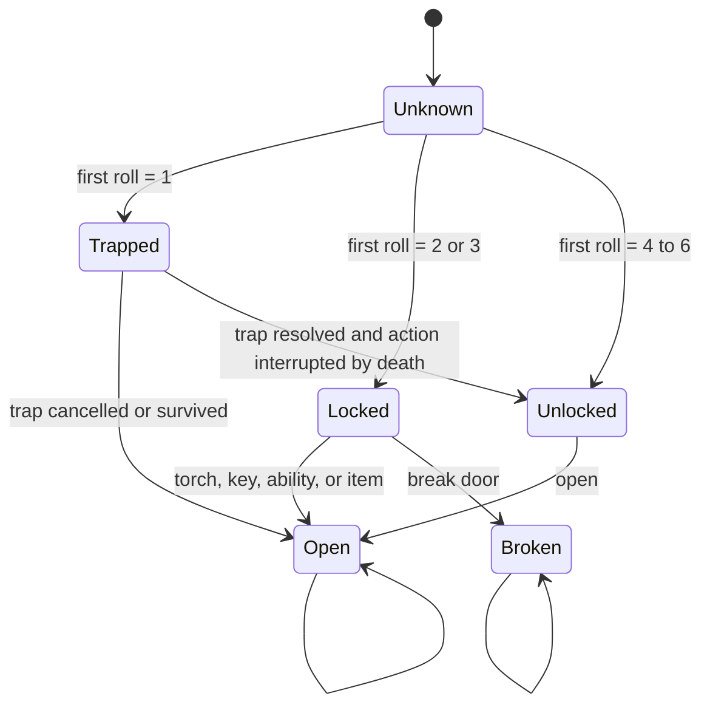
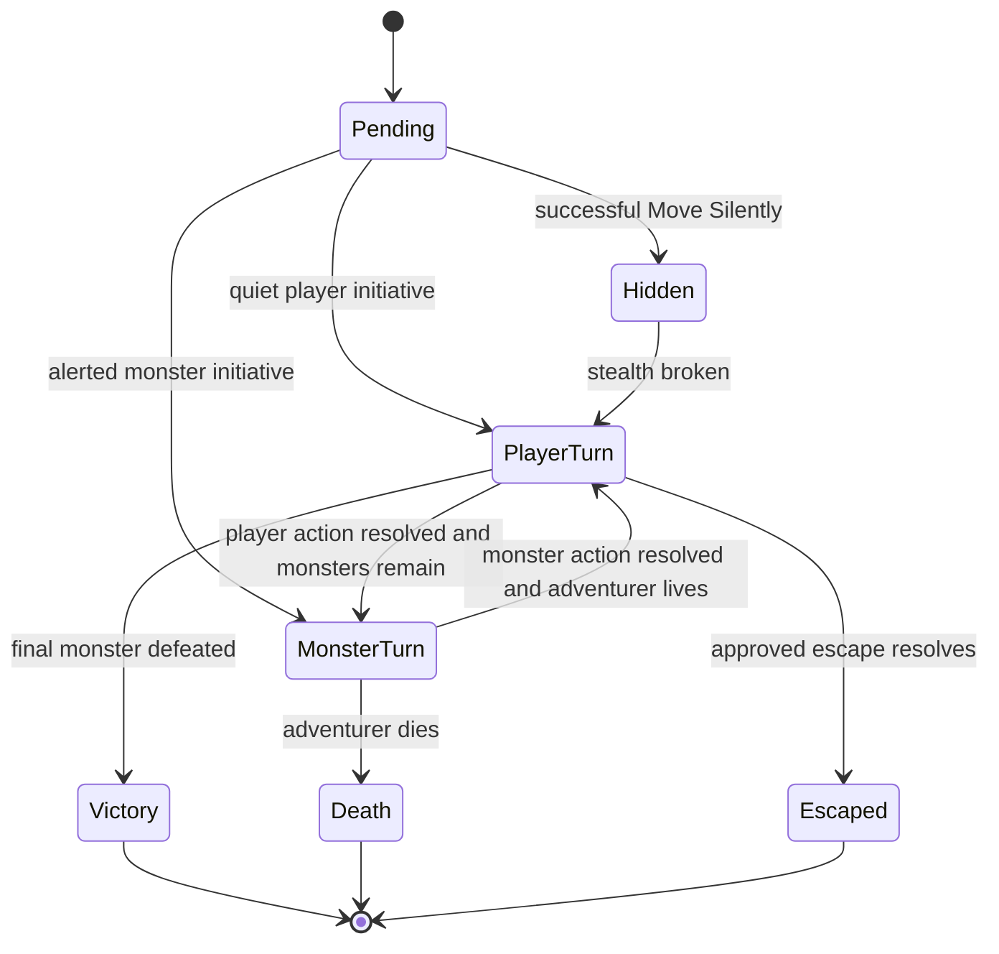
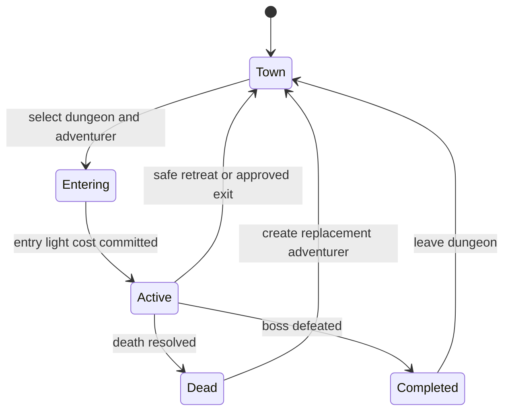

| CALC-007 | Magic item sale | `max(0, natural_d6 - 1)`, then additive modifiers, then multiplicative modifiers, floor at zero |
| CALC-008 | Cat-Person sale | `max(0, modified_base_sale) * 2` |
| CALC-009 | Chest reward | Coins = `max(d1,d2)`; Treasures = `min(d1,d2)`; double 1 overrides with trap and zero rewards |
| CALC-010 | Stair pressure | At non-stair count 6/7/8/9: stairs on pressure d6 <= 1/2/3/4; at 10 force stairs |
| CALC-011 | Boss treasure count | Sum 2d6; resolve that many independent Treasure results |
| CALC-012 | Healing | `min(max_hp, current_hp + heal_amount)` or set to max for full-heal effects |

### 16.2 Boundary catalogue

| Value / state | Minimum | Maximum | Default / start |
|---|---:|---:|---:|
| d6 | 1 | 6 | N/A |
| 2d6 | 2 | 12 | N/A |
| Physical torches | 0 | 10 | 10 |
| Virtual light units | 0 | Number created during expedition | 0 |
| Backpack items | 0 | 10 | 0 plus starting equipment outside backpack |
| Coins | 0 | Unbounded | 0 |
| Usable arms/hands | 0 | 2 | 2 |
| Current HP | 0 | Maximum HP | Maximum HP |
| Armour durability | 0 | Item maximum | Item maximum |
| Floor | 1 | 3 | 1 |
| Floor non-stair target | 6 | 6 | 6 |
| Floor non-stair hard maximum | 10 | 10 | 10 |
| Local save slots | 3 | 3 | 3 available slots |

## 17. State Machines and Transition Guards

### 17.1 Door

### 17.2 Encounter

### 17.3 Expedition

### 17.4 Principal guards

| Action | Guard |
|---|---|
| Enter dungeon | Adventurer alive; at least one physical/virtual light unit, a castable Light charge, or an approved entry exception |
| Move to connection | Connection discovered and open; no blocking unbypassed encounter |
| Open unknown door | Adventurer alive; current state permits door interaction |
| Open locked door with light unit | At least one physical or virtual light unit; door Locked |
| Use normal key | Matching origin dungeon; key owned; door Locked; trap already resolved |
| Break door | Door Locked; action not otherwise blocked |
| Move Silently | Occupied ordinary room; combat not started; quiet entry; one spendable light unit |
| Search secret passage | Segment eligible; not previously searched; one spendable light unit; no blocking encounter |
| Attack | Combat player turn; legal attack source; target living and eligible |
| Cast spell | Charge available; timing and target valid |
| Retreat | Safe route to entrance, except approved emergency exit |
| Rest / repair / buy / sell | Adventurer in Town; enough coins/resources; target valid |
| Recover item | Same segment; container/item available; capacity can be made legal |

## 18. Validation, Manual Input, and Overrides

| ID | Scenario | Standard validation | Override policy |
|---|---|---|---|
| DRS-VAL-001 | Invalid die value | Reject values outside 1-6 without mutation. | No canonical override. |
| DRS-VAL-002 | Invalid table range | Reject content definition at validation/build time. | Requires corrected versioned content. |
| DRS-VAL-003 | Negative resource | Reject transition before commit. | No canonical override. |
| DRS-VAL-004 | Over-cap inventory or torches | Require a legal choice or block gain/purchase. | Explicit correction mode may relocate an item to room. |
| DRS-VAL-005 | Illegal hands/equipment | Unequip invalid held item and require legal configuration. | No silent retention. |
| DRS-VAL-006 | Unsupported save schema | Reject without modifying existing data. | Import into a supported application version only. |
| DRS-VAL-007 | Corrupted save | Preserve source, load last-valid snapshot when available, and expose diagnostics. | Never silently reset. |
| DRS-VAL-008 | Manual dice | Accept only in explicit manual mode and preserve natural values and source. | Result remains committed once accepted. |
| DRS-VAL-009 | State correction | Require explicit correction action, reason/note, and before/after history. | Does not alter the baseline rule definition. |
| DRS-VAL-010 | House rule | Not available in canonical MVP. | Requires a separately versioned rules profile after MVP. |

## 19. Rules and Event History

### 19.1 Required event fields

| Field | Required | Notes |
|---|---:|---|
| Event ID | Yes | Stable unique identifier. |
| Event type | Yes | Creation, roll, generation, door, trap, movement, combat, item, spell, town, expedition, death, recovery, completion, correction, import, or migration. |
| Action and actor | Yes | Adventurer/system and selected action. |
| Natural dice | Where applicable | Preserve each die, not only totals. |
| Random stream and position/state | Where applicable | Supports deterministic reproduction. |
| Table and row IDs | Where applicable | Includes content version. |
| Inputs and guards | Yes | Relevant state and selected target. |
| Modifiers and order | Where applicable | Additive, multiplicative, cap, prevention, and override sequence. |
| Initial and final results | Yes | Before and after player allocation/choice. |
| State changes | Yes | Resource, HP, durability, topology, status, ownership, and lifecycle changes. |
| Context | Yes | Save slot, adventurer, dungeon, floor, segment, expedition, and encounter IDs. |
| Rules version | Yes | Version of this specification/rules profile. |
| Timestamp | Yes | Local event chronology. |
| Player note | Optional | Separate from immutable mechanical data. |

### 19.2 Retention

- Active and incomplete dungeons retain complete structured mechanically relevant history.
- Completed dungeons retain a permanent summary and the final 500 mechanically relevant entries.
- The interface displays the latest 200 entries by default and may load older retained entries.
- Cosmetic animation and repeated navigation events need not be stored.
- Mechanical history is immutable; player notes are separate editable records.

### 19.3 Requirements

| ID | Requirement | Priority | Acceptance signal |
|---|---|---:|---|
| DRS-HIST-001 | Every random result and state-changing action needed to explain an outcome shall be persisted. | Must | Accepted outcomes are reconstructable. |
| DRS-HIST-002 | Natural dice and final values shall both be recorded. | Must | Trait and modifier audit passes. |
| DRS-HIST-003 | Table and row IDs shall be recorded rather than relying only on display text. | Must | Localisation/copy changes do not break interpretation. |
| DRS-HIST-004 | Allocation and target choices shall be recorded. | Must | Armour and combat outcomes are explainable. |
| DRS-HIST-005 | Corrections shall append an event and shall not edit prior mechanical entries. | Must | Audit remains intact. |
| DRS-HIST-006 | Committed events shall be idempotent on reload. | Must | Duplicate application does not occur. |
| DRS-HIST-007 | Active/incomplete history shall be complete. | Must | No required reconstruction gap. |
| DRS-HIST-008 | Completion retention shall keep summary plus final 500 mechanical entries. | Must | Pruning is deterministic. |
| DRS-HIST-009 | The latest 200 retained entries shall be available by default. | Must | UI query returns correct window. |
| DRS-HIST-010 | Private notes, full event text, saves, Graveyard details, and exports shall not enter production diagnostics. | Must | Diagnostic inspection passes. |
| DRS-HIST-011 | Exported history shall include rules/content versions and private-data warning metadata. | Must | Import can validate provenance. |
| DRS-HIST-012 | History shall remain readable after supported schema migration. | Must | Migration fixtures preserve meaning. |

## 20. Deterministic Test Matrix

| Test ID | Fixed inputs | Expected result | Requirement IDs |
|---|---|---|---|
| DRT-001 | Race 2d6 totals 2 through 12 | Each total selects the authorised race row. | DRS-DICE-002, DRS-ADV-001 |
| DRT-002 | Class 2d6 totals 2 through 12 | Each total selects the authorised class row. | DRS-ADV-001 |
| DRT-003 | Human + Gladiator | Maximum HP 26, Short Sword, 10 torches, 0 coins. | DRS-ADV-002 to 004 |
| DRT-004 | Pixie spell rolls 2,2,3,6,6 | Light x2, Teleport x1, Fireball x2 as separate charges. | DRS-ADV-005 |
| DRT-005 | Dwarf passage dice 1 and 5 | Retained result 5. | DRS-DOOR-015 |
| DRT-006 | Halfling versus two monsters, pairs (1,4) and (2,2) | Stealth succeeds; retained results 4 and 2. | DRS-EXP-006 |
| DRT-007 | Door rolls 1,2,3,4,5,6 | Trap; Locked; Locked; Unlocked; Unlocked; Unlocked. | DRS-DOOR-002 |
| DRT-008 | Locked door + normal key from same dungeon | Key consumed; door Open; destination generated. | DRS-DOOR-007 |
