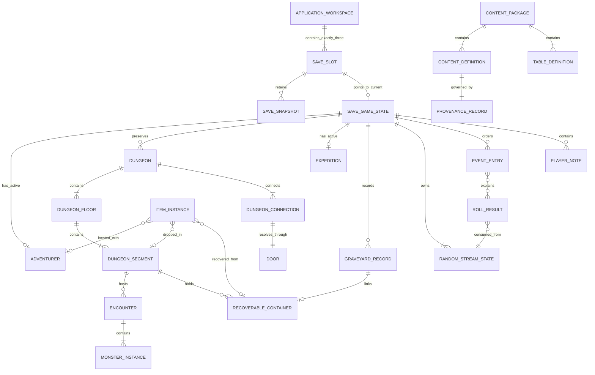

# Data Model / Domain Model Specification

## NoteQuest Web Application — Core MVP

*Version 0.1 | Draft for Review | Prepared for the NoteQuest Project*

| Field | Value |
|---|---|
| Document owner | Technical Lead / Data Modeller |
| Related documents | [Business Requirements Document v0.1](business-requirements-v0.1.md); [MVP Scope v0.1](mvp-scope-v0.1.md); [Product Requirements Document v0.1](product-requirements-v0.1.md); [Functional Requirements Document v0.1](functional-requirements-v0.1.md); [Digital Rules Specification v0.1](digital-rules-specification-v0.1.md); [Digital Adaptation Decision Register](digital-adaptation-decision-register.md); [Decision Register v0.2](digital-adaptation-decision-register-v0.2.md); [Digital Adaptation Feasibility Study](digital-adaptation-feasibility-study.md) |
| Product scope | Palace production-intent prototype and complete six-dungeon Core MVP |
| Primary audience | Product owner, technical lead, developer, rules designer, UX designer, QA/tester, data modeller, content/licensing reviewer, accessibility reviewer, and operations owner |
| Status | Draft for review |
| Last updated | 2026-07-17 |

---

## Contents

1. Purpose
2. Source Basis
3. Modeling Context
4. Data Model Scope
5. Modeling Principles
6. Bounded Contexts
7. Domain Overview
8. Entity Relationship Summary
9. Core Entities
10. Value Objects
11. Enumeration Catalogue
12. Validation Rules and Invariants
13. Lifecycle and State Transitions
14. Persistence and Storage Guidance
15. Content Provenance and Licensing Data
16. Import, Export, and Migration
17. Audit, History, and Event Log Linkage
18. Deletion, Archival, and Recovery
19. Traceability
20. Acceptance Criteria
21. Open Questions
22. Approval

---

## 1. Purpose

This specification defines the logical data structures, ownership boundaries, stable identities, relationships, invariants, lifecycle states, persistence semantics, import/export rules, migration behaviour, recovery records, and content-provenance data required for the NoteQuest web application.

It translates the approved product, functional, and digital-rules baselines into an implementation-neutral domain model for:

- three local save slots;
- canonical adventurers and their persistent state;
- six persistent dungeon records and incremental graph generation;
- expeditions, encounters, monsters, combat state, inventory, rewards, town actions, death, recovery, and the Graveyard;
- deterministic random-stream state and immutable committed outcomes;
- atomic autosaving, last-valid recovery, sequential migration, versioned export, and validated import;
- structured mechanical history and separate player-authored notes; and
- bundled-content identity, provenance, rights status, attribution, and versioning.

This document defines **what must be represented and preserved**. It does not mandate application classes, a programming language, a state-management library, a physical IndexedDB schema, component structure, or final screen design unless a logical requirement makes a constraint unavoidable.

## 2. Source Basis

### 2.1 Controlling sources

1. [Business Requirements Document v0.1](business-requirements-v0.1.md) for business objectives, release constraints, privacy, persistence, content, and operating boundaries.
2. [MVP Scope v0.1](mvp-scope-v0.1.md) for the Palace prototype, six-dungeon Core MVP, dependency order, exclusions, and release gates.
3. [Product Requirements Document v0.1](product-requirements-v0.1.md) for product outcomes, journeys, feature expectations, data safety, and accessibility obligations.
4. [Functional Requirements Document v0.1](functional-requirements-v0.1.md) for observable application behaviour, error handling, recovery, import/export, and traceability.
5. [Digital Rules Specification v0.1](digital-rules-specification-v0.1.md) for canonical calculations, timing, state transitions, persistence consequences, history, and all approved interpretive rulings.
6. Approved Digital Adaptation Decision Registers v0.1 and v0.2 for the PWA, IndexedDB, save-slot, deterministic-randomness, event-history, privacy, accessibility, and release decisions.
7. The Digital Adaptation Feasibility Study for implementation risks and architectural direction.
8. Approved content definitions and the future Content and Licensing Requirements for individual content records and release eligibility.

### 2.2 Precedence

When a modeling choice conflicts with a controlling source, apply this order:

1. later approved decision-register ruling;
2. approved Digital Rules Specification;
3. approved Functional Requirements Document;
4. approved Product Requirements Document;
5. approved MVP Scope;
6. approved Business Requirements Document;
7. this specification's implementation recommendation.

A later approved amendment may supersede this specification. Existing runtime instances retain their recorded rules and content versions unless an approved migration explicitly transforms them.

### 2.3 Downstream documents

The following documents may refine implementation detail without changing this logical model unless an approved amendment is raised:

- UX Flow and Wireframe Requirements;
- Non-Functional Requirements;
- Content and Licensing Requirements and approved inventory;
- Web Architecture and Deployment Specification; and
- Acceptance Criteria / Test Plan.

## 3. Modeling Context

NoteQuest is a single-player, local-first, installable PWA. Core play requires no account, backend, cloud save, or continuous connection. The application exposes exactly three named local save slots and stores durable game state locally.

The product has two distinct data classes:

1. **Versioned definitions** — approved races, classes, spells, items, monsters, dungeon tables, rules tables, and other bundled content. Definitions use stable namespaced IDs and provenance metadata.
2. **Runtime instances** — adventurers, dungeons, segments, monsters, item instances, expeditions, deaths, event entries, and committed random results created during play. Instances use opaque stable IDs and retain the definition and rules versions under which they were created.

The model must support incremental dungeon generation without treating screen coordinates as mechanical truth. The graph, connections, door states, segment states, and content instances are authoritative; visual coordinates are replaceable presentation data.

The model must also preserve consequences over long-lived play. Completed dungeons, opened or broken doors, damage, destroyed items, deaths, recoverable belongings, Graveyard records, event history, and committed rolls cannot be silently reconstructed from the latest rules or rerolled after reload.

## 4. Data Model Scope

### 4.1 In scope

| Area | Data support |
|---|---|
| Workspace and slots | Exactly three local save slots, slot names, metadata, current-state pointer, last-valid pointer, recovery availability, versions, timestamps, and integrity state |
| Save state | Save-owned aggregate references, current adventurer, active expedition, persistent dungeons, Graveyard, random streams, content-version set, and history sequence |
| Adventurers | Identity, private name, race/class references, HP, abilities, spell charges, arms, hands, torches, coins, equipment, inventory, status, location, and death linkage |
| Dungeons | Dungeon identity/type/name, rules/content versions, floors, segments, graph connections, doors, traps, searches, occupants, drops, recoverable containers, boss state, and completion |
| Expeditions | Start/end events, active adventurer, dungeon, entry state, current segment, virtual light, repopulation markers, and lifecycle status |
| Encounters | Participants, initiative/phase, stealth state, legal-action state, temporary effects, defeat state, reward linkage, and completion outcome |
| Monsters | Definition reference, maximum/current HP, trait state, temporary effects, spawn/revival state, and final-defeat state |
| Items and economy | Stable item identity, definition/version, quality, durability, charges, value, key origin, location, ownership, equipment state, consumption/destruction/sale, and recovery |
| Death and recovery | Normal or darkness death, recoverable container, contents, cause, location, Graveyard record, partial recovery, and final recovery state |
| Randomness | Separate dungeon, combat, reward, and repopulation streams; algorithm/version; internal state; draw count; committed roll results |
| History | Immutable mechanical events, sequence ordering, linked entities, before/after summaries, dice/table details, correction events, completion summaries, and retention state |
| Player-authored data | Adventurer/slot names and optional notes stored separately from immutable mechanical records |
| Content and rights | Stable definitions, package/version, source, licence/permission, approval, attribution, restrictions, and content hash |
| Portability | Versioned export manifest, complete slot data, checksums, content references, validation report, import preview, sequential migration, and pre-migration recovery |
| Deletion/recovery | Confirmed slot reset, archive/tombstone states, last-valid restoration, partial-invalid isolation, and application-owned storage cleanup |

### 4.2 Out of scope

| Area | Exclusion |
|---|---|
| Accounts and cloud ownership | No account, server-authoritative identity, cloud save, shared campaign, or multi-device merge model |
| Multiplayer | No player membership, permissions, shared turns, conflict resolution, leaderboard, or anti-cheat model |
| Expanded World | No expansion-specific kingdoms, factions, settlements, quests, campaign maps, or supplement entities |
| Tactical simulation | No grid position, pathfinding, collision, enemy AI, initiative queue beyond approved encounter state, or real-time movement |
| UI component state | Panel expansion, animation state, hover state, map zoom, and other view-only data are not durable domain state |
| Final physical storage | Exact IndexedDB store names, key-path syntax, binary encoding, compression, and library-specific adapters are architecture decisions |
| Production telemetry | No analytics identity, behavioural event stream, marketing profile, or unapproved remote diagnostics |
| Localisation | No translated-label persistence or localisation catalogue for the English-only Core MVP |
| Unapproved content | No storage assumption that requires copied source prose, artwork, logo, page layout, character sheet, or trade dress |

## 5. Modeling Principles

| ID | Principle | Meaning |
|---|---|---|
| DMP-001 | MVP-simple, future-safe | The first UI may expose a subset while the domain keeps identity, ownership, versioning, and provenance explicit. |
| DMP-002 | Source-faithful data | The model represents approved mechanics without adding balance corrections, unsupported statuses, or invented consequences. |
| DMP-003 | Stable definition identity | Bundled definitions use stable namespaced machine IDs such as `race.human` or `spell.light`. |
| DMP-004 | Stable runtime identity | Runtime entities use opaque IDs that do not depend on array position, display name, map coordinate, or current owner. |
| DMP-005 | Definition-instance separation | Runtime instances reference immutable versioned definitions and store only mutable instance state plus approved snapshots of derived values. |
| DMP-006 | Immutable committed outcomes | Committed dice, table rows, generated topology, rewards, and completed transitions are not silently recalculated. |
| DMP-007 | Explicit corrections | A correction creates a linked amendment event and preserves the original result rather than editing history in place. |
| DMP-008 | Atomic action commits | Every meaningful state change is persisted as one all-or-nothing action across all affected logical records. |
| DMP-009 | Last-valid recovery | Each slot retains a recoverable last-known-valid state independent from the current write attempt. |
| DMP-010 | Provenance by default | Bundled and imported definitions carry source, permission/licence, approval, attribution, restriction, version, and hash data. |
| DMP-011 | Player data separation | Names and notes remain separate from licensed source content and immutable mechanical history. |
| DMP-012 | Graph truth over layout | Dungeon connectivity is represented by segments and connections; render coordinates never determine legal movement. |
| DMP-013 | One location per instance | Every item, monster, adventurer, and recoverable container has exactly one valid current location or a terminal tombstone state. |
| DMP-014 | Exportable by design | All save-owned data can be serialized into a versioned, validated, deterministically ordered package. |
| DMP-015 | Migration without reinterpretation | Sequential migrations may reshape storage but cannot reroll outcomes or silently apply new mechanics to historical instances. |
| DMP-016 | Privacy-local by default | Private play data has no remote owner or transmission requirement and is excluded from diagnostics unless explicitly approved. |
| DMP-017 | Retention is explicit | Active/incomplete history is complete; completed history follows the approved summary and final-500 policy. |
| DMP-018 | UI-independent rules | Durable data and invariants can be validated without rendering, animation, or component state. |

## 6. Bounded Contexts

| Context | Responsibility | Primary entities / services |
|---|---|---|
| Workspace and Save Management | Maintain exactly three slots, active/last-valid snapshots, slot metadata, reset, restore, import staging, and schema compatibility | `ApplicationWorkspace`, `SaveSlot`, `SaveSnapshot`, `SaveGameState`, `MigrationRecord`, `ImportReport` |
| Content Catalogue | Provide approved, versioned, validated definitions and tables without coupling mechanics to copied prose | `ContentPackage`, `ContentDefinition`, `TableDefinition`, `TableRowDefinition`, `ProvenanceRecord` |
| Adventurer | Create and maintain the active adventurer, derived HP, abilities, spells, resources, body state, status, and private name | `Adventurer`, `AdventurerAbility`, `SpellChargePool` |
| Dungeon World | Maintain persistent dungeon graph truth, floors, segments, connections, doors, hazards, occupants, drops, boss state, and completion | `Dungeon`, `DungeonFloor`, `DungeonSegment`, `DungeonConnection`, `Door`, `RecoverableContainer` |
| Expedition | Maintain entry, active location, virtual light, repopulation checks, retreat, exit, completion, and death linkage | `Expedition`, `RepopulationCheck` |
| Encounter and Combat | Resolve encounter phases, participants, temporary effects, stealth, attacks, escape, victory, death, and reward triggers | `Encounter`, `MonsterInstance`, `TemporaryEffect`, `ActionCommit` |
| Inventory and Economy | Preserve stable item identity through equipment, backpack, drops, containers, sale, repair, consumption, and destruction | `ItemInstance`, `InventoryLocation`, `ItemTransaction` |
| Death and Legacy | Preserve death facts, Graveyard records, recoverable belongings, multiple deaths per segment, and recovery progress | `DeathRecord`, `GraveyardRecord`, `RecoverableContainer` |
| Randomness and Resolution | Own deterministic streams, draws, natural values, table rows, manual input markers, and committed results | `RandomStreamState`, `RollResult`, `TableResult` |
| History and Notes | Maintain immutable mechanical history, correction linkage, completion summaries, sequence order, and separate editable notes | `EventEntry`, `CompletionSummary`, `PlayerNote` |
| Portability and Migration | Validate exports/imports, stage changes, migrate sequentially, preserve originals, and produce reports | `ExportManifest`, `ImportReport`, `MigrationRecord`, `IntegrityCheck` |

### 6.1 Context rules

- A context may reference another context only through stable IDs and versioned value objects.
- Cross-context actions commit through an `ActionCommit` transaction envelope.
- A failed cross-context action leaves every affected aggregate at its previous valid state.
- Content definitions are immutable within a package version. Corrections create a new package or definition version.
- Runtime instances retain the definition and rules versions used when they were created.
- The UI may build read models from multiple contexts but must not make a read model authoritative.

## 7. Domain Overview

### 7.1 Recommended hierarchy

```text
ApplicationWorkspace
  ├── SaveSlot 1
  ├── SaveSlot 2
  └── SaveSlot 3
        ├── current SaveSnapshot
        ├── last-valid SaveSnapshot
        └── SaveGameState
              ├── active Adventurer
              ├── zero or one active Expedition
              ├── persistent Dungeons
              │     ├── Floors
              │     ├── Segments
              │     ├── Connections and Doors
              │     ├── Encounters and MonsterInstances
              │     ├── ItemInstances and RecoverableContainers
              │     └── completion state
              ├── GraveyardRecords
              ├── RandomStreamStates
              ├── EventEntries and CompletionSummaries
              └── PlayerNotes
```

Versioned `ContentPackage` records are application-owned reference data. Save data points to them through stable definition IDs, package versions, and hashes.

### 7.2 Aggregate roots

| Aggregate root | Owns / controls | External references | Atomic consistency responsibility |
|---|---|---|---|
| `ApplicationWorkspace` | Workspace version and the fixed three slot identities | Current app version | Exactly three slot records exist |
| `SaveSlot` | Slot name/status, current snapshot pointer, last-valid pointer, schema state, timestamps | `SaveGameState`, snapshots, import/migration reports | Pointer changes, restore, reset, and isolation |
| `SaveGameState` | Slot-level active references, rules/content version set, current sequence, RNG stream set | Adventurer, dungeons, expedition, Graveyard, events | Cross-aggregate root references are valid |
| `Adventurer` | Body state, HP, abilities, spell charges, resources, location, status | Race/class/ability/spell definitions; item IDs; expedition/death IDs | Adventurer state cannot be partially invalid |
| `Dungeon` | Graph, floors, segments, connections, doors, monster instances, segment state, containers, completion | Dungeon/content definitions; expedition IDs; item IDs | Graph and persistent dungeon truth |
| `Expedition` | Entry/exit state, current segment, virtual light, repopulation markers | Adventurer and dungeon IDs | Expedition lifecycle and location |
| `Encounter` | Combat phase, participants, temporary effects, outcome, reward trigger status | Adventurer, dungeon segment, monster IDs | One legal encounter state and outcome |
| `ItemInstance` | Definition/version, mutable condition and location, lifecycle status | Adventurer, segment, container, item definition | Exactly one owner/location or terminal state |
| `GraveyardRecord` | Immutable death summary and recovery linkage | Adventurer, dungeon, segment, container | Every death has one record |
| `EventStream` | Ordered immutable events and completion summary | Any domain entity through typed references | Sequence uniqueness and retention |
| `ContentPackage` | Definitions, tables, provenance, approval state, hashes | External permission/licence evidence | Definition and provenance validation |
| `ImportSession` | Parsed package, validation report, preview, migration plan, final status | Target slot and source manifest | No target mutation before confirmed commit |

## 8. Entity Relationship Summary



### 8.1 Relationship catalogue

| Relationship | Cardinality | Ownership / deletion behaviour | Notes |
|---|---:|---|---|
| Workspace to save slots | Exactly 1-to-3 | Workspace-owned; slot identities are recreated only by application reset | Empty slots remain records |
| Save slot to snapshots | 1-to-many | Slot-owned; retention keeps current, last-valid, and required pre-migration/import snapshots | Physical deduplication is allowed |
| Save slot to game state | 1-to-0/1 current | Pointer swap is atomic | Empty or isolated slots may have no current state |
| Save state to active adventurer | 1-to-0/1 | Adventurer persists after death as historical identity; active pointer clears | New adventurer gets a new ID |
| Save state to dungeons | 1-to-many | Dungeons persist for save lifetime unless confirmed slot reset | One persistent record per created dungeon |
| Dungeon to floors | 1-to-1..3 | Dungeon-owned | Core dungeon has up to three floors |
| Floor to segments | 1-to-many | Floor-owned | Segment graph identity is stable |
| Dungeon to connections | 1-to-many | Dungeon-owned | Each connection links two valid segment IDs |
| Connection to door | 1-to-1 | Connection-owned | Door state is shared from both directions |
| Segment to encounters | 1-to-many over time | Dungeon-owned; resolved encounters remain historical or compacted by policy | At most one active blocking encounter per segment |
| Encounter to monsters | 1-to-many | Encounter/dungeon-owned | Spawned monsters receive stable IDs |
| Item to location | Exactly 1 current location or terminal state | Save-owned; identity survives transfers | Location is adventurer, segment, container, or terminal |
| Death to Graveyard record | Exactly 1-to-1 | Save-owned; lifetime of save | Atomic with death |
| Death to recoverable container | 1-to-0/1 | Dungeon-owned | Normal and darkness deaths differ in corpse marker |
| Event to linked entities | Many-to-many typed references | Event stream owns linkage values | No cascading delete of mechanical events |
| Definition to provenance | Many-to-1 or 1-to-1 | Content package-owned | Asset-level provenance may be unique |
| Roll result to stream | Many-to-1 | Save-owned | Stores stream kind and draw index |

