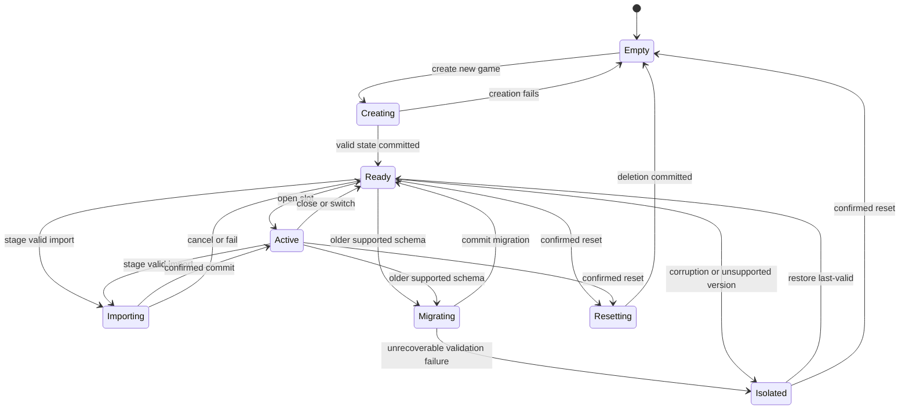
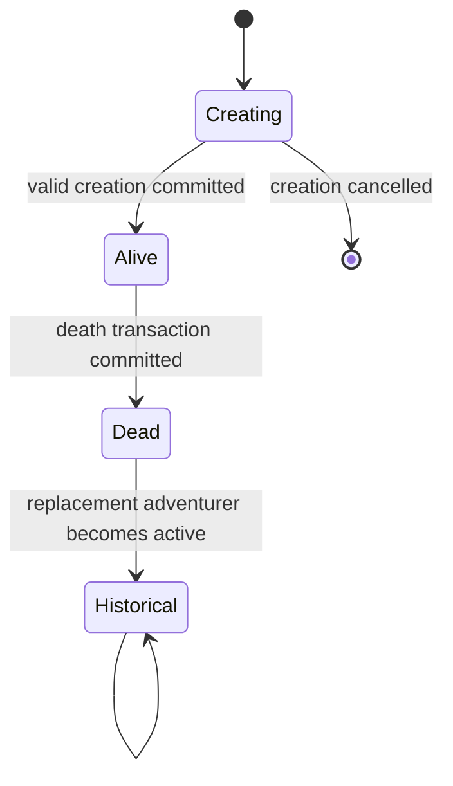
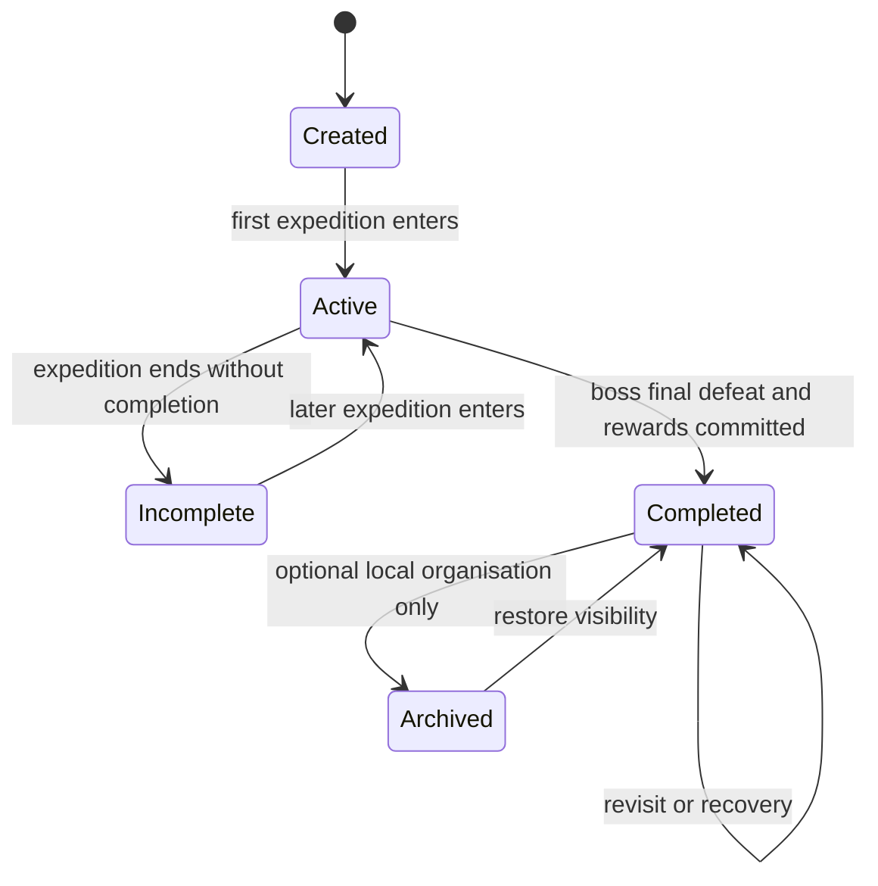
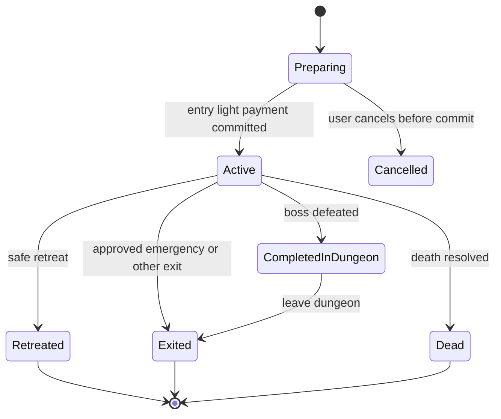
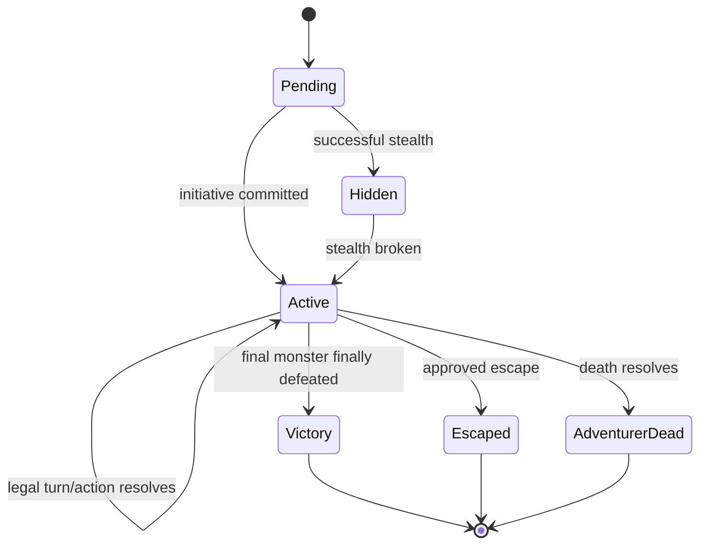
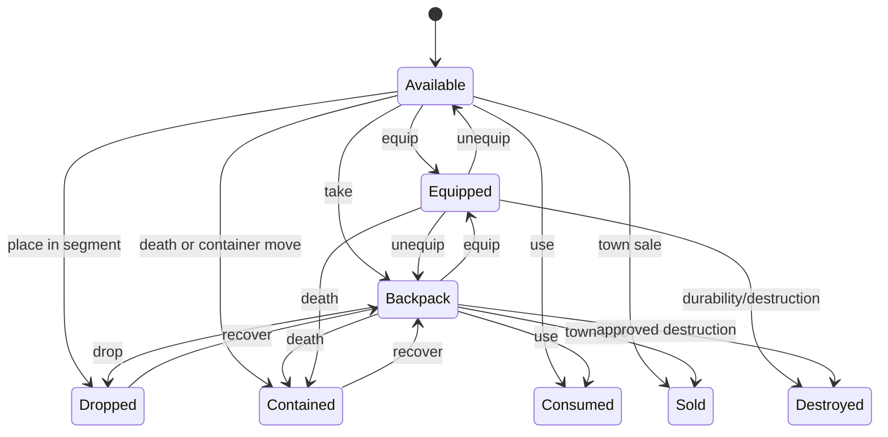
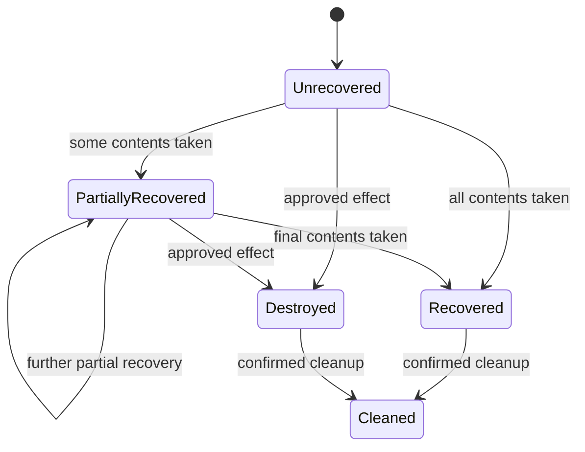

## 12. Validation Rules and Invariants

| ID | Entity / value | Invariant | Enforcement point | Error / recovery behaviour |
|---|---|---|---|---|
| DMI-001 | Workspace | Exactly three unique save slots exist | Workspace load/build | Recreate only missing empty slot records; never invent game data |
| DMI-002 | SaveSlot | `slotIndex` is unique and 1..3 | Domain/import | Reject invalid workspace package |
| DMI-003 | SaveSlot | Current and last-valid pointers reference valid snapshots from the same slot | Persistence/import | Isolate slot; retain recoverable pointer |
| DMI-004 | Snapshot | Snapshot is immutable after valid commit | Persistence | Reject mutation and preserve original |
| DMI-005 | SaveGameState | At most one active adventurer and one active expedition | Domain/import | Reject transition/import |
| DMI-006 | Random streams | Exactly one stream of each required kind exists | Creation/load/import | Block play; offer recovery |
| DMI-007 | Random result | Natural dice are each 1..6 | Domain/import | Reject without mutation |
| DMI-008 | 2d6 result | Stored sum equals two natural dice | Domain/import | Reject inconsistent result |
| DMI-009 | RollResult | Generated draw range matches stream kind and draw-count progression | Commit/import | Roll back action or reject import |
| DMI-010 | RollResult | Committed result cannot be edited | Domain/persistence | Require correction event |
| DMI-011 | Adventurer | `maxHp` > 0 and `currentHp` is 0..max | Domain/import | Reject transition; restore last valid |
| DMI-012 | Adventurer | Physical torches are 0..10 | Domain/import | Reject over/underflow |
| DMI-013 | Adventurer | Coins are non-negative | Domain/import | Reject |
| DMI-014 | Adventurer | Usable arms and hands are 0..2 | Domain/import | Reject |
| DMI-015 | Adventurer | Backpack contains at most 10 item IDs | Domain/action/import | Require explicit overflow resolution |
| DMI-016 | Adventurer | Every equipped item has legal hand/slot requirements | Domain/action/import | Reject or require explicit reconfiguration |
| DMI-017 | Adventurer | Dead status requires current HP 0 and a death record | Death transaction | Roll back incomplete death |
| DMI-018 | Adventurer | Dungeon location requires matching active expedition and current segment | Domain/load/import | Isolate invalid state |
| DMI-019 | Spell pool | Current charges are 0..maximum and maximum > 0 | Domain/import | Reject |
| DMI-020 | Dungeon | Floor numbers are unique and 1..3 | Generation/import | Reject invalid graph |
| DMI-021 | Dungeon | Entrance exists on floor 1 | Generation/load/import | Block play and recover |
| DMI-022 | Dungeon | Connection endpoints exist, differ, and share the dungeon | Generation/import | Reject action/import |
| DMI-023 | Dungeon | Every committed generated segment is reachable from the entrance | Generation validation | Do not commit invalid graph |
| DMI-024 | Floor | Non-stair count never exceeds 10 | Generation | Force approved staircase before commit |
| DMI-025 | Floor | Staircase-pressure and forced-stair facts are represented by committed generation events | Generation/history | Reject missing evidence in tests/import |
| DMI-026 | Final room | Boss segment is the floor-3 final room and reachable | Generation/completion | Do not commit invalid generation/completion |
| DMI-027 | Dungeon completion | Boss final defeat and one-time reward resolve at most once | Domain/history | Reject duplicate reward/completion |
| DMI-028 | Door | State transitions follow the approved door state machine | Domain/import | Reject illegal transition |
| DMI-029 | Door | Destination content does not exist before successful opening commit | Generation/action | Roll back destination creation |
| DMI-030 | Segment | At most one active blocking encounter exists | Domain/import | Reject |
| DMI-031 | Expedition | Active expedition has living adventurer, valid dungeon, current segment, and paid entry light | Entry commit | Cancel before entry or reject |
| DMI-032 | Expedition | Virtual light cannot persist after expedition end | Exit/death/migration | Clear during same transaction |
| DMI-033 | Repopulation | `(expeditionId, segmentId)` is unique | Domain/import | Reuse committed check; never reroll |
| DMI-034 | Repopulation | Corridors, stairs, and final room have no repopulation check | Domain/import | Reject |
| DMI-035 | Encounter | Active encounter phase is valid and terminal encounters accept no normal turn | Domain | Reject action |
| DMI-036 | Monster | Current HP is 0..max and final defeat is immutable | Domain/import | Reject |
| DMI-037 | Monster | Surviving monster healing occurs once at later-expedition start | Expedition transaction | Idempotent guard |
| DMI-038 | Item | Every non-terminal item has exactly one location | Domain/import | Reject transfer/import |
| DMI-039 | Item | Item identity remains unchanged across transfer | Domain | Reject delete-and-recreate transfer |
| DMI-040 | Item | Durability is null or 0..maximum | Domain/import | Reject |
| DMI-041 | Item | Random properties and values are assigned once | Creation/import | Preserve original; reject reroll |
| DMI-042 | Key | Normal-key origin dungeon is present and enforced | Use/import | Reject invalid use |
| DMI-043 | Terminal item | Sold, spent, consumed, or destroyed item is absent from active ownership and recovery | Domain/death | Reject death-container composition |
| DMI-044 | Death | Every death atomically creates one Graveyard record | Death transaction | Roll back entire death |
| DMI-045 | Death | Normal death uses corpse container; darkness death uses belongings without corpse marker | Death transaction | Reject invalid type |
| DMI-046 | Recoverable container | One container links to one death; multiple deaths never merge automatically | Domain/import | Reject merge |
| DMI-047 | Recovery | Partial recovery leaves uncollected items and coins in the container | Domain | Atomic partial transfer |
| DMI-048 | Graveyard | Records persist for slot lifetime | Delete/reset | Only confirmed slot reset removes |
| DMI-049 | Event stream | Sequence is unique, positive, and strictly increasing | Commit/import | Reject conflicting event order |
| DMI-050 | Mechanical event | Event is immutable after commit | Domain/persistence | Add correction event |
| DMI-051 | Player note | User text is separate and labelled user-authored | Domain/import | Reject provenance mislabelling |
| DMI-052 | Active/incomplete history | Complete mechanically relevant history is retained | Retention/export | Block destructive compaction |
| DMI-053 | Completed history | Permanent summary plus final 500 mechanical entries are retained | Completion/retention | Build summary before compaction |
| DMI-054 | UI history | Latest-200 display limit does not delete persisted required history | Read model | Correct query/read model |
| DMI-055 | Content table | Row ranges are complete, ordered, non-overlapping, and within supported dice range | Build/import | Block content package |
| DMI-056 | Content definition | Stable ID, type, version, package, hash, and provenance are present | Build/import | Block definition |
| DMI-057 | Bundled content | Unknown, blocked, or restricted content is excluded from public build | Build/release | Release gate fails |
| DMI-058 | Runtime version | Every mechanically relevant instance records rules/content version | Creation/import | Reject missing version |
| DMI-059 | Migration | Schema changes run sequentially one version at a time | Migration | Reject skipped path |
| DMI-060 | Migration | Pre-migration snapshot is valid before pointer mutation | Migration | Do not start or roll back |
| DMI-061 | Import | Parse, validate, migrate, and preview occur before target mutation | Import | Existing slots unchanged |
| DMI-062 | Import | Unsupported newer schema is rejected without mutation | Import | Explain and preserve source/target |
| DMI-063 | Export | Manifest counts and hashes match canonical data | Export/import | Mark package invalid |
| DMI-064 | Privacy | Export is labelled private and no undisclosed transmission occurs | Export/UX | Block remote action |
| DMI-065 | Action commit | Expected snapshot matches current pointer | Persistence | Abort stale commit and reload |
| DMI-066 | Action commit | Records, events, stream advances, and pointer swap commit atomically | Persistence | Roll back and retain prior snapshot |
| DMI-067 | Recovery | Last-valid restoration does not overwrite its source before success | Restore | Preserve recovery source |
| DMI-068 | Slot isolation | One invalid slot does not block valid slots | Workspace load | Isolate only affected slot |
| DMI-069 | App reset | Only application-owned storage is removed | Reset | Block if scope cannot be proven |
| DMI-070 | Typed references | Runtime references do not cross save slots | Domain/import | Reject |

## 13. Lifecycle and State Transitions

### 13.1 Save slot

### 13.2 Adventurer

### 13.3 Dungeon

Archiving cannot delete graph truth or alter mechanics.

### 13.4 Expedition

### 13.5 Encounter

### 13.6 Item instance

Terminal states retain tombstones and event linkage.

### 13.7 Recoverable container

### 13.8 Import and migration guards

| From | Event | Guard | To | Data side effects |
|---|---|---|---|---|
| Parsed import | Validate | Supported structure and fields | Validated / Invalid | No slot mutation |
| Validated import | Build preview | Migration path and references valid | Previewed | No slot mutation |
| Previewed import | Confirm | User accepts privacy and replacement impact | Confirmed | Create pre-import snapshot |
| Confirmed import | Commit | Atomic validation still passes | Committed | Create state and switch pointer |
| Any non-terminal import | Cancel/fail | — | Cancelled / Failed | Delete staging only |
| Ready slot | Start migration | Valid pre-migration snapshot exists | Migrating | No pointer change |
| Migrating | Commit step | One sequential step passes | Migrating / Ready | New immutable snapshot |
| Migrating | Step fails | Prior pointer and snapshot valid | Rolled back / Isolated | Restore prior pointer |

## 14. Persistence and Storage Guidance

### 14.1 Approved logical storage model

| Concern | Requirement / decision |
|---|---|
| Storage mode | Local-first browser storage; IndexedDB is the approved durable-store direction |
| Ownership | Application-owned local workspace; no account or remote owner |
| Transaction boundary | One meaningful player/system action, including all affected aggregates, events, stream state, snapshots, and pointer update |
| Autosave | After every meaningful state change; success is shown only after commit |
| Recovery | Keep a last-valid snapshot and pre-migration/pre-import snapshots as required |
| Concurrency | One active local writer per slot; stale expected-snapshot commits abort rather than merge |
| Schema version | Positive integer; sequential migration from N to N+1 |
| Rules/content versions | Persist on state root and every historical/mechanically relevant instance |
| Offline behaviour | Existing valid saves and approved cached content remain usable without a network |
| Sensitive data | Names, notes, history, Graveyard, imports, and exports remain local/private by default |
| Maximum practical size | Defined by NFR testing; model supports required retention without silent deletion |
| Update activation | New shell/content activates only after a safe save point and reload |
| Diagnostics | Local and privacy-safe; no save or private text attached automatically |

### 14.2 Recommended logical partitions

These are logical partitions, not mandatory physical object-store names.

| Partition | Key | Important indexes / access paths |
|---|---|---|
| Workspace | `workspaceId` | Single record |
| Save slots | `slotId` | `slotIndex`, status, updatedAt |
| Snapshots | `snapshotId` | slotId + createdAt, kind |
| Save roots | `gameStateId` | slotId |
| Adventurers | `adventurerId` | slotId, status |
| Dungeons | `dungeonId` | slotId, definition ID, status |
| Expeditions | `expeditionId` | slotId, dungeonId, status |
| Encounters | `encounterId` | dungeonId, segmentId, status |
| Items | `itemInstanceId` | slotId, location type/owner, status |
| Graveyard/deaths | record ID | slotId + occurredAt, adventurerId, containerId |
| Events | `eventId` | slotId + sequence, dungeonId, category |
| Notes | `noteId` | slotId, linked entity, updatedAt |
| Content packages | package ID + version | approval, hash |
| Definitions/tables | definition/table ID + version | package, content type |
| Import/migration reports | report ID | target slot, status, createdAt |

### 14.3 Action commit sequence

1. Read the current slot pointer and expected snapshot.
2. Validate action guards against the current complete state.
3. Resolve required choices and random outcomes using the assigned stream.
4. Build all changed aggregate records and immutable event/roll records in memory.
5. Validate cross-record invariants.
6. Create a new immutable snapshot/state root.
7. Persist all changed records, advanced stream state, events, and snapshot in one transaction.
8. Switch the slot current pointer and update the last-valid pointer according to recovery policy.
9. Report success only after the transaction completes.
10. On failure, leave prior current and last-valid pointers unchanged and show truthful status.

### 14.4 Durable versus transient state

Persist:

- every committed rule outcome and user choice;
- current legal game state;
- active encounter/expedition phase needed to resume;
- resumable workflow state only when explicitly required;
- versions, hashes, event sequence, and stream state; and
- player notes and approved preferences.

Do not persist in domain records:

- hover, focus ring, panel animation, transient toast, map camera, or skeleton-loading state;
- derived labels or translated strings;
- uncommitted random previews; or
- cached view coordinates as mechanical position.

