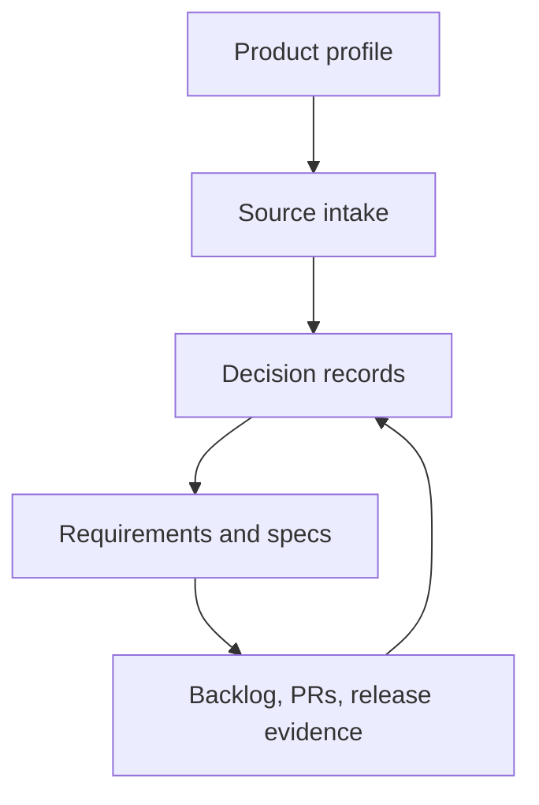

# Product-Agnostic Game Adaptation Process

## Generic Game Adaptation Framework

*Version 0.1 | Draft for Review | Prepared for reuse across tabletop, solo, and rules-driven game adaptations*

| Field | Value |
|---|---|
| Document owner | Product Owner |
| Process scope | Converting a source game into a rights-aware, implementation-ready digital product process that can be reused across similar games |
| Primary audience | Product owner, rules designer, technical lead, UX designer, QA lead, content/licensing reviewer, operations owner, contributors, and reviewers |
| Related NoteQuest examples | [Documentation Development and Governance Process v0.1](../../product/documentation-development-governance-process-v0.1.md); [Digital Adaptation Feasibility Study](../../product/digital-adaptation-feasibility-study.md); [Decision Register v0.2](../../product/digital-adaptation-decision-register-v0.2.md); [Digital Rules Specification v0.1](../../product/digital-rules-specification-v0.1.md); [Content & Licensing Requirements v0.1](../../product/content-licensing-requirements-v0.1.md); [Acceptance Criteria / Test Plan v0.1](../../product/acceptance-criteria-test-plan-v0.1.md); [PR and Issue Workflow](../pr-issue-workflow.md) |
| Status | Draft for review |
| Last updated | 2026-07-23 |

---

## Contents

1. [Purpose](#1-purpose)
2. [Scope](#2-scope)
3. [Core Principles](#3-core-principles)
4. [Process Map](#4-process-map)
5. [Product Profile](#5-product-profile)
6. [Source Intake and Authority](#6-source-intake-and-authority)
7. [Feasibility and Adaptation Model](#7-feasibility-and-adaptation-model)
8. [Decision and Document Chain](#8-decision-and-document-chain)
9. [Rules Adaptation Taxonomy](#9-rules-adaptation-taxonomy)
10. [Content and Rights Boundary](#10-content-and-rights-boundary)
11. [Backlog Translation](#11-backlog-translation)
12. [Agent-Ready Implementation Work](#12-agent-ready-implementation-work)
13. [Pull Request and Issue Closure](#13-pull-request-and-issue-closure)
14. [Product Leakage Controls](#14-product-leakage-controls)
15. [Applying the Process to a New Game](#15-applying-the-process-to-a-new-game)
16. [NoteQuest Example Profile](#16-notequest-example-profile)
17. [Acceptance Criteria](#17-acceptance-criteria)
18. [Approval](#18-approval)

---

## 1. Purpose

This document abstracts the NoteQuest documentation, backlog, implementation, review, and issue-closeout process into a product-agnostic workflow for adapting similar games.

The process exists to ensure that each adaptation:

- starts from the authoritative source material instead of assumptions or memory;
- separates reusable process from product-specific vocabulary;
- records consequential product, rules, rights, UX, technical, and release decisions before implementation depends on them;
- converts tabletop or source-game procedures into explicit software state, actions, rules, and tests;
- preserves source identity without copying unapproved expressive content, artwork, layout, or trade dress;
- turns approved documents into traceable milestones, epics, stories, prompts, and verification evidence;
- classifies work by whether an implementation agent can complete it directly, assist with it, or must wait for human approval; and
- closes issues and releases only from evidence.

This process is not a replacement for a project profile. The generic process defines the workflow; each product profile supplies the concrete game name, release model, source permissions, vocabulary, branch model, milestone plan, and implementation stack.

## 2. Scope

### 2.1 In scope

This process applies to adaptations of games with some combination of:

- rulebooks, source PDFs, SRDs, prototypes, spreadsheets, or existing digital builds;
- dice, cards, tables, randomizers, deterministic procedures, or event resolution;
- character, party, board, map, campaign, inventory, score, resource, or persistence state;
- source content that must be classified, attributed, paraphrased, licensed, or blocked;
- a digital implementation backlog maintained through issues and pull requests; and
- agent-assisted implementation, review, testing, or documentation.

### 2.2 Out of scope

This process does not provide:

- legal advice or substitute rights review;
- a universal software architecture;
- a fixed milestone list;
- a mandatory branch model;
- a single UX pattern for all games;
- a sprint ceremony model;
- an approval to copy source prose, art, page layout, logos, screenshots, fonts, or trade dress; or
- product-specific requirements for NoteQuest, Ironsworn, Scarlet Heroes, or any other game.

## 3. Core Principles

| ID | Principle | Required behavior |
|---|---|---|
| GAP-001 | Profile before product detail | Put product-specific names, branches, releases, source terms, and stack choices in a project profile, not in the generic process. |
| GAP-002 | Source before specification | Inspect the authoritative source and rights position before deriving requirements or backlog scope. |
| GAP-003 | Decisions before dependent work | Resolve material product, rules, content, UX, technical, and release questions before assigning implementation work that depends on them. |
| GAP-004 | Mechanics over expression | Implement permitted mechanics as structured data, rules, and state. Do not copy expressive source prose or presentation unless approved. |
| GAP-005 | Explicit state and timing | Convert informal tabletop handling into named state, legal actions, transition guards, timing points, and deterministic examples. |
| GAP-006 | Traceability | Every meaningful backlog item traces to approved source material, decisions, requirements, rules, UX, content controls, tests, or architecture. |
| GAP-007 | Configurable delivery | Milestones, epics, branch targets, release names, and stack-specific checks are configured per product. |
| GAP-008 | Evidence-based closeout | Checkboxes, issue closure, epic updates, and releases must be supported by reviewed evidence. |
| GAP-009 | Human gates stay human | Product approval, legal review, release go/no-go, accessibility sign-off, and playtest judgement cannot be silently reclassified as code tasks. |
| GAP-010 | Templates stay neutral | Reusable templates use placeholders and neutral terms. Product examples belong in profiles, fixtures, or case studies. |

## 4. Process Map



The feedback loop is intentional. Implementation, testing, playtest, rights review, or PR review may reveal an unresolved decision. When that happens, update the relevant decision record or controlling document before widening implementation scope.

## 5. Product Profile

Each adaptation must define a product profile before generic templates are filled in. The profile is the boundary between reusable process and product-specific facts.

### 5.1 Required profile fields

| Field | Purpose |
|---|---|
| `product_name` | Official working title used by requirements and backlog items. |
| `source_material` | Source title, edition, files, URLs, provenance, and reviewer notes. |
| `source_authority` | Precedence order when source material, decisions, requirements, and implementation disagree. |
| `adaptation_model` | Assistant, faithful digital companion, complete adaptation, expanded derivative, or another approved model. |
| `release_model` | Prototype, MVP, public release, commercial release, closed playtest, or other release modes. |
| `rights_position` | Approved, blocked, pending, unknown, or item-level requirements for source material and derived content. |
| `content_policy` | Rules for mechanics, table data, names, prose, visuals, layout, user content, and third-party assets. |
| `implementation_stack` | Language, framework, storage, build, hosting, and test commands for this product only. |
| `branch_model` | Integration branch, release branch, PR base, release-forward behavior, and protected branch rules. |
| `delivery_phases` | Product-specific milestones, phase names, entry criteria, exit criteria, and dependencies. |
| `agent_classification` | Labels or terms for direct agent work, agent-assisted work, and human-gated work. |
| `template_values` | Placeholder values for issue, PR, prompt, document, release, and evidence templates. |

### 5.2 Example profile shape

```yaml
product_name: Example Game
source_material:
  primary_title: Example Game Rulebook
  edition: First edition
  source_files:
    - path: project_sources/example-game-rulebook.pdf
      role: authoritative_review_copy
source_authority:
  - later_approved_decision
  - rights_restriction
  - digital_rules_specification
  - functional_requirements
  - source_rulebook
adaptation_model: faithful_complete_digital_adaptation
release_model:
  prototype_name: vertical_slice
  mvp_name: core_release
  public_release: free_web_release
rights_position:
  source_mechanics: review_required
  exact_source_prose: blocked_by_default
  source_visuals: blocked_by_default
content_policy:
  mechanics_as_structured_data: allowed_with_provenance
  player_facing_text: project_original_or_approved_exact_text
  source_layout_trade_dress: blocked_by_default
implementation_stack:
  language: product_specific
  ui: product_specific
  storage: product_specific
branch_model:
  integration: develop
  release: main
delivery_phases:
  - id: P0
    name: Documentation baseline
    exit: approved implementation-ready scope
  - id: P1
    name: Vertical slice
    exit: playable, tested, rights-safe prototype
agent_classification:
  direct: agent-implementable
  assisted: agent-assisted
  gated: human-gated
```

## 6. Source Intake and Authority

### 6.1 Source inventory

Create a source inventory before requirements work begins.

| Source type | Examples | Required notes |
|---|---|---|
| Primary source material | Rulebook, SRD, prototype, board, cards, table sheets, digital build | Title, edition, date, author/publisher, file path or URL, reviewer, extraction limits. |
| Rights evidence | Licence text, written permission, store terms, open licence, contract, correspondence | Scope, date, parties, permitted uses, blocked uses, confidentiality handling. |
| Existing decisions | Prior decision register, stakeholder notes, approved scope, playtest conclusions | Decision ID, owner, status, affected documents. |
| Source extracts | Tables, mechanics, names, examples, diagrams, screenshots | Category, provenance, approval state, exact-text risk, asset risk. |
| Product-original material | UI copy, helper text, art, test data, fixtures, diagrams | Author, ownership, review status, source independence. |
| Third-party material | Dependencies, fonts, icon sets, images, data packs, audio | Licence, distribution rights, attribution, build inclusion rules. |

### 6.2 Source authority

Every project must define its conflict order. A common default is:

1. later approved decision-register ruling;
2. rights or licensing restriction;
3. digital rules specification;
4. functional requirements;
5. data/domain model;
6. UX and accessibility requirements;
7. non-functional requirements;
8. content and licensing requirements;
9. acceptance criteria and test plan;
10. source material;
11. implementation detail.

A lower-level document may refine an upstream requirement, but it must not weaken or contradict it without an approved amendment.

## 7. Feasibility and Adaptation Model

Before writing detailed requirements, classify the intended adaptation model.

| Model | Description | Typical fit | Main risk |
|---|---|---|---|
| Reference assistant | Helps players consult rules, tables, or records while the source game remains external. | Rules-light companions, licensed supplements, low automation projects. | May feel like a utility rather than a complete product. |
| Tabletop companion | Automates selected friction while preserving manual player interpretation. | Journals, rollers, character sheets, campaign trackers. | Ambiguities remain with the player and may limit testability. |
| Faithful complete adaptation | Implements the full approved loop while preserving source rules and player decisions. | Solo dungeon crawlers, procedural rulebook games, compact board/card games. | Every ambiguity must be made explicit. |
| Expanded derivative | Uses the source as a base for new systems, content, or genre conventions. | Later expansions or newly licensed products. | Scope expansion can replace the source identity. |

Feasibility output should identify:

- core loop;
- player decisions;
- random procedures;
- state and persistence requirements;
- content conversion effort;
- unresolved rules ambiguities;
- UX density and accessibility risks;
- rights and provenance risks;
- recommended prototype slice; and
- reasons not to expand scope yet.

## 8. Decision and Document Chain

Use progressive elaboration. A project does not need every document on day one, but implementation should not start until the documents controlling that implementation slice are stable enough.

| Document or record | Generic question answered | Typical downstream use |
|---|---|---|
| Feasibility study | Can the source experience be adapted, and what model is appropriate? | Product approach, risk register, prototype selection. |
| Decision register | What consequential choices have been approved or still block dependent work? | Requirements, rules, UX, content, architecture, backlog. |
| Business requirements | Why build this product, for whom, and under what constraints? | Product scope and release framing. |
| MVP or baseline scope | What is the smallest complete accepted release, and what is excluded? | Milestones, epics, release gates. |
| Product requirements | What outcomes and capabilities must users receive? | Functional decomposition and UX flows. |
| Digital rules specification | What are the canonical actions, timing, randomizers, state transitions, and deterministic examples? | Rules engine, data model, tests. |
| Functional requirements | What observable system behavior must exist? | Stories, UI flows, acceptance criteria. |
| Data/domain model | What entities, identities, ownership, persistence, versioning, and migrations are required? | Schemas, storage, import/export, tests. |
| UX and wireframes | How do users move through the product, and how are states presented accessibly? | UI stories, visual checks, accessibility checks. |
| Non-functional requirements | What quality, performance, privacy, security, offline, compatibility, and support thresholds apply? | Build checks, release gates, architecture. |
| Content/licensing requirements | What source-derived and third-party content may ship, under what conditions? | Content manifests, build blockers, notices. |
| Acceptance criteria/test plan | What evidence proves the product or slice is accepted? | Test strategy, PR review, closeout. |
| Architecture and hosting plan | How will the approved product be implemented and delivered? | Repository setup, technical stories, CI/CD. |
| Backlog plan | How do approved documents become phases, epics, stories, prompts, PRs, and release evidence? | GitHub execution. |

## 9. Rules Adaptation Taxonomy

Convert source rules into software by classifying each rule or content item. This prevents broad prose requirements from becoming vague code tasks.

| Category | Questions to answer |
|---|---|
| Actors and roles | Who or what can act? Player, character, party, monster, location, system, timer, narrator, opponent? |
| Resources and counters | What values change over time? Health, coins, torches, cards, hands, inventory slots, reputation, progress, score? |
| Legal actions | What can be chosen, when is it available, what does it cost, and what blocks it? |
| Randomizers | What dice, cards, tables, seeds, probabilities, modifiers, and reroll rules exist? |
| State transitions | What state changes after each choice or random result, and what must be persisted? |
| Timing and triggers | When do effects start, resolve, expire, stack, interrupt, or become invalid? |
| Content tables | What rows, ranges, weights, IDs, names, effects, and provenance must be represented? |
| Topology and position | Does play use rooms, nodes, regions, maps, tracks, hands, decks, boards, scenes, or abstract states? |
| Inventory and ownership | What can be equipped, carried, dropped, sold, destroyed, transferred, recovered, or imported? |
| Persistence and history | What survives reload, death, session end, character replacement, campaign transition, or content updates? |
| Failure and recovery | What happens on death, defeat, timeout, resource loss, invalid import, conflict, or impossible state? |
| Termination conditions | What ends a turn, encounter, run, dungeon, scenario, campaign, session, or save? |
| Deterministic fixtures | Which fixed examples prove edge cases, probabilities, state transitions, and regressions? |

Each rules item should produce at least one of:

- a requirement ID;
- a data definition;
- a state transition;
- an action guard;
- a deterministic example;
- a UI presentation requirement;
- a content provenance record;
- a test case; or
- an explicit decision-register question.

## 10. Content and Rights Boundary

Content and rights controls must be product-agnostic in structure and product-specific in evidence. The process should classify source-derived material before it enters implementation.

### 10.1 Source expression categories

| Category | Definition | Default handling |
|---|---|---|
| `mechanic` | A rule procedure, calculation, timing rule, or permitted gameplay behavior. | Implement as code or structured data when allowed by the project rights position. |
| `table_structure` | Columns, ranges, dice bands, weights, lookup relationships, or schema shape. | Represent structurally with provenance and validation. |
| `table_value` | A specific source row, name, number, outcome, or mechanical effect. | Include only when source permission or terms allow the intended use. |
| `term_or_short_name` | Game title, rule term, item name, move name, class name, monster name, or similar label. | Include only when naming and branding controls allow it. |
| `player_facing_prose` | Source explanatory text, flavor, narrative, examples, descriptions, move text, or rule text. | Use project-original paraphrase by default; exact text requires item-level approval. |
| `visual_asset` | Art, icon, logo, map, card face, page image, screenshot, or decorative element. | Block unless separately approved for the exact digital use. |
| `layout_trade_dress` | Page layout, character sheet arrangement, visual style, borders, typography, or recognizable presentation. | Block by default unless separately approved. |
| `personal_or_sensitive_data` | Backer lists, names, contact details, private playtest notes, account data, or correspondence. | Exclude unless there is a specific approved purpose and privacy review. |
| `third_party_asset` | Dependency, font, image, audio, icon, content pack, dataset, or external code. | Include only with compatible licence, attribution, and distribution evidence. |
| `user_authored` | Player names, notes, saves, campaign content, imports, or generated personal records. | Keep separate from bundled official or source-derived content. |

### 10.2 Approval states

| State | Meaning | Build position |
|---|---|---|
| `draft` | Proposed or being transcribed; not reviewed. | Internal only. |
| `review_pending` | Source and intended use identified; review incomplete. | Excluded from public builds. |
| `approved` | Intended use, release mode, provenance, attribution, and version reviewed. | Eligible for the approved build. |
| `prototype_only` | Approved only for controlled prototype or internal validation. | Excluded from public release unless promoted. |
| `replace_before_release` | Temporary placeholder or mechanical stand-in. | Build must block or report before public release. |
| `blocked` | Unknown, restricted, incompatible, rejected, or unnecessary. | Build failure if bundled. |
| `retired` | Previously approved but replaced. | Historical compatibility only. |

Content validation should be a release gate. Unknown content is blocked rather than treated as a warning for later cleanup.

## 11. Backlog Translation

The reusable backlog sequence is:

1. Inspect approved source, decision, requirements, rules, UX, content, test, and architecture inputs.
2. Load the product profile values for release names, branches, labels, and delivery phases.
3. Create configurable delivery phases with entry dependencies and exit evidence.
4. Create one epic or equivalent parent item per phase.
5. Create child stories for implementation, documentation, testing, content, UX, release, and gate work.
6. Link every child story to its parent, controlling documents, dependencies, and acceptance evidence.
7. Classify each story as agent-implementable, agent-assisted, or human-gated.
8. Add checkbox subtasks only where they improve execution or review clarity.
9. Add self-contained implementation prompts to agent-implementable issues.
10. Re-check links, labels, milestone assignment, blockers, and product-specific leakage.
11. Review PRs against the linked issue and controlling documents.
12. Close issues only after evidence supports the delivered scope and related parent updates.

### 11.1 Generic issue hierarchy

| Level | Generic object | GitHub example |
|---|---|---|
| Delivery phase | A bounded delivery stage with exit criteria. | Milestone. |
| Parent outcome | A phase-level goal with child work and acceptance evidence. | Epic issue. |
| Work slice | A single implementation, documentation, test, content, or gate deliverable. | Feature story issue. |
| Supporting tracker | Cross-cutting sequencing, ownership, release, content, or evidence coordination. | Supporting issue. |
| Subtask | A verifiable work item inside a larger slice. | Markdown checkbox. |
| Implementation prompt | Self-contained agent instruction for a scoped work item. | Issue or PR comment. |

### 11.2 Agent ownership classification

| Generic label | Meaning | NoteQuest-compatible mapping |
|---|---|---|
| `agent-implementable` | The work can be completed and verified mainly through repository edits and local checks. | `codex-task` |
| `agent-assisted` | The agent can prepare artifacts, reports, checks, or review evidence, but acceptance depends on human judgement. | `codex-assist` |
| `human-gated` | The work primarily depends on product, legal, rights, release, playtest, accessibility, or operational approval. | `human-led` |

Labels should be configured by the product profile. Do not bake a tool name into generic templates unless the project explicitly chooses that tool.

## 12. Agent-Ready Implementation Work

An agent-ready issue or prompt must be self-contained enough to survive a new chat, fresh checkout, or changed branch.

Required prompt content:

- repository or workspace identifier;
- issue number or work item ID;
- issue title;
- goal;
- must-have scope;
- should/could scope when relevant;
- out-of-scope boundaries;
- relevant files, folders, documents, and source references;
- dependency checks and stop conditions;
- implementation guidance;
- acceptance criteria;
- verification commands and expected evidence;
- skipped-check reporting requirements; and
- risks, assumptions, or follow-up reporting.

Prompt rules:

- Use fenced code blocks for prompts posted as comments.
- Do not rely on hidden memory, branch names, latest issue numbers, or web search results as the source of truth.
- Keep each prompt narrow enough that the agent can finish and verify it.
- Preserve already accepted behavior when fixing review findings.
- For UI work, reference the applicable wireframes, responsive states, keyboard behavior, focus behavior, screen-reader expectations, and visual checks.
- For content work, reference the approved content policy, provenance requirements, and blocked source-expression categories.

## 13. Pull Request and Issue Closure

Each project should adapt the PR workflow to its branch model, but the review discipline is reusable.

### 13.1 PR review

Review each PR against:

- linked issue scope;
- controlling requirements and decisions;
- rules correctness;
- data and persistence contracts;
- UX and accessibility expectations;
- content and rights boundaries;
- tests and acceptance evidence;
- branch target and compare state; and
- CI, preview, or build status for the exact head SHA.

Findings should be reported first, ordered by severity, with concrete file or behavior references.

### 13.2 Fix prompts

When a PR needs agent fixes:

- inspect existing comments first;
- add or update one narrow prompt where possible;
- fence the prompt;
- include exact findings, constraints, and verification steps;
- avoid widening the issue scope; and
- tell the agent to preserve already-fixed behavior.

### 13.3 Issue closeout

Before closing an issue:

1. Refresh the issue body and related parent tracker.
2. Compare delivered work to must-have scope and acceptance criteria.
3. Check only boxes supported by evidence.
4. Leave future, deferred, or non-applicable work unchecked unless a closeout comment explains the status.
5. Add a closeout evidence comment with PR number, commit, delivered scope, checks, skipped checks, and remaining follow-up.
6. Update parent epics, supporting trackers, and downstream dependencies only where evidence supports the update.
7. Close the issue as completed only when the work item outcome is satisfied.

## 14. Product Leakage Controls

Product leakage happens when a reusable process or template accidentally contains the wrong game's assumptions. It creates incorrect issues, wrong licensing language, confusing prompts, and unsafe implementation scope.

### 14.1 Common leakage patterns

| Leakage pattern | Example risk | Control |
|---|---|---|
| Hard-coded product name | A template for one game says another game's title. | Use `{{PRODUCT_NAME}}` and profile-supplied values. |
| Fixed milestone sequence | Every game is forced into `M0` through `M9`. | Generate delivery phases from the product profile. |
| Fixed release names | A prototype is always called Palace or the MVP always has the same scope. | Use `{{PROTOTYPE_NAME}}`, `{{BASELINE_RELEASE_NAME}}`, and profile release modes. |
| Fixed branch names | A repo without `develop` still receives prompts targeting `develop`. | Use `{{INTEGRATION_BRANCH}}` and `{{RELEASE_BRANCH}}`. |
| Fixed tool labels | Every repository receives `codex-task` even when it uses neutral labels. | Map generic ownership classes to project labels. |
| Product-specific licensing text | A template blocks Ironsworn prose inside a NoteQuest issue. | Store source-expression policy in the profile and content requirements. |
| Source-specific UX assumptions | A generic flow assumes a dungeon map, character sheet, or move list. | Classify topology and interaction model per product. |
| Stack-specific checks | A template always requires npm commands. | Pull verification commands from the implementation stack profile. |

### 14.2 Placeholder standard

Reusable templates should prefer placeholders such as:

- `{{PRODUCT_NAME}}`
- `{{SOURCE_TITLE}}`
- `{{SOURCE_EDITION}}`
- `{{ADAPTATION_MODEL}}`
- `{{PROTOTYPE_NAME}}`
- `{{BASELINE_RELEASE_NAME}}`
- `{{PUBLIC_RELEASE_MODE}}`
- `{{INTEGRATION_BRANCH}}`
- `{{RELEASE_BRANCH}}`
- `{{AGENT_DIRECT_LABEL}}`
- `{{AGENT_ASSISTED_LABEL}}`
- `{{HUMAN_GATED_LABEL}}`
- `{{RELEVANT_WIREFRAME_PATHS}}`
- `{{VERIFICATION_COMMANDS}}`
- `{{CONTENT_POLICY_REFERENCE}}`

Product examples belong in case-study documents, not in reusable templates.

## 15. Applying the Process to a New Game

Use this sequence when starting another similar game adaptation:

1. Create a clean project context and declare whether prior project assumptions are excluded.
2. Create the product profile with source, release, rights, branch, stack, and phase defaults.
3. Inventory source files and classify source authority.
4. Produce a feasibility study and recommend an adaptation model.
5. Create an initial decision register for choices that block requirements.
6. Define business requirements and MVP or baseline scope.
7. Write the digital rules specification for the first implementation slice.
8. Write functional, data, UX, NFR, content/licensing, test, and architecture documents as the slice requires.
9. Translate approved documents into delivery phases, epics, stories, labels, subtasks, and prompts.
10. Implement through scoped PRs against the configured integration branch.
11. Review PRs against issue scope and controlling documents.
12. Close issues and parent trackers from evidence.
13. Promote to a release branch only when release gates are satisfied.
14. Record any reusable learning as a generic process update or product-specific case study.

## 16. NoteQuest Example Profile

The following profile is illustrative. It records how NoteQuest maps onto the generic process without making those choices mandatory for other products.

```yaml
product_name: NoteQuest
source_material:
  primary_title: NoteQuest rulebook
  edition: First edition
  reviewed_file: NoteQuest_eng.pdf
adaptation_model: faithful_complete_digital_adaptation
release_model:
  prototype_name: Palace production-intent prototype
  baseline_release_name: Core MVP
  public_release_mode: free_non_monetised_web_release
source_authority:
  - later_approved_decision_register
  - rights_or_licensing_restriction
  - digital_rules_specification
  - functional_requirements
  - data_domain_model
  - ux_requirements
  - acceptance_test_plan
  - source_rulebook
  - implementation_detail
content_policy:
  mechanics_as_structured_data: allowed_with_recorded_permission_and_provenance
  table_values_and_names: allowed_with_recorded_permission_and_manifest
  exact_source_prose: blocked_by_default
  source_art_logo_layout_trade_dress: blocked_by_default
  personal_or_sensitive_source_data: excluded_unless_separately_approved
implementation_stack:
  app_type: offline_first_web_application
  storage: IndexedDB
  delivery: PWA
branch_model:
  integration: develop
  release: main
agent_classification:
  direct: codex-task
  assisted: codex-assist
  gated: human-led
example_delivery_phases:
  - M0: repository_and_documentation_baseline
  - M1: deterministic_rules_foundation
  - M2: persistence_and_simulation_foundation
  - M3: Palace_content_and_simulation
```

For another game, replace this entire profile rather than editing the generic process body.

## 17. Acceptance Criteria

This process may be accepted when:

- [ ] It separates reusable adaptation workflow from product-specific values.
- [ ] It defines a product profile model for names, source material, rights, branches, stack, phases, labels, and release modes.
- [ ] It preserves source-first analysis and decision-first governance.
- [ ] It defines how to translate source rules into software actions, state, timing, randomizers, persistence, and deterministic tests.
- [ ] It defines generic content and rights categories without granting product-specific permission.
- [ ] It defines a reusable backlog translation flow from approved documents to phases, epics, stories, subtasks, prompts, PRs, and closeout evidence.
- [ ] It defines neutral agent ownership classes and maps NoteQuest labels only as an example.
- [ ] It defines controls that prevent product-specific template leakage.
- [ ] It explains how to apply the process to another game adaptation.
- [ ] It treats NoteQuest as an example profile, not as the default for all future products.

## 18. Approval

| Role | Name | Decision | Date | Notes |
|---|---|---|---|---|
| Product Owner | TBD | Pending | TBD | Review whether the process is reusable beyond NoteQuest. |
| Technical Lead | TBD | Pending | TBD | Review implementation and verification assumptions. |
| Rules / Product Designer | TBD | Pending | TBD | Review rules taxonomy and decision gates. |
| Content / Licensing Reviewer | TBD | Pending | TBD | Review source-expression and rights-boundary controls. |
| QA / Test Lead | TBD | Pending | TBD | Review acceptance and closeout evidence requirements. |
