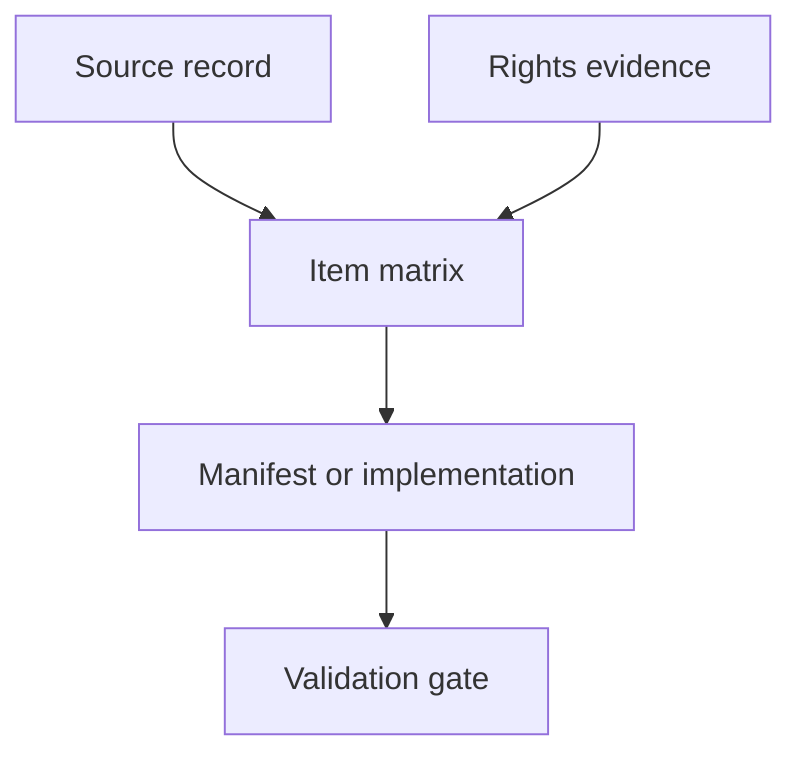

# Source Material Intake and Rights Matrix

## Generic Game Adaptation Process

*Version 0.1 | Template and process | Prepared for reuse across rules-first game adaptation projects*

| Field | Value |
|---|---|
| Template owner | Product Owner |
| Process scope | Intake, classification, provenance, rights review, approval state, and release gating for source-derived and third-party material |
| Related documents | Product-Agnostic Game Adaptation Process v0.1; Product Profile Template v0.1; Rules Extraction Taxonomy; Backlog Generation Playbook; Agent Task Template Standard; product-specific Content and Licensing Requirements |
| Primary audience | Product owner, rules designer, content/licensing reviewer, technical lead, UX designer, QA lead, release owner, and implementation agents |
| Status | Draft template |
| Last updated | 2026-07-23 |

---

## Contents

1. [Purpose](#1-purpose)
2. [When to Use This Matrix](#2-when-to-use-this-matrix)
3. [Non-Legal Review Position](#3-non-legal-review-position)
4. [Operating Principles](#4-operating-principles)
5. [Roles and Responsibilities](#5-roles-and-responsibilities)
6. [Required Registers](#6-required-registers)
7. [Identifier Standard](#7-identifier-standard)
8. [Source Material Register](#8-source-material-register)
9. [Rights Evidence Register](#9-rights-evidence-register)
10. [Source Item Classification](#10-source-item-classification)
11. [Approval States](#11-approval-states)
12. [Expression Risk Levels](#12-expression-risk-levels)
13. [Release Modes](#13-release-modes)
14. [Item-Level Rights Matrix](#14-item-level-rights-matrix)
15. [Default Disposition Matrix](#15-default-disposition-matrix)
16. [Implementation Traceability](#16-implementation-traceability)
17. [Build and Release Gates](#17-build-and-release-gates)
18. [Privacy and Confidentiality Controls](#18-privacy-and-confidentiality-controls)
19. [Review Workflow](#19-review-workflow)
20. [Integration with Product Profiles](#20-integration-with-product-profiles)
21. [Generic Example Rows](#21-generic-example-rows)
22. [NoteQuest Reality-Check Example](#22-notequest-reality-check-example)
23. [Template Audit Checklist](#23-template-audit-checklist)
24. [Acceptance Criteria](#24-acceptance-criteria)
25. [Open Questions](#25-open-questions)
26. [Approval](#26-approval)

---

## 1. Purpose

This document defines a reusable intake and rights matrix for adapting rulebooks, solo games, tabletop games, board games, procedural games, and similar source material into digital products.

The matrix exists to ensure that every source-derived or third-party item is:

- identified before implementation depends on it;
- classified by content type and expression risk;
- connected to source provenance and rights evidence;
- assigned an approval state and release scope;
- represented in software only in the approved form;
- traceable to requirements, rules, data, UX, tests, and release evidence; and
- blocked from public release when rights, provenance, or approval are uncertain.

The matrix is product-agnostic. Each product profile supplies the actual source title, edition, release mode, permission position, branch model, content policies, and labels.

---

## 2. When to Use This Matrix

Use this matrix before creating implementation-ready requirements, content manifests, rules data, fixtures, UI copy, screenshots, asset bundles, public notices, or release candidates.

Use it when the product includes any of the following:

- source rulebooks, PDFs, SRDs, supplements, cards, sheets, websites, or prototype files;
- dice tables, lookup tables, randomizers, encounter tables, move lists, powers, items, classes, monsters, enemies, locations, maps, or scenarios;
- source terms, labels, titles, game names, module names, faction names, product terminology, or branding;
- explanatory prose, flavor text, examples, fiction, prompts, tutorial text, or rule summaries derived from source material;
- artwork, icons, logos, screenshots, page scans, card faces, maps, typefaces, audio, or video;
- backer lists, credits, personal names, correspondence, contracts, playtest notes, or other sensitive records;
- third-party code, fonts, icon sets, stock assets, commissioned assets, generated assets, or open data; or
- user-authored content that must remain separate from bundled source content.

Create a separate matrix when:

- adapting a new game;
- adapting a new edition;
- adding a supplement or expansion;
- moving from private prototype to public release;
- changing from free to commercial distribution;
- translating or localising source-derived content;
- changing the rights position; or
- using templates from another project.

---

## 3. Non-Legal Review Position

This matrix is a product and release-control artifact. It is not legal advice.

A qualified rights or legal reviewer must decide legal questions when required by the product profile, publisher relationship, licence terms, contract, jurisdiction, distribution platform, or risk level.

This matrix applies conservative process defaults:

1. Unknown means blocked from public release.
2. Permission for mechanics does not imply permission for exact prose, artwork, layout, logos, branding, screenshots, or trade dress.
3. Permission for a private prototype does not imply permission for public, commercial, translated, open-source, or redistributed releases.
4. Product-original paraphrase is preferred over copied source prose.
5. Item-level evidence is required for verbatim text, source visuals, logos, and recognisable source presentation.
6. Confidential rights evidence should be recorded by controlled reference, not copied into a public repository.
7. Personal data is excluded unless there is a specific approved purpose and privacy review.

---

## 4. Operating Principles

| ID | Principle | Required behavior |
|---|---|---|
| SMR-001 | Source-first | Identify the authoritative source, edition, version, and reviewer before deriving software content. |
| SMR-002 | Item-level classification | Classify source material at the smallest useful level: table, row, term, rule, asset, paragraph, sheet, or dependency. |
| SMR-003 | Mechanics over expression | Prefer structured mechanics, state, and original code over copied explanatory expression. |
| SMR-004 | Rights evidence before inclusion | Do not ship a source-derived or third-party item unless its intended use is supported by evidence and approval. |
| SMR-005 | Release-mode specificity | Record whether approval applies to internal, closed test, public free, commercial, translated, or open-source distribution. |
| SMR-006 | Provenance everywhere | Every bundled source-derived item must trace to source, version, approval state, and implementation target. |
| SMR-007 | Separate code and content | A repository or code licence does not automatically cover embedded source content, art, data, fonts, or notices. |
| SMR-008 | Privacy by default | Do not reproduce personal data, backer lists, correspondence, account identifiers, or private notes unless explicitly approved. |
| SMR-009 | Block uncertain content | `unknown`, `review_pending`, `blocked`, and `replace_before_release` items cannot enter public release bundles. |
| SMR-010 | Audit before reuse | Run a product-leakage audit before reusing a matrix, template, issue prompt, or content manifest across products. |

---

## 5. Roles and Responsibilities

| Role | Responsibilities |
|---|---|
| Product Owner | Defines product scope, adaptation model, release mode, and whether an item is needed. |
| Content / Licensing Reviewer | Reviews source categories, rights evidence, approval states, attribution, blocked uses, and public release readiness. |
| Rules Designer | Classifies mechanics, rules domains, tables, ambiguity, and deterministic examples. |
| UX / Accessibility Lead | Confirms that player-facing copy, labels, explanations, screenshots, and UI presentation are rights-safe and accessible. |
| Technical Lead | Ensures manifests, source IDs, build gates, dependency licences, and implementation targets are enforceable. |
| QA / Test Lead | Converts matrix requirements into validation, release checks, fixtures, and evidence expectations. |
| Release Owner | Confirms that all release-mode gates are satisfied before publication. |
| Implementation Agent | Uses only approved matrix items, preserves provenance, and raises blockers for missing or uncertain content. |

One person may hold multiple roles in a small project, but approval records must state which concerns were reviewed.

---

## 6. Required Registers

Each product should maintain the following registers or equivalent structured files.

| Register | Purpose | Minimum owner |
|---|---|---|
| Source Material Register | Lists every source file, edition, URL, supplement, prototype, or source package considered by the product. | Product Owner |
| Rights Evidence Register | Records permissions, licences, terms, correspondence references, reviewer decisions, constraints, and expiration. | Content / Licensing Reviewer |
| Item-Level Rights Matrix | Classifies each source-derived item, proposed use, approval state, release mode, and implementation target. | Content / Licensing Reviewer |
| Third-Party Manifest | Records dependencies, fonts, icons, images, audio, generated assets, open-source licences, and attribution. | Technical Lead |
| Blocked / Excluded Register | Records source material that must not be used, why it is blocked, and how build/release checks enforce exclusion. | Release Owner |
| Attribution / Notices Register | Records required credit, licence text, notices, unofficial-status wording, and distribution surfaces. | Content / Licensing Reviewer |

A small project may keep these as separate sections in one document. A larger project should move them to structured data files that can be checked by automation.

---

## 7. Identifier Standard

Use stable identifiers so source material, rights evidence, implementation files, tests, and release reports can reference the same item.

| Identifier | Object | Example |
|---|---|---|
| `SRC-###` | Source material record | `SRC-001` |
| `RIGHTS-###` | Permission, licence, term, correspondence, or review evidence | `RIGHTS-001` |
| `ITEM-###` | Source-derived item, table, term, rule, row set, asset, or prose segment | `ITEM-001` |
| `3P-###` | Third-party dependency or asset | `3P-001` |
| `NOTICE-###` | Attribution or notice requirement | `NOTICE-001` |
| `BLOCK-###` | Blocked or excluded material record | `BLOCK-001` |
| `GATE-###` | Release or build gate | `GATE-001` |

Identifier rules:

- Never reuse an ID for a different object.
- Keep retired IDs for historical traceability.
- Use source-neutral IDs in generic templates.
- Put product prefixes in product-specific matrices only when the profile requires them.
- Do not encode legal conclusions in the ID itself.

---

## 8. Source Material Register

Create the Source Material Register before extracting rules, data, copy, or assets.

### 8.1 Required fields

| Field | Required | Description |
|---|---|---|
| `source_id` | Yes | Stable source identifier, for example `SRC-001`. |
| `title` | Yes | Source title or working title. |
| `source_type` | Yes | Rulebook, supplement, SRD, website, errata, prototype, spreadsheet, correspondence, asset pack, or other. |
| `edition_or_version` | Yes | Edition, version, publication date, commit, build, or retrieval date. |
| `creator_or_publisher` | Yes when known | Author, publisher, rights holder, licensor, or origin. |
| `language` | Yes when relevant | Source language and target language if translation is planned. |
| `location` | Yes | Controlled local path, repository path, private evidence pointer, public URL, or storage reference. |
| `review_copy_hash` | Recommended | Hash or checksum for the reviewed copy when exact version matters. |
| `scope_status` | Yes | `in_scope`, `reference_only`, `excluded`, `blocked`, `deferred`, or `superseded`. |
| `rights_status` | Yes | `unknown`, `requires_review`, `permissioned`, `public_license`, `blocked`, or `not_applicable`. |
| `reviewer` | Yes | Role or person who performed the intake review. |
| `notes` | Recommended | Constraints, known supplements, edition differences, or extraction limitations. |

### 8.2 Source Material Register template

| Source ID | Title | Type | Edition / Version | Creator / Publisher | Location | Scope status | Rights status | Reviewer | Notes |
|---|---|---|---|---|---|---|---|---|---|
| `SRC-001` | `{{SOURCE_TITLE}}` | `{{SOURCE_TYPE}}` | `{{EDITION_OR_VERSION}}` | `{{CREATOR_OR_PUBLISHER}}` | `{{CONTROLLED_LOCATION}}` | `{{SCOPE_STATUS}}` | `{{RIGHTS_STATUS}}` | `{{REVIEWER}}` | `{{NOTES}}` |

---

## 9. Rights Evidence Register

The Rights Evidence Register records why an item may or may not be used. It should point to confidential evidence without exposing it when the repository is public.

### 9.1 Required fields

| Field | Required | Description |
|---|---|---|
| `rights_id` | Yes | Stable rights evidence identifier, for example `RIGHTS-001`. |
| `related_source_id` | Yes when source-derived | Source record that the evidence applies to. |
| `evidence_type` | Yes | Licence, contract, permission email, publisher terms, public licence, decision record, legal memo, invoice, commission agreement, or review note. |
| `evidence_location` | Yes | Controlled reference. Do not expose private correspondence unless approved. |
| `rights_holder_or_licensor` | Yes when known | Person or entity granting or controlling the rights. |
| `granted_use` | Yes | What the product may do. Keep this concise and specific. |
| `blocked_use` | Yes when applicable | What remains prohibited or unapproved. |
| `release_modes` | Yes | Internal, closed test, public free, commercial, translated, open source, or other. |
| `territory_or_platform` | Recommended | Web, desktop, mobile, store, territory, language, or platform limits. |
| `expiration_or_review_date` | Recommended | Expiry, renewal, or next review date. |
| `attribution_required` | Yes | Yes, no, unknown, or item-specific. |
| `review_status` | Yes | Draft, review pending, approved, blocked, expired, or superseded. |
| `reviewer` | Yes | Role or person who approved the evidence record. |

### 9.2 Rights Evidence Register template

| Rights ID | Source ID | Evidence type | Evidence location | Granted use | Blocked use | Release modes | Attribution | Review status | Reviewer |
|---|---|---|---|---|---|---|---|---|---|
| `RIGHTS-001` | `SRC-001` | `{{EVIDENCE_TYPE}}` | `{{CONTROLLED_REFERENCE}}` | `{{GRANTED_USE}}` | `{{BLOCKED_USE}}` | `{{RELEASE_MODES}}` | `{{YES_NO_OR_ITEM}}` | `{{STATUS}}` | `{{REVIEWER}}` |

---

## 10. Source Item Classification

Classify each item before implementation. The category determines the default handling, evidence needs, and build gates.

| Category | Definition | Default handling |
|---|---|---|
| `mechanic` | Rule procedure, calculation, timing rule, legal action, trigger, randomizer, or gameplay behavior. | Implement as original code or structured state when the rights position allows it. |
| `table_structure` | Columns, dice bands, ranges, weights, row relationships, lookup schema, or table shape. | Represent structurally with provenance and validation. |
| `table_value` | Specific row, number, range outcome, name, effect, item, monster, class, spell, reward, or result. | Include only when evidence supports the intended release mode. |
| `term_or_short_name` | Game title, rule term, move name, class name, enemy name, item name, location name, or short label. | Include only when naming and branding controls allow it. |
| `player_facing_prose` | Source explanatory text, tutorial text, example text, move text, flavor, fiction, prompts, or descriptions. | Use product-original paraphrase by default; exact text requires item-level approval. |
| `example_or_fixture` | Source example, worked example, sample character, sample encounter, sample map, or test fixture derived from source. | Prefer project-original fixtures unless the source example is essential and approved. |
| `visual_asset` | Artwork, icon, logo, map, card face, page image, screenshot, decorative mark, texture, or illustration. | Block unless separately approved for the exact digital use. |
| `layout_trade_dress` | Page layout, character sheet arrangement, typography, border treatment, card layout, or recognizable presentation. | Block by default unless separately approved. |
| `brand_or_endorsement` | Product title, logo use, official/unofficial wording, domain, store metadata, social previews, or promotional claims. | Requires explicit product and rights review. |
| `personal_or_sensitive_data` | Backer list, private names, contact details, correspondence, playtest notes, account data, diagnostics, or private saves. | Exclude unless there is a specific approved purpose and privacy review. |
| `third_party_asset` | Dependency, font, icon set, stock image, audio, video, commissioned asset, generated asset, dataset, or external code. | Include only with compatible licence, attribution, distribution evidence, and manifest entry. |
| `project_original` | Product-created code, UI copy, data, art, diagrams, fixtures, docs, or tests that do not copy protected expression. | Preferred after ordinary product review. |
| `user_authored` | Player names, notes, campaign records, imports, exports, saves, or generated user data. | Keep separate from bundled official or source-derived content. |

---

## 11. Approval States

| State | Meaning | Internal prototype | Closed test | Public release |
|---|---|---|---|---|
| `draft` | Proposed or being extracted; not reviewed. | Allowed only in private analysis | Blocked | Blocked |
| `review_pending` | Source and proposed use identified; review incomplete. | Allowed only when not redistributed | Blocked | Blocked |
| `approved` | Intended use, release mode, provenance, attribution, and version reviewed. | Allowed | Allowed if release mode matches | Allowed if release mode matches |
| `prototype_only` | Approved only for controlled prototype or internal validation. | Allowed | Allowed only if closed-test scope says so | Blocked |
| `replace_before_release` | Temporary placeholder or mechanical stand-in. | Allowed | Allowed only with explicit gate | Blocked |
| `blocked` | Unknown, incompatible, prohibited, rejected, or unnecessary. | Blocked unless used only as private review reference | Blocked | Blocked |
| `retired` | Previously approved but replaced or superseded. | Historical reference only | Historical compatibility only | Not included in new release bundles unless explicitly selected |

Approval must name the release mode. An item approved for a private test is not automatically approved for a public release.

---

## 12. Expression Risk Levels

Use expression risk to decide review depth and implementation constraints.

| Risk | Use when | Required handling |
|---|---|---|
| `low` | Abstract mechanic, numeric state, original implementation, or project-original wording. | Preserve provenance and ordinary review. |
| `medium` | Source-derived table structure, short terms, small labels, mechanical values, or close paraphrase. | Link to source and rights evidence; review before public release. |
| `high` | Exact prose, distinctive table rows with expressive names/effects, source examples, setting text, brand-sensitive terms, or recognisable arrangement. | Item-level approval or replacement required. |
| `critical` | Source art, logo, page images, character sheets, screenshots, trade dress, personal data, private correspondence, or unclear third-party content. | Block by default; specialist approval required before any distributable use. |

When risk is uncertain, classify upward until reviewed.

---

## 13. Release Modes

| Release mode | Description | Matrix requirement |
|---|---|---|
| `private_analysis` | Internal review by project owners or reviewers. | May reference source material, but do not redistribute blocked content. |
| `internal_prototype` | Local or controlled prototype used for implementation validation. | All bundled items need at least source and status records. |
| `closed_playtest` | Limited non-public test with selected users. | Bundled content must be approved or explicitly prototype-only for this release mode. |
| `public_free` | Public free release without ads, sponsorship, paid unlocks, or donation gates. | All bundled content must be approved for public free distribution. |
| `public_commercial` | Paid, monetised, sponsored, ad-supported, subscription, marketplace, or donation-gated release. | Separate commercial rights and release review required. |
| `open_source_repository` | Public repository distribution of code, data, fixtures, assets, docs, or releases. | Code licence and embedded content rights must be documented separately. |
| `translated_release` | Public or private release in a different language. | Translation rights, glossary, reviewer, and source-language handling required. |
| `platform_store_release` | Release through a store, package registry, app marketplace, or hosting provider with extra terms. | Platform-specific rights, notices, screenshots, and metadata review required. |

A product profile may define additional release modes, but it must map them to build gates.

---

## 14. Item-Level Rights Matrix

The Item-Level Rights Matrix is the central control. It connects source material to implementation decisions.

### 14.1 Required fields

| Field | Required | Description |
|---|---|---|
| `item_id` | Yes | Stable item identifier, for example `ITEM-001`. |
| `source_id` | Yes when source-derived | Source record where the item originated. |
| `source_locator` | Yes | Page, section, table name, row range, URL, file path, asset path, commit, or other locator. Avoid copying sensitive content into the locator. |
| `item_label` | Yes | Short project-original label for the item. |
| `source_category` | Yes | One of the categories in [Source Item Classification](#10-source-item-classification). |
| `proposed_use` | Yes | Data, code behavior, UI label, help text, fixture, asset, notice, screenshot, marketing, test, or excluded. |
| `expression_handling` | Yes | `structured_only`, `project_original`, `paraphrase`, `exact_text`, `asset_reuse`, `reference_only`, or `excluded`. |
| `expression_risk` | Yes | Low, medium, high, or critical. |
| `rights_evidence_id` | Yes when needed | Linked evidence record, or `not_required` for product-original items. |
| `approval_state` | Yes | Draft, review pending, approved, prototype only, replace before release, blocked, or retired. |
| `approved_release_modes` | Yes | Release modes where this item may appear. Use `none` for blocked or excluded items. |
| `attribution_or_notice` | Yes when applicable | Linked notice ID or concise statement. |
| `implementation_target` | Yes when included | Data file, code module, UI surface, test fixture, asset bundle, documentation, or manifest. |
| `validation_gate` | Yes | Build check, content manifest check, reviewer checklist, test ID, or manual release gate. |
| `owner` | Yes | Role responsible for resolving or maintaining the item. |
| `decision_notes` | Recommended | Open questions, constraints, replacement plan, or audit notes. |

### 14.2 Matrix template

| Item ID | Source ID | Locator | Item label | Category | Proposed use | Expression handling | Risk | Rights evidence | Approval state | Release modes | Implementation target | Gate | Owner |
|---|---|---|---|---|---|---|---|---|---|---|---|---|---|
| `ITEM-001` | `SRC-001` | `{{SOURCE_LOCATOR}}` | `{{ITEM_LABEL}}` | `{{CATEGORY}}` | `{{PROPOSED_USE}}` | `{{HANDLING}}` | `{{RISK}}` | `{{RIGHTS_ID}}` | `{{STATE}}` | `{{MODES}}` | `{{TARGET}}` | `{{GATE}}` | `{{OWNER}}` |

### 14.3 Canonical CSV header

Use this header when the matrix is maintained as CSV or imported into a spreadsheet.

```csv
item_id,source_id,source_locator,item_label,source_category,proposed_use,expression_handling,expression_risk,rights_evidence_id,approval_state,approved_release_modes,attribution_or_notice,implementation_target,validation_gate,owner,decision_notes
```

### 14.4 Minimal YAML shape

Use this shape when a machine-readable content manifest is needed.

```yaml
items:
  - item_id: ITEM-001
    source_id: SRC-001
    source_locator: "{{SOURCE_LOCATOR}}"
    item_label: "{{PROJECT_ORIGINAL_LABEL}}"
    source_category: "{{CATEGORY}}"
    proposed_use: "{{PROPOSED_USE}}"
    expression_handling: "{{structured_only | project_original | paraphrase | exact_text | asset_reuse | reference_only | excluded}}"
    expression_risk: "{{low | medium | high | critical}}"
    rights_evidence_id: "{{RIGHTS_ID_OR_NOT_REQUIRED}}"
    approval_state: "{{draft | review_pending | approved | prototype_only | replace_before_release | blocked | retired}}"
    approved_release_modes:
      - "{{RELEASE_MODE}}"
    attribution_or_notice: "{{NOTICE_ID_OR_NONE}}"
    implementation_target: "{{PATH_OR_MODULE_OR_SURFACE}}"
    validation_gate: "{{GATE_ID_OR_TEST_ID}}"
    owner: "{{ROLE_OR_PERSON}}"
    decision_notes: "{{NOTES}}"
```

---

## 15. Default Disposition Matrix

The product profile may override these defaults only with explicit rights evidence and approval.

| Category | Default disposition | Evidence required before public release | Implementation guidance |
|---|---|---|---|
| `mechanic` | Usually eligible as structured behavior | Source provenance and rights position for the adaptation model | Implement as original code with deterministic tests. |
| `table_structure` | Review required | Source provenance and content policy approval | Represent as schema, ranges, weights, and IDs. |
| `table_value` | Review required | Permission, licence, or product-specific approval for intended release mode | Include only in a manifest with source/version IDs. |
| `term_or_short_name` | Review required | Naming, terminology, and branding approval | Use only where needed for gameplay or attribution. |
| `player_facing_prose` | Block exact text by default | Item-level exact-text permission or approved paraphrase policy | Write project-original concise copy. |
| `example_or_fixture` | Prefer project-original | Rights approval if source example is copied or closely adapted | Use synthetic fixtures when possible. |
| `visual_asset` | Block by default | Item-level asset permission, licence, attribution, and distribution approval | Use original, commissioned, or compatible replacement assets. |
| `layout_trade_dress` | Block by default | Specific approval for the recognisable layout or design | Design product-original UI. |
| `brand_or_endorsement` | Review required | Product title, official/unofficial wording, domain, and marketing approval | Avoid implying official status unless approved. |
| `personal_or_sensitive_data` | Exclude by default | Privacy purpose, legal basis, reviewer approval, and minimisation plan | Do not include in bundled content. |
| `third_party_asset` | Review required | Compatible licence, distribution permission, attribution, and integrity record | Lock version and include notices. |
| `project_original` | Eligible after project review | Ownership or contributor record | Keep source independence clear. |
| `user_authored` | Separate from bundled content | Privacy and data handling requirements | Store as user data, not official source data. |

---

## 16. Implementation Traceability

Every approved included item should trace forward into implementation and backward into source review.

### 16.1 Traceability chain



### 16.2 Required links

| From | To | Required evidence |
|---|---|---|
| Source record | Rights evidence | Source ID referenced by rights record. |
| Source record | Matrix item | Source ID and locator on each source-derived item. |
| Rights evidence | Matrix item | Rights ID on each item requiring permission or licence support. |
| Matrix item | Data/content manifest | Item ID preserved in the structured implementation where practical. |
| Matrix item | UI copy or asset | Item ID or source category referenced in content review notes. |
| Matrix item | Test fixture | Fixture either uses approved item ID or is marked project-original. |
| Matrix item | Release gate | Gate confirms status and release-mode eligibility. |
| Matrix item | Attribution notice | Notice ID recorded where attribution is required. |

### 16.3 Implementation rules

- Do not hard-code source-derived table values without a manifest entry.
- Do not add exact prose directly into UI or tests unless the item is approved for exact text.
- Do not use source page screenshots as documentation or marketing assets unless separately approved.
- Do not use source layout as the app layout unless trade dress approval is recorded.
- Do not include personal data in fixtures, screenshots, seed data, or docs unless privacy review approves it.
- Keep product-original fixtures clearly distinguishable from source-derived content.
- Preserve item IDs through exports, save migrations, and release reports when content versioning matters.

---

## 17. Build and Release Gates

The matrix should become enforceable before public release. Early projects may start with manual checks, but the release candidate must have documented evidence.

### 17.1 Required gates

| Gate ID | Gate | Required outcome |
|---|---|---|
| `GATE-001` | Source inventory complete | Every source used by the product has a Source Material Register entry. |
| `GATE-002` | Rights evidence complete | Every source-derived or third-party included item has rights evidence or documented exemption. |
| `GATE-003` | No blocked bundle content | Public bundle contains no `blocked`, `review_pending`, `draft`, or `replace_before_release` items. |
| `GATE-004` | Exact text check | Exact or near-verbatim source text appears only where item-level approval exists. |
| `GATE-005` | Visual asset check | Source visuals, logos, screenshots, layout, and trade dress are absent unless separately approved. |
| `GATE-006` | Personal data check | Backer lists, correspondence, account data, and private notes are absent unless privacy review approves inclusion. |
| `GATE-007` | Third-party licence check | Dependencies, fonts, icons, images, audio, and generated assets have compatible licence and notice records. |
| `GATE-008` | Attribution and notices check | Required notices appear in the app, repository, release artifact, or distribution surface as specified. |
| `GATE-009` | Release-mode check | Each included item is approved for the exact release mode being shipped. |
| `GATE-010` | Product leakage check | Templates, prompts, docs, and manifests do not contain terms from another product unless intentionally used as examples. |

### 17.2 Public release blocker examples

The release must block when:

- an included item has no matrix row;
- an included source-derived item has no source ID;
- an included permissioned item has no rights evidence ID;
- exact source prose appears without item-level approval;
- a source image, logo, screenshot, sheet, page layout, or trade dress appears without item-level approval;
- a third-party asset lacks compatible distribution rights;
- required notices are missing;
- an item approved only for prototype appears in a public build;
- a translation ships without translation rights review; or
- a commercial release uses content approved only for a free release.

---

## 18. Privacy and Confidentiality Controls

Rights and source review often involve confidential material. The matrix should record enough evidence for review without exposing unnecessary private data.

| Material | Default repository handling | Notes |
|---|---|---|
| Permission correspondence | Controlled reference only | Record scope, date, parties, reviewer, and evidence location. Do not paste private emails into public docs. |
| Contracts and invoices | Controlled reference only | Record grant summary and reviewer status. |
| Backer lists and personal names | Excluded | Include only with approved purpose and privacy review. |
| Playtest notes | Summarised or anonymised | Keep personal feedback separate from bundled content. |
| User saves and diagnostics | User-controlled data | Do not use real user data as fixtures without consent and minimisation. |
| Private source copies | Controlled path or storage reference | Do not publish source PDFs or scans unless distribution rights allow it. |
| Legal reviewer notes | Controlled reference or summary | Avoid exposing privileged or confidential details. |

---

## 19. Review Workflow

### 19.1 Intake workflow

1. Create or update the product profile.
2. Add every source to the Source Material Register.
3. Record rights evidence or open rights questions.
4. Extract candidate mechanics, tables, terms, prose, visuals, and third-party materials into the Item-Level Rights Matrix.
5. Classify category, proposed use, expression handling, risk, and release modes.
6. Assign approval state and owner.
7. Link required notices, implementation targets, and validation gates.
8. Block or replace uncertain material before implementation depends on it.
9. Review the matrix before backlog generation.
10. Re-review the matrix before any public or commercial release candidate.

### 19.2 Change workflow

When source material, rights evidence, release mode, implementation target, or public copy changes:

1. Update the matrix item before changing implementation.
2. Record the reason in `decision_notes` or the decision register.
3. Re-check downstream data, UI, tests, screenshots, notices, and release gates.
4. Retire superseded matrix items instead of deleting them when historical traceability matters.
5. Run the product leakage audit when material is copied from another project profile or template.

### 19.3 Review output

A content/licensing review should state:

- matrix version reviewed;
- source records reviewed;
- rights evidence records reviewed;
- release mode reviewed;
- blocked items and replacement plan;
- exact text, visual asset, personal data, and third-party status;
- required notices;
- public release blockers; and
- approval or rejection for the reviewed scope.

---

## 20. Integration with Product Profiles

The product profile must provide the policy defaults that this matrix applies.

| Product profile field | Matrix dependency |
|---|---|
| `source_material.authoritative_sources` | Seeds the Source Material Register. |
| `rights_and_content_policy.release_mode` | Defines which release-mode gates apply. |
| `mechanics_policy` | Controls default handling for `mechanic` items. |
| `table_structure_policy` | Controls default handling for `table_structure` items. |
| `table_value_policy` | Controls default handling for `table_value` items. |
| `term_and_name_policy` | Controls default handling for `term_or_short_name` items. |
| `exact_prose_policy` | Controls exact text and paraphrase review. |
| `art_asset_policy` | Controls source and replacement visuals. |
| `logo_brand_policy` | Controls title, logo, official/unofficial wording, domains, and public metadata. |
| `layout_trade_dress_policy` | Controls UI designs that resemble source sheets, pages, cards, or trade dress. |
| `third_party_asset_policy` | Controls dependencies, fonts, icons, stock, generated, or commissioned assets. |
| `attribution_required` | Seeds the Attribution / Notices Register. |
| `confidential_evidence_allowed_in_repo` | Controls whether evidence is committed or referenced privately. |
| `release_model` | Defines whether items are approved for prototype, baseline, public, commercial, or future release. |
| `quality_gates.release_ready` | Determines which matrix gates must pass before release. |

If the matrix and profile disagree, rights evidence and later approved decision-register entries control. Then the product profile and matrix must be amended to match.

---

## 21. Generic Example Rows

These examples show how to classify material. They are not approvals for any real product.

### 21.1 Source Material Register examples

| Source ID | Title | Type | Edition / Version | Creator / Publisher | Location | Scope status | Rights status | Reviewer | Notes |
|---|---|---|---|---|---|---|---|---|---|
| `SRC-001` | Example Game Rulebook | Rulebook | First edition | Example Publisher | Controlled review copy | In scope | Requires review | Product Owner | Primary source for core rules. |
| `SRC-002` | Example Expansion | Supplement | First edition | Example Publisher | Controlled review copy | Deferred | Unknown | Product Owner | Not part of baseline release. |

### 21.2 Rights Evidence Register examples

| Rights ID | Source ID | Evidence type | Evidence location | Granted use | Blocked use | Release modes | Attribution | Review status | Reviewer |
|---|---|---|---|---|---|---|---|---|---|
| `RIGHTS-001` | `SRC-001` | Permission record | Controlled private reference | Structured mechanics and approved table data in a free web release | Source art, exact prose, commercial release | `public_free` | Yes | Approved | Content / Licensing Reviewer |
| `RIGHTS-002` | `SRC-002` | None recorded | Not applicable | None | All bundled use | `none` | Not applicable | Blocked | Content / Licensing Reviewer |

### 21.3 Item-Level Rights Matrix examples

| Item ID | Source ID | Locator | Item label | Category | Proposed use | Expression handling | Risk | Rights evidence | Approval state | Release modes | Implementation target | Gate | Owner |
|---|---|---|---|---|---|---|---|---|---|---|---|---|---|
| `ITEM-001` | `SRC-001` | Core rules section | Turn resolution procedure | `mechanic` | Rules engine behavior | `structured_only` | Low | `RIGHTS-001` | Approved | `public_free` | Rules module | `GATE-002` | Rules Designer |
| `ITEM-002` | `SRC-001` | Character table | Character option table data | `table_value` | Structured content manifest | `structured_only` | Medium | `RIGHTS-001` | Review pending | `public_free` | Content data file | `GATE-002` | Content Reviewer |
| `ITEM-003` | `SRC-001` | Introductory prose | Introductory rule explanation | `player_facing_prose` | UI help text | `paraphrase` | High | `RIGHTS-001` | Approved | `public_free` | Help copy | `GATE-004` | UX / Content |
| `ITEM-004` | `SRC-001` | Cover image | Source cover art | `visual_asset` | Not used | `excluded` | Critical | None | Blocked | `none` | None | `GATE-005` | Content Reviewer |
| `3P-001` | None | Icon package | Interface icons | `third_party_asset` | UI icon set | `asset_reuse` | Medium | Licence record | Review pending | `public_free` | Asset manifest | `GATE-007` | Technical Lead |

---

## 22. NoteQuest Reality-Check Example

The attached NoteQuest review copy is a compact example of why the matrix is necessary. A single source PDF can contain multiple categories that must not be treated as one approval bucket.

Observed high-level categories include:

- source title, edition, creator, and publication metadata;
- credits and backer names;
- introductory player-facing prose;
- core rules procedures;
- character creation tables;
- spell, dungeon, room, encounter, boss, armour, and weapon tables;
- dungeon-specific content packages;
- graveyard-related play material;
- page layout and visual presentation;
- references to material outside the core reviewed scope.

A product-specific NoteQuest matrix should therefore separate at least these intake decisions:

| Candidate item group | Likely category | Default matrix treatment |
|---|---|---|
| Core rule procedures | `mechanic` | Structured implementation with source provenance and rights evidence. |
| Dice lookup tables and result data | `table_structure` / `table_value` | Structured content manifest with item IDs and release-mode approval. |
| Short game terms and option names | `term_or_short_name` | Include only under the approved naming and terminology policy. |
| Introductory and explanatory prose | `player_facing_prose` | Project-original paraphrase by default; exact text blocked unless item-approved. |
| Source page layout, cover, decorations, and sheet-like presentation | `visual_asset` / `layout_trade_dress` | Blocked unless separately approved. |
| Backer names and similar front-matter personal data | `personal_or_sensitive_data` | Excluded unless a specific approved purpose and privacy review exists. |
| Supplemental or out-of-scope source references | Source register record or blocked/deferred item | Do not include until separately scoped and reviewed. |

This example does not approve any NoteQuest content. It only demonstrates the classification pattern a product-specific matrix should apply.

---

## 23. Template Audit Checklist

Run this checklist before using a matrix to generate requirements, issues, prompts, or release evidence.

- [ ] All placeholders such as `{{PRODUCT_NAME}}`, `{{SOURCE_TITLE}}`, and `{{RELEASE_MODE}}` have been replaced or intentionally left as `TBD`.
- [ ] No product name from another project remains in generic sections.
- [ ] No source title, table name, rule term, or release name appears unless it belongs to the current product or is clearly marked as an example.
- [ ] Rights evidence is referenced by controlled location rather than pasted confidential text.
- [ ] Exact source prose is not copied into the matrix unless item-level approval exists and the matrix row documents it.
- [ ] Source visuals, screenshots, layouts, logos, and trade dress are not embedded in the matrix unless item-level approval exists.
- [ ] Personal data is not copied into public docs or fixtures.
- [ ] Every included item has source, category, proposed use, release mode, approval state, owner, and gate.
- [ ] Every blocked item has a reason and enforcement path.
- [ ] Every third-party asset has licence, attribution, and distribution review status.
- [ ] The selected release mode matches the product profile.
- [ ] Public release blockers are explicitly listed.

---

## 24. Acceptance Criteria

A completed product-specific Source Material Intake and Rights Matrix is accepted when:

- the Source Material Register lists every source used or considered for the release scope;
- the Rights Evidence Register records every permission, licence, blocked use, approval status, and controlled evidence location needed for the release scope;
- every source-derived implementation item has an Item-Level Rights Matrix row;
- every third-party dependency or asset intended for distribution has a manifest entry and licence status;
- every exact-prose, visual, logo, layout, trade-dress, personal-data, and third-party item is approved, excluded, or blocked explicitly;
- release modes are recorded at item level;
- public release gates block unknown, review-pending, draft, blocked, and replace-before-release content;
- required notices and attribution are identified;
- implementation targets preserve item IDs or equivalent provenance where practical;
- open questions and blockers are assigned to owners;
- the product leakage checklist passes; and
- the Product Owner, Content / Licensing Reviewer, Technical Lead, and Release Owner approve the matrix for the requested downstream use.

---

## 25. Open Questions

| ID | Question | Owner | Status |
|---|---|---|---|
| SMR-OQ-001 | Should each product store the matrix as Markdown, CSV, YAML, or generated docs from structured data? | Product Owner / Technical Lead | Open |
| SMR-OQ-002 | Which release gates should be automated before the first public release? | Technical Lead / QA Lead | Open |
| SMR-OQ-003 | What is the minimum evidence record required for confidential permission correspondence? | Content / Licensing Reviewer | Open |
| SMR-OQ-004 | Should blocked and excluded source material be tracked in the same matrix or a separate register? | Release Owner | Open |
| SMR-OQ-005 | Should product-specific matrices use globally unique IDs or project-local IDs? | Product Owner / Technical Lead | Open |

---

## 26. Approval

| Role | Name | Date | Status | Notes |
|---|---|---|---|---|
| Product Owner | TBD | TBD | Pending | Approves product scope and release use. |
| Content / Licensing Reviewer | TBD | TBD | Pending | Approves rights evidence, blocked uses, notices, and release readiness. |
| Rules Designer | TBD | TBD | Pending | Confirms mechanics, tables, and rules-domain classification. |
| Technical Lead | TBD | TBD | Pending | Confirms implementation traceability and enforceable gates. |
| QA / Test Lead | TBD | TBD | Pending | Confirms validation and release evidence. |
| Release Owner | TBD | TBD | Pending | Confirms release-mode readiness. |
