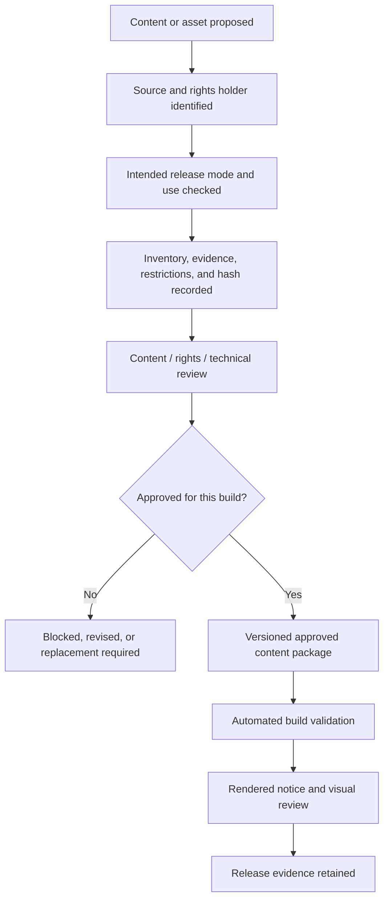

# Content & Licensing Requirements

## NoteQuest Web Application - Core MVP

*Version 0.1 | Draft for Review | Prepared for the NoteQuest Project*

| Field | Value |
|---|---|
| Document owner | Content / Licensing Reviewer |
| Related documents | [Business Requirements Document v0.1](business-requirements-v0.1.md); [MVP Scope v0.1](mvp-scope-v0.1.md); [Product Requirements Document v0.1](product-requirements-v0.1.md); [Functional Requirements Document v0.1](functional-requirements-v0.1.md); [Digital Rules Specification v0.1](digital-rules-specification-v0.1.md); [Data Model / Domain Model Specification v0.1](data-domain-model-v0.1.md); [UX Flow / Wireframe Requirements v0.1](ux-flow-wireframe-requirements-v0.1.md); [Non-Functional Requirements v0.1](non-functional-requirements-v0.1.md); [Digital Adaptation Decision Register](digital-adaptation-decision-register.md); [Decision Register v0.2](digital-adaptation-decision-register-v0.2.md) |
| Product scope | Palace production-intent prototype and complete six-dungeon Core MVP |
| Release mode | Public free, non-monetised web release; commercial distribution is not approved |
| Primary audience | Product owner, developer, UX designer, QA/tester, content reviewer, rights/legal reviewer, release owner, and documentation contributors |
| Status | Draft for review; records product controls and inventory, not legal advice |
| Last updated | 2026-07-17 |

---

## Contents

1. Purpose
2. Source Basis
3. Disclaimer and Review Position
4. Content Context
5. Content Scope
6. Licensing Principles
7. Source Categories and Approval States
8. Release Mode Policy
9. Content Usage Matrix
10. Product-Level Requirements
11. Feature-Level Requirements
12. Provenance Data Requirements
13. Attribution and Notices
14. Branding and Unofficial Product Requirements
15. Art, Icons, Fonts, UI, and Trade Dress
16. User-Authored and Imported Content
17. Third-Party and Open-Source Content
18. Approved Baseline Content Inventory
19. Review Workflow and Release Gates
20. Risk Register
21. Acceptance Criteria
22. Open Questions
23. Approval
24. Pre-Release Checklist

---

## 1. Purpose

This document defines the content, copyright, permission, provenance, attribution, branding, asset, dependency-licence, and release-gate requirements for the NoteQuest Palace prototype and complete Core MVP.

It converts the approved adaptation and rights decisions into implementable controls. It also provides the initial approved-baseline inventory of source content that may be represented as structured mechanics or terminology, identifies source material that must be paraphrased, and blocks source visuals, layout, trade dress, and unnecessary personal data unless separate item-level permission is recorded.

Approval of this document does not replace a qualified rights or legal review. It makes the documented product controls and conservative release positions normative for the project.

### 1.1 Controlling interpretation

1. Written permission for the digital adaptation, core-table digitisation, and approved terminology is recorded in the existing decision register.
2. The application uses original concise product copy and paraphrased explanations by default.
3. Exact source prose is blocked unless the rights evidence explicitly covers digital reproduction of that exact text.
4. Rules/table/name permission does not grant permission for source artwork, logos, layout, character-sheet design, page furniture, or trade dress.
5. Unknown, expired, unsupported, or unreviewed content is blocked from public builds.
6. The Core MVP remains English-only, free to use, and non-monetised.
7. Expanded World and any other supplement remain outside scope and require separate permission and scope approval.

---

## 2. Source Basis

| Source | Version / reviewed date | Rights / terms position | Approved use | Evidence location |
|---|---|---|---|---|
| NoteQuest rulebook | First edition; Tiago Junges; Porto Alegre; 2020; reviewed from `NoteQuest_eng.pdf` | Written adaptation/table/name permissions recorded in project decision registers; exact evidence file remains part of the rights record | Structured core mechanics, core tables, names, terminology, source-edition credit; prose only under the policy below | Decision Register LIC-001, LIC-003, LIC-004; RD-CONT-001 to 004 |
| [Digital Adaptation Decision Register](digital-adaptation-decision-register.md) | Historical approved baseline | Project decision baseline | Adaptation, table, names, art, branding, commercial, localisation, attribution, provenance constraints | `docs/product/digital-adaptation-decision-register.md` |
| [Decision Register v0.2](digital-adaptation-decision-register-v0.2.md) | Approved decision baseline | Project decision baseline | Paraphrase default, asset-by-asset rights, notices, English-only release | `docs/product/digital-adaptation-decision-register-v0.2.md` |
| Project-authored requirements and UI copy | Versioned repository documents | Project original | Product copy, labels, help, errors, explanations, test fixtures, and documentation that do not copy protected source expression | `docs/product/` |
| Replacement and placeholder assets | Selected after item-level review | Project original or separately compatible third-party licence | Palace placeholders and post-go final assets | Asset inventory and source files; not yet selected |
| Third-party software, fonts, icons, and assets | Version locked at implementation/release | Licence-specific | Only reviewed compatible dependencies and distributable assets | Dependency lock files, NOTICE, manifest, and release evidence |

The source PDF is used as a review source. Its page images, page design, decorative artwork, original logo, and character-sheet layout are not approved application assets.

The exact written permission instrument, correspondence, or signed licence must remain available to the rights reviewer. It need not be committed to a public repository when confidentiality or personal-data concerns apply, but its controlled evidence location, scope, date, parties, and reviewer must be recorded before a public release candidate.

---

## 3. Disclaimer and Review Position

This document records product requirements, conservative interpretations, and review controls. It is not legal advice.

A qualified rights or legal reviewer must approve before public release:

- the final rights-evidence record;
- the final item-level content and asset inventory;
- exact attribution and unofficial-product wording;
- the public application title, domain, store/listing copy, screenshots, and social-preview material;
- every third-party dependency or asset requiring redistribution or notice;
- any verbatim source text;
- any future commercial, sponsored, translated, or open-content distribution position.

Licensing is a release gate, not a post-release cleanup task. A missing or uncertain permission blocks the affected item rather than being treated as an implementation risk.

---

## 4. Content Context

The product is a faithful digital adaptation of the six-dungeon core NoteQuest game. It must implement structured races, classes, spells, dungeon tables, encounters, items, monsters, bosses, and rules while avoiding unnecessary reproduction of expressive source prose and visual presentation.

The content estate contains four distinct kinds of material:

1. **Permissioned source mechanics and tables** - structured values, ranges, names, effects, and relationships needed to implement the approved game.
2. **Protected source expression and visuals** - prose, narrative descriptions, artwork, logo, page design, decorative marks, and character-sheet layout that remain blocked unless separately approved.
3. **Project-original material** - application labels, onboarding, errors, explanations, accessibility text, visual design, icons, placeholders, test data, and documentation.
4. **User-authored material** - adventurer names, notes, imported save data, and voluntary diagnostic packages that remain private and separate from bundled content.

The source PDF includes a backer list containing personal names. The application has no functional need to reproduce that list; it is excluded unless a separate approved purpose and privacy review are recorded.

---

## 5. Content Scope

### 5.1 In scope

| Content area | Examples | Owner |
|---|---|---|
| Rules and mechanics presentation | Original UI labels, paraphrased explanations, dice/result evidence, action costs, warnings | Content / Rules / UX |
| Character creation | Race, class, spell, HP, ability, and starting-equipment definitions | Content / Rules |
| General dungeon rules | Dungeon naming, door outcomes, final room, darkness, actions, conditions, combat, hands, monster traits | Content / Rules |
| Six core dungeon packages | Palace, Crypt, Tomb, Sanctuary, Temple, Prison table definitions and approved names | Content / Rules |
| Credits and legal notices | Creator/title/source edition, permission statement, unofficial status, third-party notices | Content / Licensing |
| Product-original copy | Onboarding, help, errors, recovery, accessibility text, release notes | Product / UX / Content |
| Visual assets | Rights-safe placeholders and later approved replacement illustrations, icons, textures, and fonts | UX / Content |
| User-authored content | Adventurer names, notes, save metadata, exports, imports, and voluntary diagnostics | Product / Privacy |
| Third-party software/assets | Runtime and distributed development dependencies, fonts, icon sets, and asset libraries | Technical / Licensing |

### 5.2 Out of scope

- A final legal opinion.
- Expanded World or any other supplement.
- Commercial, paid, sponsored, advertising-supported, or donation-gated distribution.
- Public translated or localised releases.
- Exact rulebook prose not covered by an item-level reproduction approval.
- Source artwork, logo, page borders, illustrations, decorative marks, screenshots, layout, character-sheet design, and trade dress.
- The source backer list and other unnecessary personal data.
- New races, classes, dungeons, monsters, items, setting claims, or official-style expansions.
- AI-authored mechanics or lore presented as official NoteQuest content.
- User-created executable code, plugins, arbitrary HTML, or scripts.
- Unapproved screenshots or source-page reproductions in documentation, marketing, or store listings.

---

## 6. Licensing Principles

| ID | Principle | Requirement |
|---|---|---|
| CLP-001 | Source-first | Every bundled or imported content item identifies its source before inclusion. |
| CLP-002 | Permission-before-copy | No prose, table, image, icon, font, audio, or asset is shipped before the intended use is supported by recorded permission or compatible terms. |
| CLP-003 | Mechanics over expression | Implement approved mechanics as structured data and original code; prefer original product wording over copied prose. |
| CLP-004 | Paraphrase by default | Rule explanations and flavour summaries use concise project-original wording unless exact-text permission is recorded. |
| CLP-005 | Art is separate | Rules, table, names, or adaptation permission does not approve source visuals, logo, layout, or trade dress. |
| CLP-006 | Item-level provenance | Every bundled item has stable identity, source, terms, approval, version, and integrity metadata. |
| CLP-007 | Unknown means blocked | Unknown, restricted, incompatible, expired, or unreviewed items are excluded from public builds. |
| CLP-008 | Release mode matters | A future commercial or translated release requires a separate approved rights and product decision. |
| CLP-009 | No implied endorsement | Name, branding, copy, screenshots, domains, and metadata do not imply official ownership or endorsement. |
| CLP-010 | User content is separate | User-authored names and notes are private, user-controlled data and are never labelled as official content. |
| CLP-011 | Code and content licences are separate | An open-source code licence does not automatically license embedded NoteQuest content or assets. |
| CLP-012 | Historical stability | Content updates are versioned and do not silently rewrite stored results or historical rule evidence. |
| CLP-013 | Rights-safe testing | Automated fixtures use project-original or minimal structured test data unless an approved source fixture is necessary. |
| CLP-014 | Minimum necessary reproduction | The application includes only source-derived content required for the approved digital gameplay. |
| CLP-015 | Privacy-aware evidence | Rights evidence and reviewer identities are stored with appropriate access controls rather than exposed unnecessarily. |
| CLP-016 | Build enforcement | Content validation is a blocking automated release check, not a warning-only report. |
| CLP-017 | Attribution survives distribution | Required notices accompany the application, repository/release, and portable content packages where applicable. |
| CLP-018 | No silent substitution | Missing approved content blocks the affected feature/build rather than loading an unreviewed fallback. |

---

## 7. Source Categories and Approval States

### 7.1 Source categories

| Category | Definition | Release position |
|---|---|---|
| `notequest_permissioned_mechanics` | Source-derived mechanics represented through original code and structured state. | Approved for the Core MVP within the recorded adaptation permission. |
| `notequest_permissioned_tables` | Race, class, spell, dungeon, encounter, item, reward, monster, boss, trap, and related table data. | Approved at source-category level; every table/row must appear in the release manifest. |
| `notequest_permissioned_names` | NoteQuest title reference and approved race, class, spell, dungeon, monster, boss, item, and terminology names. | Approved within the recorded terminology permission and branding controls. |
| `notequest_source_prose_exact` | Verbatim or near-verbatim source prose, descriptions, or narrative text. | Blocked by default; item-level exact-text permission required. |
| `notequest_source_visual` | Source artwork, logo, page image, layout, character sheet, border, decorative mark, or trade dress. | Blocked unless separate item-level digital-use permission is recorded. |
| `project_original` | Original application copy, explanations, UI, diagrams, code, fixtures, documentation, and assets. | Preferred and approved after ordinary project review. |
| `project_placeholder` | Temporary rights-safe Palace visual or copy asset designed for replacement. | Prototype-only or reusable as recorded; must be nonessential to comprehension. |
| `user_authored` | Adventurer names, notes, user-controlled save metadata, and imported user data. | Private/user-controlled; not bundled as official content. |
| `third_party_open` | Third-party software or asset under verified compatible open terms. | Include after licence compatibility, attribution, and distribution review. |
| `third_party_licensed` | Purchased, commissioned, or proprietary asset with documented embedding/distribution rights. | Include only within the recorded grant and release modes. |
| `unknown` | Source, rights holder, terms, or provenance unresolved. | Blocked. |
| `restricted` | Known incompatible, prohibited, expired, or unapproved content. | Blocked. |

### 7.2 Approval states

| State | Meaning | Build position |
|---|---|---|
| `draft` | Proposed or being transcribed; not reviewed. | Internal development only. |
| `review_pending` | Source and terms identified; specialist review incomplete. | Excluded from public build. |
| `approved` | Intended use, release mode, provenance, and required notices approved. | Eligible for the applicable build. |
| `prototype_only` | Approved only for internal/closed Palace validation. | Excluded from public release unless promoted. |
| `replace_before_release` | Mechanically useful placeholder or temporary asset. | Allowed only in approved prototype builds. |
| `blocked` | Unknown, restricted, incompatible, or rejected. | Build failure if bundled. |
| `retired` | Previously approved version replaced; retained for historical compatibility only. | Not selected for new content; may remain addressable by version. |

---

## 8. Release Mode Policy

| Release mode | Content position | Monetisation position | Required review |
|---|---|---|---|
| Internal prototype | May use non-distributable references only in controlled analysis; distributable builds still avoid copied prose/visuals. | None | Product and content review. |
| Closed Palace playtest | Only inventory-listed approved or prototype-only content and rights-safe placeholders. | None | Content reviewer and test lead. |
| Public free non-monetised Core MVP | Only approved content compatible with the recorded permission and all required notices. | No payment, ads, sponsorship, subscription, paid unlock, or donation gate. | Product, content/rights, technical, QA, and release approval. |
| Future commercial release | Not approved. Requires separate rights, royalty, pricing, territory, platform, and distribution decision. | Undecided | New decision register and qualified rights review. |
| Future translated release | Not approved. Requires translation/localisation rights and terminology workflow. | Undecided | New decision register and qualified rights review. |
| Open-source repository | Code licence and embedded content/asset rights must be documented separately. | Does not change product monetisation | Repository, content, and rights review. |

Selected release mode: **Public free, non-monetised web release**.

---

## 9. Content Usage Matrix

| Content type | Planned use | Source category | Permitted release modes | Attribution | Approval status |
|---|---|---|---|---|---|
| Dice, calculations, state transitions, and rules logic | Original code implementing approved DRS outcomes | `notequest_permissioned_mechanics` + `project_original` | All approved Core MVP modes | Creator/source credit in About/Legal | Approved baseline |
| Race, class, spell, and starting-state tables | Structured definitions and values; no page-image reproduction | `notequest_permissioned_tables` / `notequest_permissioned_names` | Closed Palace and public free Core MVP | Source credit and rights statement | Approved baseline; manifest rows required |
| Dungeon name, door, segment, room, trap, monster, reward, boss, armour, and weapon tables | Structured definitions and values; versioned per dungeon package | `notequest_permissioned_tables` / `notequest_permissioned_names` | Closed Palace and public free Core MVP | Source credit and rights statement | Approved baseline; manifest rows required |
| General rule explanations | Concise project-original labels and paraphrases | `project_original` informed by permissioned mechanics | All approved modes | Source credit at product level | Approved baseline |
| Exact source prose and narrative descriptions | Excluded unless exact text is necessary and separately approved | `notequest_source_prose_exact` | Only as item-level permission allows | Exact item attribution/notice | Blocked by default |
| Source logo, cover, illustrations, page design, borders, icons, and character sheet | Not used | `notequest_source_visual` | None without separate permission | Item-specific if ever approved | Blocked |
| Graveyard functionality | Original application table/list using approved field concepts; no source sheet reproduction | `notequest_permissioned_mechanics` + `project_original` | All approved modes | Product-level source credit | Approved baseline |
| Project UI, onboarding, errors, recovery, accessibility, help, and release notes | Project-original wording | `project_original` | All modes | No source-text attribution needed beyond product credits | Approved after content review |
| Palace placeholder assets | Original or separately compatible silhouettes/icons/textures | `project_placeholder` / reviewed third party | Internal and closed playtest; public only if promoted | Per asset terms | Pending asset selection |
| Final replacement art, fonts, icons, and audio | Commissioned/original or compatible licensed assets | `project_original` / `third_party_open` / `third_party_licensed` | Public only after item-level approval | Per asset terms | Pending post-Palace plan |
| Documentation screenshots | Screenshots of the project UI only; no source-page screenshots or source visuals | `project_original` | All modes | App/source credit where required | Approved policy |
| Backer list and unrelated source front matter | Not included | Source personal/front-matter data | None | Not applicable | Excluded |
| User-authored names and notes | Private local data; never bundled as official content | `user_authored` | All modes | User-controlled | Approved policy |
| Imported/exported save packages | References versioned content IDs and provenance; may contain private user data | Mixed structured metadata + `user_authored` | All approved modes | Relevant provenance references | Approved policy |

---

## 10. Product-Level Requirements

| ID | Requirement | Priority | Acceptance criteria |
|---|---|---|---|
| CLR-001 | Maintain a versioned inventory of every bundled official, project-original, and third-party content or asset item. | Must | Release manifest has 100% coverage and no orphan bundled file/record. |
| CLR-002 | Represent source tables as structured, stable-ID definitions rather than page images or layout reproductions. | Must | Runtime content contains data definitions; source-page images are absent. |
| CLR-003 | Record source category, rights/permission status, release modes, attribution, approval, version, and integrity hash for every bundled item. | Must | Manifest validation passes all required fields. |
| CLR-004 | Exclude `unknown`, `restricted`, `blocked`, expired, and incompatible items from public builds. | Must | Build fails when any blocked entry is selected. |
| CLR-005 | Use project-original concise UI wording and paraphrased explanations by default. | Must | Content audit finds no unapproved verbatim source prose. |
| CLR-006 | Allow exact source prose only when an item record links to explicit digital reproduction permission. | Must | Every exact-text record has evidence reference, reviewer, approval date, and hash. |
| CLR-007 | Exclude the original logo, page layout, character sheet, source artwork, screenshots, decorative marks, and trade dress unless separately approved. | Must | Visual/source audit passes. |
| CLR-008 | Keep the release English-only and expose no incomplete translation selector or mixed-language content path. | Must | Build/string audit passes. |
| CLR-009 | Keep the complete approved Core MVP free and non-monetised. | Must | No payment, advertising, subscription, sponsorship, or paid unlock is present. |
| CLR-010 | Include readable creator/title/source-edition, permission, third-party, asset, and unofficial-product notices in required locations. | Must | Notice matrix and rendered surfaces agree. |
| CLR-011 | Keep user-authored names, notes, imports, saves, and diagnostics separate from bundled official/project content. | Must | Schema, UX, and export inspection pass. |
| CLR-012 | Preserve provenance and content-package versions through save, export, import, history, and migration. | Must | Round-trip and migration tests retain references. |
| CLR-013 | Version source-derived definitions so updates do not silently change saved outcomes or historical evidence. | Must | Compatibility tests preserve old definition/version references. |
| CLR-014 | Block an affected feature/build when required approved content is missing rather than substituting unknown content. | Must | Missing-definition test fails safely. |
| CLR-015 | Keep source rules/content separate from executable code where practical. | Must | Repository/build review shows content packages/manifests independent from logic. |
| CLR-016 | Require rights-safe, replaceable, nonessential placeholders through Palace validation. | Must | Placeholder inventory and UX review pass. |
| CLR-017 | Begin final replacement-art inclusion only after Palace go and item-level asset approval. | Must | Release gate checks go decision and asset records. |
| CLR-018 | Inventory distributed runtime and development dependencies whose licences/notices affect the release. | Must | Dependency licence report covers 100% distributable packages. |
| CLR-019 | Do not include source backer names or other unnecessary personal data. | Must | Content/search audit finds no backer-list reproduction. |
| CLR-020 | Do not present new mechanics, lore, races, classes, dungeons, items, or monsters as official NoteQuest content without separate scope and rights approval. | Must | Scope/content review passes. |
| CLR-021 | Use only project-original or explicitly approved source-derived material in public screenshots and documentation. | Must | Documentation/marketing audit passes. |
| CLR-022 | Retain the exact release content manifest, dependency licence report, notices, and approval evidence with every public release. | Must | Release evidence package is complete. |
| CLR-023 | Require an approved change record when an item's source, wording, values, file bytes, licence, attribution, or release mode changes. | Must | Hash/status change cannot bypass review. |
| CLR-024 | Prevent content validation or licence checks from being disabled in a release build without an explicit documented waiver. | Must | CI/configuration test passes. |
| CLR-025 | Treat commercial, sponsored, translated, and expansion releases as separate future decisions. | Must | No current build claims or enables those modes. |

---

## 11. Feature-Level Requirements

### 11.1 Application shell, onboarding, and credits

| ID | Requirement | Priority | Acceptance criteria |
|---|---|---|---|
| CLR-APP-001 | First-use and Data-area copy shall state that saves are local and that the application is a permitted unofficial adaptation, without implying cloud backup or official endorsement. | Must | Content and UX review passes. |
| CLR-APP-002 | About/Credits shall be reachable from first launch, the main shell, and offline mode. | Must | Browser and offline tests reach the view. |
| CLR-APP-003 | Credits shall be generated from the approved notice/manifest sources rather than maintained as an unrelated manual list. | Should | Manifest-to-credits comparison passes. |
| CLR-APP-004 | The application title, favicon, metadata, social preview, and domain shall not reuse the source logo or create confusing official branding. | Must | Brand review passes. |

### 11.2 Adventurer creation and rules presentation

| ID | Requirement | Priority | Acceptance criteria |
|---|---|---|---|
| CLR-ADV-001 | Race, class, spell, ability, starting-resource, and weapon content shall load only from approved versioned definitions. | Must | Definition/manifest validation passes. |
| CLR-ADV-002 | Creation help shall paraphrase rule concepts and avoid source-page screenshots or copied paragraphs. | Must | Content audit passes. |
| CLR-ADV-003 | Roll evidence may display approved names, numeric values, table IDs, and row IDs without reproducing the rulebook layout. | Must | UI/design review passes. |

### 11.3 Dungeon generation, exploration, and combat

| ID | Requirement | Priority | Acceptance criteria |
|---|---|---|---|
| CLR-DUN-001 | Each core dungeon shall be a separately versioned approved content package with its own table and provenance records. | Must | Package manifest and validation pass. |
| CLR-DUN-002 | Room, trap, monster, boss, reward, armour, and weapon data may reproduce approved structured values and names but shall use project-original presentation. | Must | Data and visual audits pass. |
| CLR-DUN-003 | Flavour descriptions shall be original/paraphrased and shall not add mechanics, lore claims, rewards, or penalties. | Must | Rules/content tests find no undocumented effect. |
| CLR-DUN-004 | Source dungeon illustrations and page layouts shall not appear in the map, cards, loading screens, or marketing. | Must | Asset/search audit passes. |

### 11.4 Inventory, town, death, history, and Graveyard

| ID | Requirement | Priority | Acceptance criteria |
|---|---|---|---|
| CLR-INV-001 | Item and modifier names/effects shall use approved structured definitions and stable IDs. | Must | Inventory manifest and runtime references pass. |
| CLR-TWN-001 | Town labels and explanations shall be project-original and shall not reproduce source page layout. | Must | Content/design review passes. |
| CLR-DTH-001 | The Graveyard shall implement approved fields and mechanics in an original interface; the source printable sheet is not an application asset. | Must | Functional and visual review passes. |
| CLR-HIS-001 | Rule traces shall prefer IDs, values, concise names, and project-original explanations over copied source paragraphs. | Must | History content audit passes. |

### 11.5 Save, import, export, and migration

| ID | Requirement | Priority | Acceptance criteria |
|---|---|---|---|
| CLR-SAV-001 | Portable packages shall identify application, schema, rules, content-package, and inventory versions. | Must | Export schema inspection passes. |
| CLR-SAV-002 | Exports shall reference bundled definitions by stable ID/version and shall not embed unneeded source prose or visual assets. | Must | Export inspection passes. |
| CLR-SAV-003 | Imports containing unknown or blocked content references shall be rejected or isolated without mutating valid data. | Must | Adversarial import tests pass. |
| CLR-SAV-004 | Migration shall preserve provenance and historical definition references. | Must | Migration fixtures pass. |

### 11.6 User-authored content and feedback

| ID | Requirement | Priority | Acceptance criteria |
|---|---|---|---|
| CLR-USR-001 | User names and notes shall be visibly and semantically distinct from immutable mechanics and bundled content. | Must | UX/accessibility review passes. |
| CLR-USR-002 | The application shall not claim ownership of user-authored content beyond permissions necessary for local processing. | Must | Product/privacy copy review passes. |
| CLR-USR-003 | Voluntary feedback shall not automatically attach saves, names, notes, history, or diagnostics. | Must | Network/E2E review passes. |
| CLR-USR-004 | A user-selected diagnostic package shall show an allowlisted preview before creation or attachment. | Must | Privacy/content test passes. |

### 11.7 Documentation, screenshots, and release materials

| ID | Requirement | Priority | Acceptance criteria |
|---|---|---|---|
| CLR-DOC-001 | Documentation shall not embed source PDF pages, source artwork, logo, character sheet, or trade dress. | Must | Repository documentation audit passes. |
| CLR-DOC-002 | Screenshots shall show only approved application UI and content selected for that build. | Must | Screenshot checklist passes. |
| CLR-DOC-003 | Release notes shall identify content-package changes and any notice changes. | Must | Release evidence review passes. |
| CLR-DOC-004 | Public copy shall describe the product as free and unofficial without implying endorsement or commercial rights. | Must | Rights/brand review passes. |

---

## 12. Provenance Data Requirements

| Field | Required | Description |
|---|---|---|
| contentId | Yes | Stable identifier independent of file order, display name, or source page position. |
| contentType | Yes | Definition, table, row, prose, visual, font, icon, dependency, notice, fixture, or documentation asset. |
| sourceCategory | Yes | Approved category from Section 7. |
| sourceName | Yes for bundled/imported content | Human-readable source, e.g. NoteQuest first edition or project-original. |
| sourceLocation | Yes for source-derived content | PDF page/table/row or controlled source-record reference. |
| sourceEditionVersion | Yes | Edition, package version, asset version, or reviewed date. |
| authorRightsHolder | Yes where known | Creator, rights holder, vendor, or project owner. |
| permissionLicenseId | Yes | Canonical permission, licence, contract, or project-original identifier. |
| evidenceLocation | Yes for bundled non-original content | Controlled record path/reference; may be private. |
| permittedReleaseModes | Yes | Internal, closed playtest, public free, future commercial, etc. |
| restrictions | Yes | Verbatim, visual, attribution, territory, expiry, modification, redistribution, or other constraints. |
| attributionNoticeId | When required | Reference to approved display-ready notice. |
| modifications | Should | Paraphrase, transcription, correction, normalisation, cropped/derived asset, or original implementation note. |
| approvalStatus | Yes | State from Section 7.2. |
| approvedBy | Yes for approved items | Reviewer identity or controlled reviewer record. |
| approvedAt | Yes for approved items | ISO 8601 date/time. |
| contentVersion | Yes | Version used by runtime and saves. |
| contentHash | Yes for release items | Hash of canonical serialisation or file bytes. |
| supersedes | When applicable | Prior item/version replaced. |
| compatibilityPolicy | For saved definitions | How prior saves/history resolve the item/version. |
| noticeLocations | When required | About/Credits, NOTICE, manifest, release listing, export package, etc. |

### 12.1 Row-level inventory rule

A table-level inventory entry in Section 18 authorises the planned content family only. Before a public release candidate:

- each playable table row, monster, boss, item, spell, race, class, ability, trap, reward, armour, and weapon definition must have its own stable runtime `contentId`;
- the release manifest may group shared provenance, but it must still enumerate every selected runtime definition;
- source page and table references must be sufficient to audit transcription;
- any correction of an apparent source typo or ambiguity must trace to the DRS or an approved decision, not an unrecorded editorial change.

---

## 13. Attribution and Notices

### 13.1 Required notice locations

| Location | Required content | Required for |
|---|---|---|
| In-app About / Credits | Creator/title/source-edition credit; adaptation/permission statement; unofficial-product wording; third-party software, font, icon, and asset notices; application/content versions. | Closed Palace and public release |
| Repository `NOTICE` or equivalent | Source credit, permission/licence references suitable for public disclosure, third-party notices, code/content licence separation. | Any distributed repository/release |
| Content manifest / README | Item-level provenance, release-mode status, hashes, attribution IDs, blocked-item report. | All release candidates |
| Public landing/store/listing copy | Free/non-monetised position, unofficial status, required creator/source credit, privacy/local-save limitation where appropriate. | Public release |
| Export package metadata | Application/schema/rules/content versions and relevant provenance references; private-data warning remains separate. | Export-enabled builds |
| Release evidence package | Final inventory, dependency report, notices, approvals, screenshots, and exact content package hashes. | Public release candidate and release |

### 13.2 Notice wording status

The decision register requires creator/title, source-edition, permission, asset, third-party, and unofficial-product notices. Exact legal wording has not been supplied in the repository and remains a rights-review deliverable.

The application and repository shall therefore use a controlled notice record such as `NOTICE-NQ-001`, whose text is release-blocking until approved. Product copy may use the following non-final drafting structure for review, but it shall not be treated as approved legal wording:

```text
NoteQuest was created by Tiago Junges. This digital adaptation references the first-edition
NoteQuest core game and is distributed with the permission recorded by the project.
This application is an unofficial digital adaptation and does not reuse the original
publication's logo, artwork, page design, or character-sheet trade dress unless an item is
separately identified as authorised. Additional software and asset notices appear below.
```

The rights reviewer may replace this draft without changing the product requirements, provided the final wording remains accurate, readable, and consistent with the recorded permission.

### 13.3 Notice integrity

- Notices must be stored as versioned content records.
- The rendered About/Credits view must match the selected notice records.
- Required notices must remain available offline.
- Notice changes require review and a new content-package version.
- Credits must not expose confidential correspondence, unnecessary personal data, or private reviewer contact details.

---

## 14. Branding and Unofficial Product Requirements

1. The application name, logo, favicon, domain, package identifier, metadata, and social preview must not imply official ownership or endorsement.
2. The source NoteQuest logo and look-alike tracing are excluded unless separately authorised.
3. The application may use the text name “NoteQuest” only within the recorded terminology/name permission and approved title/notice context.
4. Marketing and repository copy must state the unofficial adaptation status where required by the rights reviewer.
5. The original cover composition, typography, page frame, decorative motifs, character-sheet design, and monochrome dungeon-page layouts must not be imitated as trade dress.
6. The approved monochrome ink/notebook direction must be an independent application design, not a reconstruction of source pages.
7. Screenshots, thumbnails, social cards, and store/listing images follow the same visual restrictions.
8. A future publisher, storefront, sponsorship, or commercial presentation requires separate review.

---

## 15. Art, Icons, Fonts, UI, and Trade Dress

### 15.1 Asset policy

| Asset | Source / licence position | Embedding permitted | Redistribution permitted | Attribution | Approval |
|---|---|---|---|---|---|
| Source cover illustration and dungeon illustrations | NoteQuest rulebook | No | No | Not applicable | Blocked |
| Source NoteQuest logo | NoteQuest rulebook | No | No | Not applicable | Blocked |
| Source page layout, borders, tables, and Graveyard sheet design | NoteQuest rulebook | No | No | Not applicable | Blocked |
| Palace placeholder silhouettes/icons | Project original or compatible third party | After review | After review | Per item | Pending selection; prototype-only until approved |
| Final replacement illustrations | Commissioned/project original or separately licensed | After contract/licence review | After contract/licence review | Per item | Deferred until Palace go |
| Application icons | Project original or compatible icon set | After licence review | After licence review | Per item | Pending |
| Web fonts | System fonts or compatible web-embedding licence | After web/app embedding review | After redistribution review | Per font | Pending |
| Textures/backgrounds | Project original or compatible asset | After review | After review | Per item | Pending |
| Audio | Not required for MVP; any later audio requires separate inventory | No current selection | No current selection | Per item | Won't for baseline unless approved |

### 15.2 Asset requirements

- Every asset file has a stable ID, source file, creator, licence/contract, permitted uses, attribution, version, hash, and approval status.
- Commissioned work requires a written grant covering web embedding, distribution, modification, promotional screenshots, repository/release use where applicable, and future maintenance.
- “Royalty free” or a marketplace purchase is not sufficient without the actual licence terms and receipt/record.
- Font review must cover web/app embedding and redistribution, not only desktop installation.
- Generated assets require the tool/model/process record and a rights/policy review; generated output is not assumed safe merely because it is generated.
- Accessibility meaning must not depend on an illustration, texture, decorative icon, or animation.
- Placeholder assets are visually distinguishable from source art and easy to replace without changing mechanics or stored state.

---

## 16. User-Authored and Imported Content

1. Adventurer names, save-slot names, notes, user-entered metadata, imports, exports, event annotations, and diagnostics are private user data by default.
2. User-authored content is stored and presented separately from immutable mechanical history and bundled content.
3. The project does not use private user content for marketing, examples, training, analytics, or publication without explicit separate permission.
4. The application renders user content as text and does not execute HTML, scripts, links, or embedded resources.
5. Imports are save packages, not arbitrary content-pack or plugin installation mechanisms in the Core MVP.
6. Imports with unknown or blocked bundled-content references are rejected or isolated safely.
7. Export preserves user authorship and version/provenance references but does not grant the project rights in user content.
8. Deleting or replacing bundled definitions does not silently delete unrelated user notes; compatibility behaviour follows the Data Model and migration policy.
9. Voluntary diagnostics use an explicit allowlist and user preview.
10. Public test fixtures contain no real user names, notes, or saves unless specific consent and anonymisation review exist.

---

## 17. Third-Party and Open-Source Content

### 17.1 Current position

Application implementation dependencies, production fonts, production icon sets, production illustrations, and audio have not yet been selected. Their absence does not block approval of this requirements document; it blocks the relevant implementation or release item until inventory and review are complete.

The repository currently includes Wireloom-based UX documentation tooling. It is documentation/development tooling rather than Core MVP runtime content. Its exact package version, licence file, transitive dependencies, and redistribution position must be captured in the repository dependency report if it is distributed with release/source artifacts.

### 17.2 Dependency inventory requirements

| ID | Requirement | Priority | Acceptance |
|---|---|---|---|
| CLR-3P-001 | Lock exact dependency versions for release. | Must | Lock-file audit. |
| CLR-3P-002 | Record package name, version, source registry/repository, licence identifier, licence text location, copyright notice, use, distribution status, and review state. | Must | Dependency report validation. |
| CLR-3P-003 | Reject dependencies with unknown, incompatible, or prohibited terms from release artifacts. | Must | Licence gate. |
| CLR-3P-004 | Include required attribution/licence text in NOTICE or another required location. | Must | Rendered/file notice audit. |
| CLR-3P-005 | Separate development-only tooling from runtime/redistributed dependencies. | Must | Build and package inspection. |
| CLR-3P-006 | Review copied snippets, examples, fixtures, and documentation extracts as content, not merely code. | Must | Repository audit. |
| CLR-3P-007 | Record font, icon, stock, purchased, and commissioned asset terms independently from software packages. | Must | Asset inventory. |
| CLR-3P-008 | Re-run licence and vulnerability reviews before every public release and after dependency changes. | Must | CI/release evidence. |

---

## 18. Approved Baseline Content Inventory

### 18.1 Inventory interpretation

The following inventory records the source content families authorised or blocked by existing project decisions. “Approved baseline” means the planned use is permitted by the approved project rights position; the final release still requires row-level manifest records, transcription review, content hashes, final notice wording, and reviewer sign-off.

No source page image, original illustration, logo, or layout is approved through this inventory.

### 18.2 Source, front matter, and global rules

| ID | File / record | Content type | Source | Source category | Approved planned use | Visual/text restriction | Approval |
|---|---|---|---|---|---|---|---|
| INV-NQ-001 | Creator/title/edition credit | Credit metadata | PDF pp.1-2 | `notequest_permissioned_names` | Use factual creator, title, edition, place, and year in Credits/manifest | No source layout/logo | Approved baseline - credit |
| INV-NQ-002 | NoteQuest product-name reference and core terminology | Names/terminology | Throughout | `notequest_permissioned_names` | Use within approved application title, definitions, notices, and rule traces | Independent branding required | Approved baseline |
| INV-NQ-003 | Cover logo | Logo | PDF p.1 | `notequest_source_visual` | No use | No reproduction or imitation | Blocked |
| INV-NQ-004 | Cover illustration | Artwork | PDF p.1 | `notequest_source_visual` | No use | Replacement art required | Blocked |
| INV-NQ-005 | Title-page logo and composition | Logo/layout | PDF p.2 | `notequest_source_visual` | No use | No reproduction or imitation | Blocked |
| INV-NQ-006 | Backers list | Personal/front matter | PDF p.3 | Source personal data | Not required by application | Do not include | Excluded |
| INV-NQ-007 | Table of contents and source pagination | Layout/front matter | PDF p.4 | `notequest_source_visual` / factual metadata | May cite source pages internally; do not copy layout | No page-layout reproduction | Excluded from runtime |
| INV-NQ-008 | Introduction and How to Play concepts | Rules prose | PDF p.5 | `notequest_permissioned_mechanics` + `notequest_source_prose_exact` | Implement flow and provide original onboarding/paraphrase | No verbatim paragraph or source screenshot | Approved baseline - paraphrase only |
| INV-NQ-009 | Race table | Structured table | PDF p.6 | `notequest_permissioned_tables` / names | Digitise all approved rows as stable definitions | Original application presentation | Approved baseline - structured data |
| INV-NQ-010 | Class table | Structured table | PDF p.6 | `notequest_permissioned_tables` / names | Digitise all approved rows as stable definitions | Original application presentation | Approved baseline - structured data |
| INV-NQ-011 | Basic Spells table | Structured table | PDF p.6 | `notequest_permissioned_tables` / names | Digitise all approved rows as stable definitions | Original application presentation | Approved baseline - structured data |
| INV-NQ-012 | Building a Dungeon and Dungeon Name table | Rules/table | PDF p.7 | `notequest_permissioned_mechanics` / tables / names | Implement mechanics and digitise name columns | Paraphrase explanatory prose | Approved baseline |
| INV-NQ-013 | Open a Door table | Structured table | PDF p.7 | `notequest_permissioned_tables` | Digitise outcomes/ranges | Original application presentation | Approved baseline - structured data |
| INV-NQ-014 | Segments explanation | Rules prose | PDF p.7 | `notequest_permissioned_mechanics` | Implement graph/segment rule; paraphrase help | No copied paragraph/layout | Approved baseline - paraphrase only |
| INV-NQ-015 | Final Room rules | Rules prose | PDF p.8 | `notequest_permissioned_mechanics` | Implement approved DRS final-room behaviour | Paraphrase only | Approved baseline - paraphrase only |
| INV-NQ-016 | Darkness rules | Rules prose | PDF p.8 | `notequest_permissioned_mechanics` | Implement approved light/death behaviour | Paraphrase only | Approved baseline - paraphrase only |
| INV-NQ-017 | Dungeon Actions | Rules prose | PDF p.8 | `notequest_permissioned_mechanics` | Implement approved action set/costs | Original labels and paraphrases | Approved baseline - paraphrase only |
| INV-NQ-018 | City/Town Actions | Rules prose | PDF p.9 | `notequest_permissioned_mechanics` | Implement approved town transactions | Original labels and paraphrases | Approved baseline - paraphrase only |
| INV-NQ-019 | Special Conditions | Rules prose | PDF p.9 | `notequest_permissioned_mechanics` / names | Implement approved conditions/traits | Names and structured effects; paraphrase prose | Approved baseline |
| INV-NQ-020 | Combat rules | Rules prose | PDF p.10 | `notequest_permissioned_mechanics` | Implement DRS combat timing/calculations | Paraphrase only | Approved baseline - paraphrase only |
| INV-NQ-021 | Hands/arms rules | Rules prose | PDF p.10 | `notequest_permissioned_mechanics` | Implement DRS hand/equipment constraints | Paraphrase only | Approved baseline - paraphrase only |
| INV-NQ-022 | Monster trait rules and names | Rules/terminology | PDF p.10 | `notequest_permissioned_mechanics` / names | Implement approved trait definitions | Structured data and paraphrased help | Approved baseline |
| INV-NQ-023 | Dungeons divider illustration | Artwork/layout | PDF p.11 | `notequest_source_visual` | No use | Replacement/divider design must be original | Blocked |

### 18.3 Six core dungeon packages

| ID | File / record | Content type | Source | Source category | Approved planned use | Restriction | Approval |
|---|---|---|---|---|---|---|---|
| INV-PAL-INTRO | Palace - Dungeon introductory/flavour text | Prose | PDF pp.12-13 | `notequest_permissioned_mechanics` + `notequest_source_prose_exact` | Use only original/paraphrased flavour that adds no mechanics | Source layout/illustration excluded; project-original presentation | Approved baseline - paraphrase only |
| INV-PAL-SEG | Palace - Segments table | Structured table | PDF pp.12-13 | `notequest_permissioned_tables` | Digitise every row/range as stable definitions | Source layout/illustration excluded; project-original presentation | Approved baseline - structured data |
| INV-PAL-SEC | Palace - Secret Passage table | Structured table | PDF pp.12-13 | `notequest_permissioned_tables` | Digitise every row/range as stable definitions | Source layout/illustration excluded; project-original presentation | Approved baseline - structured data |
| INV-PAL-ROOM | Palace - Room Content table | Structured table | PDF pp.12-13 | `notequest_permissioned_tables` | Digitise every row/range as stable definitions | Source layout/illustration excluded; project-original presentation | Approved baseline - structured data |
| INV-PAL-TRAP | Palace - Trap table | Structured table | PDF pp.12-13 | `notequest_permissioned_tables` / names | Digitise every trap definition and effect | Source layout/illustration excluded; project-original presentation | Approved baseline - structured data |
| INV-PAL-MON | Palace - Monsters table | Structured table | PDF pp.12-13 | `notequest_permissioned_tables` / names | Digitise every monster definition, count/range, HP, damage, and traits | Source layout/illustration excluded; project-original presentation | Approved baseline - structured data |
| INV-PAL-REW | Palace - Reward table: Treasure, Wonders, Magic Item | Structured table | PDF pp.12-13 | `notequest_permissioned_tables` / names | Digitise every reward/item/modifier definition and cross-table result | Source layout/illustration excluded; project-original presentation | Approved baseline - structured data |
| INV-PAL-BOS | Palace - Dungeon Boss table | Structured table | PDF pp.12-13 | `notequest_permissioned_tables` / names | Digitise every boss definition and mechanical values; paraphrase flavour | Source layout/illustration excluded; project-original presentation | Approved baseline - structured data / paraphrase |
| INV-PAL-ARM | Palace - Armour table | Structured table | PDF pp.12-13 | `notequest_permissioned_tables` / names | Digitise every armour definition/value | Source layout/illustration excluded; project-original presentation | Approved baseline - structured data |
| INV-PAL-WPN | Palace - Weapon table | Structured table | PDF pp.12-13 | `notequest_permissioned_tables` / names | Digitise every weapon definition/damage/hand property | Source layout/illustration excluded; project-original presentation | Approved baseline - structured data |
| INV-PAL-VIS | Palace - Dungeon illustration and source page composition | Artwork/layout | PDF pp.12-13 | `notequest_source_visual` | No use; create independent replacement assets after approval | Source layout/illustration excluded; project-original presentation | Blocked |
| INV-CRY-INTRO | Crypt - Dungeon introductory/flavour text | Prose | PDF pp.14-15 | `notequest_permissioned_mechanics` + `notequest_source_prose_exact` | Use only original/paraphrased flavour that adds no mechanics | Source layout/illustration excluded; project-original presentation | Approved baseline - paraphrase only |
| INV-CRY-SEG | Crypt - Segments table | Structured table | PDF pp.14-15 | `notequest_permissioned_tables` | Digitise every row/range as stable definitions | Source layout/illustration excluded; project-original presentation | Approved baseline - structured data |
| INV-CRY-SEC | Crypt - Secret Passage table | Structured table | PDF pp.14-15 | `notequest_permissioned_tables` | Digitise every row/range as stable definitions | Source layout/illustration excluded; project-original presentation | Approved baseline - structured data |
| INV-CRY-ROOM | Crypt - Room Content table | Structured table | PDF pp.14-15 | `notequest_permissioned_tables` | Digitise every row/range as stable definitions | Source layout/illustration excluded; project-original presentation | Approved baseline - structured data |
| INV-CRY-TRAP | Crypt - Trap table | Structured table | PDF pp.14-15 | `notequest_permissioned_tables` / names | Digitise every trap definition and effect | Source layout/illustration excluded; project-original presentation | Approved baseline - structured data |
| INV-CRY-MON | Crypt - Monsters table | Structured table | PDF pp.14-15 | `notequest_permissioned_tables` / names | Digitise every monster definition, count/range, HP, damage, and traits | Source layout/illustration excluded; project-original presentation | Approved baseline - structured data |
| INV-CRY-REW | Crypt - Reward table: Treasure, Wonders, Magic Item | Structured table | PDF pp.14-15 | `notequest_permissioned_tables` / names | Digitise every reward/item/modifier definition and cross-table result | Source layout/illustration excluded; project-original presentation | Approved baseline - structured data |
| INV-CRY-BOS | Crypt - Dungeon Boss table | Structured table | PDF pp.14-15 | `notequest_permissioned_tables` / names | Digitise every boss definition and mechanical values; paraphrase flavour | Source layout/illustration excluded; project-original presentation | Approved baseline - structured data / paraphrase |
| INV-CRY-ARM | Crypt - Armour table | Structured table | PDF pp.14-15 | `notequest_permissioned_tables` / names | Digitise every armour definition/value | Source layout/illustration excluded; project-original presentation | Approved baseline - structured data |
| INV-CRY-WPN | Crypt - Weapon table | Structured table | PDF pp.14-15 | `notequest_permissioned_tables` / names | Digitise every weapon definition/damage/hand property | Source layout/illustration excluded; project-original presentation | Approved baseline - structured data |
| INV-CRY-VIS | Crypt - Dungeon illustration and source page composition | Artwork/layout | PDF pp.14-15 | `notequest_source_visual` | No use; create independent replacement assets after approval | Source layout/illustration excluded; project-original presentation | Blocked |
| INV-TOM-INTRO | Tomb - Dungeon introductory/flavour text | Prose | PDF pp.16-17 | `notequest_permissioned_mechanics` + `notequest_source_prose_exact` | Use only original/paraphrased flavour that adds no mechanics | Source layout/illustration excluded; project-original presentation | Approved baseline - paraphrase only |
| INV-TOM-SEG | Tomb - Segments table | Structured table | PDF pp.16-17 | `notequest_permissioned_tables` | Digitise every row/range as stable definitions | Source layout/illustration excluded; project-original presentation | Approved baseline - structured data |
| INV-TOM-SEC | Tomb - Secret Passage table | Structured table | PDF pp.16-17 | `notequest_permissioned_tables` | Digitise every row/range as stable definitions | Source layout/illustration excluded; project-original presentation | Approved baseline - structured data |
| INV-TOM-ROOM | Tomb - Room Content table | Structured table | PDF pp.16-17 | `notequest_permissioned_tables` | Digitise every row/range as stable definitions | Source layout/illustration excluded; project-original presentation | Approved baseline - structured data |
| INV-TOM-TRAP | Tomb - Trap table | Structured table | PDF pp.16-17 | `notequest_permissioned_tables` / names | Digitise every trap definition and effect | Source layout/illustration excluded; project-original presentation | Approved baseline - structured data |
| INV-TOM-MON | Tomb - Monsters table | Structured table | PDF pp.16-17 | `notequest_permissioned_tables` / names | Digitise every monster definition, count/range, HP, damage, and traits | Source layout/illustration excluded; project-original presentation | Approved baseline - structured data |
| INV-TOM-REW | Tomb - Reward table: Treasure, Wonders, Magic Item | Structured table | PDF pp.16-17 | `notequest_permissioned_tables` / names | Digitise every reward/item/modifier definition and cross-table result | Source layout/illustration excluded; project-original presentation | Approved baseline - structured data |
| INV-TOM-BOS | Tomb - Dungeon Boss table | Structured table | PDF pp.16-17 | `notequest_permissioned_tables` / names | Digitise every boss definition and mechanical values; paraphrase flavour | Source layout/illustration excluded; project-original presentation | Approved baseline - structured data / paraphrase |
| INV-TOM-ARM | Tomb - Armour table | Structured table | PDF pp.16-17 | `notequest_permissioned_tables` / names | Digitise every armour definition/value | Source layout/illustration excluded; project-original presentation | Approved baseline - structured data |
| INV-TOM-WPN | Tomb - Weapon table | Structured table | PDF pp.16-17 | `notequest_permissioned_tables` / names | Digitise every weapon definition/damage/hand property | Source layout/illustration excluded; project-original presentation | Approved baseline - structured data |
| INV-TOM-VIS | Tomb - Dungeon illustration and source page composition | Artwork/layout | PDF pp.16-17 | `notequest_source_visual` | No use; create independent replacement assets after approval | Source layout/illustration excluded; project-original presentation | Blocked |
| INV-SAN-INTRO | Sanctuary - Dungeon introductory/flavour text | Prose | PDF pp.18-19 | `notequest_permissioned_mechanics` + `notequest_source_prose_exact` | Use only original/paraphrased flavour that adds no mechanics | Source layout/illustration excluded; project-original presentation | Approved baseline - paraphrase only |
| INV-SAN-SEG | Sanctuary - Segments table | Structured table | PDF pp.18-19 | `notequest_permissioned_tables` | Digitise every row/range as stable definitions | Source layout/illustration excluded; project-original presentation | Approved baseline - structured data |
| INV-SAN-SEC | Sanctuary - Secret Passage table | Structured table | PDF pp.18-19 | `notequest_permissioned_tables` | Digitise every row/range as stable definitions | Source layout/illustration excluded; project-original presentation | Approved baseline - structured data |
| INV-SAN-ROOM | Sanctuary - Room Content table | Structured table | PDF pp.18-19 | `notequest_permissioned_tables` | Digitise every row/range as stable definitions | Source layout/illustration excluded; project-original presentation | Approved baseline - structured data |
| INV-SAN-TRAP | Sanctuary - Trap table | Structured table | PDF pp.18-19 | `notequest_permissioned_tables` / names | Digitise every trap definition and effect | Source layout/illustration excluded; project-original presentation | Approved baseline - structured data |
| INV-SAN-MON | Sanctuary - Monsters table | Structured table | PDF pp.18-19 | `notequest_permissioned_tables` / names | Digitise every monster definition, count/range, HP, damage, and traits | Source layout/illustration excluded; project-original presentation | Approved baseline - structured data |
| INV-SAN-REW | Sanctuary - Reward table: Treasure, Wonders, Magic Item | Structured table | PDF pp.18-19 | `notequest_permissioned_tables` / names | Digitise every reward/item/modifier definition and cross-table result | Source layout/illustration excluded; project-original presentation | Approved baseline - structured data |
| INV-SAN-BOS | Sanctuary - Dungeon Boss table | Structured table | PDF pp.18-19 | `notequest_permissioned_tables` / names | Digitise every boss definition and mechanical values; paraphrase flavour | Source layout/illustration excluded; project-original presentation | Approved baseline - structured data / paraphrase |
| INV-SAN-ARM | Sanctuary - Armour table | Structured table | PDF pp.18-19 | `notequest_permissioned_tables` / names | Digitise every armour definition/value | Source layout/illustration excluded; project-original presentation | Approved baseline - structured data |
| INV-SAN-WPN | Sanctuary - Weapon table | Structured table | PDF pp.18-19 | `notequest_permissioned_tables` / names | Digitise every weapon definition/damage/hand property | Source layout/illustration excluded; project-original presentation | Approved baseline - structured data |
| INV-SAN-VIS | Sanctuary - Dungeon illustration and source page composition | Artwork/layout | PDF pp.18-19 | `notequest_source_visual` | No use; create independent replacement assets after approval | Source layout/illustration excluded; project-original presentation | Blocked |
| INV-TEM-INTRO | Temple - Dungeon introductory/flavour text | Prose | PDF pp.20-21 | `notequest_permissioned_mechanics` + `notequest_source_prose_exact` | Use only original/paraphrased flavour that adds no mechanics | Source layout/illustration excluded; project-original presentation | Approved baseline - paraphrase only |
| INV-TEM-SEG | Temple - Segments table | Structured table | PDF pp.20-21 | `notequest_permissioned_tables` | Digitise every row/range as stable definitions | Source layout/illustration excluded; project-original presentation | Approved baseline - structured data |
| INV-TEM-SEC | Temple - Secret Passage table | Structured table | PDF pp.20-21 | `notequest_permissioned_tables` | Digitise every row/range as stable definitions | Source layout/illustration excluded; project-original presentation | Approved baseline - structured data |
| INV-TEM-ROOM | Temple - Room Content table | Structured table | PDF pp.20-21 | `notequest_permissioned_tables` | Digitise every row/range as stable definitions | Source layout/illustration excluded; project-original presentation | Approved baseline - structured data |
| INV-TEM-TRAP | Temple - Trap table | Structured table | PDF pp.20-21 | `notequest_permissioned_tables` / names | Digitise every trap definition and effect | Source layout/illustration excluded; project-original presentation | Approved baseline - structured data |
| INV-TEM-MON | Temple - Monsters table | Structured table | PDF pp.20-21 | `notequest_permissioned_tables` / names | Digitise every monster definition, count/range, HP, damage, and traits | Source layout/illustration excluded; project-original presentation | Approved baseline - structured data |
| INV-TEM-REW | Temple - Reward table: Treasure, Wonders, Magic Item | Structured table | PDF pp.20-21 | `notequest_permissioned_tables` / names | Digitise every reward/item/modifier definition and cross-table result | Source layout/illustration excluded; project-original presentation | Approved baseline - structured data |
| INV-TEM-BOS | Temple - Dungeon Boss table | Structured table | PDF pp.20-21 | `notequest_permissioned_tables` / names | Digitise every boss definition and mechanical values; paraphrase flavour | Source layout/illustration excluded; project-original presentation | Approved baseline - structured data / paraphrase |
| INV-TEM-ARM | Temple - Armour table | Structured table | PDF pp.20-21 | `notequest_permissioned_tables` / names | Digitise every armour definition/value | Source layout/illustration excluded; project-original presentation | Approved baseline - structured data |
| INV-TEM-WPN | Temple - Weapon table | Structured table | PDF pp.20-21 | `notequest_permissioned_tables` / names | Digitise every weapon definition/damage/hand property | Source layout/illustration excluded; project-original presentation | Approved baseline - structured data |
| INV-TEM-VIS | Temple - Dungeon illustration and source page composition | Artwork/layout | PDF pp.20-21 | `notequest_source_visual` | No use; create independent replacement assets after approval | Source layout/illustration excluded; project-original presentation | Blocked |
| INV-PRI-INTRO | Prison - Dungeon introductory/flavour text | Prose | PDF pp.22-23 | `notequest_permissioned_mechanics` + `notequest_source_prose_exact` | Use only original/paraphrased flavour that adds no mechanics | Source layout/illustration excluded; project-original presentation | Approved baseline - paraphrase only |
| INV-PRI-SEG | Prison - Segments table | Structured table | PDF pp.22-23 | `notequest_permissioned_tables` | Digitise every row/range as stable definitions | Source layout/illustration excluded; project-original presentation | Approved baseline - structured data |
| INV-PRI-SEC | Prison - Secret Passage table | Structured table | PDF pp.22-23 | `notequest_permissioned_tables` | Digitise every row/range as stable definitions | Source layout/illustration excluded; project-original presentation | Approved baseline - structured data |
| INV-PRI-ROOM | Prison - Room Content table | Structured table | PDF pp.22-23 | `notequest_permissioned_tables` | Digitise every row/range as stable definitions | Source layout/illustration excluded; project-original presentation | Approved baseline - structured data |
| INV-PRI-TRAP | Prison - Trap table | Structured table | PDF pp.22-23 | `notequest_permissioned_tables` / names | Digitise every trap definition and effect | Source layout/illustration excluded; project-original presentation | Approved baseline - structured data |
| INV-PRI-MON | Prison - Monsters table | Structured table | PDF pp.22-23 | `notequest_permissioned_tables` / names | Digitise every monster definition, count/range, HP, damage, and traits | Source layout/illustration excluded; project-original presentation | Approved baseline - structured data |
| INV-PRI-REW | Prison - Reward table: Treasure, Wonders, Magic Item | Structured table | PDF pp.22-23 | `notequest_permissioned_tables` / names | Digitise every reward/item/modifier definition and cross-table result | Source layout/illustration excluded; project-original presentation | Approved baseline - structured data |
| INV-PRI-BOS | Prison - Dungeon Boss table | Structured table | PDF pp.22-23 | `notequest_permissioned_tables` / names | Digitise every boss definition and mechanical values; paraphrase flavour | Source layout/illustration excluded; project-original presentation | Approved baseline - structured data / paraphrase |
| INV-PRI-ARM | Prison - Armour table | Structured table | PDF pp.22-23 | `notequest_permissioned_tables` / names | Digitise every armour definition/value | Source layout/illustration excluded; project-original presentation | Approved baseline - structured data |
| INV-PRI-WPN | Prison - Weapon table | Structured table | PDF pp.22-23 | `notequest_permissioned_tables` / names | Digitise every weapon definition/damage/hand property | Source layout/illustration excluded; project-original presentation | Approved baseline - structured data |
| INV-PRI-VIS | Prison - Dungeon illustration and source page composition | Artwork/layout | PDF pp.22-23 | `notequest_source_visual` | No use; create independent replacement assets after approval | Source layout/illustration excluded; project-original presentation | Blocked |

### 18.4 Graveyard and source worksheet

| ID | File / record | Content type | Source | Source category | Approved planned use | Restriction | Approval |
|---|---|---|---|---|---|---|---|
| INV-NQ-090 | Graveyard field concepts: name, dungeon, cause of death | Structured field concepts | PDF p.24 | `notequest_permissioned_mechanics` / names | Implement approved searchable Graveyard records with expanded DRS fields | Use original UI and semantics | Approved baseline |
| INV-NQ-091 | Printed Graveyard sheet grid/layout | Character-sheet/layout | PDF p.24 | `notequest_source_visual` | No use | Do not reproduce source worksheet/grid/trade dress | Blocked |
| INV-NQ-092 | Source page ornaments, borders, typography, and pagination marks | Trade dress/layout | Throughout PDF | `notequest_source_visual` | No use | Independent application design required | Blocked |

### 18.5 Inventory completion requirements

Before Palace closed playtest:

- all Palace runtime rows and placeholder assets must be enumerated with stable IDs, hashes, and approval states;
- the source-to-runtime transcription comparison must be complete for Palace;
- no source visual or verbatim prose may be present unless separately approved;
- rights-safe placeholder assets and the current notice draft must be reviewable.

Before Core MVP public release candidate:

- all six dungeon packages and global tables must have row-level runtime manifest coverage;
- every selected project-original/third-party asset and dependency must be inventoried;
- exact permission evidence and final notice wording must be approved;
- content hashes must match the release build;
- all blocked/excluded inventory items must be absent.

---

## 19. Review Workflow and Release Gates



| Gate | Pass condition | Owner |
|---|---|---|
| Source gate | Source, author/rights holder, edition/version, and source location are known. | Content reviewer |
| Permission/licence gate | Intended reproduction, adaptation, modification, embedding, redistribution, and release mode are permitted. | Rights/legal reviewer |
| Provenance gate | All required metadata, evidence reference, restrictions, approval, version, and hash are present. | Content reviewer / Technical |
| Transcription gate | Structured values match the reviewed source or approved DRS correction. | Rules / QA / Content |
| Paraphrase gate | No unapproved verbatim or near-verbatim source prose remains. | Content reviewer |
| Visual gate | No source artwork, logo, page layout, character sheet, screenshot, or trade dress is used. | UX / Content |
| Attribution gate | Final credits, permission statement, third-party notices, and unofficial wording are accurate and readable. | Rights / Product / UX |
| Dependency gate | Distributed packages/assets have compatible licences and notices. | Technical / Licensing |
| Privacy gate | Backer list, user data, private evidence, and diagnostics are not exposed improperly. | Privacy / Content |
| Build gate | Blocked/unknown/unapproved items cause a release build failure. | Technical / QA |
| Release-mode gate | The build remains free, non-monetised, English-only, and within the approved core scope. | Product / Content |
| Evidence gate | Final inventory, notices, hashes, screenshots, reports, and approvals are retained with the release. | Release owner |

---

## 20. Risk Register

| ID | Risk | Impact | Mitigation | Owner |
|---|---|---|---|---|
| CL-RISK-001 | Unapproved exact prose is shipped. | Release block and infringement risk. | Paraphrase default, exact-text inventory, source-text audit, build gate. | Content / Rights |
| CL-RISK-002 | Structured source table values are mistranscribed. | Rules defects and trust loss. | Dual review, source-page reference, deterministic fixtures, hash/version control. | Content / Rules / QA |
| CL-RISK-003 | Source artwork, logo, or trade dress enters the application or marketing. | Rights and brand-confusion risk. | Blocked inventory, asset scan, independent design review. | UX / Content |
| CL-RISK-004 | Written permission scope or evidence cannot be demonstrated. | Public release blocked. | Controlled rights record, reviewer sign-off, release evidence gate. | Product / Rights |
| CL-RISK-005 | A third-party package, font, or icon has incompatible terms. | Distribution breach or forced replacement. | Locked inventory, licence audit, notices, dependency gate. | Technical / Licensing |
| CL-RISK-006 | A non-commercial or restricted asset enters a future commercial build. | Licence breach. | Separate commercial decision and automated release-mode filtering. | Product / Rights |
| CL-RISK-007 | User-authored names, notes, or saves are published in fixtures or diagnostics. | Privacy and trust harm. | Synthetic fixtures, allowlisted diagnostics, explicit consent review. | Privacy / QA |
| CL-RISK-008 | Backer names or other source personal data are copied unnecessarily. | Privacy/reputational harm. | Explicit exclusion and repository search audit. | Content / Privacy |
| CL-RISK-009 | Content updates change saved outcomes or history silently. | Compatibility and explainability failure. | Stable IDs, versions, immutable event evidence, migration tests. | Rules / Technical |
| CL-RISK-010 | Final credits or unofficial wording is incomplete or inaccurate. | Rights/brand release block. | Controlled notice records and rights-review approval. | Content / Rights |
| CL-RISK-011 | Project-original visuals unintentionally imitate source trade dress. | Brand confusion despite new files. | Independent visual review against source pages. | UX / Content |
| CL-RISK-012 | Generated or commissioned assets lack sufficient records or grants. | Replacement cost and release delay. | Process/contract records and item-level approval before inclusion. | Product / Content |
| CL-RISK-013 | Screenshots or documentation expose blocked source visuals/content. | Public distribution issue. | Screenshot/documentation checklist and build/repo audit. | Documentation / Content |
| CL-RISK-014 | Open-source code licence is incorrectly presented as covering embedded content. | False licensing claim. | Separate code/content notices and manifest. | Technical / Rights |

---

## 21. Acceptance Criteria

- [ ] Every bundled runtime definition, text record, notice, asset, font, icon, and distributable dependency appears in the release inventory.
- [ ] Every inventory item records source, source category, version/date, rights/permission or licence, permitted release modes, restrictions, attribution, approval, and hash.
- [ ] Every source-derived runtime definition traces to a reviewed PDF page/table/row and approved rules/content version.
- [ ] Every playable race, class, spell, dungeon, room, trap, monster, boss, reward, item, armour, weapon, and ability has a stable runtime content ID.
- [ ] Unknown, restricted, blocked, expired, incompatible, and unapproved items are absent from release builds.
- [ ] Exact source prose is absent unless an item-level exact-text approval exists.
- [ ] Source artwork, logo, page images, screenshots, layout, character sheet, page furniture, and trade dress are absent unless separately authorised.
- [ ] The source backer list and unnecessary personal data are absent.
- [ ] Project-original UI copy and paraphrased explanations do not add unsupported mechanics or lore.
- [ ] Palace placeholders are rights-safe, replaceable, and nonessential to rules comprehension.
- [ ] Final replacement assets follow Palace go and item-level approval.
- [ ] Creator/title/source-edition, permission, third-party, asset, and unofficial-product notices are accurate and present in every required location.
- [ ] About/Credits remains reachable online and offline.
- [ ] User-authored names, notes, imports, saves, and diagnostics remain separate and private by default.
- [ ] Import/export and migration preserve content versions and provenance references.
- [ ] Distributed software, fonts, icons, and assets pass licence compatibility and notice review.
- [ ] The public build remains English-only, free, non-monetised, and limited to approved core content.
- [ ] Release screenshots and documentation contain only approved application content and independent project design.
- [ ] Content hashes and manifest selection match the final artifact.
- [ ] Product, content/rights, technical, UX, QA, and release reviewers approve the applicable inventory and gates.

---

## 22. Open Questions

No unresolved product or rules decision blocks approval of this document. The existing decision registers already establish adaptation permission, table/name use, paraphrase policy, source-art exclusion, attribution, release mode, and English-only scope.

The following are evidence, implementation, or release-review details rather than new product decisions.

| ID | Question | Owner | Decision point | Status |
|---|---|---|---|---|
| OQ-CL-001 | Where is the controlled written-permission evidence stored, and which non-confidential identifier may the public manifest reference? | Content / Rights / Product | Before Palace external distribution | Open; release-blocking evidence detail |
| OQ-CL-002 | What exact creator/source, permission, and unofficial-product notice wording is approved? | Rights / Product / Content | Before public release candidate | Open; release-blocking wording |
| OQ-CL-003 | What final public application title, logo, domain, favicon, and social-preview treatment pass name/brand review? | Product / UX / Rights | Before public landing page | Open; downstream |
| OQ-CL-004 | Which Palace placeholder assets are selected and what are their source/licence records? | UX / Content | Before closed Palace playtest | Open; downstream |
| OQ-CL-005 | Which final production assets are commissioned or licensed after Palace go? | Product / UX / Content | Post-Palace art plan | Deferred |
| OQ-CL-006 | Which code licence, if any, applies to the repository, and how is embedded content excluded from that grant? | Product / Technical / Rights | Before public source distribution | Open; downstream |
| OQ-CL-007 | Which runtime and development dependencies, fonts, and icon sets are selected by the architecture? | Technical / Content | During implementation / before RC | Open; downstream |
| OQ-CL-008 | Which hash/canonical-serialisation mechanism is used by the content manifest? | Technical / QA | Architecture | Open; downstream |
| OQ-CL-009 | How are source errata, spelling variants, or translation artefacts normalised without changing mechanics or silently rewriting names? | Rules / Content | Content-authoring workflow | Open; downstream |
| OQ-CL-010 | Which documentation screenshots and marketing surfaces are required for the first public release? | Product / Documentation / Content | Release plan | Open; downstream |
| OQ-CL-011 | Must any exact source phrase be reproduced for usability or legal accuracy, or can all player-facing prose remain project-original? | Content / Rights / UX | Content review | Open; default remains blocked |
| OQ-CL-012 | What retention/access policy applies to private rights correspondence and reviewer evidence? | Product / Rights / Operations | Before public RC | Open; governance detail |

---

## 23. Approval

Approval confirms the product controls and approved-baseline source inventory. It does not approve unselected assets, unrecorded dependencies, final notice wording, or a future commercial/translated release.

| Role | Name | Decision | Date | Notes |
|---|---|---|---|---|
| Product Owner |  | Pending / Approved / Rejected |  | Approves release mode, scope, branding direction, and product use |
| Content / Licensing Reviewer |  | Pending / Approved / Rejected |  | Approves inventory policy, source use, attribution, and blocked content |
| Rights / Legal Reviewer |  | Pending / Approved / Rejected |  | Approves evidence scope, final notices, public distribution, and item exceptions |
| Rules / Product Designer |  | Pending / Approved / Rejected |  | Approves source-to-structured-data and paraphrase fidelity |
| Technical Lead |  | Pending / Approved / Rejected |  | Approves manifest, build gates, dependency inventory, and version compatibility |
| UX / Visual Reviewer |  | Pending / Approved / Rejected |  | Approves independent design and source-visual/trade-dress exclusion |
| QA / Release Reviewer |  | Pending / Approved / Rejected |  | Approves testability, inventory validation, and release evidence |

---

## 24. Pre-Release Checklist

### Palace closed playtest

- [ ] Palace row-level content manifest is complete.
- [ ] Palace source transcription and deterministic fixtures pass.
- [ ] Every Palace placeholder is rights-safe and inventoried.
- [ ] No source prose, artwork, logo, page layout, or trade dress is present.
- [ ] Current credits/unofficial draft is reachable and clearly marked for review where wording is not final.
- [ ] Test fixtures contain no real user or backer data.
- [ ] Content validation fails on unknown/blocked entries.

### Core MVP public release candidate

- [ ] Selected release mode is explicitly public, free, non-monetised, and English-only.
- [ ] Written permission evidence and scope are confirmed by the rights reviewer.
- [ ] Every global and six-dungeon runtime definition has row-level manifest coverage.
- [ ] Final assets, fonts, icons, dependencies, and screenshots are inventoried and approved.
- [ ] Content hashes match the final release artifact.
- [ ] No unknown, restricted, blocked, expired, or incompatible item remains selected.
- [ ] Exact source prose is absent or carries item-level reproduction approval.
- [ ] Source artwork, logo, layout, character sheet, screenshots, page furniture, and trade dress are absent or separately authorised.
- [ ] Creator/title/source-edition, permission, third-party, asset, and unofficial notices are approved and present.
- [ ] Code and embedded content/asset licences are described separately.
- [ ] User-authored data is absent from public fixtures and release evidence.
- [ ] Release manifest, dependency report, notices, approvals, and screenshots are retained.
- [ ] Public/commercial/translation claims remain within the approved scope.
