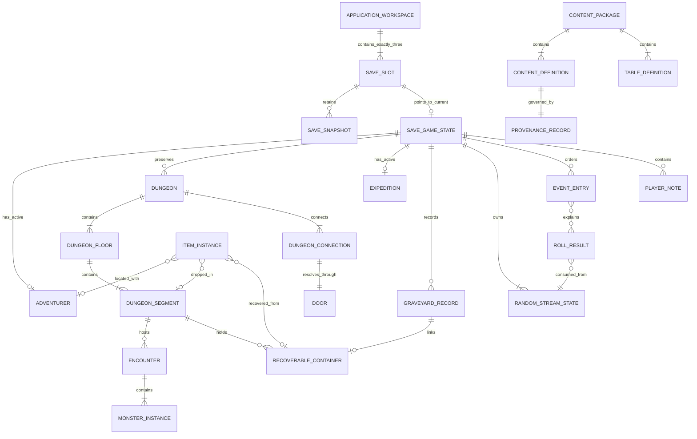
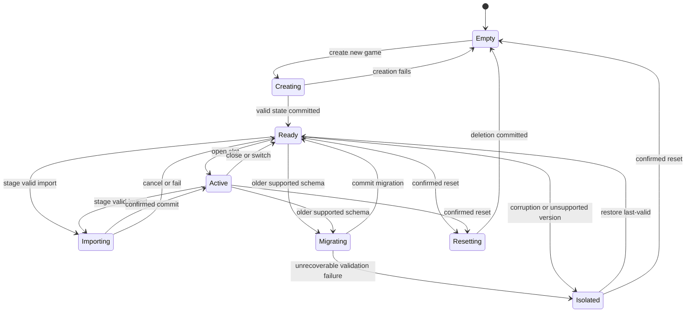
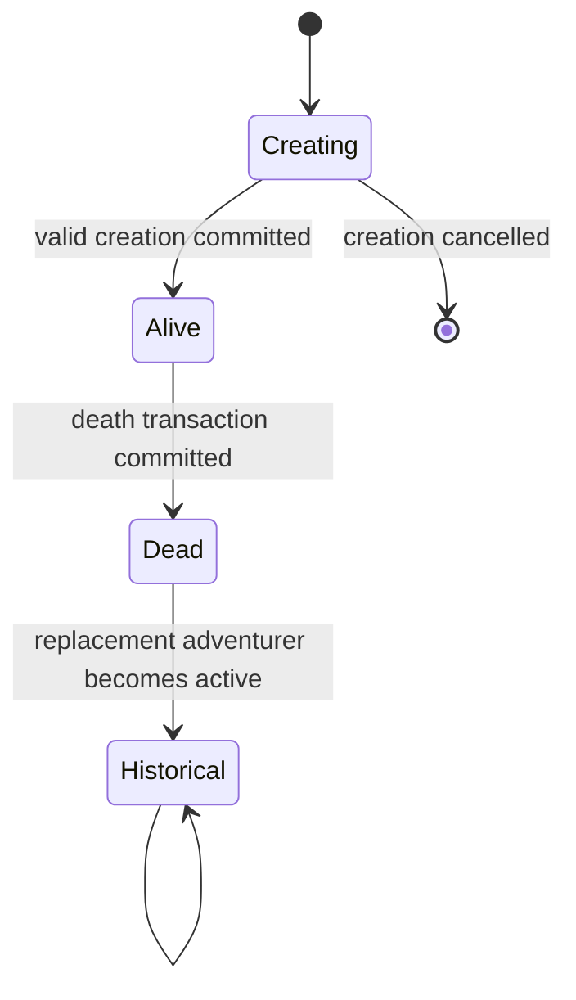
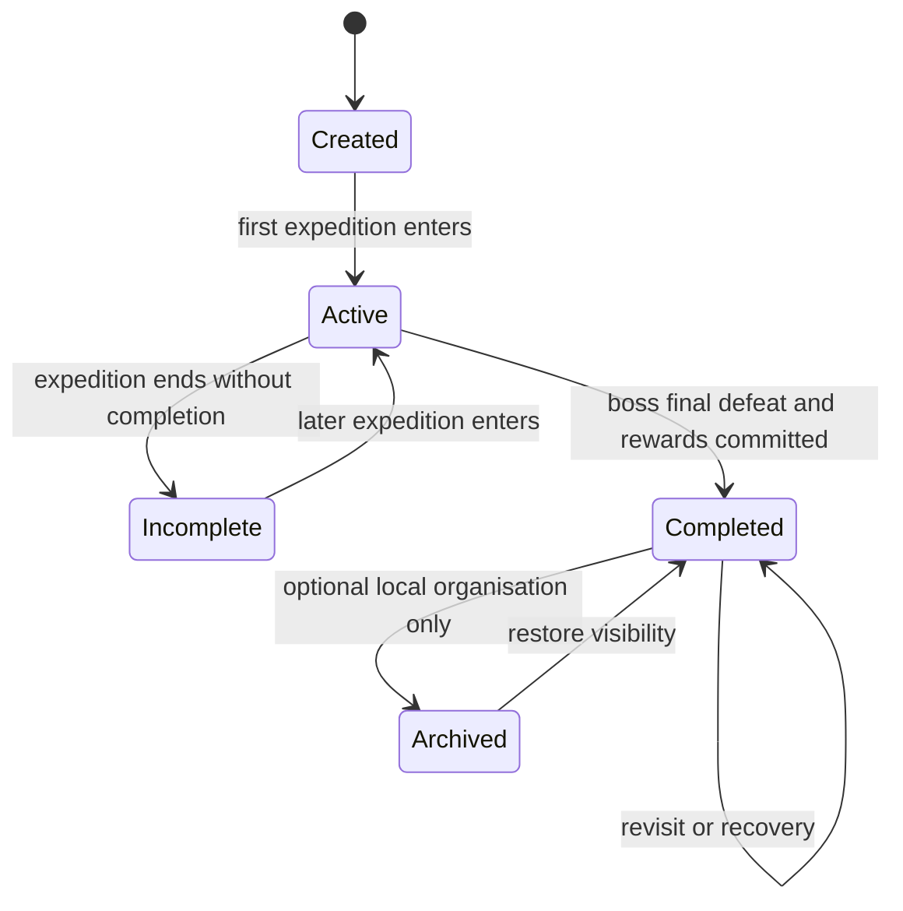
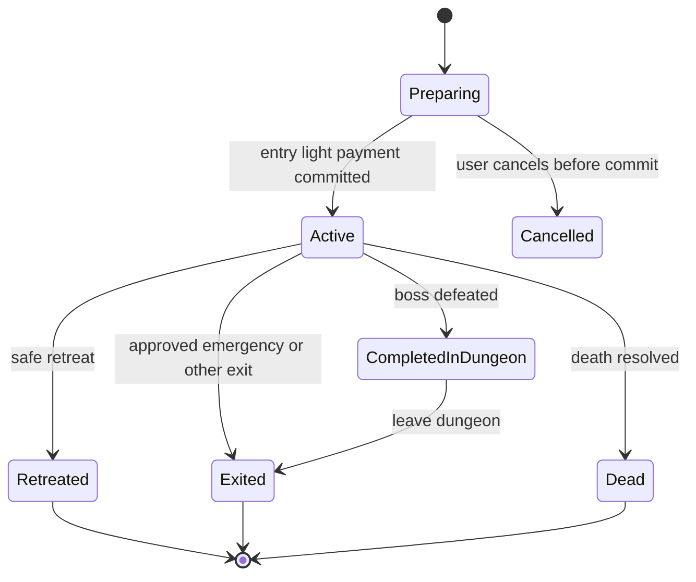
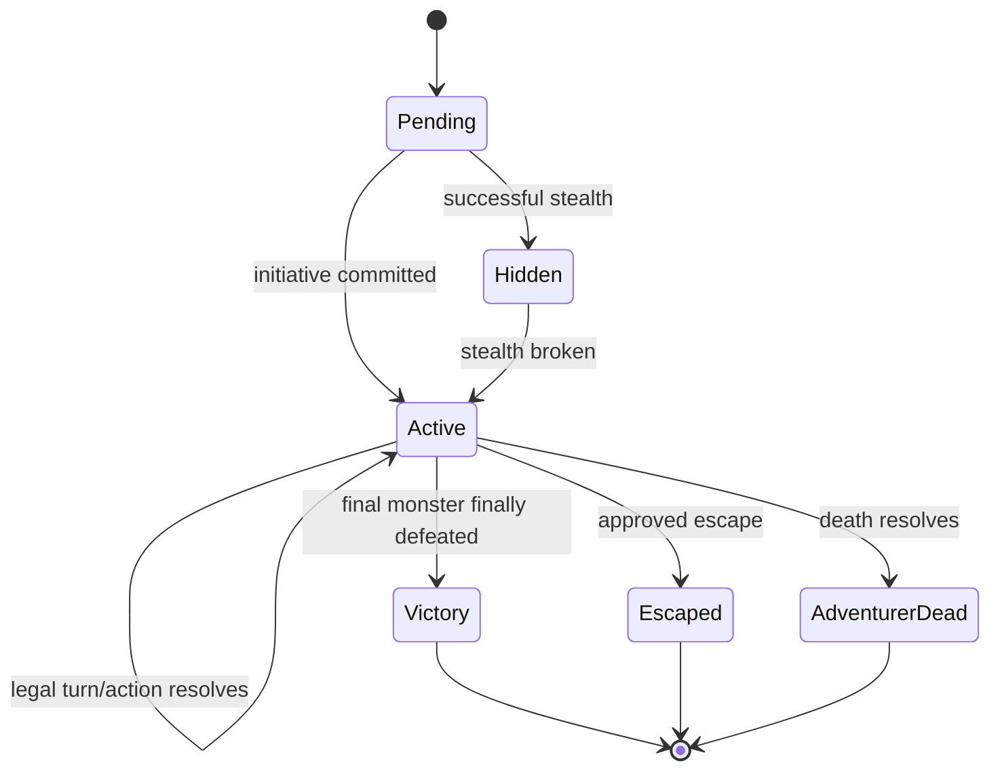
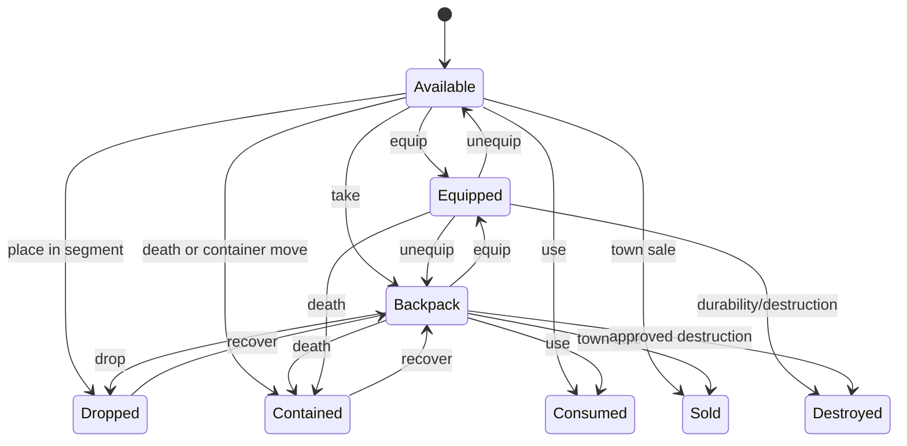
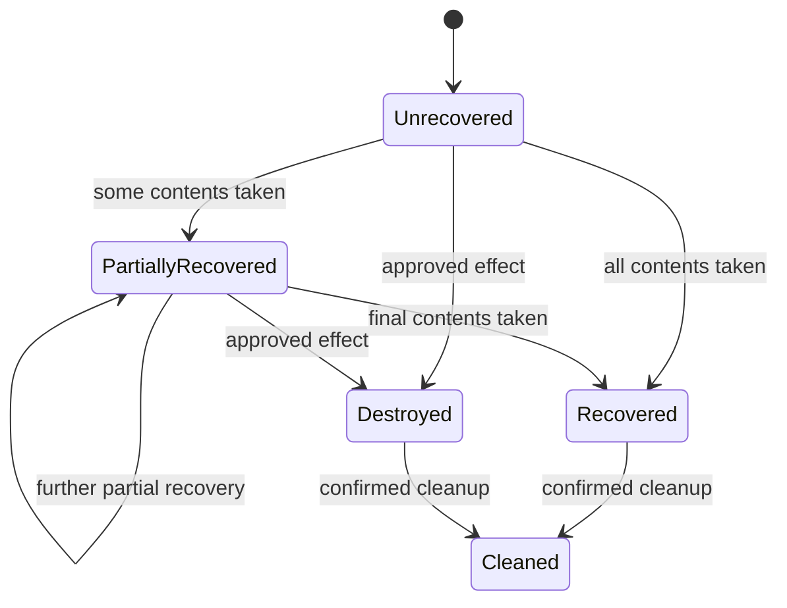

# Data Model / Domain Model Specification

## NoteQuest Web Application — Core MVP

*Version 0.1 | Draft for Review | Prepared for the NoteQuest Project*

| Field | Value |
|---|---|
| Document owner | Technical Lead / Data Modeller |
| Related documents | [Business Requirements Document v0.1](business-requirements-v0.1.md); [MVP Scope v0.1](mvp-scope-v0.1.md); [Product Requirements Document v0.1](product-requirements-v0.1.md); [Functional Requirements Document v0.1](functional-requirements-v0.1.md); [Digital Rules Specification v0.1](digital-rules-specification-v0.1.md); [Digital Adaptation Decision Register](digital-adaptation-decision-register.md); [Decision Register v0.2](digital-adaptation-decision-register-v0.2.md); [Digital Adaptation Feasibility Study](digital-adaptation-feasibility-study.md) |
| Product scope | Palace production-intent prototype and complete six-dungeon Core MVP |
| Primary audience | Product owner, technical lead, developer, rules designer, UX designer, QA/tester, data modeller, content/licensing reviewer, accessibility reviewer, and operations owner |
| Status | Draft for review |
| Last updated | 2026-07-17 |

---

## Contents

1. [Purpose](#1-purpose)
2. [Source Basis](#2-source-basis)
3. [Modeling Context](#3-modeling-context)
4. [Data Model Scope](#4-data-model-scope)
5. [Modeling Principles](#5-modeling-principles)
6. [Bounded Contexts](#6-bounded-contexts)
7. [Domain Overview](#7-domain-overview)
8. [Entity Relationship Summary](#8-entity-relationship-summary)
9. [Core Entities](#9-core-entities)
10. [Value Objects](#10-value-objects)
11. [Enumeration Catalogue](#11-enumeration-catalogue)
12. [Validation Rules and Invariants](#12-validation-rules-and-invariants)
13. [Lifecycle and State Transitions](#13-lifecycle-and-state-transitions)
14. [Persistence and Storage Guidance](#14-persistence-and-storage-guidance)
15. [Content Provenance and Licensing Data](#15-content-provenance-and-licensing-data)
16. [Import, Export, and Migration](#16-import-export-and-migration)
17. [Audit, History, and Event Log Linkage](#17-audit-history-and-event-log-linkage)
18. [Deletion, Archival, and Recovery](#18-deletion-archival-and-recovery)
19. [Traceability](#19-traceability)
20. [Acceptance Criteria](#20-acceptance-criteria)
21. [Open Questions](#21-open-questions)
22. [Approval](#22-approval)

---

## 1. Purpose

This specification defines the logical data structures, ownership boundaries, stable identities, relationships, invariants, lifecycle states, persistence semantics, import/export rules, migration behaviour, recovery records, and content-provenance data required for the NoteQuest web application.

It translates the approved product, functional, and digital-rules baselines into an implementation-neutral domain model for:

- three local save slots;
- canonical adventurers and their persistent state;
- six persistent dungeon records and incremental graph generation;
- expeditions, encounters, monsters, combat state, inventory, rewards, town actions, death, recovery, and the Graveyard;
- deterministic random-stream state and immutable committed outcomes;
- atomic autosaving, last-valid recovery, sequential migration, versioned export, and validated import;
- structured mechanical history and separate player-authored notes; and
- bundled-content identity, provenance, rights status, attribution, and versioning.

This document defines **what must be represented and preserved**. It does not mandate application classes, a programming language, a state-management library, a physical IndexedDB schema, component structure, or final screen design unless a logical requirement makes a constraint unavoidable.

## 2. Source Basis

### 2.1 Controlling sources

1. [Business Requirements Document v0.1](business-requirements-v0.1.md) for business objectives, release constraints, privacy, persistence, content, and operating boundaries.
2. [MVP Scope v0.1](mvp-scope-v0.1.md) for the Palace prototype, six-dungeon Core MVP, dependency order, exclusions, and release gates.
3. [Product Requirements Document v0.1](product-requirements-v0.1.md) for product outcomes, journeys, feature expectations, data safety, and accessibility obligations.
4. [Functional Requirements Document v0.1](functional-requirements-v0.1.md) for observable application behaviour, error handling, recovery, import/export, and traceability.
5. [Digital Rules Specification v0.1](digital-rules-specification-v0.1.md) for canonical calculations, timing, state transitions, persistence consequences, history, and all approved interpretive rulings.
6. Approved Digital Adaptation Decision Registers v0.1 and v0.2 for the PWA, IndexedDB, save-slot, deterministic-randomness, event-history, privacy, accessibility, and release decisions.
7. The [Digital Adaptation Feasibility Study](digital-adaptation-feasibility-study.md) for implementation risks and architectural direction.
8. Approved content definitions and the future Content and Licensing Requirements for individual content records and release eligibility.

### 2.2 Precedence

When a modeling choice conflicts with a controlling source, apply this order:

1. later approved decision-register ruling;
2. approved [Digital Rules Specification](digital-rules-specification-v0.1.md);
3. approved [Functional Requirements Document](functional-requirements-v0.1.md);
4. approved [Product Requirements Document](product-requirements-v0.1.md);
5. approved [MVP Scope](mvp-scope-v0.1.md);
6. approved [Business Requirements Document](business-requirements-v0.1.md);
7. this specification's implementation recommendation.

A later approved amendment may supersede this specification. Existing runtime instances retain their recorded rules and content versions unless an approved migration explicitly transforms them.

### 2.3 Downstream documents

The following documents may refine implementation detail without changing this logical model unless an approved amendment is raised:

- UX Flow and Wireframe Requirements;
- [Non-Functional Requirements](non-functional-requirements-v0.1.md);
- Content and Licensing Requirements and approved inventory;
- Web Architecture and Deployment Specification; and
- [Acceptance Criteria / Test Plan](acceptance-criteria-test-plan-v0.1.md).

## 3. Modeling Context

NoteQuest is a single-player, local-first, installable PWA. Core play requires no account, backend, cloud save, or continuous connection. The application exposes exactly three named local save slots and stores durable game state locally.

The product has two distinct data classes:

1. **Versioned definitions** — approved races, classes, spells, items, monsters, dungeon tables, rules tables, and other bundled content. Definitions use stable namespaced IDs and provenance metadata.
2. **Runtime instances** — adventurers, dungeons, segments, monsters, item instances, expeditions, deaths, event entries, and committed random results created during play. Instances use opaque stable IDs and retain the definition and rules versions under which they were created.

The model must support incremental dungeon generation without treating screen coordinates as mechanical truth. The graph, connections, door states, segment states, and content instances are authoritative; visual coordinates are replaceable presentation data.

The model must also preserve consequences over long-lived play. Completed dungeons, opened or broken doors, damage, destroyed items, deaths, recoverable belongings, Graveyard records, event history, and committed rolls cannot be silently reconstructed from the latest rules or rerolled after reload.

## 4. Data Model Scope

### 4.1 In scope

| Area | Data support |
|---|---|
| Workspace and slots | Exactly three local save slots, slot names, metadata, current-state pointer, last-valid pointer, recovery availability, versions, timestamps, and integrity state |
| Save state | Save-owned aggregate references, current adventurer, active expedition, persistent dungeons, Graveyard, random streams, content-version set, and history sequence |
| Adventurers | Identity, private name, race/class references, HP, abilities, spell charges, arms, hands, torches, coins, equipment, inventory, status, location, and death linkage |
| Dungeons | Dungeon identity/type/name, rules/content versions, floors, segments, graph connections, doors, traps, searches, occupants, drops, recoverable containers, boss state, and completion |
| Expeditions | Start/end events, active adventurer, dungeon, entry state, current segment, virtual light, repopulation markers, and lifecycle status |
| Encounters | Participants, initiative/phase, stealth state, legal-action state, temporary effects, defeat state, reward linkage, and completion outcome |
| Monsters | Definition reference, maximum/current HP, trait state, temporary effects, spawn/revival state, and final-defeat state |
| Items and economy | Stable item identity, definition/version, quality, durability, charges, value, key origin, location, ownership, equipment state, consumption/destruction/sale, and recovery |
| Death and recovery | Normal or darkness death, recoverable container, contents, cause, location, Graveyard record, partial recovery, and final recovery state |
| Randomness | Separate dungeon, combat, reward, and repopulation streams; algorithm/version; internal state; draw count; committed roll results |
| History | Immutable mechanical events, sequence ordering, linked entities, before/after summaries, dice/table details, correction events, completion summaries, and retention state |
| Player-authored data | Adventurer/slot names and optional notes stored separately from immutable mechanical records |
| Content and rights | Stable definitions, package/version, source, licence/permission, approval, attribution, restrictions, and content hash |
| Portability | Versioned export manifest, complete slot data, checksums, content references, validation report, import preview, sequential migration, and pre-migration recovery |
| Deletion/recovery | Confirmed slot reset, archive/tombstone states, last-valid restoration, partial-invalid isolation, and application-owned storage cleanup |

### 4.2 Out of scope

| Area | Exclusion |
|---|---|
| Accounts and cloud ownership | No account, server-authoritative identity, cloud save, shared campaign, or multi-device merge model |
| Multiplayer | No player membership, permissions, shared turns, conflict resolution, leaderboard, or anti-cheat model |
| Expanded World | No expansion-specific kingdoms, factions, settlements, quests, campaign maps, or supplement entities |
| Tactical simulation | No grid position, pathfinding, collision, enemy AI, initiative queue beyond approved encounter state, or real-time movement |
| UI component state | Panel expansion, animation state, hover state, map zoom, and other view-only data are not durable domain state |
| Final physical storage | Exact IndexedDB store names, key-path syntax, binary encoding, compression, and library-specific adapters are architecture decisions |
| Production telemetry | No analytics identity, behavioural event stream, marketing profile, or unapproved remote diagnostics |
| Localisation | No translated-label persistence or localisation catalogue for the English-only Core MVP |
| Unapproved content | No storage assumption that requires copied source prose, artwork, logo, page layout, character sheet, or trade dress |

## 5. Modeling Principles

| ID | Principle | Meaning |
|---|---|---|
| DMP-001 | MVP-simple, future-safe | The first UI may expose a subset while the domain keeps identity, ownership, versioning, and provenance explicit. |
| DMP-002 | Source-faithful data | The model represents approved mechanics without adding balance corrections, unsupported statuses, or invented consequences. |
| DMP-003 | Stable definition identity | Bundled definitions use stable namespaced machine IDs such as `race.human` or `spell.light`. |
| DMP-004 | Stable runtime identity | Runtime entities use opaque IDs that do not depend on array position, display name, map coordinate, or current owner. |
| DMP-005 | Definition-instance separation | Runtime instances reference immutable versioned definitions and store only mutable instance state plus approved snapshots of derived values. |
| DMP-006 | Immutable committed outcomes | Committed dice, table rows, generated topology, rewards, and completed transitions are not silently recalculated. |
| DMP-007 | Explicit corrections | A correction creates a linked amendment event and preserves the original result rather than editing history in place. |
| DMP-008 | Atomic action commits | Every meaningful state change is persisted as one all-or-nothing action across all affected logical records. |
| DMP-009 | Last-valid recovery | Each slot retains a recoverable last-known-valid state independent from the current write attempt. |
| DMP-010 | Provenance by default | Bundled and imported definitions carry source, permission/licence, approval, attribution, restriction, version, and hash data. |
| DMP-011 | Player data separation | Names and notes remain separate from licensed source content and immutable mechanical history. |
| DMP-012 | Graph truth over layout | Dungeon connectivity is represented by segments and connections; render coordinates never determine legal movement. |
| DMP-013 | One location per instance | Every item, monster, adventurer, and recoverable container has exactly one valid current location or a terminal tombstone state. |
| DMP-014 | Exportable by design | All save-owned data can be serialized into a versioned, validated, deterministically ordered package. |
| DMP-015 | Migration without reinterpretation | Sequential migrations may reshape storage but cannot reroll outcomes or silently apply new mechanics to historical instances. |
| DMP-016 | Privacy-local by default | Private play data has no remote owner or transmission requirement and is excluded from diagnostics unless explicitly approved. |
| DMP-017 | Retention is explicit | Active/incomplete history is complete; completed history follows the approved summary and final-500 policy. |
| DMP-018 | UI-independent rules | Durable data and invariants can be validated without rendering, animation, or component state. |

## 6. Bounded Contexts

| Context | Responsibility | Primary entities / services |
|---|---|---|
| Workspace and Save Management | Maintain exactly three slots, active/last-valid snapshots, slot metadata, reset, restore, import staging, and schema compatibility | `ApplicationWorkspace`, `SaveSlot`, `SaveSnapshot`, `SaveGameState`, `MigrationRecord`, `ImportReport` |
| Content Catalogue | Provide approved, versioned, validated definitions and tables without coupling mechanics to copied prose | `ContentPackage`, `ContentDefinition`, `TableDefinition`, `TableRowDefinition`, `ProvenanceRecord` |
| Adventurer | Create and maintain the active adventurer, derived HP, abilities, spells, resources, body state, status, and private name | `Adventurer`, `AdventurerAbility`, `SpellChargePool` |
| Dungeon World | Maintain persistent dungeon graph truth, floors, segments, connections, doors, hazards, occupants, drops, boss state, and completion | `Dungeon`, `DungeonFloor`, `DungeonSegment`, `DungeonConnection`, `Door`, `RecoverableContainer` |
| Expedition | Maintain entry, active location, virtual light, repopulation checks, retreat, exit, completion, and death linkage | `Expedition`, `RepopulationCheck` |
| Encounter and Combat | Resolve encounter phases, participants, temporary effects, stealth, attacks, escape, victory, death, and reward triggers | `Encounter`, `MonsterInstance`, `TemporaryEffect`, `ActionCommit` |
| Inventory and Economy | Preserve stable item identity through equipment, backpack, drops, containers, sale, repair, consumption, and destruction | `ItemInstance`, `InventoryLocation`, `ItemTransaction` |
| Death and Legacy | Preserve death facts, Graveyard records, recoverable belongings, multiple deaths per segment, and recovery progress | `DeathRecord`, `GraveyardRecord`, `RecoverableContainer` |
| Randomness and Resolution | Own deterministic streams, draws, natural values, table rows, manual input markers, and committed results | `RandomStreamState`, `RollResult`, `TableResult` |
| History and Notes | Maintain immutable mechanical history, correction linkage, completion summaries, sequence order, and separate editable notes | `EventEntry`, `CompletionSummary`, `PlayerNote` |
| Portability and Migration | Validate exports/imports, stage changes, migrate sequentially, preserve originals, and produce reports | `ExportManifest`, `ImportReport`, `MigrationRecord`, `IntegrityCheck` |

### 6.1 Context rules

- A context may reference another context only through stable IDs and versioned value objects.
- Cross-context actions commit through an `ActionCommit` transaction envelope.
- A failed cross-context action leaves every affected aggregate at its previous valid state.
- Content definitions are immutable within a package version. Corrections create a new package or definition version.
- Runtime instances retain the definition and rules versions used when they were created.
- The UI may build read models from multiple contexts but must not make a read model authoritative.

## 7. Domain Overview

### 7.1 Recommended hierarchy

```text
ApplicationWorkspace
  ├── SaveSlot 1
  ├── SaveSlot 2
  └── SaveSlot 3
        ├── current SaveSnapshot
        ├── last-valid SaveSnapshot
        └── SaveGameState
              ├── active Adventurer
              ├── zero or one active Expedition
              ├── persistent Dungeons
              │     ├── Floors
              │     ├── Segments
              │     ├── Connections and Doors
              │     ├── Encounters and MonsterInstances
              │     ├── ItemInstances and RecoverableContainers
              │     └── completion state
              ├── GraveyardRecords
              ├── RandomStreamStates
              ├── EventEntries and CompletionSummaries
              └── PlayerNotes
```

Versioned `ContentPackage` records are application-owned reference data. Save data points to them through stable definition IDs, package versions, and hashes.

### 7.2 Aggregate roots

| Aggregate root | Owns / controls | External references | Atomic consistency responsibility |
|---|---|---|---|
| `ApplicationWorkspace` | Workspace version and the fixed three slot identities | Current app version | Exactly three slot records exist |
| `SaveSlot` | Slot name/status, current snapshot pointer, last-valid pointer, schema state, timestamps | `SaveGameState`, snapshots, import/migration reports | Pointer changes, restore, reset, and isolation |
| `SaveGameState` | Slot-level active references, rules/content version set, current sequence, RNG stream set | Adventurer, dungeons, expedition, Graveyard, events | Cross-aggregate root references are valid |
| `Adventurer` | Body state, HP, abilities, spell charges, resources, location, status | Race/class/ability/spell definitions; item IDs; expedition/death IDs | Adventurer state cannot be partially invalid |
| `Dungeon` | Graph, floors, segments, connections, doors, monster instances, segment state, containers, completion | Dungeon/content definitions; expedition IDs; item IDs | Graph and persistent dungeon truth |
| `Expedition` | Entry/exit state, current segment, virtual light, repopulation markers | Adventurer and dungeon IDs | Expedition lifecycle and location |
| `Encounter` | Combat phase, participants, temporary effects, outcome, reward trigger status | Adventurer, dungeon segment, monster IDs | One legal encounter state and outcome |
| `ItemInstance` | Definition/version, mutable condition and location, lifecycle status | Adventurer, segment, container, item definition | Exactly one owner/location or terminal state |
| `GraveyardRecord` | Immutable death summary and recovery linkage | Adventurer, dungeon, segment, container | Every death has one record |
| `EventStream` | Ordered immutable events and completion summary | Any domain entity through typed references | Sequence uniqueness and retention |
| `ContentPackage` | Definitions, tables, provenance, approval state, hashes | External permission/licence evidence | Definition and provenance validation |
| `ImportSession` | Parsed package, validation report, preview, migration plan, final status | Target slot and source manifest | No target mutation before confirmed commit |

## 8. Entity Relationship Summary



### 8.1 Relationship catalogue

| Relationship | Cardinality | Ownership / deletion behaviour | Notes |
|---|---:|---|---|
| Workspace to save slots | Exactly 1-to-3 | Workspace-owned; slot identities are recreated only by application reset | Empty slots remain records |
| Save slot to snapshots | 1-to-many | Slot-owned; retention keeps current, last-valid, and required pre-migration/import snapshots | Physical deduplication is allowed |
| Save slot to game state | 1-to-0/1 current | Pointer swap is atomic | Empty or isolated slots may have no current state |
| Save state to active adventurer | 1-to-0/1 | Adventurer persists after death as historical identity; active pointer clears | New adventurer gets a new ID |
| Save state to dungeons | 1-to-many | Dungeons persist for save lifetime unless confirmed slot reset | One persistent record per created dungeon |
| Dungeon to floors | 1-to-1..3 | Dungeon-owned | Core dungeon has up to three floors |
| Floor to segments | 1-to-many | Floor-owned | Segment graph identity is stable |
| Dungeon to connections | 1-to-many | Dungeon-owned | Each connection links two valid segment IDs |
| Connection to door | 1-to-1 | Connection-owned | Door state is shared from both directions |
| Segment to encounters | 1-to-many over time | Dungeon-owned; resolved encounters remain historical or compacted by policy | At most one active blocking encounter per segment |
| Encounter to monsters | 1-to-many | Encounter/dungeon-owned | Spawned monsters receive stable IDs |
| Item to location | Exactly 1 current location or terminal state | Save-owned; identity survives transfers | Location is adventurer, segment, container, or terminal |
| Death to Graveyard record | Exactly 1-to-1 | Save-owned; lifetime of save | Atomic with death |
| Death to recoverable container | 1-to-0/1 | Dungeon-owned | Normal and darkness deaths differ in corpse marker |
| Event to linked entities | Many-to-many typed references | Event stream owns linkage values | No cascading delete of mechanical events |
| Definition to provenance | Many-to-1 or 1-to-1 | Content package-owned | Asset-level provenance may be unique |
| Roll result to stream | Many-to-1 | Save-owned | Stores stream kind and draw index |

## 9. Core Entities

All runtime IDs are opaque lowercase UUID-compatible strings. Definition IDs are stable namespaced strings. Timestamps use UTC RFC 3339 strings. Enumerated values use canonical lowercase snake-case machine values.

### 9.1 ApplicationWorkspace

**Purpose:** Represents application-owned local data and the fixed save-slot catalogue.

**Aggregate / owner:** Root application record

| Field | Type | Required | Default | Priority | Notes |
|---|---|---:|---|---|---|
| `workspaceId` | string | Yes | `workspace.local` | Must | Stable local root ID |
| `workspaceSchemaVersion` | positive integer | Yes | Current | Must | Workspace-only schema |
| `slotIds` | array of 3 IDs | Yes | Three generated stable IDs | Must | Exactly three unique entries |
| `createdAt` | datetime | Yes | Current time | Must | First application-data creation |
| `updatedAt` | datetime | Yes | Current time | Must | Last workspace mutation |
| `lastOpenedSlotId` | ID / null | No | null | Could | Convenience pointer only; does not determine validity |

#### Validation

- Exactly three unique slot IDs exist.
- Every slot ID resolves to a `SaveSlot`.
- No game mechanic depends on `lastOpenedSlotId`.

### 9.2 SaveSlot

**Purpose:** Provides a stable container, user-facing name, current state pointer, recovery pointer, and compatibility status.

**Aggregate / owner:** `ApplicationWorkspace`

| Field | Type | Required | Default | Priority | Notes |
|---|---|---:|---|---|---|
| `slotId` | runtime ID | Yes | Generated | Must | Stable for the slot lifetime |
| `slotIndex` | integer 1..3 | Yes | Assigned | Must | Unique and immutable |
| `displayName` | private text | Yes | `Save 1..3` | Must | Player-editable; not a mechanical key |
| `status` | `SaveSlotStatus` | Yes | `empty` | Must | Controls allowed operations |
| `currentSnapshotId` | ID / null | No | null | Must | Current committed state |
| `lastValidSnapshotId` | ID / null | No | null | Must | Recoverable state independent from current write |
| `schemaVersion` | positive integer / null | No | null | Must | Null only while empty |
| `rulesVersion` | version / null | No | null | Must | Current save baseline |
| `contentVersionSet` | array of `ContentVersionRef` | Yes | empty | Must | Definitions needed by runtime instances |
| `integrityStatus` | `IntegrityStatus` | Yes | `not_checked` | Must | Never hides invalidity |
| `recoveryAvailable` | boolean | Yes | false | Must | Derived from valid recovery pointer |
| `createdAt` | datetime | Yes | Current time | Must | Slot record creation |
| `updatedAt` | datetime | Yes | Current time | Must | Last metadata/state-pointer change |

#### Ownership and lifecycle

- The slot record is never removed independently of an application reset.
- Confirmed slot reset clears game-owned children and returns the slot to `empty`.
- Import replacement commits by atomically switching the current pointer after validation and confirmation.
- Corruption isolates the slot and leaves the other two slots usable.

### 9.3 SaveSnapshot

**Purpose:** Identifies a complete consistent save state suitable for current use, recovery, migration rollback, or import staging.

**Aggregate / owner:** `SaveSlot`

| Field | Type | Required | Default | Priority | Notes |
|---|---|---:|---|---|---|
| `snapshotId` | runtime ID | Yes | Generated | Must | Stable snapshot identity |
| `slotId` | ID | Yes | — | Must | Owning slot |
| `kind` | `SnapshotKind` | Yes | `current` | Must | Current, last-valid, pre-migration, pre-import, or staging |
| `stateRootId` | ID | Yes | — | Must | Resolves to `SaveGameState` |
| `schemaVersion` | positive integer | Yes | Current | Must | Snapshot schema |
| `rulesVersion` | version | Yes | Current | Must | Rules baseline |
| `contentVersionSet` | array | Yes | — | Must | Complete referenced package set |
| `eventSequence` | non-negative integer | Yes | 0 | Must | Last included mechanical sequence |
| `createdAt` | datetime | Yes | Current time | Must | Commit time |
| `reason` | enum/string | Yes | `action_commit` | Must | Why snapshot exists |
| `integrityHash` | string | Should | Calculated | Should | Covers manifest and canonical state |
| `validationStatus` | `ValidationStatus` | Yes | `valid` after commit | Must | Invalid staging cannot become current |

#### Rules

- A current or last-valid pointer references only a valid snapshot.
- A snapshot is immutable after successful commit.
- Physical implementations may use copy-on-write or structural sharing, but export must reconstruct a complete state.

### 9.4 SaveGameState

**Purpose:** Holds slot-level domain references and versioned state needed to resume play.

**Aggregate / owner:** `SaveSnapshot`

| Field | Type | Required | Default | Priority | Notes |
|---|---|---:|---|---|---|
| `gameStateId` | runtime ID | Yes | Generated | Must | Root of one complete state |
| `slotId` | ID | Yes | — | Must | Owning slot |
| `activeAdventurerId` | ID / null | No | null | Must | Null before creation or after death |
| `activeExpeditionId` | ID / null | No | null | Must | At most one |
| `dungeonIds` | ordered array of IDs | Yes | empty | Must | Persistent dungeons |
| `graveyardRecordIds` | ordered array of IDs | Yes | empty | Must | Lifetime death records |
| `randomStreamIds` | map by stream kind | Yes | Four streams | Must | Dungeon, combat, reward, repopulation |
| `nextEventSequence` | positive integer | Yes | 1 | Must | Monotonic mechanical sequence |
| `rulesVersion` | version | Yes | Current | Must | Default for new instances |
| `contentVersionSet` | array | Yes | Current packages | Must | Default content set |
| `createdAt` | datetime | Yes | Current time | Must | State creation |
| `updatedAt` | datetime | Yes | Current time | Must | Last committed transition |

#### Validation

- At most one active adventurer and expedition exist.
- An active expedition requires a living active adventurer.
- Every referenced dungeon, Graveyard record, stream, and event belongs to the same slot.
- Four required random streams exist exactly once.

### 9.5 RandomStreamState

**Purpose:** Persists independent deterministic random sequences.

**Aggregate / owner:** `SaveGameState`

| Field | Type | Required | Default | Priority | Notes |
|---|---|---:|---|---|---|
| `streamId` | runtime ID | Yes | Generated | Must | Stable stream identity |
| `slotId` | ID | Yes | — | Must | Owning save |
| `kind` | `RandomStreamKind` | Yes | — | Must | Unique per save |
| `algorithmId` | stable string | Yes | Approved implementation | Must | Versioned algorithm |
| `algorithmVersion` | version | Yes | — | Must | Prevents silent sequence change |
| `seedMaterial` | string/bytes | Yes | Generated | Must | Private local state |
| `state` | opaque serialized value | Yes | Initial | Must | Sufficient for exact next draw |
| `drawCount` | non-negative integer | Yes | 0 | Must | Audit index |
| `updatedAt` | datetime | Yes | Current time | Must | Last committed draw |

#### Rules

- Each random action uses only its assigned stream.
- State advances atomically with the committed outcome.
- Import/export preserves algorithm, state, and draw count.
- A version change cannot reinterpret an existing stream without an approved migration.

### 9.6 RollResult

**Purpose:** Preserves natural dice, input mode, stream consumption, table lookup, modifiers, and final value.

| Field | Type | Required | Default | Priority | Notes |
|---|---|---:|---|---|---|
| `rollResultId` | runtime ID | Yes | Generated | Must | Immutable |
| `slotId` | ID | Yes | — | Must | Owning save |
| `streamKind` | enum / null | Conditional | — | Must | Null for manual input |
| `streamDrawStart` | integer / null | Conditional | — | Must | First draw index |
| `naturalDice` | array of integers 1..6 | Yes | — | Must | Preserves each die |
| `inputMode` | `InputMode` | Yes | `generated` | Must | Generated or manual |
| `tableId` | definition ID / null | No | null | Must | Used for table resolution |
| `tableRowId` | definition ID / null | No | null | Must | Stable resolved row |
| `modifiers` | array of `ModifierRecord` | Yes | empty | Must | Ordered application |
| `finalValue` | integer / null | No | null | Must | When numeric |
| `rulesVersion` | version | Yes | — | Must | Historical interpretation |
| `contentVersionRef` | value / null | No | null | Must | Table/content version |
| `committedAt` | datetime | Yes | Current time | Must | Immutable commit time |
| `correctedByEventId` | ID / null | No | null | Must | Original remains intact |

### 9.7 Adventurer

**Purpose:** Represents the current or historical player character and all mechanically relevant personal state.

**Aggregate / owner:** `SaveGameState`

| Field | Type | Required | Default | Priority | Notes |
|---|---|---:|---|---|---|
| `adventurerId` | runtime ID | Yes | Generated | Must | Stable across death/history |
| `slotId` | ID | Yes | — | Must | Owning save |
| `displayName` | private text | Yes | Player supplied | Must | Not used as identity |
| `raceRef` | `DefinitionVersionRef` | Yes | Generated | Must | Weighted result |
| `classRef` | `DefinitionVersionRef` | Yes | Generated | Must | Weighted result |
| `maxHp` | positive integer | Yes | Derived at creation | Must | Persisted creation result |
| `currentHp` | integer | Yes | `maxHp` | Must | 0..maxHp |
| `usableArms` | integer 0..2 | Yes | 2 | Must | Core upper bound |
| `usableHands` | integer 0..2 | Yes | 2 | Must | Core upper bound |
| `physicalTorches` | integer 0..10 | Yes | 10 | Must | Resource state |
| `coins` | non-negative integer | Yes | 0 | Must | Unbounded practical maximum |
| `abilityStates` | array | Yes | Generated | Must | Race/class/item effects |
| `spellChargePools` | array | Yes | Generated | Must | Duplicate spells remain countable |
| `equippedItemIds` | ordered array | Yes | Starting weapon | Must | Legal hand/equipment state |
| `backpackItemIds` | ordered array | Yes | empty | Must | Maximum 10 |
| `status` | `AdventurerStatus` | Yes | `alive` | Must | Alive, dead, or historical |
| `currentLocation` | `AdventurerLocation` | Yes | town | Must | Town or dungeon segment |
| `deathRecordId` | ID / null | No | null | Must | Set on death |
| `createdAt` | datetime | Yes | Current time | Must | Creation |
| `updatedAt` | datetime | Yes | Current time | Must | Last state transition |
| `rulesVersion` | version | Yes | Current | Must | Creation baseline |
| `contentVersionSet` | array | Yes | Current | Must | Creation definitions |

#### Derived fields

| Field | Formula / source | Persisted or calculated | Override behaviour |
|---|---|---|---|
| `creationMaxHp` | race base HP + class modifier | Persisted | No canonical override |
| `availableHands` | usable hands minus hands occupied by equipped items | Calculated | Cannot be manually overridden |
| `inventoryCount` | count of backpack item IDs | Calculated | Overflow must be resolved |
| `isAlive` | current HP > 0 and status = alive | Calculated | Death transition is authoritative |
| `hasLightAvailable` | physical torches + active expedition virtual light > 0, or approved exception | Calculated | No silent grant |

### 9.8 AdventurerAbility

| Field | Type | Required | Notes |
|---|---|---:|---|
| `abilityInstanceId` | runtime ID | Yes | Stable |
| `adventurerId` | ID | Yes | Owner |
| `definitionRef` | `DefinitionVersionRef` | Yes | Race/class/item ability |
| `sourceType` | enum | Yes | Race, class, item, spell, or temporary |
| `sourceInstanceId` | ID / null | No | Item/effect source |
| `state` | structured value | Yes | Uses, armed flag, or approved mutable state |
| `active` | boolean | Yes | False when source is unavailable |
| `rulesVersion` | version | Yes | Historical interpretation |

### 9.9 SpellChargePool

| Field | Type | Required | Notes |
|---|---|---:|---|
| `spellPoolId` | runtime ID | Yes | Duplicate spell results get distinct pools |
| `adventurerId` | ID | Yes | Owner |
| `spellRef` | `DefinitionVersionRef` | Yes | Basic spell definition |
| `maximumCharges` | positive integer | Yes | Normally one per generated result |
| `currentCharges` | integer | Yes | 0..maximum |
| `source` | enum/reference | Yes | Creation, item, or approved effect |
| `createdAt` | datetime | Yes | Persisted result |

### 9.10 Dungeon

**Purpose:** Owns one persistent generated dungeon and its graph truth.

| Field | Type | Required | Default | Priority | Notes |
|---|---|---:|---|---|---|
| `dungeonId` | runtime ID | Yes | Generated | Must | Stable |
| `slotId` | ID | Yes | — | Must | Owner |
| `dungeonDefinitionRef` | `DefinitionVersionRef` | Yes | Selected | Must | One of six core types |
| `generatedName` | text | Yes | Committed result | Must | Not identity |
| `status` | `DungeonStatus` | Yes | `created` | Must | Created, active, completed, archived |
| `entranceSegmentId` | ID | Yes | Generated | Must | Floor 1 |
| `bossSegmentId` | ID / null | No | null until generated | Must | Floor 3 final room |
| `floorIds` | ordered array | Yes | Floor 1 | Must | Maximum three core floors |
| `connectionIds` | array | Yes | empty | Must | Graph edges |
| `completion` | `DungeonCompletion` | Yes | incomplete | Must | Boss/reward state |
| `currentExpeditionId` | ID / null | No | null | Must | At most one |
| `createdAt` | datetime | Yes | Current time | Must | Creation |
| `completedAt` | datetime / null | No | null | Must | Boss final defeat commit |
| `rulesVersion` | version | Yes | Current | Must | Generation baseline |
| `contentVersionRef` | value | Yes | Current package | Must | Dungeon tables/content |

#### Validation

- Every floor and connection belongs to this dungeon.
- Every connection endpoint resolves to an existing segment in this dungeon.
- The entrance is reachable and floor 1.
- Generated dungeons obey the six non-stair target, ten non-stair hard maximum, forced-stair, floor count, and final-room rules.
- A completed dungeon retains topology and cannot regenerate its boss or one-time reward.

### 9.11 DungeonFloor

| Field | Type | Required | Notes |
|---|---|---:|---|
| `floorId` | runtime ID | Yes | Stable |
| `dungeonId` | ID | Yes | Owner |
| `number` | integer 1..3 | Yes | Unique within dungeon |
| `segmentIds` | array | Yes | All segments on floor |
| `nonStairSegmentCount` | integer 0..10 | Yes | Derived but persisted for validation |
| `stairSegmentId` | ID / null | No | Required when next floor exists |
| `finalRoomSegmentId` | ID / null | No | Required only on floor 3 after generation |
| `generationStatus` | enum | Yes | Not started, active, sealed |
| `rulesVersion` | version | Yes | Generation baseline |

### 9.12 DungeonSegment

**Purpose:** Represents one authoritative graph node and its persistent local state.

| Field | Type | Required | Notes |
|---|---|---:|---|
| `segmentId` | runtime ID | Yes | Stable graph node |
| `dungeonId` | ID | Yes | Owner |
| `floorId` | ID | Yes | Owner floor |
| `segmentType` | `SegmentType` | Yes | Entrance, corridor, room, staircase, final room |
| `contentRef` | `DefinitionVersionRef` / null | No | Room/content result |
| `connectionIds` | array | Yes | Incident edges |
| `encounterIds` | array | Yes | Historical/current encounters |
| `activeEncounterId` | ID / null | No | At most one blocking encounter |
| `itemIds` | array | Yes | Dropped items |
| `recoverableContainerIds` | array | Yes | Death belongings |
| `secretSearchStatus` | enum | Yes | Not eligible, unsearched, resolved |
| `markers` | array of typed markers | Yes | Entrance, boss, corpse, belongings, inert portal, etc. |
| `repopulationState` | structured value | Yes | Per-expedition check linkage |
| `generatedAt` | datetime | Yes | Committed before presentation |
| `rulesVersion` | version | Yes | Historical behaviour |
| `contentVersionRef` | value | Yes | Definition package |

A cached visual position may be stored in a separate read-model record. It cannot determine movement, adjacency, floor membership, reachability, or generation.

### 9.13 DungeonConnection

**Purpose:** Represents an undirected traversable relationship between two segments.

| Field | Type | Required | Notes |
|---|---|---:|---|
| `connectionId` | runtime ID | Yes | Stable edge |
| `dungeonId` | ID | Yes | Same for both endpoints |
| `segmentAId` | ID | Yes | Endpoint |
| `segmentBId` | ID | Yes | Endpoint |
| `connectionType` | enum | Yes | Door, open passage, staircase link, secret passage |
| `doorId` | ID / null | Conditional | Required for door connection |
| `discoveryStatus` | enum | Yes | Unknown, discovered |
| `traversalStatus` | enum | Yes | Blocked, traversable |
| `createdByEventId` | ID | Yes | Generation trace |
| `rulesVersion` | version | Yes | Generation baseline |

#### Validation

- Endpoints are distinct and belong to the same dungeon.
- Duplicate equivalent edges are rejected unless an approved content rule explicitly permits them.
- Traversal derives from connection and door state, not visual placement.

### 9.14 Door

| Field | Type | Required | Notes |
|---|---|---:|---|
| `doorId` | runtime ID | Yes | One per door connection |
| `connectionId` | ID | Yes | Owner |
| `state` | `DoorState` | Yes | Unknown, trapped, locked, unlocked, open, broken |
| `trapRef` | `DefinitionVersionRef` / null | No | Created when trapped |
| `trapResolution` | enum / null | No | Pending, cancelled, survived, fatal |
| `lockResolutionMethod` | enum / null | No | Light, normal key, master key, ability, item, break |
| `resolvedAt` | datetime / null | No | First final resolution |
| `rulesVersion` | version | Yes | Timing baseline |

### 9.15 Expedition

**Purpose:** Represents one entry-to-exit attempt in a persistent dungeon.

| Field | Type | Required | Notes |
|---|---|---:|---|
| `expeditionId` | runtime ID | Yes | Stable history grouping |
| `slotId` | ID | Yes | Owner |
| `dungeonId` | ID | Yes | Target |
| `adventurerId` | ID | Yes | Participant |
| `status` | `ExpeditionStatus` | Yes | Preparing, active, completed, retreated, exited, dead |
| `currentSegmentId` | ID / null | Conditional | Required while active/completed in dungeon |
| `entryLightPayment` | `LightPayment` / null | Conditional | Committed before active |
| `virtualLightUnits` | non-negative integer | Yes | Cleared at expedition end |
| `repopulationCheckIds` | array | Yes | One per eligible checked room |
| `startedAt` | datetime | Yes | Entry commit |
| `endedAt` | datetime / null | No | Exit/death |
| `endReason` | enum / null | No | Retreat, emergency exit, death, completion exit |
| `rulesVersion` | version | Yes | Runtime baseline |

### 9.16 RepopulationCheck

| Field | Type | Required | Notes |
|---|---|---:|---|
| `repopulationCheckId` | runtime ID | Yes | Stable |
| `expeditionId` | ID | Yes | Owner |
| `segmentId` | ID | Yes | Eligible ordinary room |
| `rollResultId` | ID | Yes | Uses repopulation stream |
| `monsterInstanceIds` | array | Yes | Empty for no-monster result |
| `checkedAt` | datetime | Yes | First entry in later expedition |
| `outcome` | enum | Yes | Monsters or none |

A unique `(expeditionId, segmentId)` constraint prevents rerolling.

### 9.17 Encounter

**Purpose:** Preserves one encounter's participants, phase, choices, effects, and terminal outcome.

| Field | Type | Required | Notes |
|---|---|---:|---|
| `encounterId` | runtime ID | Yes | Stable |
| `dungeonId` | ID | Yes | Owner dungeon |
| `segmentId` | ID | Yes | Host |
| `expeditionId` | ID | Yes | Current expedition |
| `adventurerId` | ID | Yes | Participant |
| `monsterInstanceIds` | array | Yes | One or more at creation |
| `status` | `EncounterStatus` | Yes | Pending, hidden, active, victory, escaped, death |
| `phase` | `CombatPhase` / null | No | Player or monster turn while active |
| `initiativeSource` | enum / null | No | Quiet, alerted, or approved effect |
| `stealthState` | enum | Yes | Not attempted, hidden, failed, broken |
| `temporaryEffectIds` | array | Yes | Encounter-scoped effects |
| `rewardResolutionStatus` | enum | Yes | Not eligible, pending, complete |
| `startedAt` | datetime | Yes | Committed |
| `endedAt` | datetime / null | No | Terminal transition |
| `outcomeEventId` | ID / null | No | Terminal event |
| `rulesVersion` | version | Yes | Timing/trait baseline |

### 9.18 MonsterInstance

| Field | Type | Required | Notes |
|---|---|---:|---|
| `monsterInstanceId` | runtime ID | Yes | Stable through healing/revival |
| `dungeonId` | ID | Yes | Persistent owner |
| `segmentId` | ID | Yes | Current location |
| `encounterId` | ID | Yes | Origin/current encounter |
| `definitionRef` | `DefinitionVersionRef` | Yes | Monster/boss definition |
| `maxHp` | positive integer | Yes | Persisted creation value |
| `currentHp` | integer 0..max | Yes | Heals on later expedition start if surviving |
| `status` | `MonsterStatus` | Yes | Living, defeated-pending, revived, finally-defeated |
| `traitStates` | array | Yes | Armed effects, regeneration, Undead, etc. |
| `temporaryEffectIds` | array | Yes | Cold Ray, paralysis, or approved effects |
| `spawnSourceId` | ID / null | No | Parent/effect |
| `finalDefeatEventId` | ID / null | No | Rewards wait for this |
| `rulesVersion` | version | Yes | Historical mechanics |
| `contentVersionRef` | value | Yes | Definition package |

### 9.19 TemporaryEffect

| Field | Type | Required | Notes |
|---|---|---:|---|
| `effectId` | runtime ID | Yes | Stable |
| `definitionId` | stable ID | Yes | Approved effect type |
| `sourceRef` | typed reference | Yes | Spell, trait, item, or ability |
| `targetRef` | typed reference | Yes | Adventurer, monster, encounter, or expedition |
| `status` | enum | Yes | Armed, active, consumed, expired |
| `remainingCount` | non-negative integer / null | No | Turns/actions where applicable |
| `triggerPoint` | stable enum | Yes | Approved timing |
| `createdAt` | datetime | Yes | Commit |
| `expiresAtEventId` | ID / null | No | Explicit expiry linkage |
| `rulesVersion` | version | Yes | Timing baseline |

### 9.20 ItemInstance

**Purpose:** Preserves stable identity and mutable state across ownership and location changes.

| Field | Type | Required | Notes |
|---|---|---:|---|
| `itemInstanceId` | runtime ID | Yes | Never replaced on transfer |
| `slotId` | ID | Yes | Save owner |
| `definitionRef` | `DefinitionVersionRef` | Yes | Item/weapon/armour/key/consumable |
| `itemType` | `ItemType` | Yes | Canonical category |
| `location` | `InventoryLocation` | Yes | Exactly one |
| `status` | `ItemStatus` | Yes | Available, equipped, dropped, contained, consumed, destroyed, sold |
| `handRequirement` | integer 0..2 | Yes | Persisted definition result |
| `maximumDurability` | integer / null | No | Armour only |
| `currentDurability` | integer / null | No | 0 may preserve magical ring effects where approved |
| `charges` | integer / null | No | Item-specific |
| `rolledProperties` | structured value | Yes | Persisted magic result, spell, jewel value, modifiers |
| `originDungeonId` | ID / null | No | Required for normal keys and origin-bound items |
| `createdByEventId` | ID | Yes | Reward/content trace |
| `terminalEventId` | ID / null | No | Consumption/destruction/sale |
| `rulesVersion` | version | Yes | Creation baseline |
| `contentVersionRef` | value | Yes | Definition package |

#### Rules

- Every non-terminal item has exactly one location.
- Equipped items reference the active adventurer and legal slots/hands.
- Backpack count excludes equipped items and may not exceed ten after a committed action.
- Rolled properties are assigned once and persist.
- Sold, consumed, destroyed, and spent items cannot reappear in recovery.
- A terminal item retains a tombstone sufficient for history and referential integrity.

### 9.21 RecoverableContainer

**Purpose:** Holds belongings left by one death and supports partial recovery without merging identities.

| Field | Type | Required | Notes |
|---|---|---:|---|
| `containerId` | runtime ID | Yes | One per death when belongings exist |
| `dungeonId` | ID | Yes | Owner |
| `segmentId` | ID | Yes | Location |
| `deathRecordId` | ID | Yes | Unique source |
| `type` | `RecoverableContainerType` | Yes | Corpse or belongings |
| `itemIds` | array | Yes | Remaining items |
| `coins` | non-negative integer | Yes | Remaining coins |
| `status` | `RecoveryStatus` | Yes | Unrecovered, partial, recovered, destroyed, cleaned |
| `createdAt` | datetime | Yes | Death commit |
| `updatedAt` | datetime | Yes | Partial recovery |
| `closedAt` | datetime / null | No | Empty/terminal |
| `rulesVersion` | version | Yes | Recovery baseline |

### 9.22 DeathRecord

**Purpose:** Captures the complete mechanical death transition.

| Field | Type | Required | Notes |
|---|---|---:|---|
| `deathRecordId` | runtime ID | Yes | Stable |
| `slotId` | ID | Yes | Owner |
| `adventurerId` | ID | Yes | Deceased |
| `deathType` | `DeathType` | Yes | Normal or darkness |
| `causeCode` | stable string | Yes | Machine-readable |
| `causeSummary` | original concise text | Yes | No unapproved copied prose |
| `dungeonId` | ID | Yes | Location |
| `floorId` | ID | Yes | Location |
| `segmentId` | ID | Yes | Location |
| `expeditionId` | ID | Yes | Context |
| `containerId` | ID / null | No | Belongings |
| `occurredAt` | datetime | Yes | Atomic event |
| `eventId` | ID | Yes | Mechanical history |
| `rulesVersion` | version | Yes | Interpretation |

### 9.23 GraveyardRecord

**Purpose:** Provides a permanent save-level death index.

| Field | Type | Required | Notes |
|---|---|---:|---|
| `graveyardRecordId` | runtime ID | Yes | Stable |
| `slotId` | ID | Yes | Owner |
| `deathRecordId` | ID | Yes | Exactly one |
| `adventurerId` | ID | Yes | Historical identity |
| `adventurerNameSnapshot` | private text | Yes | Preserves name at death |
| `dungeonId` | ID | Yes | Location |
| `floorNumber` | integer | Yes | Snapshot |
| `segmentId` | ID | Yes | Location |
| `causeCode` | string | Yes | Search/filter |
| `occurredAt` | datetime | Yes | Sort |
| `recoveryStatus` | `RecoveryStatus` | Yes | Mirrors linked container safely |
| `containerId` | ID / null | No | Recovery reference |

Graveyard creation is atomic with death and survives for the lifetime of the slot.

### 9.24 EventEntry

**Purpose:** Stores an immutable mechanically relevant event in total slot order.

| Field | Type | Required | Notes |
|---|---|---:|---|
| `eventId` | runtime ID | Yes | Stable |
| `slotId` | ID | Yes | Owner |
| `sequence` | positive integer | Yes | Unique and strictly increasing |
| `occurredAt` | datetime | Yes | Display ordering aid |
| `category` | `EventCategory` | Yes | Generation, combat, inventory, death, etc. |
| `eventType` | stable namespaced string | Yes | Machine-readable |
| `actorRefs` | array of typed refs | Yes | May be empty for system action |
| `subjectRefs` | array of typed refs | Yes | Affected records |
| `locationRef` | typed ref / null | No | Dungeon/segment/town |
| `rollResultIds` | array | Yes | Immutable evidence |
| `beforeSummary` | structured value / null | No | Mechanically relevant fields only |
| `afterSummary` | structured value / null | No | Mechanically relevant fields only |
| `reasonCode` | string | Yes | Rule/action source |
| `rulesVersion` | version | Yes | Interpretation |
| `contentVersionRefs` | array | Yes | Definitions used |
| `correctionOfEventId` | ID / null | No | Amendment linkage |
| `visibility` | enum | Yes | Player, diagnostic, summary |
| `retentionClass` | enum | Yes | Active-complete, final-500, permanent-summary |

### 9.25 CompletionSummary

| Field | Type | Required | Notes |
|---|---|---:|---|
| `completionSummaryId` | runtime ID | Yes | Stable |
| `slotId` | ID | Yes | Owner |
| `dungeonId` | ID | Yes | One per completed dungeon |
| `completedAt` | datetime | Yes | Boss completion |
| `adventurerId` | ID | Yes | Completing adventurer |
| `bossDefinitionRef` | value | Yes | Historical |
| `rewardEventIds` | array | Yes | One-time rewards |
| `keyFacts` | structured value | Yes | Floors, segment count, deaths/recoveries, relevant summary |
| `eventSequenceRange` | value | Yes | Original range |
| `rulesVersion` | version | Yes | Completion baseline |
| `contentVersionRefs` | array | Yes | Used content |
| `integrityHash` | string | Should | Detects accidental change |

### 9.26 PlayerNote

**Purpose:** Stores optional user-authored text without changing mechanical truth.

| Field | Type | Required | Notes |
|---|---|---:|---|
| `noteId` | runtime ID | Yes | Stable |
| `slotId` | ID | Yes | Owner |
| `linkedRefs` | array of typed refs | Yes | Slot/adventurer/dungeon/segment/event |
| `text` | private user-authored text | Yes | Never source-labelled as official |
| `createdAt` | datetime | Yes | Creation |
| `updatedAt` | datetime | Yes | Editable |
| `archivedAt` | datetime / null | No | Soft deletion |
| `provenanceCategory` | constant | Yes | `user_authored` |

### 9.27 ContentPackage

**Purpose:** Groups immutable approved definitions and their version/provenance manifest.

| Field | Type | Required | Notes |
|---|---|---:|---|
| `packageId` | namespaced string | Yes | Stable |
| `packageVersion` | semantic or monotonic version | Yes | Immutable version |
| `rulesCompatibility` | version range/set | Yes | Valid rules baselines |
| `definitionIds` | array | Yes | Stable sorted manifest |
| `tableIds` | array | Yes | Stable sorted manifest |
| `approvalStatus` | `ApprovalStatus` | Yes | Release gate |
| `contentHash` | string | Yes | Canonical package hash |
| `provenanceRecordIds` | array | Yes | Rights/attribution |
| `createdAt` | datetime | Yes | Package creation |
| `approvedAt` | datetime / null | No | Approval |
| `reviewDate` | date | Yes | Rights review |

### 9.28 ContentDefinition

**Purpose:** Provides one immutable, typed, versioned rule/content definition.

| Field | Type | Required | Notes |
|---|---|---:|---|
| `definitionId` | namespaced string | Yes | Stable across compatible revisions |
| `definitionVersion` | version | Yes | Specific immutable revision |
| `packageId` | ID | Yes | Owner |
| `contentType` | `ContentType` | Yes | Race, class, dungeon, monster, item, spell, ability, trap, reward |
| `machineData` | validated structured value | Yes | Mechanics/parameters only |
| `displayCopyRef` | ID / null | No | Approved original/paraphrased copy |
| `provenanceRecordId` | ID | Yes | Source/rights |
| `approvalStatus` | `ApprovalStatus` | Yes | Release gate |
| `contentHash` | string | Yes | Canonical record hash |
| `supersedes` | definition-version ref / null | No | Version lineage |

### 9.29 TableDefinition and TableRowDefinition

| Field | Type | Required | Notes |
|---|---|---:|---|
| `tableId` | namespaced string | Yes | Stable |
| `tableVersion` | version | Yes | Immutable |
| `diceExpression` | enum/value | Yes | d6 or 2d6 in Core |
| `rowIds` | ordered array | Yes | Complete coverage |
| `minimumResult` | integer | Yes | 1 or 2 |
| `maximumResult` | integer | Yes | 6 or 12 |
| `provenanceRecordId` | ID | Yes | Rights/source |
| `rowId` | namespaced string | Yes | Stable within table |
| `rangeStart` | integer | Yes | Inclusive |
| `rangeEnd` | integer | Yes | Inclusive |
| `resultRef` | definition/value ref | Yes | Resolved data |
| `contentHash` | string | Yes | Integrity |

Rows must have complete non-overlapping coverage and deterministic order.

### 9.30 ProvenanceRecord

| Field | Type | Required | Notes |
|---|---|---:|---|
| `provenanceRecordId` | stable ID | Yes | Asset/definition-level |
| `sourceCategory` | `SourceCategory` | Yes | Official, project-original, user-authored, third-party, unknown, restricted |
| `sourceName` | text | Conditional | Required for bundled/imported |
| `sourceVersion` | text/date | Should | Version or retrieval date |
| `licenseId` | string / null | Conditional | Required where licence applies |
| `permissionEvidenceRef` | secure project reference / null | Conditional | No confidential evidence embedded in public app |
| `attribution` | text/reference / null | Conditional | Display-ready or linked |
| `restrictions` | array | Yes | Digital use, modification, distribution, attribution, etc. |
| `approvalStatus` | `ApprovalStatus` | Yes | Draft, approved, blocked, restricted |
| `reviewedBy` | text/reference | Conditional | Approval record |
| `reviewDate` | date | Conditional | Approval record |
| `contentHash` | string | Should | Reviewed material hash |

### 9.31 ImportReport

| Field | Type | Required | Notes |
|---|---|---:|---|
| `importReportId` | runtime ID | Yes | Stable |
| `targetSlotId` | ID | Yes | Proposed target |
| `sourceManifest` | `ExportManifest` | Yes | Parsed without mutation |
| `status` | `ImportStatus` | Yes | Parsed, invalid, previewed, confirmed, committed, failed |
| `validationIssues` | array | Yes | Machine code + safe message |
| `migrationPlan` | array | Yes | Sequential steps |
| `previewSummary` | structured value | Yes | Consequences before confirmation |
| `preImportSnapshotId` | ID / null | No | Created before commit |
| `committedSnapshotId` | ID / null | No | Final pointer |
| `createdAt` | datetime | Yes | Start |
| `completedAt` | datetime / null | No | Terminal |
| `privacyWarningAcknowledged` | boolean | Yes | Confirmation evidence |

### 9.32 MigrationRecord

| Field | Type | Required | Notes |
|---|---|---:|---|
| `migrationRecordId` | runtime ID | Yes | Stable |
| `slotId` | ID | Yes | Target |
| `fromSchemaVersion` | positive integer | Yes | Source |
| `toSchemaVersion` | positive integer | Yes | Exactly next supported step |
| `migrationId` | stable string | Yes | Implementation/version |
| `status` | `MigrationStatus` | Yes | Planned, running, committed, rolled-back, failed |
| `preMigrationSnapshotId` | ID | Yes | Recovery |
| `resultSnapshotId` | ID / null | No | Success |
| `startedAt` | datetime | Yes | Start |
| `completedAt` | datetime / null | No | Terminal |
| `issues` | array | Yes | Safe diagnostics |
| `integrityHashBefore` | string | Should | Audit |
| `integrityHashAfter` | string / null | No | Success |

## 10. Value Objects

### 10.1 DefinitionVersionRef

| Field | Type | Validation |
|---|---|---|
| `definitionId` | namespaced string | Non-empty stable machine ID |
| `definitionVersion` | version | Valid supported format |
| `packageId` | namespaced string | Resolves to package |
| `packageVersion` | version | Resolves to immutable package |
| `contentHash` | string | Matches referenced definition |

**Equality:** All fields equal.

**Serialization:** Canonical JSON object with fixed key order.

### 10.2 TypedEntityRef

| Field | Type | Validation |
|---|---|---|
| `entityType` | stable enum | Approved entity type |
| `entityId` | runtime or definition ID | Resolves in scope or is an allowed tombstone |
| `slotId` | ID / null | Required for runtime save-owned entities |

### 10.3 HpPool

| Field | Type | Validation |
|---|---|---|
| `current` | integer | 0..maximum |
| `maximum` | positive integer | Persisted creation result |
| `lastChangeReason` | string | Approved reason code |

### 10.4 DiceResult

| Field | Type | Validation |
|---|---|---|
| `naturalDice` | integer array | Each value 1..6 |
| `sum` | integer | Equals natural-dice sum when applicable |
| `finalValue` | integer / null | Approved calculation |
| `inputMode` | enum | Generated or manual |
| `streamDrawRange` | range / null | Required for generated |

### 10.5 ModifierRecord

| Field | Type | Validation |
|---|---|---|
| `sourceRef` | typed reference | Stable source |
| `operation` | enum | Add, multiply, cap, floor, replace, prevent |
| `value` | integer/rational/boolean | Rule-valid |
| `order` | positive integer | Unique within calculation |
| `ruleId` | DRS ID | Approved source |

### 10.6 LightPool and LightPayment

| Field | Type | Validation |
|---|---|---|
| `physicalTorches` | integer | 0..10 |
| `virtualUnits` | integer | >=0; active expedition only |
| `paymentType` | enum | Physical, virtual, or approved exception |
| `amount` | integer | Positive and available |
| `sourceRef` | typed reference / null | Spell/effect when virtual/exception |

### 10.7 InventoryLocation

| Field | Type | Validation |
|---|---|---|
| `locationType` | enum | Equipped, backpack, segment, recoverable-container, terminal |
| `ownerId` | ID / null | Required except terminal |
| `slotKey` | string / null | Equipment slot when needed |
| `position` | integer / null | Display order only; not identity |

### 10.8 DungeonCompletion

| Field | Type | Validation |
|---|---|---|
| `status` | enum | Incomplete or completed |
| `bossFinalDefeatEventId` | ID / null | Required when completed |
| `rewardResolved` | boolean | True exactly once after approved resolution |
| `completedAt` | datetime / null | Required when completed |
| `completionSummaryId` | ID / null | Required after summary creation |

### 10.9 AdventurerLocation

| Field | Type | Validation |
|---|---|---|
| `kind` | enum | Town or dungeon_segment |
| `dungeonId` | ID / null | Required for dungeon |
| `segmentId` | ID / null | Required for dungeon |
| `expeditionId` | ID / null | Required for active dungeon location |

### 10.10 ContentVersionRef

| Field | Type | Validation |
|---|---|---|
| `packageId` | namespaced string | Stable |
| `packageVersion` | version | Supported or retained historical package |
| `contentHash` | string | Matches package |
| `approvalStatusAtUse` | enum | Approved for bundled release use |

### 10.11 ExportManifest

| Field | Type | Validation |
|---|---|---|
| `packageFormatVersion` | positive integer | Supported |
| `schemaVersion` | positive integer | Supported or migratable |
| `sourceAppVersion` | version | Informational |
| `rulesVersion` | version | Required |
| `contentVersionSet` | sorted array | Complete and unique |
| `exportedAt` | datetime | RFC 3339 UTC |
| `scope` | enum | `save_slot` for MVP |
| `slotId` | ID | Source identity |
| `entityCounts` | map | Matches data |
| `sectionHashes` | map | Matches canonical sections |
| `manifestHash` | string | Matches manifest |

### 10.12 ValidationIssue

| Field | Type | Validation |
|---|---|---|
| `code` | stable string | Machine-readable |
| `severity` | enum | Info, warning, error, blocking |
| `entityRef` | typed ref / null | Safe linkage |
| `fieldPath` | string / null | No private value exposure |
| `messageKey` | string | Original application wording |
| `recoveryOptions` | array | Approved actions only |

### 10.13 ActionCommit

| Field | Type | Validation |
|---|---|---|
| `actionCommitId` | runtime ID | Stable |
| `slotId` | ID | One slot |
| `actionType` | stable string | Approved functional action |
| `expectedSnapshotId` | ID | Optimistic consistency guard |
| `affectedRefs` | array | All mutated aggregates |
| `rollResultIds` | array | Outcomes committed in action |
| `eventIds` | array | Mechanical history |
| `newSnapshotId` | ID | Valid complete state |
| `committedAt` | datetime | Atomic commit time |

## 11. Enumeration Catalogue

| Enum | Canonical values |
|---|---|
| `SaveSlotStatus` | `empty`, `creating`, `ready`, `active`, `importing`, `migrating`, `isolated`, `resetting` |
| `SnapshotKind` | `current`, `last_valid`, `pre_migration`, `pre_import`, `import_staging`, `migration_staging`, `manual_backup` |
| `IntegrityStatus` | `not_checked`, `valid`, `warning`, `invalid`, `unsupported_newer_version` |
| `AdventurerStatus` | `creating`, `alive`, `dead`, `historical` |
| `DungeonStatus` | `created`, `active`, `incomplete`, `completed`, `archived` |
| `SegmentType` | `entrance`, `corridor`, `room`, `staircase`, `final_room` |
| `DoorState` | `unknown`, `trapped`, `locked`, `unlocked`, `open`, `broken` |
| `ExpeditionStatus` | `preparing`, `active`, `completed_in_dungeon`, `retreated`, `exited`, `dead`, `cancelled_before_entry` |
| `EncounterStatus` | `pending`, `hidden`, `active`, `victory`, `escaped`, `adventurer_dead`, `resolved_without_combat` |
| `CombatPhase` | `player_turn`, `monster_turn`, `resolving_triggers` |
| `MonsterStatus` | `living`, `defeated_pending_triggers`, `revived`, `finally_defeated` |
| `ItemType` | `weapon`, `armour`, `ring`, `key`, `master_key`, `torch`, `consumable`, `treasure`, `wonder`, `magic_item`, `valuable`, `other_approved` |
| `ItemStatus` | `available`, `equipped`, `backpack`, `dropped`, `contained`, `consumed`, `destroyed`, `sold` |
| `RecoverableContainerType` | `corpse`, `belongings` |
| `RecoveryStatus` | `unrecovered`, `partially_recovered`, `recovered`, `destroyed`, `cleaned` |
| `RandomStreamKind` | `dungeon`, `combat`, `reward`, `repopulation` |
| `InputMode` | `generated`, `manual_physical_dice` |
| `EventCategory` | `system`, `creation`, `generation`, `exploration`, `door`, `trap`, `stealth`, `combat`, `spell`, `inventory`, `reward`, `town`, `expedition`, `death`, `recovery`, `graveyard`, `save`, `migration`, `import`, `correction`, `completion` |
| `ContentType` | `race`, `class`, `ability`, `spell`, `dungeon`, `segment_result`, `monster`, `boss`, `trait`, `weapon`, `armour`, `item`, `key`, `trap`, `reward`, `table`, `display_copy`, `asset` |
| `SourceCategory` | `official`, `project_original`, `user_authored`, `third_party`, `unknown`, `restricted` |
| `ApprovalStatus` | `draft`, `approved`, `blocked`, `restricted`, `superseded` |
| `ImportStatus` | `parsed`, `invalid`, `validated`, `previewed`, `confirmed`, `committed`, `failed`, `cancelled` |
| `MigrationStatus` | `planned`, `running`, `committed`, `rolled_back`, `failed` |
| `RetentionClass` | `active_complete`, `completed_final_500`, `permanent_summary`, `diagnostic_transient` |

Enumeration rules:

- Persist canonical machine values, never translated or styled labels.
- Do not reuse a lifecycle enum for an unrelated entity.
- Unknown imported values are blocking unless a specific migration maps them.
- Terminal values cannot transition back without an explicit approved restore rule.

## 12. Validation Rules and Invariants

| ID | Entity / value | Invariant | Enforcement point | Error / recovery behaviour |
|---|---|---|---|---|
| DMI-001 | Workspace | Exactly three unique save slots exist | Workspace load/build | Recreate only missing empty slot records; never invent game data |
| DMI-002 | SaveSlot | `slotIndex` is unique and 1..3 | Domain/import | Reject invalid workspace package |
| DMI-003 | SaveSlot | Current and last-valid pointers reference valid snapshots from the same slot | Persistence/import | Isolate slot; retain recoverable pointer |
| DMI-004 | Snapshot | Snapshot is immutable after valid commit | Persistence | Reject mutation and preserve original |
| DMI-005 | SaveGameState | At most one active adventurer and one active expedition | Domain/import | Reject transition/import |
| DMI-006 | Random streams | Exactly one stream of each required kind exists | Creation/load/import | Block play; offer recovery |
| DMI-007 | Random result | Natural dice are each 1..6 | Domain/import | Reject without mutation |
| DMI-008 | 2d6 result | Stored sum equals two natural dice | Domain/import | Reject inconsistent result |
| DMI-009 | RollResult | Generated draw range matches stream kind and draw-count progression | Commit/import | Roll back action or reject import |
| DMI-010 | RollResult | Committed result cannot be edited | Domain/persistence | Require correction event |
| DMI-011 | Adventurer | `maxHp` > 0 and `currentHp` is 0..max | Domain/import | Reject transition; restore last valid |
| DMI-012 | Adventurer | Physical torches are 0..10 | Domain/import | Reject over/underflow |
| DMI-013 | Adventurer | Coins are non-negative | Domain/import | Reject |
| DMI-014 | Adventurer | Usable arms and hands are 0..2 | Domain/import | Reject |
| DMI-015 | Adventurer | Backpack contains at most 10 item IDs | Domain/action/import | Require explicit overflow resolution |
| DMI-016 | Adventurer | Every equipped item has legal hand/slot requirements | Domain/action/import | Reject or require explicit reconfiguration |
| DMI-017 | Adventurer | Dead status requires current HP 0 and a death record | Death transaction | Roll back incomplete death |
| DMI-018 | Adventurer | Dungeon location requires matching active expedition and current segment | Domain/load/import | Isolate invalid state |
| DMI-019 | Spell pool | Current charges are 0..maximum and maximum > 0 | Domain/import | Reject |
| DMI-020 | Dungeon | Floor numbers are unique and 1..3 | Generation/import | Reject invalid graph |
| DMI-021 | Dungeon | Entrance exists on floor 1 | Generation/load/import | Block play and recover |
| DMI-022 | Dungeon | Connection endpoints exist, differ, and share the dungeon | Generation/import | Reject action/import |
| DMI-023 | Dungeon | Every committed generated segment is reachable from the entrance | Generation validation | Do not commit invalid graph |
| DMI-024 | Floor | Non-stair count never exceeds 10 | Generation | Force approved staircase before commit |
| DMI-025 | Floor | Staircase-pressure and forced-stair facts are represented by committed generation events | Generation/history | Reject missing evidence in tests/import |
| DMI-026 | Final room | Boss segment is the floor-3 final room and reachable | Generation/completion | Do not commit invalid generation/completion |
| DMI-027 | Dungeon completion | Boss final defeat and one-time reward resolve at most once | Domain/history | Reject duplicate reward/completion |
| DMI-028 | Door | State transitions follow the approved door state machine | Domain/import | Reject illegal transition |
| DMI-029 | Door | Destination content does not exist before successful opening commit | Generation/action | Roll back destination creation |
| DMI-030 | Segment | At most one active blocking encounter exists | Domain/import | Reject |
| DMI-031 | Expedition | Active expedition has living adventurer, valid dungeon, current segment, and paid entry light | Entry commit | Cancel before entry or reject |
| DMI-032 | Expedition | Virtual light cannot persist after expedition end | Exit/death/migration | Clear during same transaction |
| DMI-033 | Repopulation | `(expeditionId, segmentId)` is unique | Domain/import | Reuse committed check; never reroll |
| DMI-034 | Repopulation | Corridors, stairs, and final room have no repopulation check | Domain/import | Reject |
| DMI-035 | Encounter | Active encounter phase is valid and terminal encounters accept no normal turn | Domain | Reject action |
| DMI-036 | Monster | Current HP is 0..max and final defeat is immutable | Domain/import | Reject |
| DMI-037 | Monster | Surviving monster healing occurs once at later-expedition start | Expedition transaction | Idempotent guard |
| DMI-038 | Item | Every non-terminal item has exactly one location | Domain/import | Reject transfer/import |
| DMI-039 | Item | Item identity remains unchanged across transfer | Domain | Reject delete-and-recreate transfer |
| DMI-040 | Item | Durability is null or 0..maximum | Domain/import | Reject |
| DMI-041 | Item | Random properties and values are assigned once | Creation/import | Preserve original; reject reroll |
| DMI-042 | Key | Normal-key origin dungeon is present and enforced | Use/import | Reject invalid use |
| DMI-043 | Terminal item | Sold, spent, consumed, or destroyed item is absent from active ownership and recovery | Domain/death | Reject death-container composition |
| DMI-044 | Death | Every death atomically creates one Graveyard record | Death transaction | Roll back entire death |
| DMI-045 | Death | Normal death uses corpse container; darkness death uses belongings without corpse marker | Death transaction | Reject invalid type |
| DMI-046 | Recoverable container | One container links to one death; multiple deaths never merge automatically | Domain/import | Reject merge |
| DMI-047 | Recovery | Partial recovery leaves uncollected items and coins in the container | Domain | Atomic partial transfer |
| DMI-048 | Graveyard | Records persist for slot lifetime | Delete/reset | Only confirmed slot reset removes |
| DMI-049 | Event stream | Sequence is unique, positive, and strictly increasing | Commit/import | Reject conflicting event order |
| DMI-050 | Mechanical event | Event is immutable after commit | Domain/persistence | Add correction event |
| DMI-051 | Player note | User text is separate and labelled user-authored | Domain/import | Reject provenance mislabelling |
| DMI-052 | Active/incomplete history | Complete mechanically relevant history is retained | Retention/export | Block destructive compaction |
| DMI-053 | Completed history | Permanent summary plus final 500 mechanical entries are retained | Completion/retention | Build summary before compaction |
| DMI-054 | UI history | Latest-200 display limit does not delete persisted required history | Read model | Correct query/read model |
| DMI-055 | Content table | Row ranges are complete, ordered, non-overlapping, and within supported dice range | Build/import | Block content package |
| DMI-056 | Content definition | Stable ID, type, version, package, hash, and provenance are present | Build/import | Block definition |
| DMI-057 | Bundled content | Unknown, blocked, or restricted content is excluded from public build | Build/release | Release gate fails |
| DMI-058 | Runtime version | Every mechanically relevant instance records rules/content version | Creation/import | Reject missing version |
| DMI-059 | Migration | Schema changes run sequentially one version at a time | Migration | Reject skipped path |
| DMI-060 | Migration | Pre-migration snapshot is valid before pointer mutation | Migration | Do not start or roll back |
| DMI-061 | Import | Parse, validate, migrate, and preview occur before target mutation | Import | Existing slots unchanged |
| DMI-062 | Import | Unsupported newer schema is rejected without mutation | Import | Explain and preserve source/target |
| DMI-063 | Export | Manifest counts and hashes match canonical data | Export/import | Mark package invalid |
| DMI-064 | Privacy | Export is labelled private and no undisclosed transmission occurs | Export/UX | Block remote action |
| DMI-065 | Action commit | Expected snapshot matches current pointer | Persistence | Abort stale commit and reload |
| DMI-066 | Action commit | Records, events, stream advances, and pointer swap commit atomically | Persistence | Roll back and retain prior snapshot |
| DMI-067 | Recovery | Last-valid restoration does not overwrite its source before success | Restore | Preserve recovery source |
| DMI-068 | Slot isolation | One invalid slot does not block valid slots | Workspace load | Isolate only affected slot |
| DMI-069 | App reset | Only application-owned storage is removed | Reset | Block if scope cannot be proven |
| DMI-070 | Typed references | Runtime references do not cross save slots | Domain/import | Reject |

## 13. Lifecycle and State Transitions

### 13.1 Save slot



### 13.2 Adventurer



### 13.3 Dungeon



Archiving cannot delete graph truth or alter mechanics.

### 13.4 Expedition



### 13.5 Encounter



### 13.6 Item instance



Terminal states retain tombstones and event linkage.

### 13.7 Recoverable container



### 13.8 Import and migration guards

| From | Event | Guard | To | Data side effects |
|---|---|---|---|---|
| Parsed import | Validate | Supported structure and fields | Validated / Invalid | No slot mutation |
| Validated import | Build preview | Migration path and references valid | Previewed | No slot mutation |
| Previewed import | Confirm | User accepts privacy and replacement impact | Confirmed | Create pre-import snapshot |
| Confirmed import | Commit | Atomic validation still passes | Committed | Create state and switch pointer |
| Any non-terminal import | Cancel/fail | — | Cancelled / Failed | Delete staging only |
| Ready slot | Start migration | Valid pre-migration snapshot exists | Migrating | No pointer change |
| Migrating | Commit step | One sequential step passes | Migrating / Ready | New immutable snapshot |
| Migrating | Step fails | Prior pointer and snapshot valid | Rolled back / Isolated | Restore prior pointer |

## 14. Persistence and Storage Guidance

### 14.1 Approved logical storage model

| Concern | Requirement / decision |
|---|---|
| Storage mode | Local-first browser storage; IndexedDB is the approved durable-store direction |
| Ownership | Application-owned local workspace; no account or remote owner |
| Transaction boundary | One meaningful player/system action, including all affected aggregates, events, stream state, snapshots, and pointer update |
| Autosave | After every meaningful state change; success is shown only after commit |
| Recovery | Keep a last-valid snapshot and pre-migration/pre-import snapshots as required |
| Concurrency | One active local writer per slot; stale expected-snapshot commits abort rather than merge |
| Schema version | Positive integer; sequential migration from N to N+1 |
| Rules/content versions | Persist on state root and every historical/mechanically relevant instance |
| Offline behaviour | Existing valid saves and approved cached content remain usable without a network |
| Sensitive data | Names, notes, history, Graveyard, imports, and exports remain local/private by default |
| Maximum practical size | Defined by NFR testing; model supports required retention without silent deletion |
| Update activation | New shell/content activates only after a safe save point and reload |
| Diagnostics | Local and privacy-safe; no save or private text attached automatically |

### 14.2 Recommended logical partitions

These are logical partitions, not mandatory physical object-store names.

| Partition | Key | Important indexes / access paths |
|---|---|---|
| Workspace | `workspaceId` | Single record |
| Save slots | `slotId` | `slotIndex`, status, updatedAt |
| Snapshots | `snapshotId` | slotId + createdAt, kind |
| Save roots | `gameStateId` | slotId |
| Adventurers | `adventurerId` | slotId, status |
| Dungeons | `dungeonId` | slotId, definition ID, status |
| Expeditions | `expeditionId` | slotId, dungeonId, status |
| Encounters | `encounterId` | dungeonId, segmentId, status |
| Items | `itemInstanceId` | slotId, location type/owner, status |
| Graveyard/deaths | record ID | slotId + occurredAt, adventurerId, containerId |
| Events | `eventId` | slotId + sequence, dungeonId, category |
| Notes | `noteId` | slotId, linked entity, updatedAt |
| Content packages | package ID + version | approval, hash |
| Definitions/tables | definition/table ID + version | package, content type |
| Import/migration reports | report ID | target slot, status, createdAt |

### 14.3 Action commit sequence

1. Read the current slot pointer and expected snapshot.
2. Validate action guards against the current complete state.
3. Resolve required choices and random outcomes using the assigned stream.
4. Build all changed aggregate records and immutable event/roll records in memory.
5. Validate cross-record invariants.
6. Create a new immutable snapshot/state root.
7. Persist all changed records, advanced stream state, events, and snapshot in one transaction.
8. Switch the slot current pointer and update the last-valid pointer according to recovery policy.
9. Report success only after the transaction completes.
10. On failure, leave prior current and last-valid pointers unchanged and show truthful status.

### 14.4 Durable versus transient state

Persist:

- every committed rule outcome and user choice;
- current legal game state;
- active encounter/expedition phase needed to resume;
- resumable workflow state only when explicitly required;
- versions, hashes, event sequence, and stream state; and
- player notes and approved preferences.

Do not persist in domain records:

- hover, focus ring, panel animation, transient toast, map camera, or skeleton-loading state;
- derived labels or translated strings;
- uncommitted random previews; or
- cached view coordinates as mechanical position.

## 15. Content Provenance and Licensing Data

### 15.1 Minimum provenance fields

| Field | Required | Notes |
|---|---:|---|
| `sourceCategory` | Yes | Official, project-original, user-authored, third-party, unknown, or restricted |
| `sourceName` | Yes for bundled/imported | Human-readable source |
| `sourceVersion` | Should | Publication/package version or retrieval date |
| `licenseId` | Conditional | Canonical licence identifier where applicable |
| `permissionEvidenceRef` | Conditional | Project-record reference; confidential evidence is not embedded in the public app |
| `attribution` | Conditional | Display-ready text or approved reference |
| `restrictions` | Yes | Digital reproduction, modification, redistribution, attribution, and asset-specific limits |
| `approvalStatus` | Yes | Draft, approved, blocked, restricted, or superseded |
| `reviewedBy` | Conditional | Approval record |
| `reviewDate` | Conditional | Approval record |
| `contentHash` | Should | Hash of reviewed content/asset |
| `replacementFor` | No | Blocked/restricted source item replaced by approved original asset |

### 15.2 Separation rules

- User-authored notes and names are never labelled official or bundled.
- Mechanics use structured values and stable IDs; they do not require exact rulebook prose.
- Exact source prose or artwork is represented only when item-specific digital-use permission is recorded.
- Artwork, fonts, icons, audio, text, tables, logos, and trade dress have separate inventory/provenance records.
- Unknown, blocked, or restricted bundled items do not enter public release packages.
- Runtime save exports reference approved bundled packages by ID/version/hash rather than duplicating unnecessary source content.
- A save may retain a historical reference to a superseded approved package needed to interpret existing instances.

### 15.3 Content definition validation

A release-eligible definition must have:

1. a stable ID and immutable version;
2. a supported type-specific schema;
3. a package/version and content hash;
4. a complete provenance record;
5. approved status;
6. valid references to other definitions;
7. no missing table ranges or duplicate machine IDs; and
8. no dependency on unapproved display copy or assets.

## 16. Import, Export, and Migration

### 16.1 Export package

```json
{
  "packageFormatVersion": 1,
  "schemaVersion": 1,
  "sourceAppVersion": "0.1.0",
  "exportedAt": "2026-07-17T00:00:00Z",
  "scope": "save_slot",
  "manifest": {
    "slotId": "opaque-id",
    "rulesVersion": "0.1",
    "contentVersionSet": [],
    "entityCounts": {},
    "sectionHashes": {},
    "manifestHash": "..."
  },
  "data": {
    "slot": {},
    "snapshots": [],
    "state": {},
    "adventurers": [],
    "dungeons": [],
    "expeditions": [],
    "encounters": [],
    "items": [],
    "deaths": [],
    "graveyard": [],
    "randomStreams": [],
    "rollResults": [],
    "events": [],
    "completionSummaries": [],
    "notes": []
  }
}
```

| Requirement | Definition |
|---|---|
| Scope | One complete save slot in MVP |
| Completeness | Current state plus required recovery, history, notes, versions, streams, and referenced runtime entities |
| Stable ordering | Entity arrays sort by stable ID; events sort by sequence; definitions sort by ID/version |
| Canonical serialization | Fixed field names, canonical enum values, no UI labels |
| Privacy warning | Export is clearly marked as containing private local play data |
| Content inclusion | Reference approved bundled definitions by package/version/hash; include user-authored data and required runtime snapshots |
| Integrity | Manifest and section hashes validate before import |
| Portability | No browser-specific key objects or library-specific serialized classes |
| Unsupported values | Import fails or migrates through an explicit rule; never silently drops unknown mechanics |

### 16.2 Import workflow

1. Read the package without mutating workspace or slots.
2. Parse and validate package-format structure.
3. Validate manifest hashes, entity counts, required fields, enums, references, ownership, versions, and invariants.
4. Reject unsupported newer schema without mutation.
5. Run supported sequential migrations in staging memory/storage.
6. Validate the migrated complete state.
7. Produce an import preview identifying target slot, replacement consequences, versions, private-data scope, warnings, and recovery options.
8. Require explicit confirmation.
9. Create a valid pre-import snapshot of the target slot when applicable.
10. Commit imported records and the pointer switch atomically.
11. Preserve all existing valid data on failure.
12. Record an `ImportReport` without exposing private field values in diagnostics.

### 16.3 Migration policy

| Rule | Requirement |
|---|---|
| Sequence | Migrations run exactly N to N+1 until current |
| Idempotence | A committed migration step is not repeated |
| Recovery | Valid pre-migration snapshot exists before first mutation |
| Historical mechanics | Committed outcomes and instance rules/content versions remain intact |
| Definition changes | Existing instances keep their definition version unless an approved migration explicitly snapshots equivalent data |
| Validation | Full invariant validation occurs after each step and before pointer switch |
| Failure | Roll back to the pre-migration pointer or isolate while preserving export/recovery |
| Newer schemas | Reject without mutation |
| Reporting | Store migration IDs, versions, status, timestamps, and safe issues |

### 16.4 Initial migration catalogue

| From | To | Purpose | Reversible | Failure behaviour |
|---:|---:|---|---:|---|
| 1 | 2 | Reserved for first approved schema evolution | Determined by migration | Restore pre-migration snapshot |

No concrete migration is implemented by this document. The table establishes the required registration format.

## 17. Audit, History, and Event Log Linkage

### 17.1 Record expectations

| Record type | History expectation | Required linkage |
|---|---|---|
| Dice/table result | Immutable natural dice, input mode, stream/draw, table/row, modifiers, final result, and versions | Action/event plus affected entity |
| Dungeon generation | Append-only table result, source connection, generated segment/door/content, and stream evidence | Dungeon, floor, segment, connection |
| Door/trap/search action | Initial state, cost/choice, resolution, and resulting state | Expedition, segment, connection, door |
| Adventurer state change | Reason and mechanically relevant before/after values | Adventurer, expedition/encounter where applicable |
| Combat action | Actor, target, source, dice, modifiers, triggers, damage/prevention, and resulting HP/status | Encounter, adventurer, monsters |
| Inventory transfer | Item ID, old/new location, reason, and capacity decision | Item plus source/target |
| Town transaction | Coin/resource before/after and item/spell/armour effect | Adventurer and item/spell |
| Death | Cause, location, state, container, and Graveyard record | Adventurer, expedition, dungeon, segment |
| Recovery | Container before/after and transferred identities | Container, items, adventurer |
| Import/migration | Versions, validation summary, status, and snapshots | Slot and report |
| Correction | Original event/result and approved correction | New event linked to original |
| Destructive action | Exact scope and confirmation | Slot/container/note |
| Player note | Editable record history may use timestamps; not a mechanical event | Note and linked references |

### 17.2 Retention policy

- Active and incomplete dungeons retain complete mechanically relevant history.
- On dungeon completion, create and permanently retain a `CompletionSummary`.
- Completed dungeons retain at least the final 500 mechanically relevant event entries.
- The default UI shows the latest 200 entries without deleting additional persisted records.
- Graveyard records and death linkage persist for the lifetime of the slot.
- Correction events and their originals are retained together.
- User notes follow their own archive/delete policy and never replace mechanical records.
- Compaction is deterministic, validated, and represented by a system event/summary; it cannot remove facts needed to interpret remaining state.

### 17.3 Event identifiers

Event types use stable namespaced values, for example:

- `creation.adventurer_completed`
- `generation.segment_created`
- `door.trap_resolved`
- `exploration.light_spent`
- `combat.weapon_attack_resolved`
- `combat.monster_finally_defeated`
- `reward.item_created`
- `inventory.item_transferred`
- `town.armour_repaired`
- `expedition.repopulation_checked`
- `death.adventurer_died`
- `recovery.container_partially_recovered`
- `save.snapshot_committed`
- `migration.step_committed`
- `import.slot_replaced`
- `correction.event_amended`
- `completion.dungeon_completed`

## 18. Deletion, Archival, and Recovery

| Object | Default action | Restore supported | Hard-delete condition | Child behaviour |
|---|---|---:|---|---|
| Save slot game data | Confirmed reset | Only through prior export/retained recovery before reset commit | Explicit slot reset | Delete only records owned by that slot; slot identity returns empty |
| Application workspace | Retain | N/A | Explicit application-data reset | Remove only application-owned storage |
| Current snapshot | Supersede, retain per recovery policy | Yes while retained | Safe cleanup after another valid current/last-valid exists | Referenced immutable records may be deduplicated |
| Last-valid snapshot | Retain | Yes | Replace only after a newer fully valid commit | Never delete before replacement commits |
| Pre-migration/import snapshot | Temporary retained recovery | Yes | After successful verification and NFR retention window | Preserve on failure |
| Adventurer | Historical after death | No resurrection unless approved rule | Slot reset only | Death and Graveyard references remain |
| Dungeon | Retain; optional archive visibility | Yes | Slot reset only | Graph, drops, containers, completion preserved |
| Encounter | Resolve and retain/compact | No return to active | Approved history compaction or slot reset | Preserve required terminal facts |
| Monster | Tombstone after final defeat | No | Approved compaction or slot reset | Rewards/history retain reference |
| Item | Tombstone after sale/consumption/destruction | No | Approved compaction or slot reset | Events retain ID and definition snapshot |
| Recoverable container | Mark recovered/destroyed/cleaned | Not after terminal cleanup | Confirmed cleanup when rules allow or slot reset | Preserve death/Graveyard linkage and summary |
| Graveyard record | Retain | N/A | Slot reset only | Never cascades from container cleanup |
| Mechanical event | Retain per policy | N/A | Approved completed-history compaction or slot reset | Summary and linked retained events remain valid |
| Player note | Soft archive | Yes | Explicit confirmed note deletion or slot reset | Mechanical records unaffected |
| Import staging | Delete on cancel/failure | N/A | Terminal report created | Target data unchanged |
| Content package | Supersede, retain if referenced | N/A | No save references and release retention permits | Historical runtime references remain resolvable |

### 18.1 Recovery rules

- Recovery restores a complete valid snapshot, never a partial set of records.
- The recovery source is not overwritten until the restored state commits and validates.
- A partially invalid slot remains exportable where safe, with invalid sections clearly identified.
- Recovery never rerolls committed outcomes or advances streams.
- Other valid slots remain playable while one slot is isolated.
- Browser-data deletion outside the application cannot be recovered without an export; the product must communicate this truthfully.

## 19. Traceability

| Entity / invariant group | Functional requirements | [Digital Rules Specification](digital-rules-specification-v0.1.md) | Product / business source | Downstream evidence |
|---|---|---|---|---|
| Workspace, slots, snapshots | APP-001..014; SAV-001..024; ERR-001..016 | DRS-PER-024..025; DRS-VAL; DRS-HIST | PR-015..020; BR-009..011, BR-016, BR-019 | AT-APP, AT-SAV, AT-ERR |
| Adventurer and spells | ADV-001..016; INV group | DRS-DICE, DRS-ADV, DRS-SPELL | PR-001, PR-004..006, PR-012, PR-014 | AT-ADV, AT-INV |
| Dungeon graph and generation | DUN-001..019 | DRS-DUN, DRS-DICE | PR-007..009, PR-020, PR-031 | AT-DUN and simulation harness |
| Doors, traps, exploration, light | EXP-001..021 | DRS-DOOR, DRS-EXP, DRS-IR | PR-006, PR-008, PR-010 | AT-EXP |
| Encounter and monsters | CMB-001..023 | DRS-CMB, DRS-SPELL, DRS-ITEM, DRS-IR | PR-005, PR-006, PR-011, PR-020 | AT-CMB |
| Items and economy | INV-001..023; TWN-001..016 | DRS-ITEM, DRS-SPELL, DRS-PER | PR-012, PR-013 | AT-INV, AT-TWN |
| Expedition and repopulation | TWN and DTH groups | DRS-PER-001..013, DRS-IR | PR-013, PR-020, PR-021 | AT-TWN, AT-XFR |
| Death, recovery, Graveyard | DTH-001..015 | DRS-PER-014..023; DRS-HIST | PR-014, PR-021, PR-025 | AT-DTH |
| Random streams and roll results | SAV, HIS, XFR groups | DRS-DICE-001..012; DRS-HIST | PR-005, PR-020..022 | Deterministic fixtures |
| Events and notes | HIS-001..015 | DRS-HIST-001..012 | PR-021, PR-022, PR-025 | AT-HIS |
| Content/provenance | CNT-001..014 | DRS-P-007; content/prose boundary | PR-003, PR-028..030, PR-034; BR-014..016 | AT-CNT and inventory review |
| Import/export/migration | APP, SAV, ERR groups | DRS-DICE-011..012; DRS-PER-024..025; DRS-VAL | PR-018, PR-019, PR-025, PR-032 | AT-SAV, AT-ERR |
| Privacy and local ownership | PERM-001..005; CNT and SAV groups | UI-independent | PR-025..027; BR-014..016 | Privacy/NFR review |

Every implementation schema, repository model, migration, serializer, and acceptance test should cite the applicable `DMI-*`, FRD, and `DRS-*` requirements.

## 20. Acceptance Criteria

The specification may be approved when:

- [ ] Every persisted aggregate has a stable identity, owner, lifecycle, and version strategy.
- [ ] Definition IDs and runtime IDs are distinct and cannot be confused with display names.
- [ ] The workspace contains exactly three stable local save slots.
- [ ] Current, last-valid, pre-migration, and pre-import snapshot semantics are explicit.
- [ ] Action-level atomicity includes domain changes, events, random-stream advances, and snapshot-pointer updates.
- [ ] Adventurer HP, arms, hands, torches, coins, spells, equipment, and backpack constraints are testable.
- [ ] Dungeon floors, segments, connections, doors, graph reachability, staircase pressure, boss reachability, and completion are represented without relying on visual coordinates.
- [ ] Expedition, encounter, monster, temporary-effect, repopulation, retreat, and town lifecycles are explicit.
- [ ] Every item retains stable identity through equipment, transfer, drop, death, recovery, sale, consumption, or destruction.
- [ ] Normal death, darkness death, multiple containers, partial recovery, and Graveyard permanence are explicit.
- [ ] Separate deterministic stream state and immutable natural/random results survive reload, export, import, and migration.
- [ ] Completed results are never silently recalculated or rerolled.
- [ ] Mechanical events are immutable and player notes are separate and editable.
- [ ] Active/incomplete and completed-history retention policies match the approved complete/summary/final-500/latest-200 rules.
- [ ] Content definitions carry package, version, hash, provenance, rights, attribution, restriction, and approval data.
- [ ] Unknown, blocked, or restricted bundled content is prevented from entering a public build.
- [ ] Export packages are complete, versioned, deterministically ordered, integrity checked, and privacy-labelled.
- [ ] Import is parsed, validated, migrated, previewed, confirmed, and committed without mutating existing valid data on failure.
- [ ] Sequential migration, pre-migration recovery, unsupported-newer rejection, and historical-version retention are explicit.
- [ ] Deletion and archival rules cannot accidentally remove Graveyard, completed-dungeon, event, or recovery facts.
- [ ] One invalid slot cannot block the other valid slots.
- [ ] Application reset is limited to application-owned storage.
- [ ] The model remains implementation-neutral while providing sufficient guidance for the architecture and IndexedDB schema.
- [ ] Traceability covers the BRD, [MVP Scope](mvp-scope-v0.1.md), PRD, FRD, DRS, future UX/NFR/content documents, and acceptance evidence.
- [ ] Product Owner, Technical Lead, Rules Designer, QA Reviewer, and Content/Licensing Reviewer approve their applicable sections.

## 21. Open Questions

No unresolved product or rules decision blocks approval of this logical model. The following implementation decisions belong to downstream architecture, NFR, UX, content, or test work and must preserve this specification's semantics.

| ID | Question | Owner | Decision point | Status |
|---|---|---|---|---|
| OQ-DM-001 | What exact IndexedDB object-store boundaries, key paths, indexes, and transaction wrapper implement the logical partitions? | Technical Lead | Architecture approval | Open; downstream |
| OQ-DM-002 | Which deterministic RNG algorithm and serialized-state format satisfy stream reproducibility across supported browsers and versions? | Technical Lead / QA | Architecture and simulation harness | Open; downstream |
| OQ-DM-003 | Which canonical JSON serializer and integrity-hash algorithm are used for snapshots and exports? | Technical Lead | Architecture/NFR approval | Open; downstream |
| OQ-DM-004 | Is the export delivered as plain JSON or a versioned compressed archive while preserving transparent validation? | Product / Technical / UX | UX and architecture approval | Open; downstream |
| OQ-DM-005 | What storage-size, quota-warning, compaction, and performance thresholds apply to event history and snapshots? | Technical / QA / Operations | NFR approval | Open; downstream |
| OQ-DM-006 | How long are successful pre-migration and pre-import snapshots retained beyond the required safe verification point? | Product / Technical | NFR and recovery UX approval | Open; downstream |
| OQ-DM-007 | Which transient in-progress workflows must survive browser termination, and which safely return to the last committed state? | UX / Technical | UX Flow approval | Open; downstream |
| OQ-DM-008 | Which exact content packages, definitions, display-copy records, and assets are approved for Palace and public Core builds? | Content / Licensing Reviewer | Content inventory gate | In progress |
| OQ-DM-009 | What privacy-safe local diagnostic package fields are permitted, and is the optional package included in MVP? | Product / Technical / Privacy | NFR/operations approval | Open; downstream |
| OQ-DM-010 | What evidence fixtures prove migrations, corrupted-state isolation, partial recovery, retention compaction, and export equivalence? | QA Lead | Acceptance Criteria/Test Plan | Open; downstream |
| OQ-DM-011 | Are soft-archived player notes retained indefinitely or subject to an explicit confirmed cleanup setting? | Product / UX | UX and privacy review | Open; non-blocking |
| OQ-DM-012 | What exact display-name validation and maximum lengths apply to slot names, adventurer names, and notes? | UX / Accessibility / Technical | UX and NFR approval | Open; non-blocking |

## 22. Approval

| Role | Name | Decision | Date | Notes |
|---|---|---|---|---|
| Product Owner |  | Pending / Approved / Rejected |  |  |
| Technical Lead / Data Modeller |  | Pending / Approved / Rejected |  |  |
| Rules / Product Designer |  | Pending / Approved / Rejected |  |  |
| QA Reviewer |  | Pending / Approved / Rejected |  |  |
| UX / Accessibility Reviewer |  | Pending / Approved / Rejected |  |  |
| Content / Licensing Reviewer |  | Pending / Approved / Rejected |  |  |
