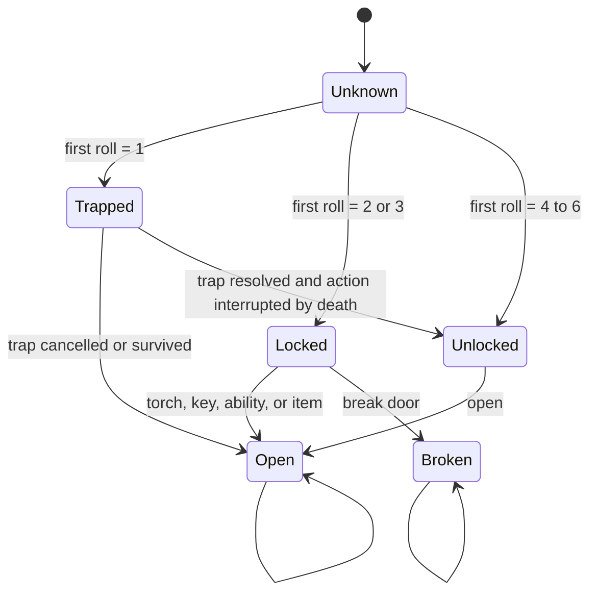
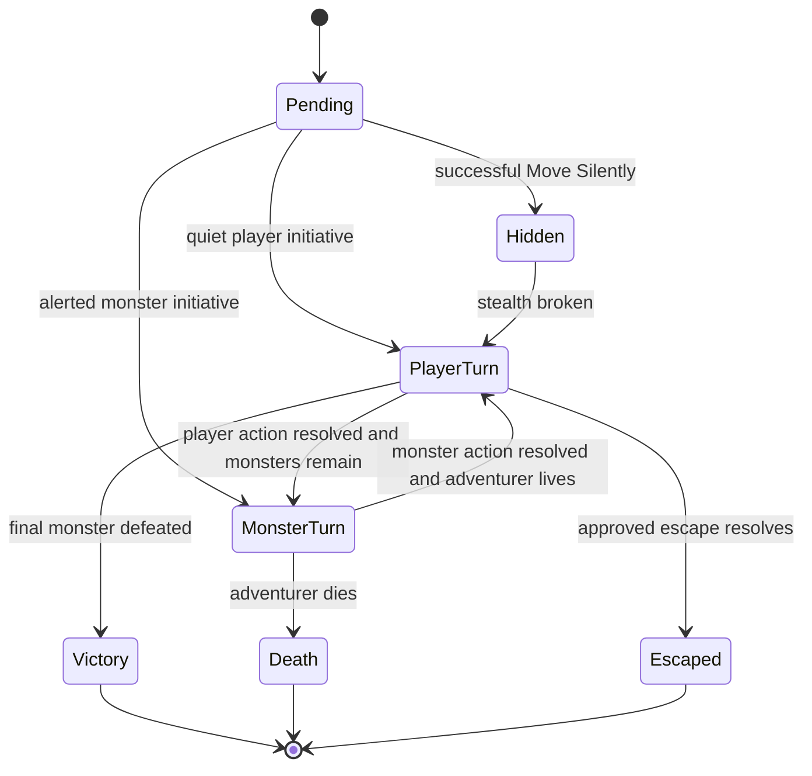
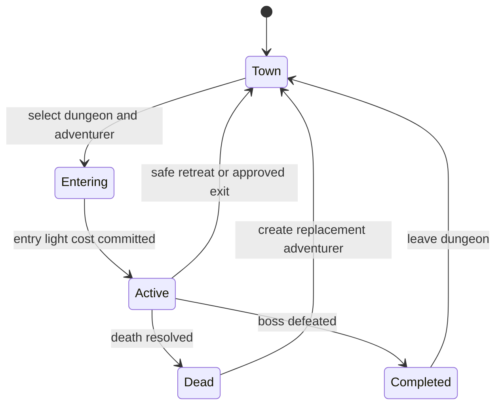

# Digital Rules Specification

## NoteQuest Web Application - Core Rules

*Version 0.1 | Draft for Review | Prepared for the NoteQuest Project*

| Field | Value |
|---|---|
| Document owner | Rules / Product Designer |
| Related documents | [Business Requirements Document v0.1](business-requirements-v0.1.md); [MVP Scope v0.1](mvp-scope-v0.1.md); [Digital Adaptation Decision Register](digital-adaptation-decision-register.md); [Decision Register v0.2](digital-adaptation-decision-register-v0.2.md); [Digital Adaptation Feasibility Study](digital-adaptation-feasibility-study.md); *NoteQuest* rulebook, first edition |
| Rules scope | Canonical single-player Core Book rules for the Palace prototype and six-dungeon MVP |
| Primary audience | Product owner, rules designer, developer, QA/tester, UX designer, data modeller, and content/licensing reviewer |
| Status | Draft for review; normative after approval |
| Last updated | 2026-07-16 |

---

## Contents

1. Purpose and Authority
2. Source Basis and Precedence
3. Normative Language and Conventions
4. Scope
5. Rules Principles
6. Rules Modules
7. Randomness and Dice
8. Adventurer Creation and State
9. Dungeon Creation, Topology, and Termination
10. Doors, Traps, Secret Passages, and Chests
11. Exploration, Torches, Light, Arms, and Hands
12. Encounters, Combat, and Monster Traits
13. Inventory, Equipment, Armour, Rewards, and Coins
14. Spells and Special Effects
15. Town, Expeditions, Persistence, Death, and Recovery
16. Calculation Reference
17. State Machines and Transition Guards
18. Validation, Manual Input, and Overrides
19. Rules and Event History
20. Deterministic Test Matrix
21. Traceability
22. Acceptance Criteria
23. Draft Interpretive Rulings
24. Approval

---

## 1. Purpose and Authority

This document defines the deterministic and stateful rules required to implement the canonical NoteQuest Core Book as a single-player web application. It converts the printed procedures and approved digital-adaptation decisions into explicit calculations, timing rules, state transitions, validation rules, persistence effects, and testable outcomes.

The specification controls **how the game behaves**. It does not define screen layout, software architecture, database technology, final artwork, deployment configuration, or the full prose displayed to players except where those concerns directly affect rules correctness.

Implementation must not invent a mechanic, timing exception, probability, reward, or consequence outside this specification and its approved content definitions. Any discovered ambiguity must be resolved through a versioned amendment rather than silently in code.

## 2. Source Basis and Precedence

### 2.1 Sources

1. The *NoteQuest* first-edition Core Book is the source for canonical mechanics, tables, names, and content.
2. The approved original Digital Adaptation Decision Register formalises ambiguous digital behaviour.
3. Decision Register v0.2 supplies the controlling prototype, dungeon-generation, randomness, persistence, accessibility, and operations decisions.
4. The approved BRD and MVP Scope define the required release boundary.
5. Approved content definitions provide the authorised rows for races, classes, spells, dungeon tables, monsters, bosses, traps, rewards, weapons, and armour.

### 2.2 Precedence

When sources conflict, apply this order:

1. A later approved decision-register ruling.
2. This approved and versioned Digital Rules Specification.
3. An earlier approved decision-register ruling.
4. The Core Book rule or table.
5. A content definition that does not alter mechanics.

A content definition may parameterise a rule, but may not override a normative rule unless it cites an approved exception ID.

### 2.3 Content and prose boundary

Exact rulebook prose is not required to execute the mechanics. Application copy should use original concise wording and paraphrased explanations unless explicit digital-reproduction permission covers the exact source text. Authorised table data and names may be stored in validated content definitions with provenance metadata.

## 3. Normative Language and Conventions

- **Must / shall**: required canonical behaviour.
- **Should**: expected behaviour that may be deferred only with documented impact.
- **May**: permitted optional behaviour.
- **Natural result**: the unmodified face value rolled on a die.
- **Final value**: the value after all approved modifiers, floors, caps, and multipliers.
- **Current dungeon**: the dungeon containing the active expedition.
- **Current segment**: the segment occupied by the active adventurer.
- **Room**: a segment whose content table is resolved. Corridors and staircases are not rooms.
- **Living monster**: a monster instance with current HP greater than zero and no resolved defeat state.
- **Active monster**: a living monster not prevented from acting by an effect such as Cold Ray.
- **Empty room**: a generated room containing no living monsters. Dropped items, recoverable containers, or a corpse do not make a room non-empty for repopulation.
- **Committed outcome**: a random result or user choice that has been accepted and persisted and therefore cannot be rerolled by reload.

All arithmetic uses integers. Unless a rule states otherwise, a calculated damage, sale, quantity, or resource result cannot fall below zero.

## 4. Scope

### 4.1 In scope

| Area | Normative scope |
|---|---|
| Dice and randomness | d6 and 2d6 procedures, weighted lookup, deterministic streams, result commitment, and natural-result preservation |
| Adventurers | Race, class, HP, abilities, spells, weapon, torches, coins, arms, hands, inventory, and status |
| Dungeons | Name, type, entrance, graph topology, segments, floors, doors, rooms, encounters, boss room, completion, and guaranteed termination |
| Exploration | Door resolution, traps, locks, keys, breaking, stealth, secret passages, chests, torch costs, and darkness |
| Combat | Initiative, legal actions, target selection, weapon damage, spells, monster damage, armour, traits, escape, defeat, death, and rewards |
| Items and economy | Backpack, equipment, armour durability, consumables, normal and master keys, rewards, selling, buying, repair, and dropping |
| Persistence | Expeditions, monster healing, room repopulation, corpses, belongings, Graveyard, save-safe outcomes, and event history |
| Core content integration | Six authorised core dungeon types and their versioned content definitions |

### 4.2 Out of scope

- Expanded World rules or content.
- Multiplayer, cooperative play, shared campaigns, and competitive validation.
- Crafting, tactical grid combat, spatial enemy movement, detailed town exploration, campaign maps, settlements, factions, kingdoms, or quests.
- Free rerolls, point-buy creation, mandatory balance correction, or baseline house-rule presets.
- AI-authored narrative or mechanics.
- Real-time torch timers.
- Cloud-authoritative saves, online anti-cheat, or account progression.
- Rules inferred from source artwork or layout when not stated in approved text or data.

## 5. Rules Principles

| ID | Principle | Normative meaning |
|---|---|---|
| DRS-P-001 | Deterministic resolution | Identical state, choices, and random-stream state produce identical outcomes. |
| DRS-P-002 | Source-faithful baseline | Canonical mode preserves authorised probabilities, content, lethality, and imbalance. |
| DRS-P-003 | Explicit timing | Every effect has a trigger, timing point, target, duration, and resolution order. |
| DRS-P-004 | Transparent automation | Natural dice, table IDs, row IDs, modifiers, choices, and state changes remain inspectable. |
| DRS-P-005 | Immutable committed outcomes | Reloading cannot reroll an initiated and committed action. |
| DRS-P-006 | State validity | The engine exposes only actions whose guards are satisfied and prevents invalid state mutation. |
| DRS-P-007 | Data-driven content | Races, classes, spells, tables, monsters, items, and abilities are definitions separate from runtime instances. |
| DRS-P-008 | Persistent consequences | Generated topology, opened or broken doors, damage, loot, deaths, drops, and completion survive save and reload. |
| DRS-P-009 | No silent ambiguity | A missing rule blocks the affected behaviour until a documented ruling exists. |
| DRS-P-010 | UI-independent logic | Rules calculations and transitions are testable without rendering or animation. |

## 6. Rules Modules

| Module | Requirement IDs | Priority |
|---|---|---:|
| Randomness and dice | DRS-DICE-001 to DRS-DICE-012 | Must |
| Adventurer creation and state | DRS-ADV-001 to DRS-ADV-020 | Must |
| Dungeon generation | DRS-DUN-001 to DRS-DUN-025 | Must |
| Doors, traps, passages, and chests | DRS-DOOR-001 to DRS-DOOR-020 | Must |
| Exploration, torches, and hands | DRS-EXP-001 to DRS-EXP-021 | Must |
| Combat and traits | DRS-CMB-001 to DRS-CMB-033 | Must |
| Items, rewards, and economy | DRS-ITEM-001 to DRS-ITEM-052 | Must |
| Spells | DRS-SPELL-001 to DRS-SPELL-015 | Must |
| Expeditions, death, and persistence | DRS-PER-001 to DRS-PER-025 | Must |
| Validation and history | DRS-VAL-001 to DRS-VAL-010; DRS-HIST-001 to DRS-HIST-012 | Must / Should |

## 7. Randomness and Dice

### 7.1 Requirements

| ID | Requirement | Priority | Acceptance signal |
|---|---|---:|---|
| DRS-DICE-001 | The engine shall support fair integer d6 results from 1 through 6. | Must | Distribution and boundary tests produce only 1-6. |
| DRS-DICE-002 | A 2d6 lookup shall sum two independent d6 results and preserve both natural dice. | Must | Every total 2-12 maps to the correct weighted row. |
| DRS-DICE-003 | The engine shall preserve natural die values separately from modified values. | Must | Natural 1 and 6 triggers remain correct after modifiers. |
| DRS-DICE-004 | Random table definitions shall use stable table and row IDs and must contain no gaps or overlaps in their supported ranges. | Must | Schema validation rejects invalid ranges. |
| DRS-DICE-005 | The canonical mode shall generate race and class by 2d6 without free rerolls. | Must | Creation cannot reroll without leaving canonical mode. |
| DRS-DICE-006 | The engine shall use separate deterministic streams for dungeon generation, combat, rewards, and expedition repopulation. | Must | Unrelated actions do not alter another stream's sequence. |
| DRS-DICE-007 | The state or committed result of a random action shall be persisted before its result is presented as final. | Must | Reload reproduces the committed result. |
| DRS-DICE-008 | A random action shall consume values only from its assigned stream. | Must | Stream audit matches the module mapping. |
| DRS-DICE-009 | Manual physical-dice entry may be supported only as an explicit mode and shall be recorded as manual input. | Should | History distinguishes generated and manual results. |
| DRS-DICE-010 | A rejected, cancelled-before-commit action shall not mutate game state; whether it consumes a random value is an implementation detail only when no player-visible result has been committed. | Must | Cancellation tests preserve gameplay state. |
| DRS-DICE-011 | Imported saves shall retain committed outcomes and stream state. | Must | Import does not reroll or reseed existing state. |
| DRS-DICE-012 | Rules and content versions shall be recorded with each mechanically significant random result. | Must | Historical outcomes remain interpretable after updates. |

### 7.2 Stream allocation

| Stream | Uses |
|---|---|
| `dungeon` | Dungeon name, type, segment, door, trap, secret passage, room content, initial monsters, boss, and fixed dungeon rewards |
| `combat` | Weapon damage, trait rolls, Undead revival, spawned-effect rolls, and combat-only random effects |
| `reward` | Chests, loot traits, treasure, wonders, magic items, generated base weapon/armour, item values, and sale rolls |
| `repopulation` | Later-expedition room repopulation and its monster-table results |

## 8. Adventurer Creation and State

### 8.1 Creation sequence

1. Start a new adventurer record with a stable ID.
2. Roll 2d6 on the authorised Race table.
3. Roll 2d6 on the authorised Class table.
4. Set maximum HP to racial HP plus the class HP modifier.
5. Set current HP equal to maximum HP.
6. Add the class starting weapon as an equipped item instance when legal.
7. Apply race and class starting effects in source order: race, then class.
8. Resolve each granted random Basic Spell as a separate 1d6 roll and create one charge for each result.
9. Set physical torches to 10 and coins to 0.
10. Set usable arms and usable hands to 2.
11. Validate all derived state, persist it, and then present the completed adventurer.

### 8.2 Canonical race definitions

| 2d6 | Race ID | Base HP | Mechanical effect |
|---:|---|---:|---|
| 2 | `race.slimemen` | 10 | Optional post-defeat engulf effect restores current HP to maximum when an eligible defeated enemy body is consumed. |
| 3 | `race.lightbugster` | 16 | Start with three Light spell charges. |
| 4 | `race.pixie` | 8 | Generate five Basic Spell charges. |
| 5 | `race.gnome` | 14 | Generate three Basic Spell charges. |
| 6 | `race.elf` | 16 | Generate one Basic Spell charge. |
| 7 | `race.human` | 20 | No mechanical effect. |
| 8 | `race.dwarf` | 18 | For each secret-passage result, roll two d6 and use the higher result. |
| 9 | `race.halfling` | 14 | For each monster checked during Move Silently, roll two d6 and use the higher result; unavailable in boss rooms. |
| 10 | `race.cat_person` | 19 | Multiply the final town sale value of equipment by two. |
| 11 | `race.rinoceroid` | 24 | May attack with a 1d6 natural horn weapon that occupies no hand. |
| 12 | `race.dragonkin` | 30 | Start with three Fireball spell charges. |

### 8.3 Canonical class definitions

| 2d6 | Class ID | HP modifier | Starting weapon | Mechanical effect |
|---:|---|---:|---|---|
| 2 | `class.hobo` | +4 | Wood Stick, 1d6-2 | None. |
| 3 | `class.grave_digger` | +2 | Shovel, 1d6-1 | Add +2 final weapon damage against monsters with Undead. |
| 4 | `class.noble` | +0 | Rapier, 1d6+1 | Generate one Basic Spell charge. |
| 5 | `class.schoolar` | +0 | Dagger, 1d6-1 | Generate three Basic Spell charges. |
| 6 | `class.blacksmith` | +4 | Hammer, 1d6 | Outside combat, spend one light unit to fully restore one damaged, non-destroyed armour piece. |
| 7 | `class.guard` | +4 | Short Sword, 1d6 | None. |
| 8 | `class.cook` | +2 | Cleaver, 1d6 | Gain one coin for each non-Undead monster whose defeat is credited to the adventurer. |
| 9 | `class.locksmith` | +2 | Dagger, 1d6-1 | Open a locked door without spending a torch; traps resolve normally. |
| 10 | `class.lumberjack` | +4 | Lumberjack Axe, 1d6 | After breaking a door, roll 1d6; on 6 gain one physical torch up to capacity. |
| 11 | `class.miner` | +4 | Pickaxe, 1d6-1 | When no light unit remains, may immediately end the expedition in town before darkness death. |
| 12 | `class.gladiator` | +6 | Short Sword, 1d6 | None. |

### 8.4 Adventurer requirements

| ID | Requirement | Priority | Acceptance signal |
|---|---|---:|---|
| DRS-ADV-001 | Race and class shall use the authorised weighted 2d6 rows. | Must | All 11 totals map correctly. |
| DRS-ADV-002 | Maximum HP shall equal race HP plus class modifier. | Must | Deterministic fixtures match. |
| DRS-ADV-003 | Current HP shall start at maximum HP and remain between zero and maximum unless a rule explicitly changes maximum HP. | Must | Boundary validation passes. |
| DRS-ADV-004 | Starting weapon, abilities, spells, 10 torches, and 0 coins shall be applied before play. | Must | New state is complete. |
| DRS-ADV-005 | Each generated spell result shall create one independent charge, including duplicates. | Must | Duplicate spell fixtures retain separate uses. |
| DRS-ADV-006 | Race and class abilities shall be represented as effect definitions with triggers, guards, targets, and outcomes. | Must | Effects are testable without class-name branching in UI code. |
| DRS-ADV-007 | Canonical generation shall not rebalance weak combinations. | Must | Source probabilities and values remain unchanged. |
| DRS-ADV-008 | The engine shall track current and maximum HP, arms, hands, spells and charges, equipment, armour durability, torches, coins, inventory, location, status, and death data. | Must | Save/reload preserves every field. |
| DRS-ADV-009 | Adventurer naming shall not alter mechanical generation. | Must | Same seed produces same mechanics across names. |
| DRS-ADV-010 | Current HP reaching zero or below shall trigger death after the current effect chain completes. | Must | Death timing fixtures pass. |
| DRS-ADV-011 | Healing shall not exceed maximum HP and cannot revive a resolved death. | Must | Heal boundaries pass. |
| DRS-ADV-012 | Losing an arm shall reduce usable arms and hands by one and immediately invalidate illegal held equipment. | Must | Equipment is unequipped and choice is requested. |
| DRS-ADV-013 | A zero-hand adventurer may use only effects and equipment requiring zero hands. | Must | Illegal actions are unavailable. |
| DRS-ADV-014 | The Rinoceroid horn shall remain available without an item instance and require zero hands. | Must | Horn remains legal after arm loss. |
| DRS-ADV-015 | Starting and permanent effects shall be idempotent and shall not reapply on reload. | Must | Reload does not duplicate spells or resources. |
| DRS-ADV-016 | Ability-triggered resource gains shall respect capacity and minimum rules. | Must | No resource exceeds its cap. |
| DRS-ADV-017 | The Miner emergency exit shall occur after the final action resolves but before darkness death. | Must | Zero-light Miner reaches town alive. |
| DRS-ADV-018 | A manual race or class selection, when supported, shall mark the adventurer as non-canonical or manually generated. | Should | History and save metadata record mode. |
| DRS-ADV-019 | Defeated-monster credit shall be assigned once for class and reward triggers. | Must | Cook and similar effects do not double-trigger. |
| DRS-ADV-020 | Generated content IDs and effect versions shall be persisted with the adventurer. | Must | Later content updates do not reinterpret existing state silently. |

## 9. Dungeon Creation, Topology, and Termination

### 9.1 Dungeon name and type

A new dungeon uses three independent d6 rolls: the first selects one of the six core dungeon types and the first name part; the second and third select the remaining authorised name parts. The six core types are Palace, Crypt, Tomb, Sanctuary, Temple, and Prison.

The dungeon type selects one versioned content set containing:

- entrance template;
- segment table with staircase-origin, corridor-origin, and room-origin columns;
- trap table;
- secret-passage table;
- room-content table;
- monster table;
- reward table with Treasure, Wonders, and Magic Item columns;
- boss table;
- weapon and armour tables.

### 9.2 Topology model

A dungeon is a persistent graph. Nodes are entrance, corridor, room, staircase, and final-room segments. Edges are normal doors or secret passages. Visual coordinates are presentation data and have no mechanical effect.

Each segment has a stable ID, floor number, type, resolved content, encounter references, search state, drops, recoverable containers, and completion markers. Each connection has a stable ID, source, destination, direction label, door state where applicable, and alert propagation state.

### 9.3 Generation algorithm

1. A dungeon begins with its authorised entrance template on floor 1.
2. An unexplored connection has no destination content until successfully opened or otherwise resolved.
3. After a connection opens, determine the origin segment category and select the corresponding segment-table column.
4. On floors 1 and 2, apply the staircase-pressure check before the normal segment-table result:
   - Let `n` be the number of generated non-stair segments already on the current floor, excluding the entrance, staircases, and final room.
   - If `n < 6`, no additional pressure applies.
   - If `n = 6`, a pressure roll of 1 on d6 creates a downward staircase.
   - If `n = 7`, a pressure roll of 1-2 creates a downward staircase.
   - If `n = 8`, a pressure roll of 1-3 creates a downward staircase.
   - If `n = 9`, a pressure roll of 1-4 creates a downward staircase.
   - If `n >= 10`, the next valid unexplored connection must create a downward staircase.
5. If pressure does not create stairs, roll the authorised segment table. A normal table staircase result remains valid.
6. A downward staircase from floor 1 leads to floor 2 and creates its destination segment on first traversal/opening according to the content definition.
7. A downward staircase from floor 2 leads directly to the floor-3 final room.
8. The final room contains only the persisted boss-table result and has no unexplored outward connection.
9. Opening a connection that creates a room immediately resolves room content and the initial monster-table result unless the room is the final room.
10. Every generated result and graph mutation is committed atomically.

### 9.4 Requirements

| ID | Requirement | Priority | Acceptance signal |
|---|---|---:|---|
| DRS-DUN-001 | Dungeon type and name shall use three authorised d6 lookups. | Must | Fixed dice create expected names and types. |
| DRS-DUN-002 | A dungeon shall be stored as stable segments and connections rather than visual tiles. | Must | Re-layout leaves topology unchanged. |
| DRS-DUN-003 | Content shall be generated only after a connection successfully opens. | Must | Unopened connections have no destination result. |
| DRS-DUN-004 | Segment-table column selection shall depend only on the origin segment type. | Must | Stair, corridor, and room fixtures select the correct column. |
| DRS-DUN-005 | Each generated room shall resolve one room-content result and one initial monster result. | Must | Room fixtures contain both results. |
| DRS-DUN-006 | A no-monster row shall create an empty encounter state rather than omit the room result. | Must | Repopulation remains possible later. |
| DRS-DUN-007 | Every segment shall have an explicit floor. | Must | Save and navigation tests preserve floors. |
| DRS-DUN-008 | Floors 1 and 2 shall use the six-target and ten-maximum staircase-pressure algorithm. | Must | Boundary tests match all pressure bands. |
| DRS-DUN-009 | The floor-3 destination shall be the final room. | Must | No ordinary floor-3 generation occurs. |
| DRS-DUN-010 | The final room shall have no outward unexplored connections. | Must | Boss-room graph invariant passes. |
| DRS-DUN-011 | The final room shall resolve the boss table only, not ordinary content or monsters. | Must | Boss room contains one boss result and no normal room roll. |
| DRS-DUN-012 | Defeating the boss shall generate 2d6 Treasure resolutions exactly once. | Must | Reload and revisit do not duplicate rewards. |
| DRS-DUN-013 | Discovering the final room shall not delete or close existing branches. | Must | Other branches remain navigable. |
| DRS-DUN-014 | Completion shall require the boss encounter to be resolved with the boss defeated. | Must | Discovery alone does not complete. |
| DRS-DUN-015 | A completed dungeon shall remain persistent and shall not regenerate its boss or one-time rewards. | Must | Re-entry preserves completion. |
| DRS-DUN-016 | Secret stairs and passages shall obey the same floor and termination invariants. | Must | Secret-route simulations terminate. |
| DRS-DUN-017 | Directions shall be labels only unless an authorised content effect explicitly uses them. | Must | Layout changes do not alter rules. |
| DRS-DUN-018 | Cosmetic room names or descriptions shall not create actions, rewards, hazards, or lore-state changes. | Must | Content validation rejects mechanical markup in flavour fields. |
| DRS-DUN-019 | Existing dungeons shall retain the generation-rules version under which they were created. | Must | Updating constants does not mutate old topology. |
| DRS-DUN-020 | Generation shall be validated with at least 100,000 deterministic seeds per dungeon type. | Must | Zero non-terminating or unreachable-boss results. |
| DRS-DUN-021 | A failed invariant shall reject the build or generation result and expose reproducible seed details. | Must | Failure report contains seed, versions, and trace. |
| DRS-DUN-022 | The Palace shall be the first mechanical-prototype dungeon. | Must | Prototype fixtures use Palace content definitions. |
| DRS-DUN-023 | Entrance topology shall come from the dungeon content definition and shall be persisted before the first player choice. | Must | Reload preserves entrance state. |
| DRS-DUN-024 | A segment or connection ID shall never depend on display name, list index, or map coordinates. | Must | Stable-ID migration tests pass. |
| DRS-DUN-025 | Generated content shall preserve the exact authorised row ID and content version. | Must | History can identify the source row. |

## 10. Doors, Traps, Secret Passages, and Chests

### 10.1 Door state machine

A normal door begins `Unknown`. On the first opening or inspection attempt, roll 1d6:

- 1: `Trapped` - resolve the dungeon trap table.
- 2-3: `Locked`.
- 4-6: `Unlocked`.

A trapped door is not also locked. If the trap is cancelled or the adventurer survives its complete effect, the door opens and its destination is generated. If the trap kills the adventurer, the trap is marked resolved, the door becomes `Unlocked`, and it remains unopened for a later adventurer; the trap does not reroll.

A locked door may be opened by spending one light unit, using one valid normal key, using a master key, using the Locksmith ability, or using an authorised item/effect. It may instead be broken without a torch. Breaking permanently changes it to `Broken`, opens it, and alerts connected monsters according to the alert rules.

### 10.2 Requirements

| ID | Requirement | Priority | Acceptance signal |
|---|---|---:|---|
| DRS-DOOR-001 | The initial door roll shall occur once and persist. | Must | Repeated interaction does not reroll. |
| DRS-DOOR-002 | Initial probabilities shall be 1 trapped, 2-3 locked, and 4-6 unlocked. | Must | Boundary fixtures pass. |
| DRS-DOOR-003 | Door states shall be Unknown, Trapped, Locked, Unlocked, Open, or Broken. | Must | Invalid transitions are rejected. |
| DRS-DOOR-004 | Trap or lock resolution shall precede destination generation. | Must | Killed-before-open scenarios reveal no destination. |
| DRS-DOOR-005 | A survived or cancelled trapped-door result shall open without a second lock roll; if the trap kills the adventurer, the resolved door shall remain Unlocked and unopened. | Must | Survival and death-interruption fixtures preserve one trap result. |
| DRS-DOOR-006 | Spending one light unit shall open one locked door when no exception applies. | Must | Resource and state change commit together. |
| DRS-DOOR-007 | A normal key shall be consumed, occupy one backpack slot before use, and work only in its origin dungeon. | Must | Cross-dungeon use is rejected. |
| DRS-DOOR-008 | A master key shall be reusable, occupy one backpack slot, and work in any dungeon. | Must | Repeated use does not consume it. |
| DRS-DOOR-009 | Keys and lock abilities shall not cancel traps. | Must | Trap resolves before lock bypass. |
| DRS-DOOR-010 | Breaking shall cost no torch, permanently open the door, and prevent later closing or repair. | Must | Broken state persists. |
| DRS-DOOR-011 | Breaking shall alert monsters in the destination and through directly communicating broken-door connections. | Must | Alert graph propagation fixture passes. |
| DRS-DOOR-012 | Open and Broken doors shall not be closable in canonical mode. | Must | Close action is unavailable. |
| DRS-DOOR-013 | Disarm Traps shall cost one light unit and arm a room-scoped protection against the next door trap triggered from that room. | Must | First eligible trap is cancelled and protection consumed. |
| DRS-DOOR-014 | Secret-passage search shall be permitted once per eligible segment and cost one light unit before rolling. | Must | Failure still consumes cost and marks searched. |
| DRS-DOOR-015 | Dwarf secret-passage advantage shall roll two dice and keep the higher result for the table lookup. | Must | Advantage fixtures pass. |
| DRS-DOOR-016 | A secret-passage result may produce nothing, a chest, a trap, a passage, or stairs only as defined by the dungeon table. | Must | Result type matches authorised row. |
| DRS-DOOR-017 | A hidden chest shall use the normal chest procedure. | Must | Chest outcomes are identical regardless of source. |
| DRS-DOOR-018 | Opening a chest shall roll two d6; the higher die is the coin quantity and the lower die is the Treasure quantity. | Must | Ordered-dice fixtures pass. |
| DRS-DOOR-019 | Double natural 1 on a chest shall produce no coins or Treasure and shall activate one dungeon trap. | Must | Trap resolves and empty reward persists. |
| DRS-DOOR-020 | Trap effects shall resolve in authorised effect order and may deal damage, remove an arm, kill, spend resources, spawn monsters, or do nothing. | Must | Every trap row has deterministic fixtures. |

## 11. Exploration, Torches, Light, Arms, and Hands

### 11.1 Exploration order

On entering a segment:

1. Set the current segment.
2. Resolve first-entry repopulation if this is a later expedition and the room is eligible.
3. If living monsters are present, determine whether Move Silently is available or combat begins.
4. If no unresolved hostile encounter blocks action, expose legal room, door, chest, item, passage, and movement actions.

A player may not open chests, pick up ordinary room rewards, search, or open other doors while an unbypassed hostile encounter blocks the room.

### 11.2 Light model

- Physical torches are a resource with capacity 10.
- During dungeon-entry preparation or an active expedition, one unspent Light spell charge may be cast to add one virtual light unit to that expedition's light reserve. Casting consumes the charge, requires no hand, and cannot be banked in town.
- Virtual light units are tracked separately from physical torches, may pay the same explicit light costs, and are cleared when the expedition ends.
- A lamp is a persistent alternative light source requiring no hand. It prevents darkness death but does not pay an explicit time/resource cost that requires spending a light unit.
- Entering a dungeon for a new expedition costs one physical or virtual light unit before the first exploration action.
- Open Lock, Move Silently, Disarm Traps, Find Secret Passage, and other explicitly costed actions spend one physical or virtual light unit before resolution.
- When an action reduces the active light reserve to zero, resolve that action fully, then allow an available Light charge to be cast. If no virtual unit is created and no persistent alternative source exists, apply the Miner exception or darkness death before another voluntary action.

### 11.3 Hands

An adventurer starts with two hands. A physical torch occupies one hand while serving as the active light source. One-handed weapons occupy one hand; two-handed weapons occupy two. Lamps, Light spell illumination, spells, and the Rinoceroid horn occupy zero hands unless an authorised definition states otherwise.

### 11.4 Requirements

| ID | Requirement | Priority | Acceptance signal |
|---|---|---:|---|
| DRS-EXP-001 | Movement shall follow discovered graph connections only. | Must | Non-adjacent movement is rejected. |
| DRS-EXP-002 | Living unbypassed monsters shall block ordinary room actions and safe retreat. | Must | Illegal actions are unavailable. |
| DRS-EXP-003 | Move Silently may be attempted before combat in an occupied, non-alerted, non-boss room when the entry was not caused by breaking or a trap and the cost can be paid. | Must | Guards match initiative and alert state. |
| DRS-EXP-004 | Move Silently shall spend one light unit before rolling one check per living monster. | Must | Failure retains cost. |
| DRS-EXP-005 | The attempt shall fail if any retained natural result is 1. | Must | Multi-monster boundaries pass. |
| DRS-EXP-006 | Halfling advantage shall roll two dice per monster and retain the higher die. | Must | A pair containing 1 and a higher result succeeds for that monster. |
| DRS-EXP-007 | Successful stealth shall permit movement through the room, visible treasure pickup, chest opening, and normal door interaction without combat. | Must | Hidden action matrix passes; a chest trap breaks stealth. |
| DRS-EXP-008 | Attacking, breaking a door, triggering a trap, or performing an authorised noisy action shall end stealth and alert the room. | Must | Combat begins with monster initiative where specified. |
| DRS-EXP-009 | Stealth shall end when the adventurer leaves the room and must be repeated on re-entry. | Must | Re-entry requires a new cost and roll. |
| DRS-EXP-010 | Move Silently shall be unavailable in the final room. | Must | Boss cannot be bypassed. |
| DRS-EXP-011 | Physical torches, virtual expedition light units, and unspent Light spell charges shall be tracked separately from inventory. | Must | Item slots and spell charges remain distinct. |
| DRS-EXP-012 | Physical torches shall not exceed 10. | Must | Gains at capacity are blocked or capped explicitly. |
| DRS-EXP-013 | Entry and action light costs shall be committed before random resolution. | Must | Cost remains after a failed action. |
| DRS-EXP-014 | Voluntary use of the final light unit shall require an irreversible-action warning. | Must | Confirmation identifies darkness outcome. |
| DRS-EXP-015 | Darkness death shall occur after the consuming action and before another voluntary action. | Must | Revealed rewards remain but cannot be picked up. |
| DRS-EXP-016 | Darkness death shall leave recoverable belongings but no corpse. | Must | Death container type is correct. |
| DRS-EXP-017 | Losing an arm shall reduce hands immediately and force a legal equipment/light configuration. | Must | No invalid held state persists. |
| DRS-EXP-018 | A two-handed weapon shall be illegal while a physical torch occupies one of two hands. | Must | Lamp or Light enables the weapon. |
| DRS-EXP-019 | The Miner emergency exit shall ignore normal safe-route requirements but shall end the expedition immediately. | Must | No further dungeon action occurs. |
| DRS-EXP-020 | Rewards or topology generated by a final-light action shall remain committed after darkness death. | Must | Replacement adventurer can recover them. |
| DRS-EXP-021 | A carried Lamp may be selected as a persistent alternative light source; it occupies one backpack slot, requires no hand, cannot pay explicit light costs, and deactivates when dropped, sold, or no longer carried. | Must | Lamp, drop, and two-handed weapon fixtures pass. |

## 12. Encounters, Combat, and Monster Traits

### 12.1 Encounter initiation

- Quiet entry through an unlocked or successfully unlocked door gives the adventurer the first combat action.
- Breaking a door, triggering a trap, entering an alerted room, or failing stealth gives monsters the first action.
- A room remains blocked by combat until all monsters are defeated, the adventurer escapes through an approved effect, or the adventurer dies.

### 12.2 Player turn

A player turn permits one legal combat action:

- attack one eligible monster with the equipped weapon or a legal natural weapon;
- cast one spell with a valid target and remaining charge;
- use one combat-permitted consumable;
- use one approved escape effect.

Weapon switching is not a standard combat action and is unavailable unless an effect explicitly permits it.

### 12.3 Weapon attack order

1. Select a legal attack source and target.
2. Roll and record the natural weapon damage die.
3. Evaluate natural-result trait triggers on the target.
4. If Explosive triggers, resolve it and stop the normal attack.
5. Calculate weapon damage: natural die plus weapon, ability, item, and temporary modifiers; floor at zero.
6. Apply Weakness doubling when triggered.
7. Apply Intangible and Stoneskin prevention checks.
8. Apply remaining damage to target HP.
9. Resolve defeat, Undead revival, on-defeat effects, and spawned effects.
10. If all monsters are defeated and the adventurer lives, resolve encounter rewards.

When more than one trait is triggered by the same natural result, resolve effects in this priority: Explosive interrupts first; then healing effects; then spawned-monster effects; then armed next-attack effects; then normal damage. Stable content-definition order breaks ties within one priority.

### 12.4 Monster turn

1. Identify monsters whose next attack is prevented, exclude them from this monster turn, and consume that prevention after the turn resolves.
2. Resolve immediate fatal effects such as an armed Deathtouch attack.
3. Sum normal damage from all active monsters, including armed bonuses.
4. Sum armour-bypassing damage separately, including Poison monster damage and its applicable bonuses.
5. Apply bypass damage directly to adventurer HP.
6. Present normal combined damage as one event; the player chooses HP or one intact armour piece.
7. Apply normal damage to the selected recipient, with armour spillover to HP.
8. Consume one-attack bonuses and apply paralysis effects.
9. Resolve adventurer death if HP is zero or lower.

### 12.5 Monster trait catalogue

| Trait ID | Trigger / rule | Resolution |
|---|---|---|
| `trait.stoneskin` | Final incoming weapon damage is 3 or less. | Prevent all of that damage. |
| `trait.loot` | Encounter ends with this monster finally defeated. | Resolve one Loot roll for this monster: 6 = one Treasure, 5 = one normal key, 1-4 = one coin. |
| `trait.explosive` | Targeted by a weapon attack whose natural die is 1. | Before normal attack damage, defeat the monster and deal its current HP as normal incoming damage to the adventurer; no other monster is damaged. |
| `trait.firebreath` | Targeted by a weapon attack whose natural die is 1. | Arm +10 damage for this monster's next attack, then consume. |
| `trait.horde` | Targeted by a weapon attack whose natural die is 1. | Spawn one Orc instance with 6 HP, damage 3, and Loot in the encounter. |
| `trait.intangible` | Final incoming weapon damage is even. | Prevent all of that damage. |
| `trait.sorcery` | Targeted by a weapon attack whose natural die is 1. | Roll 1d6 and add the result to this monster's next attack, then consume. |
| `trait.deathtouch` | Targeted by a weapon attack whose natural die is 1. | Arm a fatal effect; if the monster participates in the next monster turn, the adventurer dies before damage allocation. |
| `trait.undead` | Monster reaches zero HP. | Roll 1d6; on 1 restore it to 1 HP, otherwise finalise defeat. |
| `trait.necromancy` | Targeted by a weapon attack whose natural die is 1. | Spawn one Skeleton with 4 HP, damage 1, and Undead. |
| `trait.weakness` | Targeted by a weapon attack whose natural die is 6. | Double calculated weapon damage before defensive prevention. |
| `trait.regeneration` | Targeted by a weapon attack whose natural die is 1 and Explosive did not end resolution. | Restore 6 HP up to maximum HP before normal damage is applied. |
| `trait.paralyze` | Targeted by a weapon attack whose natural die is 1. | Arm paralysis; this monster's next successful attack causes the adventurer to skip 1d6 player turns. |
| `trait.poison` | Monster deals damage. | All damage from that monster, including armed bonuses, bypasses armour and applies to HP. |

### 12.6 Combat requirements

| ID | Requirement | Priority | Acceptance signal |
|---|---|---:|---|
| DRS-CMB-001 | Initiative shall follow quiet-entry, broken-door, trap, stealth, and alert state. | Must | Each entry fixture selects the correct side. |
| DRS-CMB-002 | Combat shall alternate player and monster turns after the initial side. | Must | Turn sequence is stable. |
| DRS-CMB-003 | Only legal actions and targets shall be selectable. | Must | Invalid target/action does not mutate state. |
| DRS-CMB-004 | Weapon attacks shall preserve natural dice before modifiers. | Must | Trait triggers remain correct. |
| DRS-CMB-005 | Weapon damage shall be floored at zero. | Must | Negative weapons cannot heal. |
| DRS-CMB-006 | A normal attack shall target one monster unless an effect explicitly states multiple targets. | Must | Targeting matrix passes. |
| DRS-CMB-007 | Fixed-damage spells shall not trigger weapon-die traits. | Must | Spell fixtures trigger none. |
| DRS-CMB-008 | Grave Digger damage shall apply before Weakness doubling. | Must | Undead natural-6 fixture matches order. |
| DRS-CMB-009 | Explosive shall interrupt normal weapon damage. | Must | Monster and adventurer outcomes match current HP. |
| DRS-CMB-010 | Explosion damage shall be normal armour-eligible damage unless another effect marks it bypassing. | Must | Armour allocation is available. |
| DRS-CMB-011 | Intangible shall test final calculated damage parity. | Must | Even final value is prevented. |
| DRS-CMB-012 | Stoneskin shall test final calculated damage after Weakness and modifiers. | Must | Values 0-3 are prevented; 4+ applies. |
| DRS-CMB-013 | Regeneration shall not exceed monster maximum HP. | Must | Cap fixture passes. |
| DRS-CMB-014 | Undead shall resolve before defeat rewards and Cook credit. | Must | Revival suppresses defeat triggers. |
| DRS-CMB-015 | Spawned monsters shall join immediately and may act on the next monster turn. | Must | Spawn timing fixture passes. |
| DRS-CMB-016 | Cold Ray shall prevent the target from contributing to exactly the next monster turn. | Must | Status is consumed once. |
| DRS-CMB-017 | Combined normal monster damage shall be one allocation event. | Must | It cannot be split across intact armour pieces. |
| DRS-CMB-018 | Poison damage shall be separated and applied directly to HP. | Must | Mixed encounter fixture passes. |
| DRS-CMB-019 | The player may choose direct HP damage even while armour remains. | Must | Allocation options include HP. |
| DRS-CMB-020 | One chosen armour piece shall absorb damage until exhausted; remaining damage spills to HP. | Must | Breakage fixture passes. |
| DRS-CMB-021 | Destroyed armour shall be removed and cannot be repaired or recovered without an explicit effect. | Must | Repair action is unavailable. |
| DRS-CMB-022 | Deathtouch shall kill before normal damage allocation when its armed attack occurs. | Must | Armour and HP do not prevent it. |
| DRS-CMB-023 | Paralysis shall skip the rolled number of player turns while monster turns continue. | Must | Duration decrements on skipped player turns. |
| DRS-CMB-024 | Escape shall require an approved spell, item, ability, or route effect. | Must | No generic escape action exists. |
| DRS-CMB-025 | Teleport escape shall move the adventurer to its selected discovered safe segment and leave surviving monsters in place. | Must | Encounter ends without defeating monsters. |
| DRS-CMB-026 | Boss encounters shall reject Move Silently and Teleport escape. | Must | Boss cannot be bypassed. |
| DRS-CMB-027 | If the adventurer and final monster die in the same effect chain, adventurer death shall still be recorded. | Must | Simultaneous-death fixture passes. |
| DRS-CMB-028 | Rewards generated before or during simultaneous death shall remain in the room. | Must | Replacement recovery succeeds. |
| DRS-CMB-029 | Each Loot monster shall resolve one Loot roll only after final defeat and encounter victory. | Must | Multiple Loot monsters produce separate rolls. |
| DRS-CMB-030 | Cook coin gain shall occur once per finally defeated non-Undead monster credited to the adventurer. | Must | Revived Undead and duplicate events do not pay. |
| DRS-CMB-031 | Combat state and committed turn outcomes shall autosave after every resolved turn or interrupt. | Must | Reload restores exact turn boundary. |
| DRS-CMB-032 | Fast-forward or repeated-action UI shall not change the number, order, or visibility of decisions and triggers. | Must | Accelerated and normal runs match. |
| DRS-CMB-033 | Multiple traits triggered by one natural result shall use the documented priority order and stable content-definition order for ties. | Must | Multi-trait fixtures produce one reproducible sequence. |

## 13. Inventory, Equipment, Armour, Rewards, and Coins

### 13.1 Capacity and ownership

- Backpack capacity is 10 unequipped item instances.
- Physical torches have a separate capacity of 10.
- Coins, spells, and spell charges do not occupy backpack slots.
- Normal keys and master keys each occupy one backpack slot.
- Each individual consumable occupies one slot unless an authorised definition explicitly permits a stack.
- Equipped weapons, worn armour, and one equipped ring do not occupy backpack slots.

### 13.2 Armour

The five protective armour slots are shoulderpads, bracelets, boots, helmet, and breastplate. Only one item may occupy each slot. A separate ring accessory slot exists because authorised armour tables include Ring results. Each armour or ring instance has maximum and current durability. Normal incoming damage may be assigned only to an equipped item whose current durability is greater than zero. An item with positive durability is destroyed when damage reduces it to zero. A Ring whose maximum durability is zero remains a valid equipped accessory, cannot absorb damage, and is not destroyed merely for having zero durability.

Town repair and the Blacksmith ability fully restore one damaged, non-destroyed protective item. They cannot restore destroyed items or increase a zero-maximum Ring above its defined maximum.

### 13.3 Reward resolution

A **Treasure** resolution rolls 1d6 on the selected dungeon's Treasure column. A row may produce a direct item/value or redirect to an authorised Wonders, Magic Item, Weapon, Armour, or other named reward table. Each redirect rolls independently in the named table or column.

A Magic Item row containing an armour or weapon placeholder first rolls the dungeon's authorised armour or weapon table, then creates the base item instance with the stated modifier. Base identity, modifier identity, durability, and provenance remain separate data.

Boss victory generates 2d6 Treasure resolutions. Chest Treasure count and Loot-generated Treasure use the same procedure. One-time rewards are marked resolved before presentation.

### 13.4 Core content effect primitives

The authorised Core reward tables may compose the following effect primitives. Display names remain content data; these mechanics are identified by stable effect IDs.

| Effect ID | Canonical rule |
|---|---|
| `effect.fixed_sale_value` | Set and persist a fixed coin value for ordinary sale. |
| `effect.rolled_sale_value` | Roll the stated value formula when the item is created, persist the value, and use it for ordinary sale. The Core jewel formula is 2d6 x 10 coins. |
| `effect.full_heal` | Restore current HP to maximum; cannot revive death. |
| `effect.restore_spells` | Restore all generated/restorable spell charges; does not recreate consumed scrolls. |
| `effect.magic_scroll` | Roll and persist one Basic Spell when the scroll is created; casting uses that spell once and consumes the scroll permanently. |
| `effect.learn_spell` | On use, roll one Basic Spell and permanently add one restorable charge to the adventurer. |
| `effect.restore_arm` | Restore one missing arm, up to the normal maximum of two usable arms. |
| `effect.trap_cancel_next` | Cancel the next eligible activated trap and consume the protection. |
| `effect.trap_cancel_discard_equipment` | The player may destroy the equipped source item to cancel an eligible activated trap. |
| `effect.trap_immunity_tag` | Ignore a trap effect carrying the stated trap tag, such as `blade`. |
| `effect.damage_bonus_flat` | Add the stated amount to weapon damage while the source is active/equipped. |
| `effect.damage_bonus_tagged` | Add the stated amount against monsters with one of the listed tags. |
| `effect.damage_multiplier_tagged` | Multiply final pre-defence weapon damage against monsters with one of the listed tags. |
| `effect.armour_durability_modifier` | Modify the base armour maximum durability at item creation; floor the result at zero. |
| `effect.chest_coin_multiplier` | Multiply only the coin quantity produced by a non-trapped chest. |
| `effect.chest_reward_multiplier_next` | Consume the source on the next chest opened and multiply both non-trap coin and Treasure quantities by the stated factor. |
| `effect.temporary_damage_bonus` | Add the stated damage until the current encounter ends; consume the item on activation. |
| `effect.virtual_light_gain` | During entry preparation or an active expedition, consume the item and add the stated number of virtual light units. |
| `effect.ignore_monster_trait` | Suppress the named trait for interactions involving the equipped/owned source, such as Undead revival, Paralyze, Deathtouch, Firebreath, or Intangible. |
| `effect.vampiric_weapon` | After a completed weapon attack by this weapon, restore the stated HP if the adventurer remains alive; cap at maximum. |
| `effect.vorpal_weapon` | On a natural weapon die of 6, set the target to zero HP before normal damage; then resolve normal defeat and Undead checks. |
| `effect.force_monster_flee_tagged` | Remove all living monsters with the stated tag from the encounter as fled; they are not defeated and grant no defeat, Loot, or Cook rewards. |
| `effect.disable_stealth` | While equipped, Move Silently is unavailable. |
| `effect.cosmetic_change` | Persist a cosmetic state change without mechanical effect. |
| `effect.destroy_cursed_item` | Destroy one owned item explicitly tagged `cursed`; unavailable when no valid target exists. |
| `effect.portal_marker` | Create and persist a portal marker. In the Core rules profile the marker is mechanically inert because portal travel belongs to Expanded World. |

When several trap-cancellation protections are eligible, the player chooses which protection to consume. Passive immunity applies before consumable cancellation and does not consume an item unless the effect explicitly requires discard.

### 13.5 Requirements

| ID | Requirement | Priority | Acceptance signal |
|---|---|---:|---|
| DRS-ITEM-001 | Only unequipped items shall count toward the 10-item backpack limit. | Must | Equip/unequip boundaries pass. |
| DRS-ITEM-002 | Torches, coins, and spells shall not consume backpack slots. | Must | Capacity remains correct. |
| DRS-ITEM-003 | Keys and consumables shall consume slots as individual instances. | Must | Full inventory blocks pickup. |
| DRS-ITEM-004 | Item identity and state shall persist through equip, drop, recovery, sale, export, and import. | Must | Durability and modifiers are unchanged. |
| DRS-ITEM-005 | Dropping an item shall create or update a persistent room drop container. | Must | Later visits can recover it. |
| DRS-ITEM-006 | Dropped items may coexist with monsters, corpses, and repopulation. | Must | Room state supports all references. |
| DRS-ITEM-007 | Loot exceeding capacity shall pause resolution and require a legal take, equip, use, leave, or discard choice. | Must | No item disappears silently. |
| DRS-ITEM-008 | Only one armour item may occupy each authorised armour slot. | Must | Duplicate-slot equip is rejected. |
| DRS-ITEM-009 | Armour current durability shall remain between zero and maximum. | Must | Boundary validation passes. |
| DRS-ITEM-010 | Protective armour with positive durability shall be removed and marked destroyed when damage reduces it to zero; zero-maximum Rings are not destroyed by their zero value. | Must | Protective breakage and Ring fixtures pass. |
| DRS-ITEM-011 | Town repair shall cost one coin and fully restore one damaged, non-destroyed piece. | Must | Coin and durability commit together. |
| DRS-ITEM-012 | Blacksmith repair shall cost one light unit and fully restore one damaged, non-destroyed piece outside combat. | Must | Final-light consequences apply afterward. |
| DRS-ITEM-013 | Weapon hand requirements shall be validated whenever equipment or arms change. | Must | Illegal loadouts cannot persist. |
| DRS-ITEM-014 | A Magic Item shall retain separate base-item and modifier IDs. | Must | Composed display name does not replace provenance. |
| DRS-ITEM-015 | Each Treasure, Wonder, Magic Item, weapon, and armour roll shall preserve table and row IDs. | Must | History can reconstruct reward generation. |
| DRS-ITEM-016 | A Treasure redirect shall resolve exactly once and shall not also grant the redirecting row as an item. | Must | No duplicate reward. |
| DRS-ITEM-017 | Boss 2d6 shall determine the number of Treasure resolutions, not a direct coin value. | Must | Boss reward fixture passes. |
| DRS-ITEM-018 | Ordinary item sale shall return one coin unless modified. | Must | Base sale fixture passes. |
| DRS-ITEM-019 | Magic item sale shall roll 1d6-1 coins, floor at zero, then apply sale modifiers. | Must | Natural 1 produces zero before modifiers. |
| DRS-ITEM-020 | Cat-Person shall multiply the non-negative final base sale value of weapons, armour, and other equipment-category items by two. | Must | Ordinary and magic equipment sale fixtures pass. |
| DRS-ITEM-021 | Multiplicative sale modifiers shall apply after additive modifiers unless an effect explicitly specifies another order. | Must | Modifier-order history is explicit. |
| DRS-ITEM-022 | Coins shall be a non-negative unbounded integer resource for Core rules. | Must | Spending cannot create negative coins. |
| DRS-ITEM-023 | A Health Potion shall restore current HP to maximum and cannot revive death; use at maximum HP is allowed only after a no-benefit warning and still consumes the potion. | Must | Damaged and full-HP use fixtures pass. |
| DRS-ITEM-024 | A one-use item shall be consumed only after its effect is committed. | Must | Failed target validation does not consume it. |
| DRS-ITEM-025 | Trap-cancelling effects shall be consumed by the next eligible activated trap. | Must | Potion of Luck timing passes. |
| DRS-ITEM-026 | All bespoke item effects shall be implemented through approved effect primitives or a documented exception. | Must | Content schema validates every effect. |
| DRS-ITEM-027 | Fixed-value treasure shall retain its sale value as item data and use ordinary-item sale rather than a magic sale roll. | Must | Ornament, religious object, and idol fixtures pass. |
| DRS-ITEM-028 | A rolled-value jewel shall roll 2d6 x 10 at creation and persist that value. | Must | Reload and later sale use the same value. |
| DRS-ITEM-029 | A Magic Scroll shall roll its Basic Spell at creation, occupy one slot, cast once, and never restore at rest. | Must | Scroll use consumes the item only after a valid cast. |
| DRS-ITEM-030 | A Mana Potion shall fully restore all generated/restorable spell charges and shall not recreate consumed scrolls. | Must | Mixed spell-source fixture passes. |
| DRS-ITEM-031 | A Sapphire of Magic shall permanently add one newly rolled restorable Basic Spell charge. | Must | Rest later restores the learned charge. |
| DRS-ITEM-032 | Salamander and Helping Hand effects shall restore one missing arm up to two usable arms; use at two arms is allowed only after a no-benefit warning and still consumes the item. | Must | Missing-arm and full-arm fixtures pass. |
| DRS-ITEM-033 | Potion of Luck shall cancel and consume itself on the next eligible activated trap. | Must | Trap effect is skipped and history records cancellation. |
| DRS-ITEM-034 | When multiple consumable trap protections are eligible, the player shall choose which one is consumed. | Must | No protection is silently selected. |
| DRS-ITEM-035 | Trap-tag immunity shall prevent the matching trap consequence without consuming the source. | Must | Blade-immunity fixture passes. |
| DRS-ITEM-036 | Potion of Fury shall add +2 weapon damage until the current encounter ends and shall be consumed on activation. | Must | Bonus ends on victory, escape, or death. |
| DRS-ITEM-037 | Potion of Luminescence shall add two virtual light units during entry preparation or an active expedition and shall then be consumed. | Must | Units clear when the expedition ends. |
| DRS-ITEM-038 | Protector Candle shall be consumed by the next chest opened and double both coin and Treasure quantities only when the chest is not the double-1 trap result. | Must | Normal and trapped chest fixtures pass. |
| DRS-ITEM-039 | Blessed Potion shall destroy one owned item tagged cursed and shall be unusable without a valid target. | Must | No arbitrary item can be destroyed through the effect. |
| DRS-ITEM-040 | Trait-immunity equipment shall suppress only the named trait and shall not suppress unrelated damage or effects. | Must | Undead, Paralyze, Deathtouch, and Firebreath fixtures pass. |
| DRS-ITEM-041 | Tagged damage bonuses and multipliers shall require matching monster tags in authorised content data. | Must | Angel, dragon, snake, vampire, ghoul, and cockroach fixtures pass. |
| DRS-ITEM-042 | Flat equipment damage bonuses shall be included in weapon-damage calculation before Weakness. | Must | Strength and Destruction modifiers pass. |
| DRS-ITEM-043 | Armour HP modifiers shall alter maximum and starting durability at item creation and may reduce it to zero. | Must | Positive and negative armour modifiers pass. |
| DRS-ITEM-044 | Leprechaun-style chest effects shall multiply chest coins only, not Treasure count. | Must | Chest comparison fixture passes. |
| DRS-ITEM-045 | A Vampiric weapon shall heal 1 HP after each completed attack action, even when damage is prevented, unless the adventurer dies during the effect chain. | Must | Stoneskin and Explosive fixtures pass. |
| DRS-ITEM-046 | A Vorpal weapon natural 6 shall cause immediate target defeat before normal damage and then run ordinary Undead and on-defeat processing. | Must | Undead Vorpal fixture passes. |
| DRS-ITEM-047 | A Goblin Whistle shall make living Goblin-tagged monsters flee; fled monsters grant no defeat or Loot rewards. | Must | Mixed encounter retains non-Goblins. |
| DRS-ITEM-048 | An effect that ignores Intangible shall bypass only Intangible prevention and shall not bypass Stoneskin or other defences. | Must | Boatman's Oar fixture passes. |
| DRS-ITEM-049 | Core portal-creating content shall create an inert persistent marker and shall not provide travel or Expanded World mechanics. | Must | No destination or action is generated. |
| DRS-ITEM-050 | Cosmetic-only effects and descriptions shall not alter rules state except explicitly identified cosmetic fields. | Must | Hair colour, elegance, odour, and religious-symbol text create no mechanics. |
| DRS-ITEM-051 | Authorised Ring results shall use one ring accessory slot separate from the five protective armour slots. | Must | Only one Ring may be equipped; equipped Ring leaves the backpack. |
| DRS-ITEM-052 | A Ring with zero maximum durability shall remain equipped and may provide magical effects but cannot be chosen to absorb damage. | Must | Zero-durability Ring is neither destroyed nor a damage target. |

## 14. Spells and Special Effects

### 14.1 Basic Spell table

| 1d6 | Spell ID | Canonical effect |
|---:|---|---|
| 1 | `spell.heal` | Restore 5 HP up to maximum. |
| 2 | `spell.light` | During entry preparation or an active expedition, consume one charge to add one virtual light unit to that expedition's reserve; it requires no hand. |
| 3 | `spell.teleport` | Move to a discovered segment in the current dungeon that contains no living monsters; may escape non-boss combat. |
| 4 | `spell.cold_ray` | Deal 4 damage to one monster and prevent it from attacking on the next monster turn. |
| 5 | `spell.lightning` | Deal 6 damage to one monster. |
| 6 | `spell.fireball` | Deal 5 damage to every living monster in the current room. |

### 14.2 Requirements

| ID | Requirement | Priority | Acceptance signal |
|---|---|---:|---|
| DRS-SPELL-001 | Each generated spell shall create one charge and casting shall consume one matching charge. | Must | Duplicate charges decrement independently. |
| DRS-SPELL-002 | Resting in town shall restore every generated spell charge to its maximum count. | Must | Exhausted duplicates restore. |
| DRS-SPELL-003 | Casting in combat shall consume the player's action. | Must | Monster turn follows unless encounter ends. |
| DRS-SPELL-004 | Spell use outside combat shall be limited by the spell's timing and target rules. | Must | Attack spells require a living target. |
| DRS-SPELL-005 | Spells shall require zero hands unless a content definition explicitly states otherwise. | Must | Arm loss does not block Basic Spells. |
| DRS-SPELL-006 | Heal shall restore 5 HP, cap at maximum, and fail after death resolution; casting at maximum HP is allowed only after a no-benefit warning and consumes the charge. | Must | Damaged, full-HP, and death boundaries pass. |
| DRS-SPELL-007 | Light shall be cast only during entry preparation or an active expedition, consume one charge, add one virtual expedition light unit, and require no hand. | Must | The unit can pay entry/action cost or delay darkness and is cleared at expedition end. |
| DRS-SPELL-008 | Multiple Light charges and virtual units may exist; each cast consumes one charge and creates one separately countable unit. | Must | Charge and reserve counts remain explicit without town banking. |
| DRS-SPELL-009 | Teleport shall target only a discovered segment in the current dungeon with no living monsters. | Must | Undiscovered, occupied, and other-dungeon targets are rejected. |
| DRS-SPELL-010 | Teleport shall not generate content or bypass a final boss encounter. | Must | Boss escape and unexplored target are rejected. |
| DRS-SPELL-011 | Cold Ray shall apply 4 direct monster damage and a one-monster-turn attack-prevention state. | Must | Status duration passes. |
| DRS-SPELL-012 | Lightning shall apply 6 direct damage to one monster. | Must | Trait triggers are not evaluated. |
| DRS-SPELL-013 | Fireball shall apply 5 direct damage independently to every living monster in the room. | Must | Defeat and Undead checks resolve per target. |
| DRS-SPELL-014 | Fixed spell damage shall use normal monster defensive traits only where those traits inspect received damage rather than a natural weapon die. | Must | Stoneskin and Intangible apply; natural-1/6 triggers do not. |
| DRS-SPELL-015 | A spell secondary effect that does not state a damage prerequisite shall resolve even when a defensive trait prevents the spell's damage. | Must | Cold Ray prevents the next attack against an Intangible target even when its 4 damage is prevented. |

## 15. Town, Expeditions, Persistence, Death, and Recovery

### 15.1 Expedition lifecycle

An expedition begins when an adventurer enters a dungeon and the entry light cost is paid. It ends when the adventurer reaches town through a legal retreat or explicit exit effect, dies, or completes another approved exit action. Boss defeat completes the dungeon but does not itself require deletion of the expedition state.

At the start of a later expedition into an existing dungeon:

- restore every surviving monster instance to maximum HP;
- reset each ordinary room's per-expedition repopulation-check marker;
- retain topology, doors, traps already resolved, search state, drops, recoverable containers, boss state, and completion state.

On first entry into a previously generated ordinary room with no living monsters during that later expedition, roll the dungeon Monster table once. Corridors, staircases, and the final room do not repopulate. A result producing no monsters still consumes that room's repopulation check for the expedition.

### 15.2 Retreat and town

Normal retreat requires a continuous discovered route from the current segment to the entrance containing no living unbypassed monsters. Monsters passed through by stealth still make the route unsafe. A valid retreat moves the adventurer to town and ends the expedition.

Town actions:

- Rest: spend 1 coin; restore current HP to maximum and all spell charges.
- Repair Armour: spend 1 coin; fully restore one damaged, non-destroyed piece.
- Buy Torch: spend 1 coin; add one physical torch up to 10.
- Sell Item: apply ordinary or magic sale rules and remove the sold item.
- Start or resume a dungeon expedition.

### 15.3 Death and recovery

Normal death creates a corpse/recoverable container in the death segment containing equipped items, backpack items, unused consumables, keys, and coins, except destroyed or consumed items. Darkness death creates belongings without a corpse. Each death immediately creates a Graveyard record.

Multiple death containers may coexist. Recovery applies normal capacity and equipment rules; excess belongings remain in the room. Containers persist for the lifetime of the save unless fully recovered, explicitly destroyed, or removed by a confirmed cleanup action.

### 15.4 Requirements

| ID | Requirement | Priority | Acceptance signal |
|---|---|---:|---|
| DRS-PER-001 | An expedition shall have explicit start and end events and a stable ID. | Must | History groups all actions correctly. |
| DRS-PER-002 | Entry shall cost one physical or virtual light unit before the expedition's first action; a Light charge may be cast during entry preparation to create the unit. | Must | Insufficient-light entry is blocked unless an exception applies. |
| DRS-PER-003 | Later expeditions shall restore surviving monsters to maximum HP. | Must | Healing occurs once at start. |
| DRS-PER-004 | Eligible empty ordinary rooms shall repopulate at most once on first entry per later expedition. | Must | Repeated movement does not reroll. |
| DRS-PER-005 | Rooms with corpses or drops shall remain eligible for repopulation. | Must | Coexistence fixture passes. |
| DRS-PER-006 | Corridors, staircases, and the final room shall not repopulate. | Must | No repopulation event is offered. |
| DRS-PER-007 | A no-monster repopulation result shall mark the room checked for that expedition. | Must | Re-entry does not reroll. |
| DRS-PER-008 | Normal retreat shall require a discovered safe route to the entrance. | Must | Occupied route is rejected. |
| DRS-PER-009 | Stealth-bypassed monsters shall keep a route unsafe. | Must | Retreat remains disabled. |
| DRS-PER-010 | The Miner emergency exit shall bypass route safety only at zero remaining light. | Must | Other classes die or require an alternative source. |
| DRS-PER-011 | Rest shall cost one coin and restore HP and all spell charges. | Must | Insufficient coin prevents action. |
| DRS-PER-012 | Buying a physical torch shall cost one coin and respect capacity 10. | Must | No over-cap purchase. |
| DRS-PER-013 | Town actions shall be unavailable while the adventurer is inside a dungeon unless an explicit exit has completed. | Must | State guard passes. |
| DRS-PER-014 | Normal death shall leave a corpse and recoverable belongings. | Must | Container inventory matches pre-death state. |
| DRS-PER-015 | Darkness death shall leave recoverable belongings without a corpse. | Must | Map marker and record distinguish it. |
| DRS-PER-016 | Destroyed, sold, spent, and consumed objects shall not appear in death recovery. | Must | Ownership ledger matches. |
| DRS-PER-017 | Graveyard record creation shall be atomic with death resolution. | Must | No death exists without a record. |
| DRS-PER-018 | Graveyard records shall include adventurer ID/name, dungeon, floor, segment, cause, timestamp, and recovery status/reference. | Must | Required fields validate. |
| DRS-PER-019 | Multiple deaths in one segment shall produce distinct records and containers. | Must | Recovery identifies each container. |
| DRS-PER-020 | Recovery shall enforce normal capacity; uncollected items remain. | Must | Partial recovery persists. |
| DRS-PER-021 | Completed dungeons shall preserve topology, drops, corpses, and completion state. | Must | Revisit is stable. |
| DRS-PER-022 | Bosses and one-time boss rewards shall not regenerate. | Must | Re-entry produces none. |
| DRS-PER-023 | The player may safely abandon one unfinished dungeon for another after returning to town. | Must | Both dungeons remain persistent. |
| DRS-PER-024 | Every meaningful transition shall autosave atomically and retain a last-known-valid recovery state. | Must | Fault matrix shows no silent corruption. |
| DRS-PER-025 | Existing runtime instances shall retain their rules and content versions across migration. | Must | Reload does not reinterpret historical effects. |

## 16. Calculation Reference

### 16.1 Formula catalogue

| ID | Calculation | Formula / order |
|---|---|---|
| CALC-001 | Maximum adventurer HP | `race.base_hp + class.hp_modifier` |
| CALC-002 | Weapon damage | `max(0, natural_d6 + weapon_modifier + ability_modifiers + item_modifiers + temporary_modifiers)` |
| CALC-003 | Weakness damage | `weapon_damage * 2`, before Stoneskin or Intangible prevention |
| CALC-004 | Normal monster-turn damage | Sum fixed damage and armed bonuses of active non-Poison monsters |
| CALC-005 | Poison monster-turn damage | Sum fixed damage and armed bonuses of active Poison monsters; apply directly to HP |
| CALC-006 | Armour spillover | `max(0, incoming_normal_damage - selected_piece.current_durability)` |
| CALC-007 | Magic item sale | `max(0, natural_d6 - 1)`, then additive modifiers, then multiplicative modifiers, floor at zero |
| CALC-008 | Cat-Person sale | `max(0, modified_base_sale) * 2` |
| CALC-009 | Chest reward | Coins = `max(d1,d2)`; Treasures = `min(d1,d2)`; double 1 overrides with trap and zero rewards |
| CALC-010 | Stair pressure | At non-stair count 6/7/8/9: stairs on pressure d6 <= 1/2/3/4; at 10 force stairs |
| CALC-011 | Boss treasure count | Sum 2d6; resolve that many independent Treasure results |
| CALC-012 | Healing | `min(max_hp, current_hp + heal_amount)` or set to max for full-heal effects |

### 16.2 Boundary catalogue

| Value / state | Minimum | Maximum | Default / start |
|---|---:|---:|---:|
| d6 | 1 | 6 | N/A |
| 2d6 | 2 | 12 | N/A |
| Physical torches | 0 | 10 | 10 |
| Virtual light units | 0 | Number created during expedition | 0 |
| Backpack items | 0 | 10 | 0 plus starting equipment outside backpack |
| Coins | 0 | Unbounded | 0 |
| Usable arms/hands | 0 | 2 | 2 |
| Current HP | 0 | Maximum HP | Maximum HP |
| Armour durability | 0 | Item maximum | Item maximum |
| Floor | 1 | 3 | 1 |
| Floor non-stair target | 6 | 6 | 6 |
| Floor non-stair hard maximum | 10 | 10 | 10 |
| Local save slots | 3 | 3 | 3 available slots |

## 17. State Machines and Transition Guards

### 17.1 Door

### 17.2 Encounter

### 17.3 Expedition

### 17.4 Principal guards

| Action | Guard |
|---|---|
| Enter dungeon | Adventurer alive; at least one physical/virtual light unit, a castable Light charge, or an approved entry exception |
| Move to connection | Connection discovered and open; no blocking unbypassed encounter |
| Open unknown door | Adventurer alive; current state permits door interaction |
| Open locked door with light unit | At least one physical or virtual light unit; door Locked |
| Use normal key | Matching origin dungeon; key owned; door Locked; trap already resolved |
| Break door | Door Locked; action not otherwise blocked |
| Move Silently | Occupied ordinary room; combat not started; quiet entry; one spendable light unit |
| Search secret passage | Segment eligible; not previously searched; one spendable light unit; no blocking encounter |
| Attack | Combat player turn; legal attack source; target living and eligible |
| Cast spell | Charge available; timing and target valid |
| Retreat | Safe route to entrance, except approved emergency exit |
| Rest / repair / buy / sell | Adventurer in Town; enough coins/resources; target valid |
| Recover item | Same segment; container/item available; capacity can be made legal |

## 18. Validation, Manual Input, and Overrides

| ID | Scenario | Standard validation | Override policy |
|---|---|---|---|
| DRS-VAL-001 | Invalid die value | Reject values outside 1-6 without mutation. | No canonical override. |
| DRS-VAL-002 | Invalid table range | Reject content definition at validation/build time. | Requires corrected versioned content. |
| DRS-VAL-003 | Negative resource | Reject transition before commit. | No canonical override. |
| DRS-VAL-004 | Over-cap inventory or torches | Require a legal choice or block gain/purchase. | Explicit correction mode may relocate an item to room. |
| DRS-VAL-005 | Illegal hands/equipment | Unequip invalid held item and require legal configuration. | No silent retention. |
| DRS-VAL-006 | Unsupported save schema | Reject without modifying existing data. | Import into a supported application version only. |
| DRS-VAL-007 | Corrupted save | Preserve source, load last-valid snapshot when available, and expose diagnostics. | Never silently reset. |
| DRS-VAL-008 | Manual dice | Accept only in explicit manual mode and preserve natural values and source. | Result remains committed once accepted. |
| DRS-VAL-009 | State correction | Require explicit correction action, reason/note, and before/after history. | Does not alter the baseline rule definition. |
| DRS-VAL-010 | House rule | Not available in canonical MVP. | Requires a separately versioned rules profile after MVP. |

## 19. Rules and Event History

### 19.1 Required event fields

| Field | Required | Notes |
|---|---:|---|
| Event ID | Yes | Stable unique identifier. |
| Event type | Yes | Creation, roll, generation, door, trap, movement, combat, item, spell, town, expedition, death, recovery, completion, correction, import, or migration. |
| Action and actor | Yes | Adventurer/system and selected action. |
| Natural dice | Where applicable | Preserve each die, not only totals. |
| Random stream and position/state | Where applicable | Supports deterministic reproduction. |
| Table and row IDs | Where applicable | Includes content version. |
| Inputs and guards | Yes | Relevant state and selected target. |
| Modifiers and order | Where applicable | Additive, multiplicative, cap, prevention, and override sequence. |
| Initial and final results | Yes | Before and after player allocation/choice. |
| State changes | Yes | Resource, HP, durability, topology, status, ownership, and lifecycle changes. |
| Context | Yes | Save slot, adventurer, dungeon, floor, segment, expedition, and encounter IDs. |
| Rules version | Yes | Version of this specification/rules profile. |
| Timestamp | Yes | Local event chronology. |
| Player note | Optional | Separate from immutable mechanical data. |

### 19.2 Retention

- Active and incomplete dungeons retain complete structured mechanically relevant history.
- Completed dungeons retain a permanent summary and the final 500 mechanically relevant entries.
- The interface displays the latest 200 entries by default and may load older retained entries.
- Cosmetic animation and repeated navigation events need not be stored.
- Mechanical history is immutable; player notes are separate editable records.

### 19.3 Requirements

| ID | Requirement | Priority | Acceptance signal |
|---|---|---:|---|
| DRS-HIST-001 | Every random result and state-changing action needed to explain an outcome shall be persisted. | Must | Accepted outcomes are reconstructable. |
| DRS-HIST-002 | Natural dice and final values shall both be recorded. | Must | Trait and modifier audit passes. |
| DRS-HIST-003 | Table and row IDs shall be recorded rather than relying only on display text. | Must | Localisation/copy changes do not break interpretation. |
| DRS-HIST-004 | Allocation and target choices shall be recorded. | Must | Armour and combat outcomes are explainable. |
| DRS-HIST-005 | Corrections shall append an event and shall not edit prior mechanical entries. | Must | Audit remains intact. |
| DRS-HIST-006 | Committed events shall be idempotent on reload. | Must | Duplicate application does not occur. |
| DRS-HIST-007 | Active/incomplete history shall be complete. | Must | No required reconstruction gap. |
| DRS-HIST-008 | Completion retention shall keep summary plus final 500 mechanical entries. | Must | Pruning is deterministic. |
| DRS-HIST-009 | The latest 200 retained entries shall be available by default. | Must | UI query returns correct window. |
| DRS-HIST-010 | Private notes, full event text, saves, Graveyard details, and exports shall not enter production diagnostics. | Must | Diagnostic inspection passes. |
| DRS-HIST-011 | Exported history shall include rules/content versions and private-data warning metadata. | Must | Import can validate provenance. |
| DRS-HIST-012 | History shall remain readable after supported schema migration. | Must | Migration fixtures preserve meaning. |

## 20. Deterministic Test Matrix

| Test ID | Fixed inputs | Expected result | Requirement IDs |
|---|---|---|---|
| DRT-001 | Race 2d6 totals 2 through 12 | Each total selects the authorised race row. | DRS-DICE-002, DRS-ADV-001 |
| DRT-002 | Class 2d6 totals 2 through 12 | Each total selects the authorised class row. | DRS-ADV-001 |
| DRT-003 | Human + Gladiator | Maximum HP 26, Short Sword, 10 torches, 0 coins. | DRS-ADV-002 to 004 |
| DRT-004 | Pixie spell rolls 2,2,3,6,6 | Light x2, Teleport x1, Fireball x2 as separate charges. | DRS-ADV-005 |
| DRT-005 | Dwarf passage dice 1 and 5 | Retained result 5. | DRS-DOOR-015 |
| DRT-006 | Halfling versus two monsters, pairs (1,4) and (2,2) | Stealth succeeds; retained results 4 and 2. | DRS-EXP-006 |
| DRT-007 | Door rolls 1,2,3,4,5,6 | Trap; Locked; Locked; Unlocked; Unlocked; Unlocked. | DRS-DOOR-002 |
| DRT-008 | Locked door + normal key from same dungeon | Key consumed; door Open; destination generated. | DRS-DOOR-007 |
| DRT-009 | Locked door + normal key from other dungeon | Action rejected with no mutation. | DRS-DOOR-007 |
| DRT-010 | Locked door broken | Door Broken, no torch spent, destination monsters alerted. | DRS-DOOR-010, 011 |
| DRT-011 | Chest dice 6 and 2 | 6 coins and 2 Treasure resolutions. | DRS-DOOR-018 |
| DRT-012 | Chest dice 1 and 1 | Zero rewards and one trap. | DRS-DOOR-019 |
| DRT-013 | Floor non-stair count 5 | No additional stair-pressure roll. | DRS-DUN-008 |
| DRT-014 | Counts 6/7/8/9 with pressure die at threshold | Stair generated at 1/2/3/4 respectively. | DRS-DUN-008 |
| DRT-015 | Count 10 | Next valid connection forced to stairs. | DRS-DUN-008 |
| DRT-016 | Floor-2 downward stair | Destination is final room with boss only. | DRS-DUN-009 to 011 |
| DRT-017 | Final physical torch spent opening lock; no alternate light | Door and destination persist, then darkness death. | DRS-EXP-013 to 020 |
| DRT-018 | Same as DRT-017 with lamp | Adventurer survives; lamp does not pay lock cost. | DRS-EXP-015, 018 |
| DRT-019 | Same as DRT-017 with Miner | Expedition ends in town before death. | DRS-ADV-017, DRS-EXP-019 |
| DRT-020 | Two-handed weapon + physical torch + two arms | Attack unavailable. | DRS-EXP-018 |
| DRT-021 | Two-handed weapon + lamp + two arms | Attack available. | DRS-EXP-018 |
| DRT-022 | Weapon natural 1 against Explosive monster at 7 HP | Monster defeated; normal attack cancelled; adventurer receives 7 normal damage. | DRS-CMB-009, 010 |
| DRT-023 | Weapon natural 6, base final damage 3, target Weakness + Stoneskin | Damage doubles to 6, Stoneskin does not prevent, 6 applied. | DRS-CMB-008, 012 |
| DRT-024 | Final calculated weapon damage 4 against Intangible | Prevented because final value is even. | DRS-CMB-011 |
| DRT-025 | Undead reaches 0 HP, revival die 1 | Monster returns at 1 HP; no reward or Cook coin. | DRS-CMB-014, 030 |
| DRT-026 | Mixed normal damage 7 and Poison damage 3 | 3 applies to HP; player allocates 7 to HP or one armour piece. | DRS-CMB-017 to 019 |
| DRT-027 | Armour durability 4 receives 7 | Armour destroyed; 3 spills to HP. | DRS-CMB-020, 021 |
| DRT-028 | Cold Ray target | 4 damage; target excluded from next monster turn only. | DRS-SPELL-011 |
| DRT-029 | Fireball versus three monsters including Undead | Each receives 5; Undead revival checks resolve individually; no natural traits. | DRS-SPELL-013, 014 |
| DRT-030 | Magic item sale natural die 1 by Cat-Person | Base 0, doubled final remains 0. | DRS-ITEM-019, 020 |
| DRT-031 | Full backpack receives two items | Resolution pauses until capacity is legal; no silent loss. | DRS-ITEM-007 |
| DRT-032 | Later expedition enters empty room twice | Repopulation rolls on first entry only. | DRS-PER-004, 007 |
| DRT-033 | Retreat path includes stealth-bypassed monster | Retreat rejected. | DRS-PER-008, 009 |
| DRT-034 | Normal death with equipment, key, coins, consumed potion | Corpse contains all except consumed potion; Graveyard created. | DRS-PER-014 to 018 |
| DRT-035 | Darkness death in same state | Belongings remain without corpse; Graveyard created. | DRS-PER-015, 018 |
| DRT-036 | Reload after committed combat roll | Same dice, target, effects, and turn state; no duplicate event. | DRS-DICE-007, DRS-HIST-006 |
| DRT-037 | Import newer unsupported schema | Reject without modifying current slots. | DRS-VAL-006 |
| DRT-038 | 100,000 seeds per dungeon type | Zero non-termination and zero unreachable bosses. | DRS-DUN-020 |
| DRT-039 | Valuable jewel creation dice 4 and 5 | Persisted ordinary sale value 90 coins. | DRS-ITEM-028 |
| DRT-040 | Magic Scroll creation spell 4, later cast | Cold Ray stored; valid cast consumes scroll; town rest does not recreate it. | DRS-ITEM-029 |
| DRT-041 | Sapphire roll 2 | Adds one permanent restorable Light charge. | DRS-ITEM-031 |
| DRT-042 | Helping Hand at one arm, then at two | First restores to two; second warns, consumes the item, and leaves arms at two. | DRS-ITEM-032 |
| DRT-043 | Potion of Luck and Cultist armour both available | Player chooses one cancellation source; only chosen source is consumed/discarded. | DRS-ITEM-034 |
| DRT-044 | Protector Candle, chest dice 6 and 2 | Candle consumed; 12 coins and 4 Treasures. | DRS-ITEM-038 |
| DRT-045 | Protector Candle, chest dice 1 and 1 | Candle consumed; zero rewards; trap resolves. | DRS-ITEM-038 |
| DRT-046 | Vampiric weapon attack prevented by Stoneskin | Adventurer heals 1 after completed attack. | DRS-ITEM-045 |
| DRT-047 | Vorpal natural 6 against Undead, revival die 1 | Target reaches zero then revives at 1 HP. | DRS-ITEM-046 |
| DRT-048 | Goblin Whistle in Goblin + Orc encounter | Goblin flees without rewards; Orc remains. | DRS-ITEM-047 |
| DRT-049 | Boatman's Oar final even damage against Intangible + Stoneskin | Intangible ignored; Stoneskin still prevents if final damage <=3. | DRS-ITEM-048 |
| DRT-050 | Cosmic weapon natural 1 in Core profile | Portal marker persists; no travel action appears. | DRS-ITEM-049 |
| DRT-051 | Equip plain Ring with 0 durability | Ring leaves backpack, remains equipped, cannot absorb damage, and is not destroyed. | DRS-ITEM-051, DRS-ITEM-052 |
| DRT-052 | Cold Ray against Intangible target | 4 damage is prevented; target still skips the next monster turn. | DRS-SPELL-015 |

## 21. Traceability

| Rules area | Primary decision sources | BRD / MVP sources | Downstream targets |
|---|---|---|---|
| Character generation | CHAR-001 to CHAR-008 | BR-001 to BR-005; MVP-001 | Functional Requirements, Data Model, tests |
| Dungeon topology and termination | DUN-001 to DUN-014; RD-RULE-001 to 003 | BR-006, BR-012, BR-022; MVP-002 | Architecture, Data Model, simulation plan |
| Doors, traps, stealth, light | DOOR-001 to 012; LIGHT-001 to 010; STEALTH-001 to 007 | BR-005 to BR-007; MVP-003 | Functional Requirements, UX flows, tests |
| Combat and traits | COMBAT-001 to 018 | BR-002, BR-005, BR-013; MVP-004 | Combat service, event model, deterministic tests |
| Inventory, spells, town | ITEM-001 to 014; SPELL-001 to 010; TOWN-001 to 008 | BR-001, BR-007, BR-010; MVP-005/006 | Data Model, UX, tests |
| Persistence and death | PERSIST-001 to 014; ARCH-006 to 014; RD-TECH-005 to 008 | BR-010, BR-011, BR-013, BR-019; MVP-007/008/009 | Persistence design, migration plan, fault tests |
| Event history | ARCH-011; RD-DATA-001 to 003 | BR-005, BR-019; MVP-009 | Event schema, privacy/NFR, UX |
| Canonical content | LIC-003/004/012; RD-CONT-001 to 004 | BR-003, BR-015; MVP-011 | Content and Licensing Requirements, content manifest |

Every downstream requirement should cite one or more `DRS-*` IDs. Content rows should cite their table/row IDs and effect-definition IDs.

## 22. Acceptance Criteria

The Digital Rules Specification may be approved when:

- [ ] Every Must rule is deterministic and testable without UI dependencies.
- [ ] All authorised 1d6 and 2d6 tables have stable IDs, complete ranges, and verified source provenance.
- [ ] Character generation and all race/class starting effects have deterministic fixtures.
- [ ] The six/ten staircase algorithm and floor-3 final-room rule pass boundary tests.
- [ ] At least 100,000 seeds per dungeon type produce zero non-terminating or unreachable-boss dungeons.
- [ ] Door, trap, secret passage, chest, stealth, light, and hand timing is explicit.
- [ ] Combat order, monster traits, armour allocation, spell timing, escape, and simultaneous death are explicit.
- [ ] Inventory, rewards, keys, equipment, sale, repair, and capacity rules are explicit.
- [ ] Expedition, repopulation, retreat, death, recovery, Graveyard, and completion rules are explicit.
- [ ] Random streams, committed outcomes, event history, save versions, and import/migration behaviour are traceable.
- [ ] Exact source prose is not required by implementation logic.
- [ ] Content/licensing review confirms that referenced tables and names are eligible for the intended build.
- [ ] Product, rules, technical, QA, and content reviewers approve the draft interpretive rulings below.

## 23. Draft Interpretive Rulings

The following implementation-level rulings are made explicit in v0.1 because the source text does not fully specify digital timing. They are normative only after this document is approved.

| ID | Ruling |
|---|---|
| DRS-IR-001 | Each finally defeated monster with Loot produces one separate Loot roll after encounter victory. |
| DRS-IR-002 | Regeneration is capped at monster maximum HP and resolves before normal attack damage. |
| DRS-IR-003 | Intangible and Stoneskin inspect final calculated attack damage after modifiers and Weakness. |
| DRS-IR-004 | Paralyze causes the adventurer to skip the rolled number of player turns while monster turns continue. |
| DRS-IR-005 | Deathtouch kills before normal damage allocation when the armed monster next attacks. |
| DRS-IR-006 | The Miner zero-light ability is an immediate emergency exit to town that bypasses normal retreat safety. |
| DRS-IR-007 | A Light charge may be cast during entry preparation or an active expedition to create one virtual light unit that is cleared at expedition end; a lamp prevents darkness but does not pay explicit light costs. |
| DRS-IR-008 | A trapped-door result opens the door after the trap is cancelled or fully survived; it is not additionally locked. |
| DRS-IR-009 | Cook rewards and other defeat effects trigger only after Undead revival fails and the monster is finally defeated. |
| DRS-IR-010 | The Rinoceroid horn is a zero-hand natural weapon. |
| DRS-IR-011 | Slimemen may use the engulf effect after final defeat of a monster that was not destroyed by Explosive; using it restores HP to maximum. |
| DRS-IR-012 | Fixed-damage spells do not trigger natural weapon-die traits but are still subject to damage-based prevention such as Stoneskin and Intangible. |
| DRS-IR-013 | Staircase pressure is a separate override check made before the ordinary segment-table roll; ordinary staircase rows remain valid when the pressure check does not create stairs. |
| DRS-IR-014 | Simultaneous trait triggers use the priority Explosive, healing, spawning, armed next-attack effects, then normal damage, with stable content order for ties. |
| DRS-IR-015 | Helping Hand restores a missing arm but does not raise the Core adventurer above two usable arms. |
| DRS-IR-016 | Valuable-jewel value is rolled once when created and is not rerolled at sale. |
| DRS-IR-017 | Protector Candle doubles both chest coins and Treasure count, is consumed by the next chest even when trapped, and does not cancel that trap. |
| DRS-IR-018 | Potion of Luminescence creates two virtual expedition light units rather than physical torch items. |
| DRS-IR-019 | Vampiric healing triggers on a completed weapon attack even if defensive traits prevent damage, but not if the attack chain kills the adventurer. |
| DRS-IR-020 | Vorpal instant defeat still permits an Undead revival check. |
| DRS-IR-021 | Goblin Whistle causes flight rather than defeat and therefore grants no rewards. |
| DRS-IR-022 | Core portal references create inert markers because portal travel is an Expanded World rule. |
| DRS-IR-023 | Magic Scrolls determine and persist their random Basic Spell when created, not when cast. |
| DRS-IR-024 | Ring results use one accessory slot; a zero-durability Ring remains usable for magical effects but cannot absorb damage. |

## 24. Approval

| Role | Name | Decision | Date | Notes |
|---|---|---|---|---|
| Product Owner |  | Pending / Approved / Rejected |  |  |
| Rules / Product Designer |  | Pending / Approved / Rejected |  |  |
| Technical Lead |  | Pending / Approved / Rejected |  |  |
| QA Reviewer |  | Pending / Approved / Rejected |  |  |
| UX Reviewer |  | Pending / Approved / Rejected |  |  |
| Content / Licensing Reviewer |  | Pending / Approved / Rejected |  |  |
