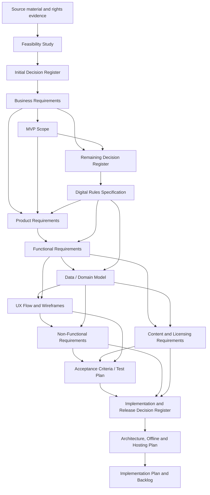
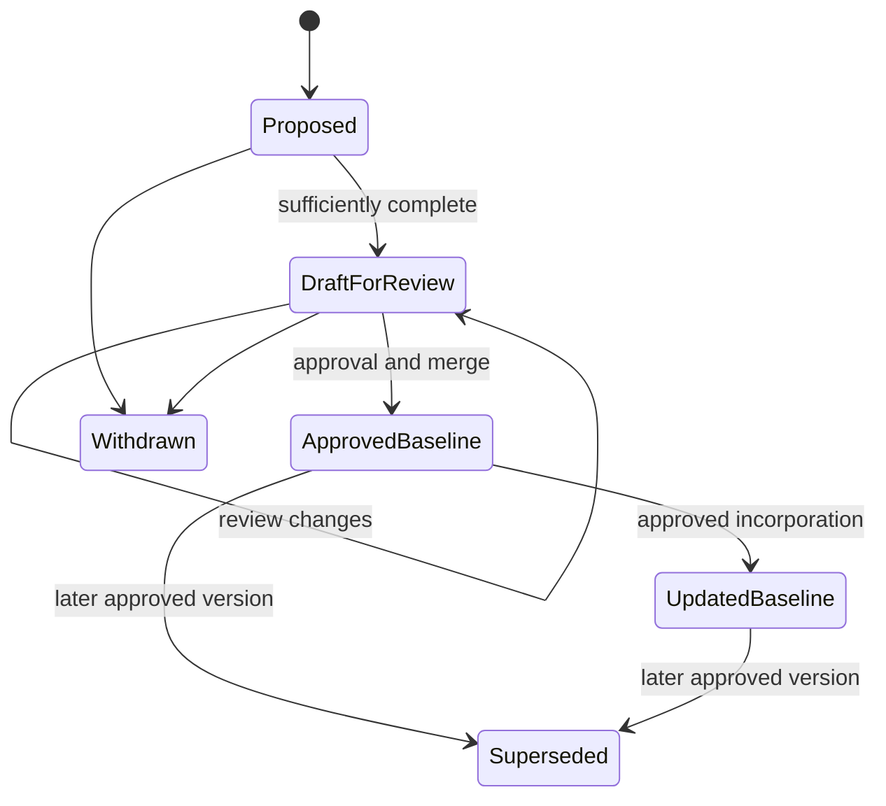

# Documentation Development and Governance Process

## NoteQuest Project

*Version 0.1 | Draft for Review | Prepared for the NoteQuest Project*

| Field | Value |
|---|---|
| Document owner | Product Owner |
| Process scope | Project documentation from source intake through implementation readiness and controlled maintenance |
| Related documents | [Digital Adaptation Feasibility Study](digital-adaptation-feasibility-study.md); [Digital Adaptation Decision Register](digital-adaptation-decision-register.md); [Decision Register v0.2](digital-adaptation-decision-register-v0.2.md); [Implementation and Release Decision Register v0.3](implementation-release-decision-register-v0.3.md); [Business Requirements Document v0.1](business-requirements-v0.1.md); [MVP Scope v0.1](mvp-scope-v0.1.md); [Web Architecture, Offline Strategy and Hosting Plan v0.1](web-architecture-offline-hosting-plan-v0.1.md) |
| Primary audience | Product owner, rules designer, technical lead, UX designer, QA lead, content/licensing reviewer, operations owner, contributors, and reviewers |
| Status | Draft for review |
| Last updated | 2026-07-18 |

---

## Contents

1. [Purpose](#1-purpose)
2. [Scope](#2-scope)
3. [Process Principles](#3-process-principles)
4. [Roles and Responsibilities](#4-roles-and-responsibilities)
5. [Source Hierarchy and Authority](#5-source-hierarchy-and-authority)
6. [Document Types and Dependency Order](#6-document-types-and-dependency-order)
7. [Document Lifecycle and Status Model](#7-document-lifecycle-and-status-model)
8. [Decision Management](#8-decision-management)
9. [End-to-End Documentation Process](#9-end-to-end-documentation-process)
10. [Document Production Method](#10-document-production-method)
11. [Traceability and Dependency Management](#11-traceability-and-dependency-management)
12. [Git and Pull-Request Workflow](#12-git-and-pull-request-workflow)
13. [Review, Approval, and Merge Semantics](#13-review-approval-and-merge-semantics)
14. [Quality-Control Passes](#14-quality-control-passes)
15. [Change Control and Amendments](#15-change-control-and-amendments)
16. [Stage Gates](#16-stage-gates)
17. [Historical NoteQuest Sequence](#17-historical-notequest-sequence)
18. [Future Documentation Work](#18-future-documentation-work)
19. [Reusable Checklists](#19-reusable-checklists)
20. [Process Acceptance Criteria](#20-process-acceptance-criteria)
21. [Approval](#21-approval)

---

## 1. Purpose

This document formalises the process used to create, review, approve, connect, and maintain the NoteQuest project documentation.

The process exists to ensure that:

- source material is understood before requirements are written;
- unresolved choices are made explicitly rather than silently embedded in later documents or code;
- each document is produced only when its controlling inputs are sufficiently stable;
- downstream documents remain traceable to approved upstream sources;
- approvals are recorded through version-controlled changes and pull requests;
- dependency tables reflect the documents that actually exist on `main`;
- implementation begins from a coherent, reviewable baseline rather than a collection of unrelated drafts; and
- later changes are controlled through amendments rather than informal contradiction.

This document describes both the reusable governance model and the historical sequence followed for NoteQuest. The historical sequence illustrates the process but does not require every future amendment to reproduce every original step.

## 2. Scope

### 2.1 In scope

This process governs:

- project isolation and context definition;
- source-document intake and analysis;
- feasibility assessment;
- product, rules, technical, UX, content, test, and release decisions;
- requirements-document production;
- dependency and traceability updates;
- document review and approval;
- branch and pull-request discipline;
- document status normalisation;
- cross-document and internal navigation links;
- amendments and supersession; and
- the handoff from approved documentation to implementation planning.

### 2.2 Out of scope

This process does not define:

- source-code development practices beyond the documentation-to-implementation handoff;
- detailed sprint, issue, milestone, or release-management procedures;
- legal advice or specialist rights review;
- the technical implementation itself; or
- post-release support procedures except where documentation governance affects them.

## 3. Process Principles

| ID | Principle | Required behaviour |
|---|---|---|
| DGP-001 | Source before specification | Analyse the authoritative source and constraints before deriving requirements. |
| DGP-002 | Decisions before dependent detail | Resolve material product, rules, rights, UX, technical, or release choices before writing documents that depend on them. |
| DGP-003 | No silent assumptions | Record consequential assumptions, recommendations, alternatives, and approvals explicitly. |
| DGP-004 | One source of truth per concern | Give each concern a controlling document and avoid duplicating normative detail unnecessarily. |
| DGP-005 | Progressive elaboration | Move from business intent to product scope, observable behaviour, data, UX, quality, tests, and architecture in dependency order. |
| DGP-006 | Traceability | Every material downstream requirement must be traceable to an approved upstream source or approved new decision. |
| DGP-007 | Evidence-based approval | Approval confirms that a document is sufficiently complete for its intended downstream use; it does not imply that every later implementation or specialist verification is complete. |
| DGP-008 | Focused changes | Each pull request should have one clear purpose and avoid unrelated document or code changes. |
| DGP-009 | `main` is the accepted record | A document or amendment becomes part of the project baseline only after merge into `main`. |
| DGP-010 | Status follows reality | Document headers, approval records, and dependency tables must be brought into alignment with accepted merges. |
| DGP-011 | Preserve approved boundaries | Later documents may refine implementation detail but may not contradict an approved upstream decision without a formal amendment. |
| DGP-012 | Navigation is quality | Documents must be connected through useful relative links and internal anchors without changing normative meaning. |
| DGP-013 | Separate approval from specialist sign-off | Product-owner approval must not be presented as technical, legal, accessibility, QA, privacy, or operations verification when those reviews have not occurred. |
| DGP-014 | Implementation starts from a bounded baseline | Coding begins only when the applicable scope, rules, behaviour, data, UX, quality, test, content, and architecture inputs are sufficient for the selected implementation increment. |

## 4. Roles and Responsibilities

| Role | Documentation responsibilities | Approval authority |
|---|---|---|
| Product Owner | Product intent, scope, priorities, decision registers, document sequencing, dependency status, and business acceptance | Final product-scope and business acceptance authority |
| Rules / Product Designer | Source interpretation, canonical mechanics, rules rulings, deterministic examples, and fidelity | Approves rules definitions and amendments |
| Technical Lead / Architect | Feasibility, architecture, persistence, deterministic systems, security, delivery, and implementation readiness | Approves technical design within approved product constraints |
| UX / Accessibility Lead | User flows, responsive behaviour, interaction states, information architecture, and accessibility requirements | Approves UX and accessibility design evidence |
| QA / Test Lead | Acceptance criteria, test strategy, traceability, evidence, defects, and release-gate verification | Recommends acceptance or rejection based on evidence |
| Content / Licensing Reviewer | Source permissions, provenance, notices, assets, dependencies, and release eligibility | May block content or release where evidence is insufficient |
| Operations Owner | Hosting, monitoring, deployment, rollback, access, and operational readiness | Approves operational readiness |
| Contributors | Draft and update documents within approved boundaries and provide evidence for review | No independent scope-change authority unless delegated |
| Reviewers | Check correctness, completeness, consistency, traceability, and scope | Approve only within their assigned area |

One person may perform several roles in a small project, but the document must still distinguish the type of approval being recorded.

## 5. Source Hierarchy and Authority

### 5.1 Source classes

The documentation process uses the following source classes:

1. **Original source material** — the NoteQuest rulebook and any separately authorised source content.
2. **Rights evidence** — permission records, licence terms, attribution requirements, and asset/dependency evidence.
3. **Approved decision records** — the original decision register, Decision Register v0.2, and Implementation and Release Decision Register v0.3.
4. **Approved requirements and specifications** — BRD, MVP Scope, DRS, PRD, FRD, Data Model, UX, NFR, Content/Licensing, Test Plan, and Architecture Plan.
5. **Implementation evidence** — code, schemas, test fixtures, build outputs, manifests, reports, and release artefacts.

### 5.2 Precedence

When documents conflict, use this order unless a later approved amendment explicitly states otherwise:

1. later approved decision-register ruling or approved amendment;
2. approved rights restriction for content and release eligibility;
3. [Digital Rules Specification v0.1](digital-rules-specification-v0.1.md) for mechanics, legal actions, timing, probabilities, and mechanical outcomes;
4. [Functional Requirements Document v0.1](functional-requirements-v0.1.md) for observable system behaviour;
5. [Data Model / Domain Model Specification v0.1](data-domain-model-v0.1.md) for identity, ownership, persistence, history, migration, import, and recovery;
6. [UX Flow / Wireframe Requirements v0.1](ux-flow-wireframe-requirements-v0.1.md) for interaction, presentation, focus, announcements, and responsive transformation;
7. [Non-Functional Requirements v0.1](non-functional-requirements-v0.1.md) for measurable quality thresholds;
8. [Content & Licensing Requirements v0.1](content-licensing-requirements-v0.1.md) for provenance, rights, notices, and content release gates;
9. [Acceptance Criteria / Test Plan v0.1](acceptance-criteria-test-plan-v0.1.md) for evidence and acceptance execution;
10. [Product Requirements Document v0.1](product-requirements-v0.1.md), [MVP Scope v0.1](mvp-scope-v0.1.md), and [Business Requirements Document v0.1](business-requirements-v0.1.md) for product and release boundaries;
11. [Web Architecture, Offline Strategy and Hosting Plan v0.1](web-architecture-offline-hosting-plan-v0.1.md) for technical realisation; and
12. implementation detail.

A lower-level document may refine a higher-level requirement but may not weaken or contradict it without an approved amendment.

## 6. Document Types and Dependency Order

### 6.1 Core document chain

### 6.2 Purpose of each document

| Document | Primary question answered | Must exist before |
|---|---|---|
| Feasibility Study | Can and should the source experience be converted, and what are the major risks? | Formal product baseline |
| Initial Decision Register | What foundational product, rules, platform, rights, UX, and MVP choices must be fixed? | BRD and MVP Scope finalisation |
| BRD | Why is the product being created, for whom, and under what business constraints? | Product requirements and release governance |
| MVP Scope | What is the minimum complete accepted product, and what is explicitly excluded? | Detailed product and feature decomposition |
| Remaining Decision Register | Which unresolved choices still block rules, data, UX, NFR, content, test, or operations work? | Dependent specifications |
| DRS | What are the canonical mechanics, timing, state transitions, probabilities, and deterministic examples? | Final functional, data, and test detail |
| PRD | What user and product outcomes must the product deliver? | Functional decomposition |
| FRD | What must the application observably do? | Data, UX, and implementation breakdown |
| Data / Domain Model | What entities, identities, ownership, invariants, persistence, and history must exist? | Physical architecture and durable implementation |
| UX Flow / Wireframes | How do users navigate, act, recover, and understand state across viewports and assistive technologies? | Final NFR and test execution detail |
| NFR | How well must the product perform, recover, protect data, remain accessible, and operate? | Acceptance and architecture approval |
| Content & Licensing Requirements | Which content and assets may be used, under what evidence and notice controls? | Public test and release candidates |
| Acceptance Criteria / Test Plan | What evidence proves that Palace and Core MVP are acceptable? | Go/no-go and release decisions |
| Implementation and Release Decision Register | Which concrete stack, persistence, test, hosting, evidence, and release choices remain? | Detailed architecture |
| Architecture Plan | How are approved requirements realised technically? | Implementation scaffold and backlog |
| Implementation Plan / Backlog | In what milestones, epics, and issues will the approved design be built and validated? | Production implementation |

## 7. Document Lifecycle and Status Model

### 7.1 Statuses

| Status | Meaning | Downstream use |
|---|---|---|
| Proposed | Candidate document or decision not yet accepted | May inform discussion but is not controlling |
| Draft for Review | Complete enough for structured review; unresolved approval remains | May support analysis but must not be treated as an approved baseline |
| Approved Baseline | Accepted for its defined scope and suitable as a controlling downstream input | Normative within its scope |
| Updated Baseline | Approved document revised to incorporate later approved decisions without changing its version family | Normative within its scope |
| Superseded | Replaced by a later approved version or amendment | Historical reference only unless explicitly retained |
| Withdrawn | Removed from consideration and not accepted | Not a project baseline |

### 7.2 Lifecycle

### 7.3 Merge and status synchronisation

A merge demonstrates acceptance of the pull-request change, but the document header and approval record must also represent the accepted state. When a document is merged while still labelled `Draft for Review`, a focused follow-up status PR must:

- change only the status and approval fields required to reflect the accepted baseline;
- record the approving role, date, and scope;
- avoid implying specialist sign-off that did not occur; and
- update dependent BRD/MVP rows where applicable.

## 8. Decision Management

### 8.1 When a decision register is required

Create or extend a decision register when an unresolved choice:

- materially changes product scope, mechanics, UX, data, quality, rights, architecture, testing, hosting, operations, or release eligibility;
- affects more than one downstream document;
- could lead different authors to produce incompatible specifications;
- cannot safely remain an implementation detail; or
- must be approved before a dependent document can be completed.

Do not create a decision row for routine implementation details that can be selected inside an already approved architecture without affecting other baselines.

### 8.2 Approval convention

The project uses this convention:

- `Approved: yes` accepts the recommendation as written.
- `Approved: no` rejects the recommendation, and the complete controlling alternative in the comments column becomes the baseline.
- A blank approval cell remains unresolved.
- A `no` without a complete alternative is not a decision.
- A later register must state whether it extends, supersedes, or leaves earlier registers unchanged.

### 8.3 Decision categories

Decision registers should group rows by concern, such as:

- product and scope;
- rules and content behaviour;
- platform and architecture;
- persistence and data safety;
- randomness and reproducibility;
- UX and accessibility;
- content, rights, and branding;
- testing and evidence;
- hosting, monitoring, and rollback; and
- release identity and governance.

### 8.4 Incorporation rule

Approving a decision is not the final step. Every approved row must be incorporated into its named downstream document, requirement, schema, test, workflow, or release control. The register completion checklist must distinguish:

1. decision approved;
2. decision incorporated into documentation;
3. decision implemented; and
4. decision verified by evidence.

## 9. End-to-End Documentation Process

### 9.1 Step 0 — Establish project isolation

Define the project as a standalone context and explicitly exclude assumptions, terminology, architecture, or decisions from unrelated projects.

**Outputs**

- project identity and repository;
- source-of-truth locations;
- explicit context boundaries; and
- initial documentation conventions.

**Exit condition**

Contributors can identify which repository, source files, and prior decisions apply to the project.

### 9.2 Step 1 — Intake and inspect source material

Review the complete source material and record:

- edition and provenance;
- mechanical systems and tables;
- gameplay loop;
- ambiguities and omissions;
- content and asset categories;
- rights evidence and restrictions; and
- digital-conversion risks.

**Exit condition**

The source is sufficiently understood to discuss feasibility and identify decisions without inventing mechanics.

### 9.3 Step 2 — Produce the feasibility study

Assess:

- technical feasibility;
- product-shape alternatives;
- rules formalisation needs;
- persistence and procedural-generation risks;
- UX and accessibility challenges;
- content and licensing constraints;
- likely architecture direction; and
- recommended phased approach.

The feasibility study is analytical, not a substitute for approved requirements.

**Exit condition**

The project has a credible conversion direction and a known set of decision areas.

### 9.4 Step 3 — Create the foundational decision register

Resolve the choices required to write the first baselines, including:

- adaptation type;
- product platform;
- initial content boundary;
- canonical versus expanded mechanics;
- persistence and recovery direction;
- accessibility baseline;
- rights and branding constraints; and
- MVP exclusions.

**Exit condition**

Every decision required by the BRD and MVP Scope is approved or has a controlling alternative.

### 9.5 Step 4 — Produce the BRD

Translate source understanding and approved decisions into:

- business context and opportunity;
- problem statement;
- objectives;
- stakeholders and users;
- product vision;
- scope;
- business requirements;
- success measures;
- constraints, assumptions, dependencies, and risks;
- release approach; and
- approval criteria.

**Exit condition**

The business purpose, product boundary, free-release model, rights constraints, and acceptance direction are explicit.

### 9.6 Step 5 — Produce the MVP Scope

Define:

- the minimum complete public product;
- the pre-production Palace prototype;
- Must/Should/Could/Won't priorities;
- feature-area acceptance signals;
- release gates;
- exclusions and deferred backlog;
- dependencies and risks; and
- measurable prototype and MVP success thresholds.

**Exit condition**

The project can distinguish prototype, Core MVP, and post-MVP work without ambiguity.

### 9.7 Step 6 — Audit unresolved decisions

Review the BRD and MVP Scope for:

- open questions;
- contradictory language;
- unstated technical assumptions;
- incomplete rights or UX positions;
- missing success thresholds; and
- dependencies that cannot yet be produced safely.

Create a second decision register only for unresolved cross-cutting choices. Do not reopen decisions already settled unless a formal amendment is required.

**Exit condition**

The rules, product, persistence, accessibility, content, and operations inputs required for detailed specifications are approved.

### 9.8 Step 7 — Produce the Digital Rules Specification

Formalise:

- dice and random-table behaviour;
- adventurer state;
- dungeon generation and termination;
- doors, traps, exploration, light, combat, inventory, spells, town, death, and recovery;
- calculations and boundaries;
- state machines and transition guards;
- random-stream and persistence consequences;
- event-history requirements;
- deterministic reference tests; and
- explicit interpretive rulings for source ambiguities.

Where the DRS exposes new material ambiguities, present them as reviewable rulings and approve them before affected implementation becomes final.

**Exit condition**

Canonical mechanics can be implemented and tested without silently interpreting the source in code.

### 9.9 Step 8 — Update dependency tables

After a controlling document is approved and merged:

- link it from the BRD and MVP Scope dependency tables;
- mark its actual status accurately;
- identify any remaining release qualification;
- preserve distinctions such as “approved requirements” versus “final evidence still release-gated”; and
- make no unrelated changes in the dependency-update PR.

This step repeats throughout the documentation programme.

### 9.10 Step 9 — Produce the PRD

Convert business and scope baselines into:

- product outcomes;
- user problems and use cases;
- product principles;
- user journeys;
- product requirements;
- feature expectations;
- success metrics;
- rollout; and
- product-level dependencies and risks.

**Exit condition**

Every Must product outcome has an observable acceptance signal and a clear relationship to the MVP and DRS.

### 9.11 Step 10 — Produce the FRD

Describe observable application behaviour for:

- entry and save management;
- adventurer creation;
- dungeon generation and exploration;
- combat;
- inventory;
- town;
- death and recovery;
- persistence, import, export, and migration;
- history and diagnostics;
- responsive and accessibility behaviour;
- content and release controls; and
- error, cancellation, confirmation, and recovery states.

Delegate formulas, probabilities, and canonical transitions to the DRS rather than duplicating them.

**Exit condition**

Application behaviour can be decomposed into testable implementation work without redefining mechanics.

### 9.12 Step 11 — Produce the Data / Domain Model

Define:

- bounded contexts;
- aggregates, entities, and value objects;
- stable identifiers;
- ownership and relationships;
- invariants;
- lifecycle states;
- persistence, snapshots, recovery, and slot isolation;
- RNG state and committed results;
- content packages, provenance, and rights records;
- import, export, migration, history, retention, deletion, and archival; and
- logical acceptance criteria.

Keep the model implementation-neutral while providing enough precision for physical architecture.

**Exit condition**

All durable state and relationships required by the DRS and FRD are represented without contradiction.

### 9.13 Step 12 — Produce UX flows and wireframes

Translate the FRD and Data Model into:

- information architecture;
- application shells;
- end-to-end flows;
- screen and component states;
- responsive transformations;
- focus and keyboard behaviour;
- announcements and textual alternatives;
- visual/textual map equivalence;
- error and recovery experiences; and
- low-fidelity wireframe sources.

Use version-controlled, reproducible wireframe sources where practical.

**Exit condition**

Every major workflow, required state, responsive arrangement, and accessibility path can be reviewed before implementation.

### 9.14 Step 13 — Produce the NFR

Convert approved quality intent into measurable requirements for:

- performance and resource budgets;
- reliability and data integrity;
- availability and offline behaviour;
- security;
- privacy;
- accessibility;
- compatibility and responsive support;
- usability;
- maintainability and testability;
- diagnostics;
- recovery and portability;
- content controls; and
- build, release, and operations.

Separate inherited approved thresholds from newly proposed numeric targets, then approve the proposed targets before treating them as normative.

**Exit condition**

Architecture and QA can design against measurable quality thresholds.

### 9.15 Step 14 — Produce Content and Licensing Requirements

Define:

- source categories;
- approval states;
- paraphrase and exact-text rules;
- structured-table use;
- provenance fields;
- attribution and notices;
- branding and trade-dress restrictions;
- placeholder and final-asset controls;
- dependency and licence controls;
- item-level release manifests;
- Palace and Core inventories; and
- release-blocking evidence gates.

Distinguish approval of the content policy and baseline inventory from final item-level evidence and production-asset approval.

**Exit condition**

Content can be authored and selected without unclear rights or provenance status.

### 9.16 Step 15 — Produce the Acceptance Criteria / Test Plan

Map requirements to:

- test levels and environments;
- deterministic fixtures and seed sets;
- end-to-end scenarios;
- rules, persistence, UX, accessibility, responsive, security, privacy, and content matrices;
- Palace and Core release gates;
- usability protocol;
- defect severity and waiver rules;
- evidence artefacts; and
- sign-off requirements.

Large test plans may be split into a master document and normative parts, provided the master defines how approval applies to the complete set.

**Exit condition**

Every Must requirement has an acceptance criterion, planned verification method, owner, and expected evidence.

### 9.17 Step 16 — Audit implementation and release decisions

After the requirements baseline is complete, identify decisions still required for:

- stack and package structure;
- physical persistence;
- RNG algorithm and serialisation;
- export/import format;
- test and CI tooling;
- simulation harnesses;
- Palace playtest execution;
- placeholder assets;
- hosting, monitoring, diagnostics, and rollback;
- product identity and repository licence; and
- release-evidence governance.

Capture only cross-cutting or materially constraining decisions in the implementation and release register.

**Exit condition**

Architecture can be written without choosing between unresolved project-level alternatives.

### 9.18 Step 17 — Produce the architecture plan

Translate approved requirements and implementation rulings into:

- technology baseline;
- repository and package structure;
- dependency boundaries;
- runtime components;
- command, state, and concurrency model;
- physical IndexedDB design;
- atomic persistence, snapshots, migration, staging, and quota handling;
- deterministic RNG, canonical serialisation, hashing, export, and import;
- PWA and service-worker lifecycle;
- security, privacy, accessibility, testing, CI, hosting, monitoring, release, and rollback architecture;
- diagrams;
- implementation sequence; and
- required technical spikes.

**Exit condition**

The team can create an implementation plan and application scaffold without unresolved architecture-blocking decisions.

### 9.19 Step 18 — Perform navigation and consistency audits

After the documentation set stabilises:

1. add relative links between existing documents where useful;
2. add table-of-contents and same-document section links to existing headings;
3. validate anchors against the repository renderer;
4. preserve all visible wording during link-only audits;
5. leave references unlinked when no exact target exists rather than changing text merely to create one; and
6. keep link-only PRs separate from normative document changes.

**Exit condition**

Reviewers can navigate the documentation set efficiently and links do not change meaning.

## 10. Document Production Method

### 10.1 Preparation

Before drafting a document:

- identify its purpose and audience;
- identify controlling upstream sources;
- inspect the applicable repository template;
- list required sections and identifiers;
- collect unresolved decisions;
- determine whether a decision register is required first;
- verify current dependency status on `main`; and
- define the intended approval state and downstream consumers.

### 10.2 Drafting

A document draft should:

- state its authority, scope, and exclusions;
- link its controlling sources;
- use stable requirement or decision IDs where traceability is needed;
- distinguish normative requirements from explanation;
- distinguish inherited approved values from proposed values;
- define happy, error, cancellation, confirmation, and recovery behaviour where applicable;
- include dependencies, risks, open questions, acceptance criteria, and approval records;
- avoid unsupported source prose or assets; and
- remain consistent with approved decisions.

### 10.3 Self-review

Before opening a PR, verify:

- all template sections are completed or deliberately marked not applicable;
- no placeholder guidance remains accidentally;
- no unresolved blocker is disguised as a fixed requirement;
- links resolve;
- identifiers are unique;
- tables are structurally valid;
- headings and contents agree;
- stated statuses are accurate;
- downstream references use current file names; and
- the branch contains no unrelated files.

### 10.4 Review readiness

A draft is ready for review when reviewers can assess it without needing the author to explain undocumented assumptions.

## 11. Traceability and Dependency Management

### 11.1 Traceability directions

Traceability must work in both directions:

- **forward:** source or decision → requirement → design → test → evidence;
- **backward:** test failure or implementation behaviour → requirement → controlling source or decision.

### 11.2 Required links

Where applicable, documents should link:

- metadata “Related documents” entries;
- dependency-table document names;
- explicit references to controlling specifications;
- test-plan parts and appendices;
- architecture references to requirements and decisions; and
- internal table-of-contents entries and section references.

### 11.3 Dependency-row rules

A dependency row must state:

- stable dependency ID;
- linked document or external dependency;
- owner or category where the table requires it;
- blocking scope or purpose; and
- precise status.

Preferred status wording distinguishes:

- pending;
- in progress;
- available for review;
- available; approved baseline;
- approved requirements with release evidence still pending; and
- superseded.

### 11.4 Synchronisation trigger

Update dependency sections after:

- a named dependent document is merged and approved;
- a document is superseded or renamed;
- an external dependency becomes available or fails;
- a release qualification changes; or
- a decision alters which document is required.

## 12. Git and Pull-Request Workflow

### 12.1 Branch discipline

- Never commit project-document changes directly to `main`.
- Create a fresh branch from current `main`.
- Use a descriptive branch name such as `docs/add-<document>-v0.1` or `docs/update-<dependency-purpose>`.
- Keep one coherent purpose per branch.
- Rebase or recreate from current `main` when a stale branch would obscure the actual diff.

### 12.2 Commit discipline

- Use descriptive documentation commit messages.
- Avoid temporary files in the final branch.
- Do not combine application-code changes with documentation-governance changes unless the PR explicitly requires both.
- Keep status-only, dependency-only, and link-only changes narrowly scoped.

### 12.3 Pull-request description

A documentation PR should state:

- the document or rows being added or changed;
- the controlling inputs;
- the decisions incorporated;
- major coverage;
- whether new decisions are proposed;
- files changed;
- exclusions; and
- whether application code is affected.

### 12.4 Pre-PR diff check

Before opening the PR:

- compare the branch to `main`;
- verify changed filenames;
- inspect additions and deletions;
- ensure no accidental helper or temporary file remains;
- ensure the file is complete and not truncated; and
- confirm the PR can be reviewed as one logical change.

## 13. Review, Approval, and Merge Semantics

### 13.1 Review

Reviewers assess:

- correctness;
- completeness;
- consistency with controlling sources;
- clarity and testability;
- traceability;
- rights and privacy implications;
- feasibility; and
- downstream readiness.

### 13.2 Approval

Approval means the document is accepted for its stated scope. It does not automatically mean:

- application code exists;
- every acceptance test has run;
- every asset has final rights evidence;
- every specialist has signed off;
- the release is ready; or
- open downstream implementation details are resolved.

### 13.3 Merge

A merged PR becomes part of the repository record. The baseline becomes controlling when the project treats the merge as approval and the document’s status/approval record reflects that acceptance.

### 13.4 Follow-up after merge

After merge:

1. confirm the PR and merge commit;
2. verify the file is on `main`;
3. update status and approval metadata if required;
4. update BRD/MVP dependencies where applicable;
5. update decision-register incorporation checklists where applicable;
6. identify the next blocked dependency or substantive document; and
7. avoid starting downstream work from an unconfirmed branch-only version.

## 14. Quality-Control Passes

### 14.1 Content quality

- No unsupported mechanics or requirements.
- No hidden scope expansion.
- No contradiction with approved decisions.
- No accidental claim of specialist approval.
- No unresolved release blocker presented as complete.

### 14.2 Structural quality

- Correct metadata.
- Complete contents.
- Stable headings.
- Unique IDs.
- Valid tables and diagrams.
- Explicit dependencies, risks, open questions, acceptance, and approval sections.

### 14.3 Link quality

- Relative links for repository documents.
- Correct file names and paths.
- Internal anchors generated from actual headings.
- No broken links to uncommitted artefacts.
- Link-only changes preserve visible text.

### 14.4 Consistency quality

Audit recurring project constants and boundaries, including:

- Palace prototype versus six-dungeon Core MVP;
- free, English-only, non-monetised release;
- no mandatory account or backend dependency for core play;
- three local save slots;
- deterministic streams and committed outcomes;
- approved generation thresholds;
- persistence and recovery semantics;
- WCAG and browser/assistive-technology coverage;
- paraphrase and asset restrictions; and
- protected release and rollback expectations.

### 14.5 Repository quality

- No direct normative-document commits to `main`.
- No unrelated file changes.
- No obsolete temporary workflow files.
- No generated artefact claimed as committed when it is absent.
- PR body accurately describes the diff.

## 15. Change Control and Amendments

### 15.1 Types of change

| Change type | Required treatment |
|---|---|
| Editorial correction with no meaning change | Focused documentation PR; no new decision required |
| Hyperlink or navigation-only change | Link-only PR with visible-text preservation check |
| Clarification within approved meaning | Focused amendment with traceability review |
| New implementation detail inside approved architecture | Architecture or implementation note update |
| Cross-cutting new choice | Decision-register amendment before dependent changes |
| Product, rules, rights, accessibility, privacy, or release-boundary change | Formal decision and updates to all affected baselines |
| Superseding document version | New version, supersession statement, migration of links/dependencies, and approval |

### 15.2 Amendment rules

An amendment must:

- identify the affected requirement, decision, or section;
- explain why the change is needed;
- identify downstream documents and implementation affected;
- avoid silently rewriting historical approval records;
- update traceability and dependency status; and
- state whether existing saves, content, tests, or releases require migration or re-verification.

### 15.3 No retroactive ambiguity

Do not edit an approved historical decision so that readers cannot determine what was originally accepted. Use a later version, amendment, or supersession note when meaning changes.

## 16. Stage Gates

### 16.1 Gate A — Source and feasibility ready

- [ ] Source edition and provenance recorded.
- [ ] Gameplay loop and systems analysed.
- [ ] Major digital risks identified.
- [ ] Rights constraints understood sufficiently for planning.
- [ ] Feasibility direction accepted.

### 16.2 Gate B — Product baseline ready

- [ ] Foundational decisions approved.
- [ ] BRD approved.
- [ ] MVP Scope approved.
- [ ] Prototype and public MVP distinguished.
- [ ] Exclusions and success thresholds explicit.

### 16.3 Gate C — Rules and product specification ready

- [ ] Remaining cross-cutting decisions approved.
- [ ] DRS approved, including interpretive rulings required by the implementation increment.
- [ ] PRD approved.
- [ ] FRD approved.
- [ ] No silent rules ambiguity remains in dependent features.

### 16.4 Gate D — Design and quality baseline ready

- [ ] Data / Domain Model approved.
- [ ] UX flows and wireframes approved.
- [ ] NFR approved.
- [ ] Content and Licensing Requirements approved.
- [ ] Acceptance Criteria / Test Plan approved.
- [ ] Dependency tables reflect all available baselines.

### 16.5 Gate E — Architecture ready

- [ ] Implementation and release decisions approved.
- [ ] Architecture plan approved.
- [ ] Physical persistence and deterministic-system spikes identified.
- [ ] Hosting, security, privacy, test, CI, and rollback architecture defined.
- [ ] Implementation sequence and exit conditions defined.

### 16.6 Gate F — Implementation planning ready

- [ ] Repository-readiness milestone defined.
- [ ] Deterministic-core milestone defined.
- [ ] Persistence milestone defined.
- [ ] Application-shell/PWA milestone defined.
- [ ] Palace vertical-slice milestone defined.
- [ ] External Palace-readiness milestone defined.
- [ ] Issues trace to requirements, architecture, and acceptance criteria.

## 17. Historical NoteQuest Sequence

The following sequence records the main documentation path followed so far. Temporary unmerged workflow attempts are excluded because they did not become part of the accepted baseline.

| Sequence | Result | Main PR(s) |
|---:|---|---:|
| 1 | Product templates adapted to NoteQuest terminology | #1 |
| 2 | Initial Digital Adaptation Decision Register created and approved | #2, #3 |
| 3 | Business Requirements Document v0.1 created | #4 |
| 4 | MVP Scope v0.1 created | #5 |
| 5 | Remaining Decision Register v0.2 created and approved | #6, #7 |
| 6 | Approved v0.2 rulings incorporated into BRD, MVP, and the original register | #11 |
| 7 | Digital Rules Specification v0.1 created | #12 |
| 8 | BRD and MVP dependency rows updated for the DRS | #13 |
| 9 | Product Requirements Document v0.1 created | #14 |
| 10 | DRS interpretive rulings approved | #15 |
| 11 | Functional Requirements Document v0.1 created | #16 |
| 12 | BRD and MVP dependencies updated for PRD and FRD | #17 |
| 13 | Data / Domain Model Specification v0.1 created | #18 |
| 14 | UX Flow / Wireframe Requirements v0.1 and Wireloom sources created | #19 |
| 15 | BRD and MVP dependencies updated for Data and UX | #20 |
| 16 | Non-Functional Requirements v0.1 created | #21 |
| 17 | Content & Licensing Requirements and Acceptance Criteria / Test Plan v0.1 created | #22 |
| 18 | BRD and MVP dependencies updated for NFR, content, and test baselines | #23 |
| 19 | Implementation and Release Decision Register v0.3 created and approved | #24, #25 |
| 20 | Web Architecture, Offline Strategy and Hosting Plan v0.1 created | #26 |
| 21 | Cross-document hyperlinks added | #27 |
| 22 | Internal contents and section links added | #28 |

### 17.1 Lessons incorporated into this process

- Dependency updates are best handled as narrow follow-up PRs.
- A merged draft may need a separate status-normalisation PR.
- Approval of recommendations should not be confused with specialist verification.
- Large test documents can remain one baseline while being split into linked normative parts.
- Automated link audits must remove their temporary workflow from the final branch.
- Link-only changes should preserve visible text and validate anchors.
- Branch and final-diff verification are required before opening a PR.
- A decision register should be created only when unresolved choices materially affect dependent documents.

## 18. Future Documentation Work

The next documentation-oriented outputs after the current baseline are expected to include:

1. status and dependency normalisation for the merged architecture baseline, where still required;
2. Palace Prototype Implementation Plan and Backlog v0.1;
3. physical IndexedDB schema mapping or architecture appendix;
4. deterministic simulation-harness specification;
5. Palace content/placeholder manifest and evidence plan;
6. Palace playtest protocol and recruitment package;
7. implementation-stage evidence and technical-spike records;
8. release-readiness addenda and evidence packs; and
9. versioned amendments where implementation or testing reveals a genuine baseline issue.

These outputs should be created only when their upstream inputs and decision gates are satisfied.

## 19. Reusable Checklists

### 19.1 New-document checklist

- [ ] Purpose and owner identified.
- [ ] Controlling sources inspected.
- [ ] Applicable template selected.
- [ ] Required decisions already approved or registered.
- [ ] Scope and exclusions explicit.
- [ ] Stable identifiers used where needed.
- [ ] Proposed values distinguished from approved values.
- [ ] Dependencies, risks, open questions, acceptance, and approval included.
- [ ] Cross-document links use correct relative paths.
- [ ] Contents link to actual headings for long documents.
- [ ] Branch contains only intended files.
- [ ] PR describes scope and exclusions accurately.

### 19.2 Decision-register checklist

- [ ] Every row represents a material unresolved choice.
- [ ] Source and downstream owner identified.
- [ ] Recommendation is complete and implementable.
- [ ] `yes`/`no + alternative` semantics stated.
- [ ] Earlier registers are extended, superseded, or preserved explicitly.
- [ ] No settled decision is reopened accidentally.
- [ ] Completion distinguishes approval, incorporation, implementation, and evidence.

### 19.3 Approval-follow-up checklist

- [ ] Merge confirmed on `main`.
- [ ] Status header reflects acceptance.
- [ ] Approval record identifies role, date, and scope.
- [ ] Specialist reviews remain accurately pending where applicable.
- [ ] BRD dependency row updated where applicable.
- [ ] MVP dependency row updated where applicable.
- [ ] Decision-register incorporation checklist updated where applicable.
- [ ] Next blocked dependency identified.

### 19.4 Link-audit checklist

- [ ] Repository document references linked where a target exists.
- [ ] Table-of-contents entries linked to existing headings.
- [ ] Explicit section references linked only when the target is unambiguous.
- [ ] Anchors match repository-rendered heading rules.
- [ ] Visible text is unchanged for link-only PRs.
- [ ] Templates, code, generated assets, and source files remain unchanged unless explicitly in scope.
- [ ] No temporary audit workflow remains in the final diff.

### 19.5 Implementation-readiness checklist

- [ ] Selected implementation increment is bounded.
- [ ] Applicable rules are approved and deterministic.
- [ ] Observable functional behaviour is specified.
- [ ] Durable state and invariants are modelled.
- [ ] UX and accessibility paths are specified.
- [ ] NFR thresholds are measurable.
- [ ] Content and rights gates are known.
- [ ] Acceptance evidence is defined.
- [ ] Architecture decisions and technical design are approved.
- [ ] Backlog items can link to requirements and tests.

## 20. Process Acceptance Criteria

This process may be approved when:

- [ ] It accurately describes the documentation sequence followed for NoteQuest.
- [ ] It separates reusable governance from the historical record.
- [ ] It defines when decision registers are required.
- [ ] It defines document dependency order and stage gates.
- [ ] It defines statuses, approval, merge, and specialist-sign-off semantics.
- [ ] It defines dependency-table and traceability maintenance.
- [ ] It defines branch, commit, pull-request, and final-diff discipline.
- [ ] It defines link and navigation quality controls.
- [ ] It defines amendment and supersession behaviour.
- [ ] It provides reusable checklists for future project documentation.
- [ ] Product, technical, QA, UX/accessibility, content/licensing, and operations reviewers can apply it without relying on undocumented conventions.

## 21. Approval

| Role | Name | Decision | Date | Notes |
|---|---|---|---|---|
| Product Owner |  | Pending / Approved / Rejected |  |  |
| Rules / Product Designer |  | Pending / Approved / Rejected |  |  |
| Technical Lead / Architect |  | Pending / Approved / Rejected |  |  |
| UX / Accessibility Lead |  | Pending / Approved / Rejected |  |  |
| QA / Test Lead |  | Pending / Approved / Rejected |  |  |
| Content / Licensing Reviewer |  | Pending / Approved / Rejected |  |  |
| Operations Owner |  | Pending / Approved / Rejected |  |  |
