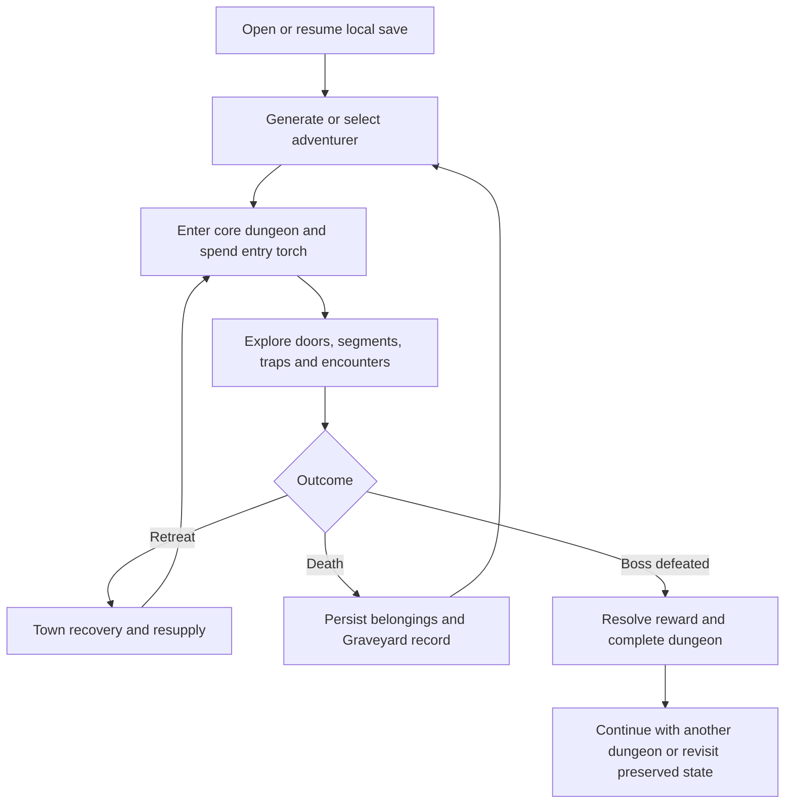

# MVP Scope Document

## NoteQuest Web Application — Core MVP

*Version 0.1 | Draft for Review | Prepared for the NoteQuest Project*

| Field | Value |
|---|---|
| Document owner | Product Owner |
| Related documents | [Business Requirements Document v0.1](business-requirements-v0.1.md); [Digital Adaptation Decision Register](digital-adaptation-decision-register.md); [Digital Adaptation Feasibility Study](digital-adaptation-feasibility-study.md); *NoteQuest* rulebook, first edition |
| MVP / release baseline | Faithful, free, single-player, web-first, fully responsive, offline-first adaptation of the six core NoteQuest dungeons |
| Primary audience | Product owner, rules designer, developer, UX designer, QA/tester, content/licensing reviewer, and operations owner |
| Status | Draft for review |
| Last updated | 2026-07-16 |

---

## 1. Purpose

This document defines the minimum complete product that may be accepted as the NoteQuest Core MVP. It establishes the required end-to-end gameplay loop, Must/Should/Could priorities, explicit exclusions, release gates, dependencies, and measurable acceptance conditions.

The document controls **what must be delivered for the MVP**. Detailed mechanical behaviour remains governed by the approved Digital Adaptation Decision Register and the versioned Digital Rules Specification. Functional, data, UX, non-functional, and test specifications must remain traceable to this scope.

A one-dungeon mechanical prototype is required as a pre-production validation gate. That prototype is not the public MVP: the accepted MVP includes all six approved core dungeon types and the complete core loop defined below.

## 2. Source Basis

This scope is based on:

- [Business Requirements Document v0.1](business-requirements-v0.1.md), including objectives BO-001 through BO-007 and requirements BR-001 through BR-022.
- [Digital Adaptation Decision Register](digital-adaptation-decision-register.md), where `yes` accepts the recommendation and `no` makes the comments-column resolution controlling.
- [Digital Adaptation Feasibility Study](digital-adaptation-feasibility-study.md), including the recommended faithful-adaptation model, phased delivery approach, MVP boundary, principal risks, and go/no-go criteria.
- The *NoteQuest* first-edition rulebook as the source gameplay and content reference.
- The approved project decisions that the product is a free web application, designed web-first with full responsive support, using offline-first local saves and no mandatory account.

## 3. MVP Goal

> Deliver a free, responsive, offline-capable web application in which a solo player can complete and resume the full six-dungeon core NoteQuest gameplay loop without external tables, paper mapping, manual bookkeeping, or unresolved rule interpretation.

The MVP succeeds when a primary user can generate an adventurer, enter and explore a procedural dungeon, resolve doors, traps, combat, light, inventory, retreat, town actions, death or boss victory, and later resume with all required persistent state preserved.

## 4. MVP Principles

| ID | Principle | Meaning for this release |
|---|---|---|
| MP-001 | Minimum but complete | Deliver a complete playable loop rather than isolated rollers, trackers, or partial dungeon systems. |
| MP-002 | Solo-first | The full core experience requires no game master, second player, or manual interpretation of source tables. |
| MP-003 | Faithful adaptation | Implement approved core rules and digital rulings without unsupported mechanics, balance changes, or generated narrative consequences. |
| MP-004 | Web-first and fully responsive | Required gameplay remains usable across the agreed desktop, tablet, and mobile viewport matrix. |
| MP-005 | Offline-first and private | Core play uses local data, requires no mandatory account, and does not depend on continuous connectivity. |
| MP-006 | Persistent and safe | Adventurers, dungeons, monsters, inventory, corpses, dropped items, outcomes, and Graveyard records survive normal close and resume. |
| MP-007 | Transparent automation | Dice, tables, costs, modifiers, triggers, warnings, and resulting state changes are visible or inspectable. |
| MP-008 | Accessible by design | Keyboard use, readable state, non-colour indicators, scalable text, reduced motion, and textual map access are part of the MVP baseline. |
| MP-009 | Licensing-conscious | Only approved content and assets with documented provenance may enter the public build. |
| MP-010 | Free core experience | The complete approved MVP is available without payment, advertising, subscriptions, or other monetisation flows. |
| MP-011 | Scope discipline | Multiplayer, Expanded World, crafting, tactical combat, accounts, live services, and other expansion systems remain deferred. |
| MP-012 | Extensible foundation | Content definitions, reusable effects, persistence boundaries, and rules logic should support approved future additions without blocking the MVP. |

## 5. Target Users

| User type | Priority | Primary need | MVP support |
|---|---:|---|---|
| Existing NoteQuest and solo-tabletop players | Primary | Faithful play without repeated table lookup, paper mapping, or handwritten state tracking | Complete automated core rules, six dungeons, persistent map and game state, transparent results |
| Players interested in minimalist solo dungeon crawlers | Primary | A low-friction, understandable browser game with short sessions and persistent consequences | Guided core loop, clear actions and costs, local saves, death/recovery continuity |
| Tablet and mobile players | Secondary | Full access to critical state, map, encounters, and actions on smaller screens | Responsive layouts, adaptive panels, touch-safe controls, no hover-only actions |
| Players with accessibility needs | Secondary | Keyboard-operable, readable, non-time-critical play with alternative map representation | Keyboard navigation, labels and focus, scalable text, reduced motion, textual map view |
| Future expansion and challenge-mode players | Later | Additional content, variants, shared seeds, or separately licensed expansions | Deferred; MVP foundation must not make these impractical |

## 6. Core User Journey

1. The user opens or installs the web application and starts a new local save or resumes an existing one.
2. The user generates and names an adventurer using the approved weighted race and class procedures.
3. The application assigns HP, abilities, spells, weapon, torches, coins, and other starting state.
4. The user creates or selects one of the six approved core dungeon types and begins an expedition.
5. The application spends the entry torch, places the adventurer at the entrance, and presents the active dungeon map and valid actions.
6. The user explores incrementally generated segments and resolves doors, locks, traps, keys, secret passages, stealth, light, and alert states.
7. The user resolves encounters through turn-based combat, spells, consumables, armour, monster traits, escape, victory, or death.
8. The user manages loot, equipped items, backpack capacity, keys, spells, torches, coins, armour durability, and dropped items.
9. The user chooses whether to continue, safely retreat to town, or progress deeper toward the boss.
10. In town, the user may rest, restore spells, repair armour, purchase torches, sell items, and prepare another expedition.
11. Later expeditions preserve the generated dungeon while applying approved monster healing and room-repopulation rules.
12. If the adventurer dies, the application records the death, persists recoverable belongings, updates the Graveyard, and supports a replacement adventurer.
13. If the boss is defeated, the application resolves the approved reward and records dungeon completion without regenerating unique rewards.
14. The user closes the application and later resumes with equivalent required state preserved.

## 7. Feature Set

| ID | Feature | Status | Summary | Owner |
|---|---|---|---|---|
| MVP-001 | Adventurer generation and state | Must Have | Weighted creation, HP, abilities, spells, equipment, limbs, resources, status, and naming | Rules / Product Designer; Developer |
| MVP-002 | Procedural dungeon generation and map | Must Have | Six core dungeon types, incremental graph generation, floors, readable map, and guaranteed termination | Developer; UX/UI Designer |
| MVP-003 | Exploration, doors, traps, stealth, and light | Must Have | Door states, locks, keys, breaking, traps, secret passages, stealth, alerting, torches, alternative light, and hand constraints | Rules / Product Designer; Developer |
| MVP-004 | Combat and monster traits | Must Have | Initiative, player actions, natural-die triggers, monster damage, armour, spells, escape, death, victory, bosses, and rewards | Rules / Product Designer; Developer |
| MVP-005 | Inventory, equipment, and spells | Must Have | Backpack, equipment, armour durability, spell uses, keys, consumables, loot choices, dropped-item persistence, and overflow handling | Developer; UX/UI Designer |
| MVP-006 | Town and expedition lifecycle | Must Have | Safe retreat, town actions, re-entry, expedition boundaries, monster healing, and room repopulation | Rules / Product Designer; Developer |
| MVP-007 | Persistence, recovery, and reproducible randomness | Must Have | Local save slots, autosave, versioned state, failure visibility, deterministic testing, and stable random outcomes | Technical Lead; QA |
| MVP-008 | Death, corpse recovery, and Graveyard | Must Have | Normal and darkness death, belongings persistence, replacement adventurers, recovery, and historical records | Developer; UX/UI Designer |
| MVP-009 | Rule transparency and event history | Must Have | Recent actions, dice, table results, costs, modifiers, triggers, warnings, and important state changes | Developer; UX/UI Designer |
| MVP-010 | Responsive and accessible interaction | Must Have | Supported browsers and viewports, keyboard use, focus, labels, scalable text, reduced motion, non-colour feedback, and textual map | UX/UI Designer; QA |
| MVP-011 | Content and rights controls | Must Have | Approved content inventory, provenance, attribution, release notices, and blocking of unknown or restricted content | Content / Licensing Reviewer |
| MVP-012 | Free web delivery | Must Have | Public web deployment of the complete approved MVP with no payment or monetisation mechanism | Product Owner; Operations Owner |
| MVP-013 | Pacing and cosmetic variation | Should Have | Fast repeat actions, adjustable result speed, audiovisual feedback, and non-mechanical cosmetic variety | UX/UI Designer; Content Lead |
| MVP-014 | Save export and manual backup | Should Have | User-controlled export or backup of local save data if viable within the selected web architecture | Technical Lead; UX/UI Designer |

### 7.1 Pre-MVP mechanical prototype

Before full production across all six dungeons, the project shall validate one complete dungeon type using production-intent rules architecture but temporary presentation where necessary.

The prototype must demonstrate:

- Adventurer generation and entry into one dungeon.
- Incremental dungeon generation with guaranteed boss access and termination.
- A readable map on representative desktop and mobile widths.
- Doors, traps, torch expenditure, combat, loot, retreat, town return, and re-entry.
- Save, close, reopen, and restoration of the required dungeon and adventurer state.
- Character death, belongings persistence, replacement adventurer creation, and equipment recovery.
- Meaningful torch decisions and acceptable repeated combat during playtesting.

Failure of this prototype gate requires rules, UX, or scope revision before implementing all remaining dungeon content.

## 8. Detailed Feature Scope

### 8.1 MVP-001: Adventurer Generation and State

**Goal:** Create a valid canonical adventurer and maintain all state required for the complete game loop.

#### Included

| ID | Scope item | Priority | Acceptance signal |
|---|---|---:|---|
| ADV-001 | Generate race and class through approved weighted 2d6 table lookups. | Must | Deterministic fixtures map every 2d6 result to the approved content. |
| ADV-002 | Calculate maximum and current HP and assign starting weapon, abilities, spells, ten torches, and zero coins. | Must | New adventurer state matches approved source and digital rulings. |
| ADV-003 | Store duplicate spells as separate available uses. | Must | Duplicate generation produces the correct number of independent charges. |
| ADV-004 | Track HP, available hands, lost arms, spell uses, equipment, armour durability, torches, coins, inventory, location, status, and death information. | Must | Save/reload restores all required adventurer fields. |
| ADV-005 | Permit an adventurer name without changing mechanical generation. | Must | Valid names persist and display correctly across supported layouts. |
| ADV-006 | Represent race, class, item, spell, and monster effects through reusable effect definitions where practical. | Should | New test content can reuse an effect without modifying unrelated rules. |

#### Excluded

- Point-buy or custom-stat character creation.
- Mandatory balance corrections to source race and class combinations.
- Account-level unlocks or progression trees.
- Portrait generation as a requirement for MVP acceptance.

#### Dependencies

- Versioned Digital Rules Specification.
- Approved character, class, spell, weapon, and ability content inventory.
- Data / Domain Model Specification.

#### Feature acceptance criteria

- [ ] Every approved race and class result can be generated and persisted.
- [ ] Starting resources and derived HP are correct for deterministic fixtures.
- [ ] Invalid combinations of limbs, hands, light, and equipment are prevented or resolved explicitly.
- [ ] Creation and state review remain usable across the agreed responsive matrix.
- [ ] No unapproved character content appears in the release build.

### 8.2 MVP-002: Procedural Dungeon Generation and Map

**Goal:** Generate, display, and preserve an explorable dungeon that always reaches a final boss room.

#### Included

| ID | Scope item | Priority | Acceptance signal |
|---|---|---:|---|
| DUN-S-001 | Include all six approved core dungeon types and their authorised content. | Must | Content and test inventories confirm all six types are available. |
| DUN-S-002 | Generate content incrementally only after an unexplored connection is successfully opened. | Must | Unopened branches contain no resolved destination content. |
| DUN-S-003 | Store the dungeon as persistent segments and connections, including entrance, rooms, corridors, staircases, and final room. | Must | Save/reload preserves graph identity and connectivity. |
| DUN-S-004 | Assign every segment to an explicit floor and preserve staircase transitions. | Must | Navigation and persistence tests retain floor membership and links. |
| DUN-S-005 | Apply approved target and hard-maximum rules so every dungeon can reach the third-level final room. | Must | Large seeded simulations contain zero non-terminating dungeons. |
| DUN-S-006 | Display a responsive hybrid node-and-room map with current location and relevant markers. | Must | Users can identify connections, doors, stairs, occupied rooms, dropped items, corpses, entrance, and boss room. |
| DUN-S-007 | Allow visual re-layout for readability without changing topology, segment identity, contents, or direction labels. | Should | Re-layout comparison confirms mechanical state is unchanged. |
| DUN-S-008 | Preserve completed dungeons and prevent boss and unique-reward regeneration. | Must | Re-entry tests retain completion and unique-reward state. |

#### Excluded

- Strict tile-by-tile movement or collision-based grid generation.
- A pre-generated campaign world outside individual dungeons.
- Tactical combat positioning on the dungeon map.
- User-authored dungeon editors.

#### Dependencies

- Approved dungeon-generation rules and termination constants.
- Data model for dungeon, floor, segment, door, encounter, and content instances.
- Responsive map wireframes and textual-map requirements.

#### Feature acceptance criteria

- [ ] Every dungeon seed terminates under the approved simulation target.
- [ ] Generated state persists after every meaningful discovery.
- [ ] The map remains understandable after extensive branching.
- [ ] The complete map can be navigated by keyboard and represented textually.
- [ ] Cosmetic descriptions do not introduce unsupported mechanics or rewards.

### 8.3 MVP-003: Exploration, Doors, Traps, Stealth, and Light

**Goal:** Automate the principal exploration decisions while making costs and consequences clear before commitment.

#### Included

| ID | Scope item | Priority | Acceptance signal |
|---|---|---:|---|
| EXP-001 | Resolve first door interaction as trapped, locked, or unlocked using the approved probabilities. | Must | Boundary fixtures produce the approved 1d6 outcomes. |
| EXP-002 | Persist Unknown, Trapped, Locked, Unlocked, Open, and Broken door states. | Must | State transitions survive close and resume. |
| EXP-003 | Support torch unlocking, normal keys, master keys, approved abilities, and door breaking. | Must | Each valid method applies its approved cost, consumption, and alert consequence. |
| EXP-004 | Resolve traps before destination generation and apply approved cancellation, damage, limb, spawn, or alert effects. | Must | Trap fixtures follow the Digital Rules Specification timing. |
| EXP-005 | Permit one secret-passage search per eligible segment and persist the searched state. | Must | Repeated search is unavailable after the first result. |
| EXP-006 | Implement room-scoped Move Silently, hidden state, permitted hidden actions, noise-breaking actions, re-entry behaviour, and boss restrictions. | Must | Stealth integration scenarios pass. |
| EXP-007 | Treat torches as abstract expedition-light units, including entry and approved action costs. | Must | Resource tests show correct expenditure and capacity. |
| EXP-008 | Support lamps and Light spells as approved alternative light sources and enforce hand requirements. | Must | Legal and illegal equipment/light configurations behave correctly. |
| EXP-009 | Warn before voluntary use of the last torch and apply approved darkness-death timing. | Must | Last-torch scenarios clearly preview and resolve the consequence. |
| EXP-010 | Show cost, risk, noise, resource, and irreversible consequences on relevant actions. | Must | Users identify consequences correctly during usability tests. |

#### Excluded

- Real-time torch timers.
- Free repeated searching until a favourable secret-passage result occurs.
- Arbitrary environmental interactions not present in the approved rules.
- Automatically generated narrative consequences.

#### Dependencies

- Digital Rules Specification for action timing and trap effects.
- UX action-state and confirmation requirements.
- Persistent door, segment, light-source, and alert models.

#### Feature acceptance criteria

- [ ] All door, key, trap, stealth, search, light, and hand scenarios are deterministic and testable.
- [ ] Destination content is not generated before a door is successfully opened.
- [ ] Broken doors and alert-relevant state persist across expeditions.
- [ ] The player cannot accidentally spend the last torch without a clear warning.
- [ ] Required actions remain operable by keyboard and touch.

### 8.4 MVP-004: Combat and Monster Traits

**Goal:** Resolve the complete approved encounter loop consistently while preserving meaningful target, resource, armour, spell, and escape decisions.

#### Included

| ID | Scope item | Priority | Acceptance signal |
|---|---|---:|---|
| CMB-001 | Determine first action from quiet entry, broken doors, traps, and existing alert state. | Must | Initiative fixtures match approved rulings. |
| CMB-002 | Allow an adventurer action using a valid weapon, spell, consumable, or escape effect and an eligible target. | Must | State validation exposes only legal actions and targets. |
| CMB-003 | Preserve natural die values separately from modifiers and trigger approved monster traits on natural results. | Must | Natural 1 and 6 fixtures trigger only the correct effects. |
| CMB-004 | Resolve combined surviving-monster damage and approved armour allocation, breakage, spillover, and bypass rules. | Must | Damage matrices produce expected HP and durability results. |
| CMB-005 | Implement approved special traits, including explosive timing and non-area behaviour unless explicitly specified. | Must | Trait-specific deterministic tests pass. |
| CMB-006 | Resolve defeated monsters, loot, escape, adventurer death, encounter victory, bosses, and boss rewards. | Must | End-to-end encounter scenarios reach the correct terminal state. |
| CMB-007 | Show dice, modifiers, trait triggers, damage, armour changes, remaining enemies, and recent turns. | Must | Players can explain the outcome from visible history. |
| CMB-008 | Provide a repeat-action or accelerated-result option that does not alter mechanics. | Should | Repeated combat can be accelerated with identical outcomes. |

#### Excluded

- Accuracy rolls or mechanics not present in the approved rules.
- Spatial movement, pathfinding, enemy targeting AI, or tactical initiative queues.
- Newly invented status systems or advanced combat actions.
- Mandatory high-production combat animation.

#### Dependencies

- Complete combat and trait sections of the Digital Rules Specification.
- Approved monster, boss, weapon, armour, spell, item, and reward content.
- Deterministic test injection and event-history model.

#### Feature acceptance criteria

- [ ] Every approved combat action and monster trait has deterministic expected-result coverage.
- [ ] Completed outcomes are stable after save/reload and are not silently rerolled.
- [ ] Combat can end through victory, valid escape, or adventurer death.
- [ ] Required controls and feedback remain usable at supported widths and with reduced motion.
- [ ] No unsupported tactical or narrative mechanics are introduced.

### 8.5 MVP-005: Inventory, Equipment, Armour, and Spells

**Goal:** Preserve all source trade-offs while removing manual item and spell bookkeeping.

#### Included

| ID | Scope item | Priority | Acceptance signal |
|---|---|---:|---|
| INV-001 | Enforce a ten-item unequipped backpack and separate ten-torch capacity. | Must | Capacity boundary tests prevent invalid additions. |
| INV-002 | Track equipped weapon, worn armour pieces, durability, hands required, and available hands. | Must | Invalid equipment configurations are prevented or explicitly resolved. |
| INV-003 | Track each spell result as a separate use and restore uses only through approved town actions or effects. | Must | Duplicate and exhausted spell scenarios persist correctly. |
| INV-004 | Support normal keys, master keys, consumables, magical modifiers, coins, and approved item effects. | Must | Item-specific fixtures apply the correct restrictions and outcomes. |
| INV-005 | Require an explicit choice when receiving loot at full capacity. | Must | No item silently disappears or exceeds capacity. |
| INV-006 | Persist deliberately dropped items and recoverable belongings at their dungeon location. | Must | Later expeditions can find and collect preserved items. |
| INV-007 | Support selling, repair, use, equip, unequip, discard, and pickup only in valid states. | Must | State-machine tests reject invalid actions. |

#### Excluded

- Crafting, item enhancement, or procedural item systems beyond approved content.
- Shared account inventory or cloud stash.
- Unlimited inventory or automatic disposal decisions.

#### Dependencies

- Item, equipment, armour, spell, key, and ability definitions.
- Data model separating content definitions from runtime instances.
- UX for capacity overflow, equipment legality, and destructive actions.

#### Feature acceptance criteria

- [ ] Capacity, equipment, durability, spell-use, and hand constraints are enforced.
- [ ] No required inventory state is lost during save/reload.
- [ ] Full-capacity loot always produces an understandable choice.
- [ ] Dropped and corpse-held items remain traceable to a persistent location.
- [ ] Inventory interactions remain usable by keyboard and at supported small widths.

### 8.6 MVP-006: Town and Expedition Lifecycle

**Goal:** Connect repeated dungeon expeditions into a persistent, complete gameplay loop.

#### Included

| ID | Scope item | Priority | Acceptance signal |
|---|---|---:|---|
| LIFE-001 | Permit town return only when the approved safe-route conditions are satisfied. | Must | Blocked and valid retreat-path scenarios behave correctly. |
| LIFE-002 | Support rest, HP and spell restoration, armour repair, torch purchase, and item sale at approved costs. | Must | Town transaction fixtures produce expected state. |
| LIFE-003 | Define expedition start and end events and increment persistent expedition history. | Must | Exit, death, and re-entry create the correct lifecycle boundaries. |
| LIFE-004 | Fully heal surviving monsters at the approved new-expedition event. | Must | Monster HP resets only at the correct boundary. |
| LIFE-005 | Roll eligible room repopulation once on first entry during a later expedition. | Must | Repeated movement in one expedition does not reroll repopulation. |
| LIFE-006 | Allow rooms containing dropped items or recoverable belongings to repopulate where approved. | Must | Recovery and encounter state can coexist. |
| LIFE-007 | Preserve completed-dungeon status and prevent unique boss reward regeneration. | Must | Re-entry after completion does not recreate unique outcomes. |

#### Excluded

- Walkable or explorable town scenes.
- Merchants with dynamic simulated inventories unless required by approved rules.
- Quests, factions, settlements, kingdoms, or campaign-map systems.

#### Dependencies

- Approved retreat, town-price, expedition-reset, monster-healing, and repopulation rules.
- Persistent path and dungeon-state model.
- UX for unavailable actions and cost confirmation.

#### Feature acceptance criteria

- [ ] A user can retreat, recover in town, and re-enter the preserved dungeon.
- [ ] Invalid retreat is blocked with an understandable reason.
- [ ] Town transactions cannot create negative or invalid resources.
- [ ] Healing and repopulation occur once at the approved lifecycle point.
- [ ] The journey remains resumable after any town or expedition transition.

### 8.7 MVP-007: Persistence, Recovery, and Reproducible Randomness

**Goal:** Protect the persistent game and make random outcomes stable, testable, and explainable.

#### Included

| ID | Scope item | Priority | Acceptance signal |
|---|---|---:|---|
| PERS-001 | Store all required play data locally by default with no mandatory account. | Must | Network-independent test restores an existing save under agreed conditions. |
| PERS-002 | Autosave after meaningful state changes, including generation, door resolution, combat turns, resource use, inventory changes, exits, death, and completion. | Must | State checkpoints survive close and reopen. |
| PERS-003 | Show accurate pending, successful, and failed save status; never claim success after a failed write. | Must | Failure-injection scenarios present correct state and recovery guidance. |
| PERS-004 | Use a versioned save schema with validation and non-destructive recovery behaviour. | Must | Invalid or older fixtures are rejected, migrated, or recovered without overwriting valid data. |
| PERS-005 | Preserve generated random outcomes before presentation so reload does not silently create a different resolved event. | Must | Reload comparison returns the same completed result. |
| PERS-006 | Support seeded or injectable randomness for deterministic tests and reproducible defect reports. | Must | A known seed reproduces the agreed generation sequence. |
| PERS-007 | Provide user-controlled save export or backup where technically viable within MVP delivery. | Should | Exported data validates and can restore the required state, or is formally deferred before scope approval. |
| PERS-008 | Explain local-storage limits and browser-data deletion risks in plain language. | Must | Storage notice passes content and usability review. |

#### Excluded

- Mandatory cloud accounts or server-side save authority.
- Online anti-cheat or competitive validation.
- Cross-device synchronisation as an MVP requirement.
- Hidden collection of private save data.

#### Dependencies

- Web architecture and supported-browser decision.
- Data / Domain Model and schema-version policy.
- Non-Functional Requirements and fault-injection test plan.

#### Feature acceptance criteria

- [ ] Required state is equivalent after normal save, close, and resume.
- [ ] Interrupted or failed writes do not silently destroy the last valid state.
- [ ] Completed random outcomes remain stable after reload.
- [ ] Save behaviour works across the agreed browser matrix.
- [ ] Private play data remains local unless the user explicitly exports it.

### 8.8 MVP-008: Death, Recovery, and Graveyard

**Goal:** Preserve NoteQuest’s distinctive continuity between failed and replacement adventurers.

#### Included

| ID | Scope item | Priority | Acceptance signal |
|---|---|---:|---|
| DEATH-001 | Resolve normal death and darkness death according to their approved timing and remaining-belongings rules. | Must | Deterministic scenarios produce the correct location and recoverable state. |
| DEATH-002 | Leave approved carried items, equipment, and coins at the death location unless destroyed by a specific effect. | Must | Save/reload retains recoverable belongings. |
| DEATH-003 | Distinguish normal corpse presence from darkness-death belongings where required. | Must | Map and data state reflect the approved distinction. |
| DEATH-004 | Create a Graveyard record containing the approved adventurer, dungeon, location, cause, and time information. | Must | Every death produces one persistent, readable record. |
| DEATH-005 | Permit creation of a replacement adventurer without resetting the persistent dungeon. | Must | The new adventurer can re-enter the same dungeon state. |
| DEATH-006 | Support later recovery subject to inventory capacity, encounters, and room state. | Must | Recovery scenarios preserve explicit overflow choices and danger. |
| DEATH-007 | Preserve historical Graveyard records after belongings are recovered or a dungeon is completed. | Must | Historical records are not removed by later gameplay. |

#### Excluded

- Permanent account penalties or progression loss beyond approved game state.
- Online sharing or leaderboards for death records.
- Automatic deletion of old corpses or Graveyard entries without a separately approved retention rule.

#### Dependencies

- Approved death and recovery rulings.
- Persistent map, inventory, dungeon, and Graveyard entities.
- UX for death explanation, replacement creation, and recovery markers.

#### Feature acceptance criteria

- [ ] The complete death-to-replacement-to-recovery flow works across save/reload.
- [ ] Darkness death follows the approved last-torch timing.
- [ ] Recoverable and destroyed belongings are correctly distinguished.
- [ ] Graveyard records remain readable and accessible at supported widths.
- [ ] No death state requires external bookkeeping to continue play.

### 8.9 MVP-009 and MVP-010: Transparency, Responsive UX, and Accessibility

**Goal:** Make every required action and survival-critical state understandable and operable across supported devices and assistive interaction modes.

#### Included

| ID | Scope item | Priority | Acceptance signal |
|---|---|---:|---|
| UX-S-001 | Keep current location, HP, armour, torches, coins, weapon, spells, enemies, and valid actions visible or one deliberate action away. | Must | Usability review finds no hidden survival-critical state. |
| UX-S-002 | Show action cost, availability, warning, noise, likely consequence, and irreversible outcome where relevant. | Must | Representative users interpret critical actions correctly. |
| UX-S-003 | Provide recent event history containing dice, table outcomes, modifiers, trait triggers, and state changes needed to explain results. | Must | A tester can reconstruct an accepted outcome from the UI and saved history. |
| UX-S-004 | Support the agreed current desktop, tablet, and mobile viewport matrix with no clipped or unreachable required control. | Must | Responsive matrix passes the complete core journey. |
| UX-S-005 | Support keyboard-only operation with logical order, visible focus, labelled controls, and correct modal focus management. | Must | Keyboard acceptance scenarios pass. |
| UX-S-006 | Support scalable text, sufficient contrast, non-colour-only state, reduced motion, and no sound-only required information. | Must | Accessibility audit passes the agreed baseline. |
| UX-S-007 | Provide a textual alternative for dungeon-map position and available connections. | Must | A user can understand and navigate the dungeon without relying on the visual graph. |
| UX-S-008 | Provide touch-safe targets and avoid hover-only required information. | Must | Touch interaction passes on representative supported devices. |
| UX-S-009 | Permit instant or accelerated dice and combat presentation without changing rules outcomes. | Should | Reduced-motion and fast-result modes preserve identical mechanics. |

#### Excluded

- A final high-cost animation suite as an MVP gate.
- Controller-first or console navigation.
- A requirement that all map, encounter, inventory, and history panels be simultaneously visible on phone screens.
- Essential information communicated only through colour, sound, animation, or hover.

#### Dependencies

- UX Flow and Wireframe Requirements.
- Non-Functional Requirements and agreed accessibility target.
- Browser, viewport, assistive-technology, and device test matrix.

#### Feature acceptance criteria

- [ ] Primary users can complete the core journey without facilitator intervention or external notes.
- [ ] All Must responsive combinations expose every required action.
- [ ] Keyboard, labels, focus, contrast, reduced-motion, and textual-map checks pass.
- [ ] Destructive and irreversible actions can be cancelled before commitment where the rules allow.
- [ ] Event history explains outcomes without requiring source-rule lookup during ordinary play.

### 8.10 MVP-011 and MVP-012: Content Compliance and Free Web Delivery

**Goal:** Publish an eligible, maintainable, free web application using only approved content and assets.

#### Included

| ID | Scope item | Priority | Acceptance signal |
|---|---|---:|---|
| REL-001 | Maintain provenance, rights or licence, approval status, attribution, and version or review date for bundled content and assets. | Must | Release inventory contains no unknown or restricted item. |
| REL-002 | Include only approved core NoteQuest content and separately approved original application copy. | Must | Content review confirms the release boundary. |
| REL-003 | Exclude original logo, page layout, character-sheet trade dress, or other publication design unless specifically authorised. | Must | Visual and content audit finds no unauthorised reproduction. |
| REL-004 | Provide required attribution, licence, rights, and unofficial-status notices in a discoverable legal/about location. | Must | Reviewer confirms notice completeness and discoverability. |
| REL-005 | Deploy the complete accepted MVP as a web application. | Must | Public release URL serves the approved build under the supported browser matrix. |
| REL-006 | Provide the complete approved core experience without payment, advertising, subscription, or monetisation flow. | Must | Release review finds no gated Must capability or monetisation mechanism. |
| REL-007 | Support offline-first play under the selected web delivery strategy. | Must | Offline test conditions pass after the required initial availability step. |
| REL-008 | Establish a documented hosting, maintenance, deployment, and rollback owner. | Must | Operational readiness checklist is approved. |

#### Excluded

- Paid access, subscriptions, advertising, donations embedded as a gameplay requirement, or premium core features.
- Localised public releases in the initial MVP.
- Expanded World or other separately licensed supplements.
- Unknown, restricted, or unreviewed third-party dependencies and assets.

#### Dependencies

- Content and licensing inventory with permission evidence.
- Web architecture, hosting plan, deployment pipeline, and rollback process.
- Approved visual direction and replacement-asset plan.

#### Feature acceptance criteria

- [ ] Every bundled item has an approved provenance record.
- [ ] The complete Must scope is freely accessible.
- [ ] The public build contains all required notices and no blocked content.
- [ ] Supported online and offline launch paths behave as documented.
- [ ] Deployment and rollback responsibilities are assigned and tested.

## 9. Cross-Cutting Scope

### 9.1 Persistence and data safety

- Autosave after every meaningful state-changing action defined by the Functional Requirements and Digital Rules Specification.
- Preserve a last-known-valid state when a write fails or stored data is invalid.
- Validate schema version before loading and avoid destructive migration without a recoverable path.
- Make save status truthful and visible without disrupting ordinary turn-based play.
- Keep private play data local by default and prohibit undisclosed reuse for analytics, marketing, examples, or training.
- Explain browser storage and deletion risks before the user relies on local saves.
- Save export and manual backup are Should scope; they become Must only if architecture review determines local-only recovery is insufficient for acceptable data safety.

### 9.2 Responsive and accessibility baseline

- Web-first responsive design across an agreed current desktop, tablet, and mobile browser matrix.
- Keyboard-operable required controls with logical focus order and no hover-only action.
- Programmatic labels, visible focus, managed modal focus, and announced status/error changes.
- Scalable readable text, sufficient contrast, non-colour-only indicators, reduced motion, and optional instant results.
- Touch-safe targets and adaptive small-screen strategies for map, inventory, encounter, and event-history views.
- A textual map alternative describing current segment, known connections, door states, important markers, and route toward the entrance.
- No essential information conveyed only through sound or animation.

### 9.3 Content and licensing

- Approved content sources: authorised core NoteQuest rule and table content; approved original application copy; approved replacement or licensed visual/audio assets; approved open-source software and fonts.
- Prohibited or deferred content: Expanded World, localisation, unknown or restricted assets, unauthorised source prose, original trade dress, and unapproved derivative game content.
- Attribution and rights notices must be available from a discoverable About / Legal area and included wherever an individual licence requires additional placement.
- The MVP is free to use and contains no monetisation mechanism.
- Exact rules prose should be included only where the recorded permission explicitly covers that use; otherwise use approved original UI wording and concise summaries.

### 9.4 Quality baseline

- Deterministic unit tests cover rules calculations, table boundaries, natural die triggers, generation limits, capacities, costs, state transitions, and invalid inputs.
- Integration tests cover adventurer creation, dungeon entry, doors, traps, combat, town return, re-entry, death, recovery, boss completion, and save/reload.
- Large seeded simulations demonstrate zero non-terminating dungeons in the agreed test set and provide balancing evidence without silently changing source mechanics.
- End-to-end tests cover the complete core journey on representative responsive layouts.
- Accessibility checks combine automated tooling with keyboard, reduced-motion, contrast, and textual-map manual review.
- Builds must pass formatting, content-manifest, schema, deterministic-rules, responsive smoke, and release-gate checks.
- No blocker or critical defect may remain open; a high defect requires explicit product-owner waiver and documented impact.

## 10. Explicit MVP Exclusions

The following are not required for MVP acceptance:

- Multiplayer, cooperative play, shared campaigns, or real-time collaboration.
- Expanded World or other supplements not separately approved.
- Crafting, tactical grid combat, detailed town exploration, campaign maps, hex exploration, settlements, kingdoms, quests, or factions.
- Custom character builders that replace canonical weighted generation.
- Account-wide progression, achievements as a release requirement, cloud accounts, cloud synchronisation, online leaderboards, daily services, or live-service systems.
- AI-authored narrative, automated game-master behaviour, or generated mechanics outside approved rules.
- Paid access, subscriptions, advertising, or other monetisation.
- Localised or translated public releases.
- Console release, controller-first navigation, or platform certification.
- Fully animated combat, 3D dungeons, spatial enemy movement, or pathfinding.
- A strict collision-based square-grid map.
- Save sharing, public seed leaderboards, or competitive anti-cheat.
- Full virtual tabletop features.
- Unapproved NoteQuest rules text, tables, item or monster descriptions, art, icons, screenshots, copied layout, logo, or trade dress.

## 11. Release Gates

| Gate | Requirement | Pass condition |
|---|---|---|
| Documentation gate | Downstream specifications trace to the BRD, decision register, and this scope. | Digital Rules, PRD/FRS, Data Model, UX, NFR, Content/Licensing, and Test Plan are sufficiently approved for implementation and acceptance. |
| Prototype gate | One complete dungeon validates the core loop before full content production. | Termination, map readability, torch pressure, combat, saving, death/recovery, town return, and repeat play meet the approved prototype criteria. |
| Scope gate | All Must features are implemented or formally descoped through an approved scope change. | No unapproved Must gap remains and all exclusions remain outside the build. |
| End-to-end gate | Primary user can complete all major terminal paths. | Acceptance scenarios pass for boss victory, safe retreat and re-entry, and death followed by replacement and recovery. |
| Rules gate | Deterministic mechanics conform to the approved Digital Rules Specification. | 100% of Must deterministic fixtures and rules traceability checks pass. |
| Dungeon-generation gate | Every tested dungeon can reach a final room and terminate. | Zero non-terminating or unreachable-boss cases in the agreed large-seed simulation. |
| Persistence gate | Required user data survives ordinary and fault scenarios. | All Must save/reload, interrupted-write, validation, and recovery scenarios pass. |
| UX gate | Core actions, costs, warnings, and state are understandable. | At least 80% of representative primary users complete the agreed core flow without facilitator intervention or external bookkeeping. |
| Responsive gate | The complete journey works across supported viewports. | Every Must browser/viewport combination completes the core flow without clipped or inaccessible required controls. |
| Accessibility gate | Agreed accessibility baseline passes. | All Must keyboard, label, focus, contrast, reduced-motion, non-colour, and textual-map requirements pass. |
| Content gate | All bundled content and assets are release-eligible. | 100% of bundled items have approved provenance; no unknown, restricted, or unapproved item is included. |
| Free-access gate | Complete approved core experience is free. | No Must feature requires payment and no monetisation flow is present. |
| Operational gate | Web hosting, deployment, offline behaviour, and rollback are ready. | Deployment and rollback tests pass and ownership is assigned. |
| Defect gate | Release contains no unacceptable known defect. | No blocker or critical defect remains open; high defects have explicit documented waiver. |

## 12. Success Measures

| ID | Measure | Target | Evidence |
|---|---|---|---|
| MVP-SM-001 | Complete core journey | 100% of Must end-to-end scenarios pass for creation, exploration, combat, retreat, town, re-entry, boss completion, death, replacement, and recovery. | Acceptance execution report |
| MVP-SM-002 | Rules conformance | 100% of Must deterministic rule fixtures pass. | Unit, integration, and rules-matrix results |
| MVP-SM-003 | Dungeon termination | Zero non-terminating or unreachable-boss dungeons in the agreed large-seed test set. | Automated simulation report |
| MVP-SM-004 | Save integrity | 100% of Must normal, interrupted, validation, and recovery scenarios preserve or safely recover required state. | Persistence test matrix |
| MVP-SM-005 | Core usability | At least 80% of representative primary users complete the agreed core flow without facilitator intervention or external bookkeeping. | Moderated playtest / UAT |
| MVP-SM-006 | Responsive support | All Must browser and viewport combinations complete the core flow without inaccessible required controls. | Responsive matrix |
| MVP-SM-007 | Accessibility | All Must baseline checks pass through agreed automated and manual evidence. | Accessibility audit |
| MVP-SM-008 | Content eligibility | 100% of bundled content and assets have approved provenance; zero blocked items ship. | Content inventory and release report |
| MVP-SM-009 | Defect readiness | Zero open blocker or critical defects; high defects require explicit waiver. | Defect and release report |
| MVP-SM-010 | Free access | The complete Must scope is available without payment or monetisation. | Release review |
| MVP-SM-011 | Prototype validation | One-dungeon prototype passes its go/no-go criteria before remaining dungeon production. | Prototype review and playtest record |
| MVP-SM-012 | Privacy | No hidden telemetry or undisclosed external use of local play data. | Network, storage, code, and policy review |

## 13. Assumptions and Dependencies

### 13.1 Assumptions

- Written permission covers the digital adaptation and approved use of core tables, names, and terminology.
- The initial public application is free and requires no monetisation features.
- The six core dungeons provide sufficient MVP content when supported by appropriate pacing and non-mechanical presentation variation.
- A responsive browser interface can make the map, critical adventurer state, encounters, inventory, and actions usable across the agreed matrix.
- Offline-first local persistence is viable within selected supported browsers.
- Approved decision-register rulings will be converted into a versioned Digital Rules Specification before production implementation.
- Original or licensed replacement assets can be produced where existing artwork rights are unavailable.
- Hosting and maintenance costs for a free web application are acceptable to the project owner.
- Local-first save limitations can be communicated clearly enough for users to make informed backup decisions.

### 13.2 Dependencies

| ID | Dependency | Status | Blocking scope |
|---|---|---|---|
| DEP-MVP-001 | Approved Business Requirements Document v0.1 | Available | Scope and release traceability |
| DEP-MVP-002 | Approved Digital Adaptation Decision Register | Available | All feature and rules boundaries |
| DEP-MVP-003 | Versioned Digital Rules Specification | Required next | Prototype and all mechanical Must features |
| DEP-MVP-004 | Product / Functional Requirements Specification | Pending | Implementation breakdown and traceability |
| DEP-MVP-005 | Data / Domain Model Specification | Pending | Persistence, definitions, instances, import, and recovery |
| DEP-MVP-006 | UX Flow and Wireframe Requirements | Pending | Responsive map, action states, accessibility, and estimation |
| DEP-MVP-007 | Non-Functional Requirements | Pending | Browser, performance, reliability, privacy, accessibility, and operations |
| DEP-MVP-008 | Content and Licensing Requirements plus approved inventory | Pending / in progress | Content gate and public release |
| DEP-MVP-009 | Acceptance Criteria / Test Plan | Pending | Prototype and release gates |
| DEP-MVP-010 | Web architecture, supported browser matrix, offline strategy, and hosting plan | Pending | Prototype deployment, persistence, and operational gate |
| DEP-MVP-011 | Approved visual direction and asset-production plan | Pending | Release presentation and content gate |
| DEP-MVP-012 | Deterministic random and automated simulation harness | Pending | Rules, generation, persistence, and prototype gates |
| DEP-MVP-013 | Representative playtest participants and feedback process | Pending | Prototype, usability, and replayability evidence |

## 14. Risks and Scope Controls

| Risk | Scope impact | Control |
|---|---|---|
| Incomplete rule formalisation | Rework, inconsistent gameplay, and blocked acceptance | Complete the Digital Rules Specification before production implementation; require traceability and deterministic tests. |
| Non-terminating or unreachable dungeon | Breaks the core journey | Use approved floor targets and hard maximums; validate through large seeded simulations. |
| Save corruption or browser-data loss | Destroys persistent player value | Transactional/last-valid saves, schema validation, fault tests, truthful status, storage notice, and evaluate export as Should scope. |
| Responsive interface overload | Makes mobile or tablet play impractical | Validate adaptive map/state/action layouts early in the one-dungeon prototype. |
| Combat or content repetition | Reduces replayability | Fast controls, clear feedback, optional pacing acceleration, and cosmetic variation without balance changes. |
| Scope creep | Delays validation and increases defects | New work requires an explicit Must/Should/Could/Won't decision and approved change to this document. |
| Rights or provenance gap | Blocks public release | Item-level inventory and content gate; replace or remove unapproved assets. |
| Free hosting or maintenance cost | Threatens availability | Approve architecture and operating budget before the operational gate. |
| Browser offline limitations | Breaks the approved connectivity model | Architecture spike and supported-browser matrix before persistence implementation. |
| Accessibility deferred as polish | Creates structural rework and exclusion | Include keyboard, textual map, responsive, and reduced-motion requirements in initial UX and prototype work. |
| Source-faithful imbalance | Some adventurers may be much stronger than others | Preserve canonical behaviour; use simulation and playtest evidence, with optional variants deferred. |
| Overly broad event history | Increases storage and UI complexity | Define minimum explainability records and retention rules in data and NFR documents. |

## 15. Deferred Backlog

| Item | Reason deferred | Target milestone | Prerequisite |
|---|---|---|---|
| Expanded World integration | Separately licensed and materially expands scope | Post-core expansion | Rights confirmation and separate scope approval |
| Multiplayer or cooperative play | Not present in core design and requires new ownership/synchronisation rules | Future major release | Proven core loop and new product decision |
| Optional house-rule or balance presets | Canonical mode must stabilise first | Post-MVP | Complete rules conformance and playtest evidence |
| Shared or daily dungeon seeds | Requires additional UX, validation, and possibly online service | Post-MVP challenge release | Stable seeded generation and privacy review |
| Cloud backup and synchronisation | Conflicts with no-account simplicity and adds operations/privacy cost | Future optional service | Architecture, privacy, account, and cost approval |
| Localisation | Initial public translation rights and content process are not approved | Future release | Translation rights and localisation architecture |
| Achievements and statistics | Not required to validate the complete core loop | Post-MVP polish | Stable event model and privacy review |
| Crafting and extended item systems | Unsupported expansion mechanic | Not planned for core roadmap | Separate product and rules approval |
| Tactical grid combat and 3D presentation | High cost and replaces the minimalist source loop | Not planned for core roadmap | Separate product strategy |
| Detailed town or campaign-world exploration | Outside dungeon-focused MVP | Future expansion, if approved | New content and domain specification |
| Console and controller-first support | Requires redesign and certification effort | Future platform release | Stable responsive web release and platform approval |
| Public leaderboards or live services | Adds accounts, moderation, privacy, and operational burden | Not planned for MVP | Separate business model and privacy approval |

## 16. Open Questions

| ID | Question | Owner | Decision point | Status |
|---|---|---|---|---|
| OQ-MVP-001 | Which browser versions and desktop, tablet, and mobile viewport sizes constitute the supported MVP matrix? | Technical Lead / UX Lead | Before UX wireframes and NFR approval | Open |
| OQ-MVP-002 | Which web offline strategy and local storage technology will meet the approved persistence model? | Technical Lead | Architecture decision before prototype implementation | Open |
| OQ-MVP-003 | Does save export become Must scope after assessment of browser-data-loss risk, or remain Should scope? | Product Owner / Technical Lead | Persistence architecture and risk review | Open |
| OQ-MVP-004 | What exact accessibility standard, screen-reader matrix, and contrast targets apply to the MVP? | UX Lead / QA | NFR and test-plan approval | Open |
| OQ-MVP-005 | Which one of the six core dungeon types will be used for the mechanical prototype? | Product Owner / Rules Designer | Before prototype backlog creation | Open |
| OQ-MVP-006 | What target and hard-maximum values govern dungeon-floor termination? | Rules Designer | Digital Rules Specification approval | Open |
| OQ-MVP-007 | What minimum event-history retention is required for player explanation, saves, and defect reproduction? | Product Owner / Technical Lead / QA | Data Model and NFR approval | Open |
| OQ-MVP-008 | What visual direction and replacement-asset budget will be used for the MVP release? | Product Owner / UX Lead / Content Reviewer | Before full presentation production | Open |
| OQ-MVP-009 | What hosting, deployment, monitoring, maintenance, and rollback model will operate the free application? | Operations Owner / Technical Lead | Before prototype deployment | Open |
| OQ-MVP-010 | Does the recorded adaptation permission allow exact source rules prose in the application, or should all UI text use approved original summaries? | Content / Licensing Reviewer | Content Requirements approval | Open |

## 17. Approval

- [ ] Product owner approves the bounded MVP and explicit exclusions.
- [ ] Rules designer confirms that the scope is implementable from the decision register and planned Digital Rules Specification.
- [ ] Technical lead confirms feasibility of responsive web delivery, offline-first persistence, deterministic randomness, and guaranteed dungeon termination.
- [ ] UX lead confirms that the core flow, map, responsive strategy, and accessibility baseline are sufficient for detailed design and estimation.
- [ ] Content/licensing reviewer confirms that the intended content boundary and free release model are understood.
- [ ] QA confirms that every Must item can be traced to measurable acceptance evidence.
- [ ] Operations owner confirms that the free web release can be hosted, maintained, and rolled back under an approved plan.
