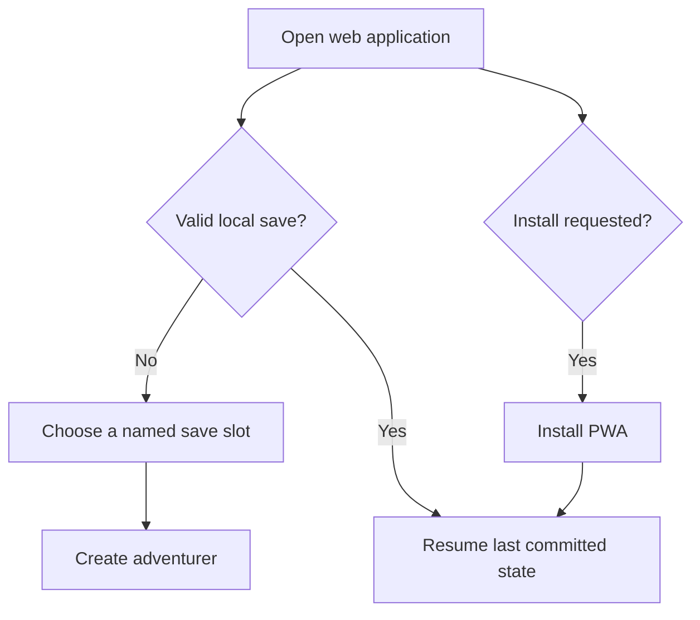

# Product Requirements Document

## NoteQuest Web Application — Core MVP

*Version 0.1 | Draft for Review | Prepared for the NoteQuest Project*

| Field | Value |
|---|---|
| Product owner | Product Owner |
| Target release | NoteQuest Core MVP |
| Related documents | [Business Requirements Document v0.1](business-requirements-v0.1.md); [MVP Scope v0.1](mvp-scope-v0.1.md); [Digital Rules Specification v0.1](digital-rules-specification-v0.1.md); [Digital Adaptation Decision Register](digital-adaptation-decision-register.md); [Decision Register v0.2](digital-adaptation-decision-register-v0.2.md); [Digital Adaptation Feasibility Study](digital-adaptation-feasibility-study.md); *NoteQuest* rulebook, first edition |
| Primary audience | Product, UX, engineering, QA, content/licensing, operations, and playtest stakeholders |
| Status | Draft for review |
| Last updated | 2026-07-16 |

---

## Contents

1. Product Summary
2. User Problem
3. Product Outcomes
4. Users and Use Cases
5. Product Principles
6. Scope and Priorities
7. User Journeys
8. Product Requirements
9. Feature Requirements
10. UX and Accessibility Expectations
11. Data, Rules, and Content Impact
12. Analytics and Success Metrics
13. Dependencies and Risks
14. Release and Rollout
15. Acceptance and Sign-Off
16. Open Questions

---

## 1. Product Summary

The NoteQuest Web Application is a faithful, free, single-player digital adaptation of the complete first-edition Core Book loop. It automates adventurer generation, dice and table resolution, incremental dungeon generation, mapping, exploration, combat, inventory, town actions, expedition persistence, death, corpse or belongings recovery, and the Graveyard while preserving the source game's lethality, procedural discovery, torch pressure, meaningful choices, and persistent consequences.

The Core MVP includes all six approved core dungeon types. It is delivered as an installable, web-first, fully responsive Progressive Web Application whose versioned application shell and approved static content can run offline after installation. Core play requires no account, backend, or continuous network connection. Game state is stored locally in IndexedDB through three named save slots with autosave, last-valid recovery, versioned export, and validated import.

A complete Palace dungeon is the required pre-production prototype. The Palace prototype must pass the approved rules, generation, persistence, responsive, accessibility, and playtest gates before production expands to all six dungeon types and final presentation work.

### Product statement

> For solo tabletop players and players who enjoy minimalist dungeon crawlers, NoteQuest Core MVP is a responsive offline-capable browser game that delivers the complete source-faithful NoteQuest experience without paper mapping, repeated table lookup, or manual state tracking. Unlike generic roguelikes or partial tabletop utilities, it preserves the original rules, transparent dice procedures, persistent dungeons, lethal consequences, corpse recovery, and Graveyard continuity.

## 2. User Problem

### Primary problem

Players who want to play NoteQuest digitally must currently reproduce the tabletop workflow manually. They must consult multiple tables, roll and interpret dice, draw and maintain a multi-floor dungeon map, track torches, HP, limbs, spells, equipment, armour, monsters, doors, corpses, dropped items, and persistent dungeon state, and make their own rulings when concise tabletop wording leaves timing or edge cases unclear.

This creates avoidable setup and bookkeeping effort, inconsistent rule resolution, and a meaningful risk that the persistent state connecting expeditions and replacement adventurers is recorded incorrectly or lost.

### User evidence

- The Core Book repeatedly uses weighted 2d6 generation and d6 tables for adventurers, dungeons, doors, rooms, monsters, bosses, traps, spells, equipment, and rewards.
- The core journey requires the player to draw a growing dungeon, remember connections and floors, and preserve changes between expeditions and adventurers.
- Torch use, door state, initiative, armour allocation, monster traits, stealth, retreat, death, repopulation, and recovery contain timing or persistence interactions that software must resolve consistently.
- The feasibility study concluded that the complete game is technically suitable for a digital adaptation but identified rules completeness, map readability, save integrity, combat repetition, content repetition, and rights provenance as the principal risks.
- No representative product playtest evidence exists yet. The Palace prototype is the approved mechanism for obtaining usability, pacing, map-clarity, and replayability evidence before full production.

### Current alternatives

| Alternative | Benefit | Limitation |
|---|---|---|
| Play the tabletop Core Book with dice and paper | Original experience with complete player control | Requires table lookup, map drawing, manual bookkeeping, persistent records, and personal rules interpretation |
| Use generic dice rollers, spreadsheets, or note applications | Reduces isolated bookkeeping tasks | Does not provide a unified game loop, legal action control, automatic rules resolution, map generation, or reliable linked persistence |
| Play a conventional digital roguelike | Immediate digital dungeon-crawling experience | Does not preserve NoteQuest's specific generation, torch economy, simple combat, persistent dungeons, corpse recovery, or Graveyard loop |
| Use a partial tabletop assistant | Can automate selected rolls or trackers | Leaves the player responsible for external rules, map management, edge cases, and cross-expedition state |

## 3. Product Outcomes

| ID | Outcome | User value | Product value | Priority |
|---|---|---|---|---|
| PO-001 | Players can complete the full six-dungeon core loop without external bookkeeping or source-table consultation. | A complete, low-friction digital game rather than a partial assistant | Demonstrates a faithful and releasable adaptation | Must |
| PO-002 | Automated outcomes remain understandable and inspectable. | Players can trust dice, modifiers, costs, triggers, and consequences | Reduces confusion, support cost, and rules defects | Must |
| PO-003 | Persistent progress and consequences survive ordinary close, reload, migration, export, import, and recoverable failure. | Players can invest in long-lived dungeons and recovery stories without silent loss | Protects the product's central value and user trust | Must |
| PO-004 | The core journey is usable across the approved browser, viewport, keyboard, and assistive-technology matrix. | Desktop, tablet, and phone players can access the same complete experience | Avoids a desktop-only product and structural accessibility rework | Must |
| PO-005 | Dungeon generation is deterministic, debuggable, and guaranteed to reach the boss and terminate. | Players never lose a run to an impossible or endless dungeon | Enables reliable QA, reproducible defects, and release confidence | Must |
| PO-006 | Repeated exploration and combat remain readable and acceptably paced without changing canonical balance. | Faster digital play does not make the source loop tedious or opaque | Supports retention and validates the full adaptation model | Should |
| PO-007 | The public release contains only approved, attributable, rights-cleared content and assets. | Players receive a coherent legitimate release | Prevents legal, licensing, and provenance blockers | Must |
| PO-008 | The complete Core MVP is free to use and requires no account or monetisation flow. | No payment or registration barrier | Conforms to the approved release model and simplifies operations | Must |

### Non-goals

- Replacing NoteQuest with a larger conventional roguelike or campaign-world game.
- Adding multiplayer, cooperative play, shared accounts, leaderboards, cloud-authoritative state, or live-service systems.
- Including Expanded World or other supplements in the Core MVP.
- Adding crafting, tactical grid combat, real-time movement, 3D dungeon presentation, detailed town exploration, settlements, factions, quests, or generated narrative systems.
- Correcting canonical balance or generation probabilities in the baseline mode.
- Reproducing unapproved source prose, artwork, logo, page layout, character-sheet design, or trade dress.
- Supporting localisation or translated releases in the Core MVP.

## 4. Users and Use Cases

### 4.1 Personas

| Persona | Priority | Context | Primary need | Success condition |
|---|---:|---|---|---|
| Existing NoteQuest player | Primary | Knows the tabletop rules and wants faster complete play | Faithful automation without hidden mechanical changes | Recognises the source loop, can inspect outcomes, and completes a dungeon without paper tools |
| Solo tabletop player new to NoteQuest | Primary | Enjoys procedural solo games but does not want extensive setup | Clear valid actions, costs, consequences, and progressive guidance | Creates an adventurer and completes the core flow without facilitator intervention |
| Minimalist dungeon-crawler player | Primary | Wants short browser sessions with persistent consequences | Fast entry, readable combat, meaningful risk, and resumable progress | Understands the loop and finds repeated runs acceptable |
| Tablet or phone player | Secondary | Plays on touch devices and smaller viewports | Complete access to map, state, encounters, inventory, and confirmations | No required action or survival-critical information is clipped, inaccessible, or hover-dependent |
| Player using assistive technology | Secondary | Uses keyboard, screen reader, text scaling, or reduced motion | Equivalent access to map structure, state, actions, outcomes, and warnings | Completes the core journey using the approved accessibility path |
| Playtester or QA reviewer | Supporting | Validates deterministic rules, persistence, responsive behavior, and pacing | Reproducible seeds, inspectable event history, and clear failure diagnostics | Can reconstruct an outcome and report a defect without private-data leakage |

### 4.2 Core use cases

| ID | Use case | Actor | Trigger | Expected outcome |
|---|---|---|---|---|
| UC-001 | Start a new local game | Player | No suitable save exists | A named save slot is created and the player reaches adventurer creation |
| UC-002 | Resume an existing game | Player | A valid local save exists | The latest committed state is restored without rerolling resolved outcomes |
| UC-003 | Create and name an adventurer | Player | A save has no active adventurer or the previous adventurer died | Canonical race, class, HP, abilities, spells, weapon, torches, and coins are generated and persisted |
| UC-004 | Create or select a core dungeon | Player | A valid adventurer is in town | One of the six approved dungeon types is available and its persistent record can be entered or resumed |
| UC-005 | Explore an unknown connection | Player | The adventurer is at a segment with an unexplored door or passage | Door state and costs are resolved, then the destination is generated only after successful opening |
| UC-006 | Resolve a room or encounter | Player | The adventurer enters generated content | The application presents legal choices and resolves stealth, combat, treasure, traps, or other approved content |
| UC-007 | Manage loot and equipment | Player | Rewards, drops, recovery, or inventory changes occur | Capacity, equipment, hands, durability, spell uses, keys, and item persistence remain legal and explicit |
| UC-008 | Retreat to town | Player | A safe discovered path to the entrance exists | The expedition ends and the player reaches town with persistent dungeon state retained |
| UC-009 | Rest, repair, resupply, and sell | Player | The adventurer is in town | Approved coin costs, healing, spell restoration, armour repair, torch purchase, and sales are resolved |
| UC-010 | Re-enter a persistent dungeon | Player | An unfinished or completed dungeon exists | Existing topology and state are restored and approved healing or repopulation behavior is applied |
| UC-011 | Resolve adventurer death | Player | HP reaches zero or darkness death occurs | Death is recorded, recoverable belongings persist correctly, and the Graveyard is updated |
| UC-012 | Recover a prior adventurer's belongings | Player | A replacement adventurer reaches a death segment | Recoverable items and coins can be taken under normal capacity rules |
| UC-013 | Defeat a boss and complete a dungeon | Player | The final-room boss is defeated | Unique rewards are resolved once and the dungeon is marked complete without regenerating the boss |
| UC-014 | Export, import, or recover a save | Player | Backup, transfer, migration, or corruption handling is needed | Data is validated and previewed before mutation, existing state is protected, and failure is explained truthfully |

## 5. Product Principles

| ID | Principle | Product implication |
|---|---|---|
| PP-001 | Expedition-first | The map, active segment, adventurer state, encounter, inventory, valid actions, and recent history remain close to the current dungeon context. |
| PP-002 | Source-faithful | The canonical product implements approved NoteQuest mechanics, probabilities, content, lethality, and imbalance without unsupported additions. |
| PP-003 | Transparent automation | Dice, table rows, costs, modifiers, triggers, choices, cancellations, and state changes are visible or inspectable. |
| PP-004 | Persistent consequences | Generated topology, doors, monsters, damage, items, corpses, drops, completions, and Graveyard records survive save and reload. |
| PP-005 | Data safety | State-changing actions autosave atomically, failure is never presented as success, and recovery preserves the last valid state. |
| PP-006 | Offline-first privacy | Core play requires no account, backend, or continuous connection, and private play data remains local by default. |
| PP-007 | Responsive and accessible | The complete core flow works across the approved viewport and assistive-technology matrix rather than treating phone and accessibility support as polish. |
| PP-008 | Deterministic and testable | Separate seeded random streams and immutable committed outcomes make rules and defects reproducible without UI dependencies. |
| PP-009 | Explicit correction | Manual dice entry or correction, where supported, is deliberate, validated, and recorded; silent overrides and baseline house-rule presets are excluded. |
| PP-010 | Licensing-conscious | Bundled content and assets require provenance, approval, attribution, and the correct rights position before release. |
| PP-011 | Free core experience | The complete approved Core MVP contains no payment, advertising, subscription, or paid-access mechanism. |
| PP-012 | Scope discipline | Expansion systems cannot enter the Core MVP without an approved change to the BRD, [MVP Scope](mvp-scope-v0.1.md), and affected specifications. |

## 6. Scope and Priorities

### Must have

- Complete single-player gameplay from save creation and adventurer generation through exploration, combat, retreat, town, death and recovery, boss victory, and later resume.
- All six approved Core Book dungeon types and authorised core races, classes, spells, equipment, monsters, bosses, traps, rewards, and town procedures.
- Canonical rules behavior defined by the approved decision registers and [Digital Rules Specification](digital-rules-specification-v0.1.md).
- Incremental graph-based dungeon generation with persistent floors, connections, content, and a readable hybrid dungeon map.
- Guaranteed boss reachability and termination using the approved six-segment target, ten-segment hard maximum, increasing staircase pressure, and forced staircase.
- Doors, locks, traps, keys, breaking, secret passages, stealth, alerts, torches, alternative light, arms, and hands.
- Turn-based encounters, target selection, weapon and spell resolution, natural-die traits, combined monster damage, armour allocation, escape restrictions, death, victory, and boss rewards.
- Inventory, equipment, armour durability, spell charges, consumables, coins, keys, overflow decisions, drops, and recovery.
- Town rest, spell restoration, armour repair, torch purchase, item sale, safe retreat, re-entry, monster healing, and room repopulation.
- Persistent death records, normal and darkness-death belongings, replacement adventurers, corpse or drop recovery, and the Graveyard.
- Installable static PWA, service-worker-cached versioned shell and static content, IndexedDB game state, and no backend dependency for core play.
- Three named local save slots with active state, last-valid snapshot, schema version, rules/content version, update timestamp, autosave, explicit sequential migration, versioned export, and validated import.
- Separate deterministic random streams for dungeon generation, combat, rewards, and repopulation, with committed outcomes preserved across reload.
- Complete active and incomplete dungeon event history; a permanent completion summary plus final 500 mechanically relevant entries for completed dungeons; latest 200 entries shown by default.
- Current and previous two major versions of Chrome, Edge, Firefox, and Safari at 360, 390, 768, 1024, 1280, and 1440 CSS pixels, including phone browsers.
- WCAG 2.2 Level AA target, complete keyboard operation, reduced motion, scalable text, non-colour status, and equivalent visual and textual map actions.
- Approved screen-reader matrix: NVDA with Firefox and Chrome, VoiceOver with Safari on macOS and iOS, and TalkBack with Chrome on Android.
- Content provenance, credits, required notices, rights restrictions, English-only release, and replacement or removal of unapproved assets.
- CDN-backed static hosting, protected tagged GitHub Actions deployment, immutable artifacts, retained previous release, safe service-worker activation, and one-action rollback.
- Free public use with no account, payment, subscription, advertising, or other monetisation requirement.
- Palace prototype approval before expansion to all six dungeons and final asset production.

### Should have

- Fast repeat-action controls and adjustable pacing that never conceal decisions, triggers, or resource changes.
- Ink-and-notebook cosmetic variation, lightweight feedback, and restrained audio that do not alter mechanics or accessibility.
- Explicit manual physical-dice entry mode recorded separately from generated results.
- Player annotations separate from immutable mechanical event entries.
- Progressive, skippable guidance for first-time users without requiring a separate tutorial campaign.

### Could have

- Additional non-mechanical room descriptions and visual flourishes drawn from approved content definitions.
- Optional local diagnostic package generation that excludes names, notes, event text, Graveyard detail, full saves, and exports.
- Additional accessibility preferences beyond the approved baseline when they do not delay Must requirements.

### Won't have in this release

- Multiplayer, cooperative play, shared campaigns, public leaderboards, or competitive validation.
- Expanded World or other separately scoped supplements.
- Cloud accounts, cloud backup, mandatory login, or cloud-authoritative saves.
- Crafting, tactical grid combat, spatial enemy movement, detailed town exploration, campaign maps, factions, settlements, kingdoms, or quests.
- 3D dungeon presentation or real-time torch simulation.
- Free rerolls, point-buy creation, mandatory balance correction, or baseline house-rule presets.
- AI-authored narrative, rules, rewards, or mechanical consequences.
- Localisation or translated public releases.
- Monetisation, subscriptions, advertising, donations required for access, or paid content within the Core MVP.
- Unapproved rulebook prose, artwork, logo, page layout, character-sheet design, or trade dress.

## 7. User Journeys

### Journey A: Start, install, or resume

| Step | User intent | Product behavior | Failure / recovery state |
|---|---|---|---|
| 1 | Open the game | Load the versioned application shell and inspect local save metadata | Present offline or update status without blocking valid local play |
| 2 | Start or resume | Show three named slots with truthful state, last update, and recovery availability | Isolate an invalid slot and leave other slots usable |
| 3 | Continue play | Restore the latest committed state and random-stream positions | Never reroll or silently reset an initiated outcome |
| 4 | Install for offline use | Offer supported PWA installation without making installation mandatory | Explain unsupported installation while retaining browser play |

### Journey B: Create an adventurer and begin an expedition

| Step | User intent | Product behavior | Failure / recovery state |
|---|---|---|---|
| 1 | Create a new adventurer | Generate race and class using weighted 2d6 procedures | Reject invalid content definitions before state mutation |
| 2 | Review the adventurer | Show HP, abilities, spells, weapon, ten torches, zero coins, arms, and hands | Explain any content or validation failure and preserve the prior valid save |
| 3 | Choose a dungeon | Present the six core dungeon types and existing persistent dungeons | Block unapproved or invalid dungeon content |
| 4 | Enter the dungeon | Spend the entry torch, create the expedition, and place the adventurer at the entrance | Warn before entry when no valid post-cost light state exists |

### Journey C: Explore and resolve an encounter

| Step | User intent | Product behavior | Failure / recovery state |
|---|---|---|---|
| 1 | Inspect the current segment | Show map, exits, doors, occupants, hazards, drops, state, and legal actions | Textual map provides equivalent information and actions |
| 2 | Open an unknown connection | Resolve trap or lock state before generating the destination | Do not generate destination content when opening fails or is cancelled |
| 3 | Enter generated content | Persist the new segment, room result, encounter, and random outcomes | Reload returns to the committed result rather than rerolling |
| 4 | Resolve danger or opportunity | Present stealth, combat, item, spell, treasure, movement, or other legal choices | Invalid actions are disabled or rejected without mutation |
| 5 | Continue or leave | Update map, resources, history, and autosave after each meaningful change | Persistence failure is visible and blocks unsafe continuation where necessary |

### Journey D: Retreat, town, and re-entry

| Step | User intent | Product behavior | Failure / recovery state |
|---|---|---|---|
| 1 | Return to town | Verify a continuous safe discovered route to the entrance | Identify the occupied segment preventing retreat |
| 2 | End the expedition | Preserve topology, door states, monsters, drops, corpses, rewards, and completion state | Failed save retains the last valid expedition state |
| 3 | Recover and resupply | Apply approved rest, repair, torch purchase, and sale costs | Prevent unaffordable or invalid actions without mutation |
| 4 | Re-enter | Restore the persistent dungeon and apply approved healing and repopulation | Repopulation occurs at most once per eligible room per expedition |

### Journey E: Death and recovery

| Step | User intent | Product behavior | Failure / recovery state |
|---|---|---|---|
| 1 | Understand death | Resolve all already-triggered effects, record cause and location, and show recoverable state | Never suppress death because the final monster also dies |
| 2 | Continue the save | Create a Graveyard entry and allow a replacement adventurer | Multiple deaths in one room remain distinct |
| 3 | Recover belongings | Allow retrieval under normal capacity and equipment rules | Excess items remain in the room rather than disappearing |
| 4 | Review history | Show death cause, dungeon, floor, segment, date or play timestamp, and recovery status | Private information remains local and excluded from diagnostics |

### Journey F: Boss victory and dungeon completion

| Step | User intent | Product behavior | Failure / recovery state |
|---|---|---|---|
| 1 | Reach the final room | Generate the boss destination on entering level three under the approved termination rules | Simulation and runtime guards prevent unreachable or outward-expanding final rooms |
| 2 | Defeat the boss | Resolve the encounter under normal combat and boss restrictions | Stealth and unsupported escape do not bypass completion |
| 3 | Claim rewards | Resolve authorised unique rewards once | Capacity choices preserve uncollected items in the room |
| 4 | Continue play | Mark the dungeon complete and retain it for revisit or recovery | Boss and unique rewards do not regenerate |

### Journey G: Export, import, migration, and recovery

| Step | User intent | Product behavior | Failure / recovery state |
|---|---|---|---|
| 1 | Export a backup | Create a versioned package containing complete save state and provenance | Clearly warn that the package contains private local play data |
| 2 | Import a package | Validate schema, version, content references, and preview impact before mutation | Unsupported or invalid packages leave existing data unchanged |
| 3 | Load an older supported schema | Apply explicit sequential migrations with a pre-migration recovery snapshot | Migration failure restores or preserves the original state |
| 4 | Recover from corruption | Offer the last valid transactional snapshot and privacy-safe diagnostics | Never silently reset or overwrite recoverable data |

## 8. Product Requirements

The requirements below define observable product outcomes. Detailed formulas, timing, table rows, and mechanical state transitions remain controlled by the [Digital Rules Specification](digital-rules-specification-v0.1.md).

| ID | Requirement | Priority | Acceptance signal | Linked outcome |
|---|---|---:|---|---|
| PR-001 | The product shall provide a complete playable loop from local save creation through adventurer creation, dungeon exploration, encounter resolution, town, boss victory or death, recovery, and later resume. | Must | All Must end-to-end scenarios pass without external bookkeeping or source-table consultation. | PO-001 |
| PR-002 | The Core MVP shall support one local player and shall require no game master, second player, or multiplayer service. | Must | Every core workflow is completable by one player. | PO-001, PO-008 |
| PR-003 | The product shall include all six approved Core Book dungeon types and authorised core gameplay content. | Must | Content inventory and acceptance tests confirm all approved core definitions are available. | PO-001, PO-007 |
| PR-004 | The canonical mode shall implement approved NoteQuest rules and rulings without unsupported probabilities, balance changes, mechanics, rewards, or consequences. | Must | Every implemented mechanic traces to the [Digital Rules Specification](digital-rules-specification-v0.1.md) or approved decision record. | PO-001, PO-002 |
| PR-005 | The product shall automate dice, table lookup, calculations, triggers, and state changes while preserving natural values and making the result inspectable. | Must | Players and testers can inspect dice, table and row IDs, modifiers, costs, choices, and final outcomes. | PO-002, PO-005 |
| PR-006 | The product shall expose only legal actions for the current state and shall show material costs, warnings, and irreversible consequences before commitment where appropriate. | Must | Invalid actions do not mutate state; last-light, breaking, discard, overwrite, reset, and import actions use clear confirmation. | PO-002, PO-003 |
| PR-007 | The product shall maintain a persistent hybrid dungeon map showing current location, floors, connections, door states, occupancy, corpses, drops, stairs, entrance, boss room, and secret-search state. | Must | Visual and textual map paths provide equivalent navigation and action access. | PO-001, PO-004 |
| PR-008 | Dungeon content shall be generated incrementally only after an unexplored connection is successfully opened and shall persist immediately after resolution. | Must | Unopened destinations remain unresolved; reload restores committed generated content. | PO-003, PO-005 |
| PR-009 | Every floor shall use the approved six non-stair segment target and ten-segment hard maximum, with post-target staircase pressure and forced stairs at the maximum. | Must | At least 100,000 deterministic seeds per dungeon type yield zero non-terminating dungeons and zero unreachable boss rooms. | PO-005 |
| PR-010 | The product shall support the approved exploration system, including door states, traps, locks, breaking, normal and master keys, secret passages, stealth, alerts, torches, alternative light, arms, and hands. | Must | All relevant [Digital Rules Specification](digital-rules-specification-v0.1.md) fixtures and user journeys pass. | PO-001, PO-002 |
| PR-011 | The product shall support approved turn-based combat, target selection, weapon and spell resolution, monster traits, combined monster damage, armour allocation, escape restrictions, death, victory, bosses, and rewards. | Must | Deterministic combat fixtures and complete encounter journeys pass. | PO-001, PO-002, PO-006 |
| PR-012 | The product shall support backpack capacity, equipped items, armour durability, spell charges, keys, consumables, coins, loot choices, overflow resolution, drops, sales, and item recovery without silent loss of item identity or state. | Must | Inventory remains legal and item state survives ownership and location changes. | PO-001, PO-003 |
| PR-013 | The product shall support safe retreat, town rest, spell restoration, armour repair, torch purchase, item sale, dungeon re-entry, monster healing, and eligible room repopulation. | Must | Expedition lifecycle scenarios pass across close and reload. | PO-001, PO-003 |
| PR-014 | The product shall preserve normal and darkness-death results, distinct recoverable containers, replacement adventurers, recovery, and searchable Graveyard records for the lifetime of the save. | Must | Death and recovery scenarios preserve correct belongings and history. | PO-001, PO-003 |
| PR-015 | The product shall be an installable static PWA with a service-worker-cached versioned shell and approved static content, IndexedDB state, and no backend dependency for core play. | Must | Installed and browser versions launch and use existing saves under the approved offline test conditions. | PO-003, PO-008 |
| PR-016 | The product shall provide three named local save slots, each containing active state, last-valid recovery snapshot, schema version, rules/content version, and update timestamp. | Must | Slot creation, rename, resume, overwrite confirmation, reset, and isolation tests pass. | PO-003 |
| PR-017 | The product shall autosave atomically after every meaningful state change and shall never show a successful save when persistence fails. | Must | Failure-injection tests produce truthful status and no silent loss. | PO-003 |
| PR-018 | The product shall use explicit sequential save migrations, retain a pre-migration recovery snapshot, reject unsupported newer schemas without mutation, and preserve the original data when migration fails. | Must | Migration and rollback matrices pass for all supported versions. | PO-003 |
| PR-019 | The product shall support versioned save export and validated import with preview and private-data warnings before existing data is changed. | Must | Invalid imports leave all existing slots unchanged; valid round trips preserve equivalent state. | PO-003 |
| PR-020 | The product shall use separate deterministic random streams for dungeon generation, combat, rewards, and repopulation and shall preserve committed outcomes across save, reload, export, and import. | Must | Unrelated actions do not shift another stream and reload cannot reroll an initiated outcome. | PO-002, PO-005 |
| PR-021 | The product shall retain complete structured event history for active and incomplete dungeons and a permanent completion summary plus the final 500 mechanically relevant entries for completed dungeons. | Must | History survives persistence and supports reconstruction of significant outcomes. | PO-002, PO-003 |
| PR-022 | The latest 200 event-history entries shall be available by default, and mechanical records shall remain immutable while optional player notes remain separate. | Must | Event review is usable without changing recorded outcomes. | PO-002 |
| PR-023 | The product shall support the current and previous two major versions of Chrome, Edge, Firefox, and Safari at 360, 390, 768, 1024, 1280, and 1440 CSS pixels. | Must | Every supported combination completes the core journey without inaccessible required controls. | PO-004 |
| PR-024 | The product shall target WCAG 2.2 Level AA and provide keyboard operation, labels, focus management, scalable text, reduced motion, non-colour status, dynamic announcements, and equivalent textual map actions. | Must | The approved automated, keyboard, NVDA, VoiceOver, TalkBack, and textual-map matrix passes. | PO-004 |
| PR-025 | Core play data, names, notes, event history, Graveyard entries, exports, and imported content shall remain private and local by default. | Must | Network and diagnostics review shows no undisclosed collection or external use. | PO-003, PO-008 |
| PR-026 | Production analytics and telemetry shall be disabled unless a separate approved purpose, data inventory, consent position, and privacy review are completed. | Must | Release build contains no unapproved analytics requests or identifiers. | PO-008 |
| PR-027 | The complete Core MVP shall be free to use and shall include no payment, subscription, advertising, or paid-access mechanism. | Must | Public access and the complete core loop require no payment. | PO-008 |
| PR-028 | Every bundled text, table, image, font, icon, audio asset, and third-party dependency shall have source, licence or permission, approval status, attribution requirement, and version or review date. | Must | Release inventory contains no unknown, blocked, or unapproved item. | PO-007 |
| PR-029 | Application copy shall use original concise wording and paraphrase by default; exact source prose and artwork require item-specific digital-use permission; the Core MVP shall be English-only. | Must | Content review confirms the approved copy and language boundary. | PO-007 |
| PR-030 | The visual baseline shall use a 2D monochrome ink-and-notebook presentation with a restrained warm torch accent, without reproducing unapproved source trade dress. | Must | UX and content review approve presentation and provenance. | PO-004, PO-007 |
| PR-031 | The Palace prototype shall pass all Must scenarios, at least 100,000 terminating and boss-reachable seeds, zero save-corruption failures, at least 80% unaided core-flow completion, and at least 70% acceptable-or-better ratings for combat pacing, map clarity, and overall play before a written go decision. | Must | Prototype evidence pack and written decision are approved. | PO-005, PO-006 |
| PR-032 | Public deployment shall use protected tagged GitHub Actions, immutable versioned artifacts, a retained previous release, privacy-safe monitoring, safe update activation after a save point, and one-action rollback. | Must | Release and rollback rehearsal passes without save loss. | PO-003, PO-008 |
| PR-033 | The product should provide fast repeat actions, optional reduced animation, and non-mechanical cosmetic variation without hiding decisions, triggers, or resource changes. | Should | At least 70% of Palace playtesters rate pacing acceptable or better. | PO-006 |
| PR-034 | The Core MVP shall exclude every system listed under Won't Have unless the BRD, [MVP Scope](mvp-scope-v0.1.md), PRD, and affected specifications are formally changed. | Must | Release scope audit finds no unapproved expansion behavior. | PO-007, PO-008 |

## 9. Feature Requirements

### 9.1 Application Entry, Installation, and Save Slots

**Goal:** Let a player begin or resume private local play safely and understand the state of every save.

**Primary user:** All players

#### Included behavior

| ID | Requirement | Priority | Notes |
|---|---|---:|---|
| PRD-APP-001 | The product shall present three named local save slots with state, last update, rules/content version, and recovery availability. | Must | Links PR-016 |
| PRD-APP-002 | The product shall allow create, resume, rename, export, import, and confirmed reset or overwrite actions. | Must | Destructive actions require explicit confirmation |
| PRD-APP-003 | The product shall communicate offline readiness, installation availability, current version, and pending safe update. | Must | Update activation waits for a save point and reload |
| PRD-APP-004 | The product shall isolate a corrupted or incompatible slot without blocking other valid slots. | Must | No silent reset |
| PRD-APP-005 | The product should provide concise first-run guidance about local storage, export, and browser-data deletion risk. | Should | Guidance is skippable and remains available later |

#### Empty, loading, error, and confirmation states

- Empty: An unused slot explains that creating it starts adventurer creation.
- Loading: Local validation and migration status is visible; the user is not shown a false playable state.
- Error: The affected slot is isolated with the reason and available recovery or export actions.
- Confirmation: Reset, overwrite, import replacement, and last-valid restoration identify the affected slot and consequences.
- Recovery: The player may restore the last valid snapshot or preserve/export recoverable data.

#### Exclusions

- Account sign-in or cloud save selection.
- More than three active local slots as an MVP requirement.

### 9.2 Adventurer Creation and Management

**Goal:** Produce a valid canonical adventurer and keep all required state understandable.

**Primary user:** Player starting or continuing a save after death

#### Included behavior

| ID | Requirement | Priority | Notes |
|---|---|---:|---|
| PRD-ADV-001 | The product shall generate race and class through approved weighted 2d6 procedures. | Must | No free canonical reroll |
| PRD-ADV-002 | The product shall assign HP, abilities, spells, starting weapon, ten torches, zero coins, two arms, and two hands. | Must | Exact mechanics remain in the DRS |
| PRD-ADV-003 | The product shall let the player enter and persist an adventurer name without altering mechanics. | Must | Name is private user data |
| PRD-ADV-004 | The product shall show current and maximum HP, arms, hands, spells and uses, equipment, armour, torches, coins, inventory, location, status, and death information. | Must | Critical state remains visible or one action away |
| PRD-ADV-005 | The product shall prevent or explicitly resolve illegal hand, light, equipment, and capacity states. | Must | No silent item loss |
| PRD-ADV-006 | Manual physical-dice entry may be offered as an explicit recorded mode. | Should | Generated and manual outcomes remain distinguishable |

#### Empty, loading, error, and confirmation states

- Empty: No active adventurer leads directly to creation or Graveyard review.
- Loading: Generated values are committed before final presentation.
- Error: Invalid content or state leaves the last valid save unchanged and identifies the affected definition.
- Confirmation: No routine confirmation is required for ordinary creation; abandoning an unfinished creation requires confirmation.
- Recovery: A failed creation returns to the prior valid save state.

#### Exclusions

- Point-buy, custom-stat creation, free rerolls, balance mode, or account unlocks.
- Required portraits or generative imagery.

### 9.3 Dungeon Selection, Generation, and Map

**Goal:** Create and preserve readable dungeons that always reach the boss and terminate.

**Primary user:** Player preparing or conducting an expedition

#### Included behavior

| ID | Requirement | Priority | Notes |
|---|---|---:|---|
| PRD-DUN-001 | The product shall provide all six approved core dungeon types and retain unfinished and completed dungeon records. | Must | Expanded World excluded |
| PRD-DUN-002 | The product shall generate destinations incrementally after successful opening and persist every resolved segment and connection. | Must | Links PR-008 |
| PRD-DUN-003 | The product shall use the approved floor target, hard maximum, staircase pressure, forced staircase, and final-room rules. | Must | Links PR-009 |
| PRD-DUN-004 | The visual map shall show graph truth without making presentation coordinates mechanically significant. | Must | Layout may rearrange for readability |
| PRD-DUN-005 | The textual map shall expose equivalent current segment, connections, doors, hazards, occupants, markers, route, and actions. | Must | Accessibility equivalence |
| PRD-DUN-006 | Completed bosses and unique rewards shall not regenerate. | Must | Revisit may support recovery and unfinished branches |

#### Empty, loading, error, and confirmation states

- Empty: A save with no dungeon offers the six approved creation choices.
- Loading: Generation is committed and autosaved before the destination is presented as final.
- Error: Invalid or impossible generation stops safely and preserves the last valid graph.
- Confirmation: Entering a dungeon confirms entry-torch consequences when the post-cost light state is dangerous.
- Recovery: Reload restores the same graph, generated content, and random-stream state.

#### Exclusions

- Manual map editing that changes graph truth.
- Tactical grid movement, collision, fog-of-war simulation, or 3D rooms.

### 9.4 Exploration, Doors, Traps, Stealth, and Light

**Goal:** Present legal exploration choices and their costs without hiding irreversible risk.

**Primary user:** Player in a dungeon

#### Included behavior

| ID | Requirement | Priority | Notes |
|---|---|---:|---|
| PRD-EXP-001 | The product shall represent unknown, trapped, locked, unlocked, open, and broken door states. | Must | Destination generation follows successful opening |
| PRD-EXP-002 | The product shall support normal keys, master keys, breaking, approved class or item effects, and trap resolution. | Must | Keys do not silently bypass traps |
| PRD-EXP-003 | The product shall support one-time secret-passage searches and persistent searched state. | Must | Torch is spent before rolling |
| PRD-EXP-004 | The product shall support Move Silently and its room-visit, monster-count, failure, alert, and boss restrictions. | Must | Exact dice remain in DRS |
| PRD-EXP-005 | The product shall show torch and alternative-light state before every qualifying action. | Must | Final light use receives an irreversible warning |
| PRD-EXP-006 | The product shall enforce arm and hand requirements after limb loss and require a legal configuration before affected actions. | Must | Unequipped items persist |

#### Empty, loading, error, and confirmation states

- Empty: Segments with no unresolved exploration action show movement, inventory, history, and retreat options as applicable.
- Loading: Random results are committed before outcome presentation.
- Error: Insufficient resources or invalid state prevents the action without cost or mutation unless the DRS defines commitment earlier.
- Confirmation: Last light, door breaking, and destructive item use identify permanent effects.
- Recovery: Reload preserves door, trap, search, alert, light, and limb state.

#### Exclusions

- Real-time torch timers.
- Universal free lockpicking, disarming, stealth, or combat escape actions.

### 9.5 Encounters, Combat, and Bosses

**Goal:** Resolve lethal source-faithful encounters quickly while keeping choices and triggers clear.

**Primary user:** Player in an occupied room or boss encounter

#### Included behavior

| ID | Requirement | Priority | Notes |
|---|---|---:|---|
| PRD-CMB-001 | The product shall determine and communicate initiative from quiet entry, breaking, traps, and alert state. | Must | Links DRS combat rules |
| PRD-CMB-002 | The product shall present only legal combat actions and valid targets. | Must | No unsupported weapon switching or escape |
| PRD-CMB-003 | The product shall preserve natural dice, show modifiers, resolve trait timing, and apply defeated or spawned states in approved order. | Must | Event history records the chain |
| PRD-CMB-004 | The product shall preview exact combined active-monster damage when no hidden rule can change it and let the player choose legal HP or armour allocation. | Must | Armour spillover remains explicit |
| PRD-CMB-005 | The product shall resolve simultaneous deaths, boss restrictions, rewards, and post-combat choices without suppressing triggered consequences. | Must | Rewards may remain after death |
| PRD-CMB-006 | The product should offer repeat attack and reduced-animation controls that stop for every decision or new trigger. | Should | Does not automate target or allocation decisions |

#### Empty, loading, error, and confirmation states

- Empty: No encounter returns the player to exploration.
- Loading: Dice and effects resolve in an inspectable sequence and commit before presentation.
- Error: A rules or content failure blocks further mutation and preserves the last valid combat state.
- Confirmation: No confirmation for ordinary attacks; consumables or effects with permanent loss show their consequences.
- Recovery: Reload returns to the same committed combat state and outcomes.

#### Exclusions

- Tactical positioning, enemy pathfinding, real-time action, or auto-battle.
- Stealth bypass of the final boss.

### 9.6 Inventory, Equipment, Armour, Spells, and Rewards

**Goal:** Make every ownership, capacity, equipment, durability, and reward choice explicit and persistent.

**Primary user:** Player receiving, using, dropping, recovering, or selling items

#### Included behavior

| ID | Requirement | Priority | Notes |
|---|---|---:|---|
| PRD-INV-001 | The product shall distinguish ten backpack slots, separate torch capacity, equipped items, spells, and numeric coins. | Must | Keys occupy backpack slots |
| PRD-INV-002 | The product shall preserve stable item identity, modifiers, durability, provenance, and location across all transfers. | Must | Includes export/import |
| PRD-INV-003 | The product shall pause overflow resolution and require take, leave, equip, use, or discard choices until state is legal. | Must | Unchosen items remain in the room |
| PRD-INV-004 | The product shall enforce armour-slot uniqueness, hand requirements, destroyed-item removal, and approved repair behavior. | Must | No silent replacement |
| PRD-INV-005 | The product shall track generated spell charges separately and restore them only through approved effects or town rest. | Must | Duplicate spells create separate uses |
| PRD-INV-006 | The product shall show item and reward provenance in internal data and required attribution or notice surfaces. | Must | Player-facing provenance detail may be concise |

#### Empty, loading, error, and confirmation states

- Empty: Empty backpack or reward state clearly distinguishes no item from a loading failure.
- Loading: Generated rewards are committed before the player chooses ownership.
- Error: Invalid item definitions or capacity transitions leave state unchanged and explain the conflict.
- Confirmation: Deliberate discard, destructive use, sale, and replacement identify the affected item.
- Recovery: Dropped, corpse-held, or uncollected items remain at their segment.

#### Exclusions

- Crafting, item upgrading outside approved effects, account storage, or infinite stacking.

### 9.7 Town and Expedition Lifecycle

**Goal:** Connect repeated expeditions through understandable recovery, preparation, and persistent dungeon change.

**Primary user:** Player safely returned to town

#### Included behavior

| ID | Requirement | Priority | Notes |
|---|---|---:|---|
| PRD-TOWN-001 | The product shall expose town as a focused action panel rather than a spatial exploration area. | Must | Core town actions only |
| PRD-TOWN-002 | The product shall validate safe retreat and identify the exact occupied segment that blocks it. | Must | Stealth-bypassed monsters remain unsafe |
| PRD-TOWN-003 | The product shall support approved rest, repair, torch purchase, ordinary sale, and magical sale actions. | Must | Natural sale die remains inspectable |
| PRD-TOWN-004 | The product shall preserve unfinished dungeons and let a player begin or resume another approved dungeon after safe return. | Must | No abandonment deletion |
| PRD-TOWN-005 | The product shall apply monster healing and eligible room repopulation at the approved expedition timing. | Must | At most once per eligible room per expedition |

#### Empty, loading, error, and confirmation states

- Empty: Unavailable actions state the missing coin, item, damage, capacity, or dungeon condition.
- Loading: Town actions are local and immediate after validation and persistence.
- Error: Failed persistence leaves resources and items unchanged.
- Confirmation: Sales and other irreversible transfers identify the result before completion where required.
- Recovery: Reload restores the last committed town or expedition boundary.

#### Exclusions

- Detailed town map, NPC dialogue system, crafting, quests, shops beyond approved actions, or campaign economy.

### 9.8 Death, Recovery, and Graveyard

**Goal:** Preserve NoteQuest's distinctive continuity after lethal failure.

**Primary user:** Player whose adventurer died or who is recovering prior belongings

#### Included behavior

| ID | Requirement | Priority | Notes |
|---|---|---:|---|
| PRD-PER-001 | The product shall create a Graveyard record immediately when death resolves. | Must | Includes identity, cause, dungeon, floor, segment, time, and recovery reference |
| PRD-PER-002 | Normal death shall leave a corpse or recoverable container with approved belongings; darkness death shall leave belongings without a corpse. | Must | Consumed and destroyed items remain absent |
| PRD-PER-003 | Multiple deaths in one segment shall remain distinct and independently recoverable. | Must | Stable identifiers required |
| PRD-PER-004 | A replacement adventurer shall enter the same persistent save and may recover belongings under normal capacity rules. | Must | Excess remains in place |
| PRD-PER-005 | The Graveyard shall be searchable or filterable by relevant recorded fields and shall show recovery status. | Must | Detailed UX belongs in UX specification |

#### Empty, loading, error, and confirmation states

- Empty: A save with no deaths shows an informative empty Graveyard.
- Loading: Death state is persisted before continuation choices are offered.
- Error: Failure blocks replacement creation until death and recoverable state are safely recorded or restored.
- Confirmation: Optional cleanup or permanent deletion requires clear confirmation; routine recovery does not.
- Recovery: Last-valid restoration must not duplicate or erase death containers.

#### Exclusions

- Account-wide achievements, online memorials, public sharing, or automatic cleanup.

### 9.9 Rules Transparency and Event History

**Goal:** Let players and testers understand why every important outcome occurred.

**Primary user:** Player, QA reviewer, and support reviewer

#### Included behavior

| ID | Requirement | Priority | Notes |
|---|---|---:|---|
| PRD-HIST-001 | The product shall record significant actions, natural dice, table and row IDs, modifiers, rule version, location, expedition, and resulting state changes. | Must | Exact record schema belongs in data model |
| PRD-HIST-002 | The product shall show the latest 200 entries by default and provide access to retained history. | Must | Large histories must remain usable |
| PRD-HIST-003 | The product shall retain complete history for active and incomplete dungeons and summary plus final 500 mechanical entries for completed dungeons. | Must | Links PR-021 |
| PRD-HIST-004 | Mechanical entries shall be immutable; optional annotations remain separate. | Must | Notes cannot alter outcomes |
| PRD-HIST-005 | Privacy-safe diagnostics shall exclude private names, notes, event text, full saves, Graveyard details, and exports. | Must | Diagnostics require explicit user action |

#### Empty, loading, error, and confirmation states

- Empty: A new save explains that mechanical history appears after the first action.
- Loading: History display does not block rules resolution or persistence.
- Error: Gameplay remains available when only history rendering fails, while the stored record is preserved.
- Confirmation: Exporting diagnostics identifies included and excluded data.
- Recovery: Rebuilt views never rewrite immutable history.

#### Exclusions

- Editing or deleting individual mechanical outcomes.
- Production analytics derived from private history.

### 9.10 Responsive, Accessible, and Guided Interaction

**Goal:** Make the complete product usable across the approved device and assistive-technology matrix.

**Primary user:** All players, including keyboard, screen-reader, touch, low-vision, and reduced-motion users

#### Included behavior

| ID | Requirement | Priority | Notes |
|---|---|---:|---|
| PRD-UX-001 | Every core workflow shall work at all approved widths and supported browser versions. | Must | Phone support is Must |
| PRD-UX-002 | No required action shall depend on hover, precise pointer movement, colour, sound, or animation alone. | Must | Touch targets and labels required |
| PRD-UX-003 | Keyboard order shall follow visual and task order, with managed focus for dialogs, drawers, errors, and confirmations. | Must | Full keyboard operation |
| PRD-UX-004 | Dynamic dice, combat, save, and status updates shall be announced appropriately without overwhelming the user. | Must | Details belong in UX specification |
| PRD-UX-005 | Visual and textual map paths shall expose equivalent information and actions. | Must | Text path is not read-only |
| PRD-UX-006 | The product shall respect reduced-motion preferences and provide instant or skipped dice and transition animations. | Must | Mechanics and history unchanged |
| PRD-UX-007 | First-run guidance should use progressive disclosure, remain skippable, and be available for later review. | Should | No mandatory tutorial campaign |

#### Empty, loading, error, and confirmation states

- Empty: Every empty panel explains its purpose and next available action.
- Loading: Focus and announcements communicate progress without trapping navigation.
- Error: Errors are associated with their controls and include a recovery action.
- Confirmation: Focus enters, remains within, and returns from confirmations correctly.
- Recovery: Responsive reflow and orientation change preserve current task and selected object.

#### Exclusions

- Controller-first navigation or console certification.
- Accessibility modes that change canonical rules outcomes.

### 9.11 Content, Licensing, Credits, and Presentation

**Goal:** Ensure every released element is approved, attributable, and visually coherent.

**Primary user:** Content/licensing reviewer and public player

#### Included behavior

| ID | Requirement | Priority | Notes |
|---|---|---:|---|
| PRD-CONT-001 | The release pipeline shall reject content or assets without required provenance and approval metadata. | Must | Unknown and blocked status fail the content gate |
| PRD-CONT-002 | The application shall include required credits, licence notices, rights statements, and unofficial-product disclaimers. | Must | Placement defined in UX/content requirements |
| PRD-CONT-003 | The Core MVP shall be English-only and use original concise UI wording and paraphrase by default. | Must | Exact prose requires explicit permission |
| PRD-CONT-004 | Original source artwork shall be used only where item-specific digital rights are documented; otherwise placeholders or replacement art shall be used. | Must | Final art plan follows Palace go decision |
| PRD-CONT-005 | Presentation shall follow the approved monochrome ink-and-notebook direction with a restrained warm torch accent. | Must | Must not reproduce unapproved trade dress |
| PRD-CONT-006 | Cosmetic variation shall not create undocumented choices, rewards, penalties, or lore claims. | Must | Mechanics remain data-driven and approved |

#### Empty, loading, error, and confirmation states

- Empty: Missing optional artwork uses an approved accessible placeholder.
- Loading: Static content version is visible to diagnostics but does not require a backend.
- Error: Missing required approved content blocks the affected release or feature rather than substituting unapproved material.
- Confirmation: Not applicable to routine player actions.
- Recovery: Rollback restores the prior approved content artifact without altering saves.

#### Exclusions

- Expanded World content, localisation, unapproved source prose or art, generative content, or copied trade dress.

### 9.12 Release Operations and Maintenance

**Goal:** Publish and maintain a reliable free static PWA without compromising local saves or privacy.

**Primary user:** Operations owner and public player

#### Included behavior

| ID | Requirement | Priority | Notes |
|---|---|---:|---|
| PRD-OPS-001 | Public releases shall be produced from protected tagged GitHub Actions workflows and immutable artifacts. | Must | Deployment detail belongs in technical requirements |
| PRD-OPS-002 | The hosting platform shall retain the previous release and support one-action rollback. | Must | Rollback rehearsal required |
| PRD-OPS-003 | Service-worker updates shall activate only after a safe save point and reload. | Must | No mid-action code replacement |
| PRD-OPS-004 | Monitoring shall be privacy-safe and exclude private save and gameplay content. | Must | No production analytics by default |
| PRD-OPS-005 | Named owners shall review dependencies, browser support, hosting cost, and maintenance at least quarterly. | Must | Operational governance requirement |
| PRD-OPS-006 | Voluntary feedback channels shall explain what information the user chooses to submit. | Must | No automatic save attachment |

#### Empty, loading, error, and confirmation states

- Empty: No network or monitoring state is required for core play.
- Loading: Update download does not block the active local session.
- Error: Failed update or deployment leaves the previous application version usable.
- Confirmation: User-triggered feedback or diagnostics confirms included information.
- Recovery: Rollback does not downgrade or overwrite local saves; unsupported schemas receive a truthful warning.

#### Exclusions

- Mandatory online service, user accounts, remote save administration, or hidden telemetry.

## 10. UX and Accessibility Expectations

| Area | Requirement |
|---|---|
| Navigation | Core tasks remain organised around save, town, expedition, current segment, encounter, inventory, map, history, and Graveyard contexts. |
| Responsive behavior | The complete core journey works at 360, 390, 768, 1024, 1280, and 1440 CSS pixels in the approved browser versions. |
| Touch | Required controls use touch-safe targets and no action depends on hover or right-click. |
| Keyboard | Every core action, dialog, map connection, inventory operation, history control, and confirmation is keyboard operable in a logical order. |
| Labels | Controls, inputs, dice, status indicators, map nodes, connections, enemies, items, and errors have programmatically associated names or descriptions. |
| Focus | Dialogs, drawers, errors, destructive confirmations, and responsive panel changes manage and restore focus predictably. |
| Visual map | Shows current location, connections, direction labels, floors, entrance, stairs, boss room, doors, occupants, cleared rooms, corpses, drops, and search state. |
| Textual map | Provides equivalent graph information, route context, object selection, and legal actions rather than a read-only description. |
| Readability | Survival-critical state remains visible or one action away, supports text scaling, and is not communicated through colour alone. |
| Motion | Reduced-motion preferences are respected; dice and transition animations can be skipped without changing timing or outcomes. |
| Audio | No essential information depends on sound; audio feedback is optional and subordinate to text and structure. |
| Dynamic updates | Important dice, combat, save, inventory, map, and error changes are announced appropriately to assistive technology. |
| Guidance | First-run guidance uses progressive disclosure, can be skipped, and remains accessible later. |
| Costs and warnings | Torch, coin, item, spell, hand, alert, capacity, damage, overwrite, import, and permanent-loss consequences are shown before commitment where appropriate. |
| Event history | Recent events are easy to scan; details expose natural dice, table references, modifiers, and state changes without requiring animation replay. |
| Error recovery | Errors identify what failed, whether state changed, which recovery is available, and whether continued play is safe. |

## 11. Data, Rules, and Content Impact

### Data impact

- Principal aggregates: Save Slot, Adventurer, Dungeon, Segment, Connection, Door, Expedition, Encounter, Monster Instance, Item Instance, Spell Charge, Corpse or Drop Container, Event Record, Completion Summary, and Graveyard Record.
- Every persisted aggregate and instance requires a stable identifier independent of array position, display name, or visual map coordinates.
- Definitions for races, classes, spells, tables, dungeons, monsters, bosses, traps, items, rewards, and abilities remain separate from runtime instances.
- Persistence changes: three IndexedDB slots, active and last-valid snapshots, atomic autosave, schema version, rules/content version, timestamps, sequential migrations, and safe update handling.
- Export/import changes: complete versioned package, provenance metadata, validation, preview, private-data warning, and no mutation on failure.
- Event retention: complete active/incomplete history; completed summary plus final 500 mechanically relevant entries; latest 200 shown by default.
- Data-loss risks: browser-data deletion, quota limits, interrupted transaction, invalid content reference, migration failure, incompatible newer schema, corrupted local storage, and unsafe service-worker update.
- Recovery requirements: no silent reset, slot isolation, last-valid restoration, preserved original import or pre-migration data, truthful save status, and privacy-safe diagnostics.

### Rules impact

- Calculations and transitions are defined by [Digital Rules Specification v0.1](digital-rules-specification-v0.1.md), including randomness, adventurer generation, dungeon termination, doors, exploration, combat, items, spells, town, expeditions, death, persistence, validation, and history.
- Feature requirements must reference DRS identifiers rather than restating formulas or creating UI-specific variants.
- The 24 draft interpretive rulings in DRS Section 23 require formal rules/product approval before implementation of the affected behavior is considered final.
- Manual override support is limited to explicit validated modes such as physical-dice entry or correction. Canonical results, completed mechanical history, and resolved random outcomes cannot be silently edited.
- Deterministic tests must cover every d6 and 2d6 boundary, table range, generation branch, floor limit, action cost, natural trigger, armour allocation, persistence transition, migration, and recovery path relevant to a Must requirement.
- The Palace prototype and later release simulations must use reproducible seeds and stored stream state.

### Content and licensing impact

- Bundled content affected: all authorised Core Book races, classes, spells, dungeon names and types, segment tables, room content, monsters, bosses, traps, items, weapons, armour, treasures, wonders, rewards, and concise player-facing explanations.
- Source and rights: written adaptation permission and permission for core tables, names, and terminology are recorded; exact prose and artwork require item-specific digital-use permission.
- Attribution changes: About/Credits must contain required creator, title, licence, permission, dependency, asset, and unofficial-product notices.
- Provenance requirements: source, rights or licence, approval status, attribution, version or review date, and replacement status for every bundled item.
- Original publication logo, page layout, character-sheet design, and trade dress remain excluded unless specifically authorised.
- User-authored content remains separate: Yes. Adventurer names and optional notes are private local data and are not bundled product content.

## 12. Analytics and Success Metrics

No production analytics are enabled by default. Release evidence comes from automated test reports, deterministic simulations, accessibility review, moderated or observed playtests, content inventories, and operational rehearsals. Any future telemetry requires a separately approved purpose, data inventory, consent position, retention policy, and privacy review.

| ID | Metric | Definition | Target | Collection method | Privacy note |
|---|---|---|---|---|---|
| PM-001 | Core journey conformance | Must end-to-end scenarios for creation, exploration, combat, town, boss, death, recovery, and resume | 100% pass | Automated acceptance and UAT report | Test fixtures or consenting playtest data only |
| PM-002 | Rules conformance | Must DRS calculations, transitions, and deterministic fixtures | 100% pass | Unit and integration test suite | No player data required |
| PM-003 | Dungeon termination | Non-terminating or boss-unreachable seeds | 0 across at least 100,000 seeds per dungeon type | Automated simulation harness | Synthetic seeds only |
| PM-004 | Save integrity | Required save, close, reopen, interruption, migration, export/import, and recovery scenarios | 100% preserve or safely recover required state | Persistence fault-injection matrix | Synthetic or dedicated test saves |
| PM-005 | Unaided completion | Representative primary users completing the agreed Palace core flow without facilitator or external bookkeeping | At least 80% | Moderated playtest observation | Consent required; no hidden recording |
| PM-006 | Pacing and clarity | Users rating combat pacing, map clarity, and overall play acceptable or better | At least 70% for each measure | Voluntary post-session questionnaire | Aggregate manually; no production tracking |
| PM-007 | Responsive support | Approved browser/version and viewport combinations completing the core journey | 100% pass | Responsive test matrix | No player data |
| PM-008 | Accessibility | Approved automated, keyboard, NVDA, VoiceOver, TalkBack, text scaling, reduced-motion, and textual-map checks | 100% of Must checks pass | Accessibility audit and assistive-technology test report | No player data unless voluntary usability study |
| PM-009 | Content compliance | Released bundled items with complete provenance and approval | 100% | Content inventory and release gate | No player data |
| PM-010 | Release quality | Open blocker or critical defects at release approval | 0 | Defect and release report | Internal project data only |
| PM-011 | Rollback readiness | Successful rollback to retained previous artifact without loss of compatible local saves | 100% rehearsal pass | Deployment rehearsal | Test saves only |
| PM-012 | Privacy baseline | Unapproved analytics, identifiers, or private-data transmission in release build | 0 | Network, source, storage, and policy review | Designed to prevent collection |

## 13. Dependencies and Risks

### Dependencies

| ID | Dependency | Owner | Required by | Status |
|---|---|---|---|---|
| DEP-PRD-001 | [Business Requirements Document v0.1](business-requirements-v0.1.md) | Product Owner | PRD scope and outcomes | Available; approved baseline |
| DEP-PRD-002 | [MVP Scope v0.1](mvp-scope-v0.1.md) | Product Owner | Priorities, exclusions, and gates | Available; approved baseline |
| DEP-PRD-003 | Approved Digital Adaptation Decision Registers v0.1 and v0.2 | Product / Rules | Product, UX, persistence, content, and operations boundaries | Available; approved baselines |
| DEP-PRD-004 | [Digital Rules Specification v0.1](digital-rules-specification-v0.1.md) | Rules / Product Designer | Mechanical requirements and deterministic tests | Available baseline; Section 23 interpretive rulings require formal sign-off before affected implementation is final |
| DEP-PRD-005 | [Functional Requirements Document](functional-requirements-v0.1.md) | Product / Technical Lead | Observable feature behavior and implementation breakdown | Pending; next downstream document |
| DEP-PRD-006 | Data / Domain Model Specification | Technical Lead | Persisted entities, definitions, relations, schemas, migration, and export | Pending |
| DEP-PRD-007 | UX Flow and Wireframe Requirements | UX Lead | Navigation, responsive composition, textual map, states, and estimation | Pending |
| DEP-PRD-008 | [Non-Functional Requirements](non-functional-requirements-v0.1.md) | Technical / Operations | Performance, reliability, security, browser, privacy, and operational detail | Pending |
| DEP-PRD-009 | Content and Licensing Requirements plus item-level inventory | Content / Licensing Reviewer | Content implementation and public release | In progress; core permissions recorded |
| DEP-PRD-010 | [Acceptance Criteria / Test Plan](acceptance-criteria-test-plan-v0.1.md) | QA Lead | Palace gate and Core MVP approval | Pending |
| DEP-PRD-011 | Web architecture and PWA implementation plan | Technical Lead | Prototype implementation and deployment | Direction approved; detailed design pending |
| DEP-PRD-012 | Deterministic random and automated simulation harness | Technical Lead / QA | Generation, rules, persistence, and prototype gates | Pending |
| DEP-PRD-013 | Representative Palace playtest participants and voluntary feedback process | Product / UX | Prototype usability, pacing, and go decision | Thresholds approved; recruitment pending |
| DEP-PRD-014 | Replacement-art inventory, production plan, and capped budget | Content / UX / Product | Final public presentation | Begins after Palace go decision and rights review |
| DEP-PRD-015 | Named hosting and maintenance owners with approved operating budget | Product / Operations | Public release | Hosting direction approved; detailed ownership and budget pending |

### Risks

| ID | Risk | Impact | Mitigation | Owner |
|---|---|---|---|---|
| RISK-001 | DRS interpretive rulings remain unapproved | Affected features may be implemented inconsistently or require rework | Review and approve Section 23 before FRD and affected implementation sign-off | Product Owner / Rules Designer |
| RISK-002 | Non-terminating or boss-unreachable dungeon generation | Breaks the core journey and can invalidate saves | Enforce approved limits and run at least 100,000 deterministic seeds per dungeon type | Technical Lead / QA |
| RISK-003 | IndexedDB corruption, quota loss, migration failure, or browser-data deletion | Destroys long-lived persistent value | Atomic saves, last-valid snapshots, explicit migrations, export/import, truthful status, and storage guidance | Technical Lead |
| RISK-004 | Responsive interface overload | Required map, state, encounter, inventory, and actions become unusable on phones | Validate adaptive composition and textual map in the Palace prototype at all representative widths | UX Lead |
| RISK-005 | Accessibility is deferred until presentation is fixed | Creates structural rework and excludes users | Include keyboard, focus, announcements, text scaling, reduced motion, and textual map in the prototype architecture | UX Lead / QA |
| RISK-006 | Faster automation exposes repetitive combat or content | Reduces replayability and acceptance | Use transparent repeat controls, reduced animation, feedback, cosmetic variation, and Palace playtest thresholds without changing balance | Product / UX |
| RISK-007 | Rights or provenance gaps | Blocks public release or requires late content removal | Maintain item-level inventory and fail the release gate for unknown or blocked items | Content / Licensing Reviewer |
| RISK-008 | Service-worker update changes code during unsafe state | Causes inconsistent runtime or save behavior | Download in background; activate only after save point and reload; retain prior artifact | Technical Lead / Operations |
| RISK-009 | Browser behavior differs across the approved matrix | Offline, storage, layout, or accessibility failures appear late | Architecture spikes and continuous matrix testing beginning with Palace | Technical Lead / QA |
| RISK-010 | Free hosting and maintenance cost becomes unsustainable | Threatens availability or release cadence | Approve budget and named ownership before public gate; use static CDN-backed deployment | Product / Operations |
| RISK-011 | Scope creep adds expansion systems before core validation | Delays delivery and reduces rules confidence | Require formal changes to BRD, [MVP Scope](mvp-scope-v0.1.md), PRD, and affected specifications | Product Owner |
| RISK-012 | Overly detailed history harms storage or usability | Slows the interface and complicates saves | Apply approved retention and default-display limits; store structured records efficiently | Technical Lead / UX |
| RISK-013 | Canonical imbalance produces uneven runs | Some combinations feel much easier or harder | Preserve source behavior, measure with simulation and playtests, and defer variants | Product / Rules |
| RISK-014 | Final art work begins before product validation | Wastes budget if map or interaction changes | Use placeholders through Palace and approve replacement-art plan only after go decision | Product / Content / UX |

## 14. Release and Rollout

### Delivery stages

1. **Requirements foundation**
   - Approve the PRD, Functional Requirements, Data / Domain Model, UX Flow, [Non-Functional Requirements](non-functional-requirements-v0.1.md), Content and Licensing Requirements, and [Acceptance Criteria / Test Plan](acceptance-criteria-test-plan-v0.1.md).
   - Approve the DRS Section 23 interpretive rulings required by the Palace feature set.
   - Select the production-intent web/PWA architecture and deterministic test harness.

2. **Palace mechanical prototype**
   - Implement adventurer creation, Palace generation, map, doors, traps, torches, combat, inventory, town return, re-entry, death, recovery, Graveyard, save/load, export/import, responsive layouts, keyboard access, and textual map with temporary presentation where necessary.
   - Run the approved deterministic, fault, browser, viewport, accessibility, and playtest evidence plan.

3. **Written prototype go/no-go**
   - Require all Must prototype scenarios to pass.
   - Require at least 100,000 Palace seeds with zero non-termination and zero unreachable boss rooms.
   - Require zero save-corruption failures in the approved fault matrix.
   - Require at least 80% unaided core-flow completion and at least 70% acceptable-or-better ratings for combat pacing, map clarity, and overall play.
   - Record a written go, revise, or stop decision.

4. **Core MVP production**
   - Add the remaining five dungeon types and complete authorised content.
   - Complete final responsive and accessible interaction, event retention, content gates, replacement art, credits, operational deployment, and full regression coverage.
   - Run at least 100,000 generation seeds per dungeon type.

5. **Closed validation and release candidate**
   - Execute complete rules, persistence, browser, viewport, assistive-technology, content, privacy, operations, and rollback matrices.
   - Resolve all blocker and critical defects.
   - Validate free access, offline behavior, safe update activation, and prior-release rollback.

6. **Public Core MVP release**
   - Deploy an immutable tagged artifact to CDN-backed static hosting.
   - Retain the previous release for one-action rollback.
   - Publish required credits, notices, limitations, storage guidance, feedback channels, and maintenance ownership.

### Rollback / recovery

- Every public release is an immutable versioned artifact created through a protected tagged GitHub Actions workflow.
- The immediately previous approved release remains available for one-action rollback.
- A service-worker update may download in the background but must not replace the active version mid-action. Activation occurs only after a successful save point and page or application reload.
- Rollback must not delete, reset, or silently migrate local saves.
- A version that cannot read a newer save schema must explain incompatibility and preserve the save unchanged.
- Save migration failure restores or preserves the original and pre-migration recovery state.
- Release rollback and save recovery are rehearsed before public approval.

### Known limitations

- Saves are local to the browser profile and device unless the player exports and imports them manually.
- Browser-data deletion, private browsing, storage eviction, device loss, or unsupported browser behavior can remove local data; the product must communicate this truthfully.
- The Core MVP is English-only.
- Core play has no cloud synchronisation, account recovery, multiplayer, public sharing, or leaderboards.
- Final replacement art is produced only after the Palace prototype passes and rights are reviewed.
- Canonical race and class imbalance is preserved.
- The product contains the six Core Book dungeons only; Expanded World is a separate future scope.
- Production analytics are absent by default, so release success relies on test evidence and voluntary feedback rather than continuous usage tracking.

## 15. Acceptance and Sign-Off

- [ ] Product summary, users, outcomes, priorities, and exclusions match the approved BRD and [MVP Scope](mvp-scope-v0.1.md).
- [ ] Every Must product requirement has an observable acceptance signal.
- [ ] Feature areas cover the complete core journey and relevant empty, error, confirmation, and recovery states.
- [ ] Product requirements delegate formulas, tables, timing, and mechanical state transitions to the [Digital Rules Specification](digital-rules-specification-v0.1.md).
- [ ] DRS Section 23 interpretive rulings required by the Palace prototype are approved or explicitly tracked as blockers.
- [ ] Three-slot persistence, autosave, migrations, export/import, recovery, event retention, and safe update behavior are represented.
- [ ] Responsive browser, viewport, keyboard, screen-reader, textual-map, reduced-motion, and WCAG expectations are testable.
- [ ] Palace prototype gates and Core MVP release measures are measurable and traceable.
- [ ] Content, artwork, copy, attribution, language, and provenance boundaries are represented.
- [ ] Privacy and no-analytics baselines are represented.
- [ ] Free access and no-monetisation requirements are represented.
- [ ] Dependencies, risks, rollout, rollback, and known limitations are reviewed by the responsible owners.
- [ ] Product Owner approves the Core MVP product requirements.
- [ ] Rules / Product Designer confirms consistency with the [Digital Rules Specification](digital-rules-specification-v0.1.md).
- [ ] Technical Lead confirms that requirements are suitable for functional and technical decomposition.
- [ ] UX Lead confirms that user journeys and accessibility expectations are sufficient for UX specification.
- [ ] QA Lead confirms that Must requirements can be converted into acceptance evidence.
- [ ] Content / Licensing Reviewer confirms that release content boundaries and gates are understood.
- [ ] Operations Owner confirms that deployment, rollback, privacy, and maintenance expectations are viable.

## 16. Open Questions

No unresolved product-scope decision prevents PRD review. The following execution decisions must be completed by the stated downstream milestone.

| ID | Question | Owner | Decision point | Status / resolution |
|---|---|---|---|---|
| OQ-PRD-001 | Are all 24 draft interpretive rulings in DRS Section 23 approved as written, or does any ruling require amendment? | Product Owner / Rules Designer | Before FRD approval and before affected Palace implementation | Open |
| OQ-PRD-002 | Which production-intent frontend framework, state-management approach, deterministic RNG implementation, IndexedDB layer, and service-worker strategy will satisfy the approved PWA baseline? | Technical Lead | Before Palace implementation planning | Open; belongs in architecture and NFR work |
| OQ-PRD-003 | What final information architecture and responsive composition will keep map, state, encounter, inventory, actions, and history usable at every approved width? | UX Lead | Before Palace UI implementation | Open; belongs in UX Flow / Wireframes |
| OQ-PRD-004 | What exact textual-map interaction model and announcement strategy will provide full visual/textual action equivalence without excessive screen-reader verbosity? | UX Lead / Accessibility Reviewer | Before Palace accessibility implementation | Open; belongs in UX and accessibility requirements |
| OQ-PRD-005 | Which content and artwork items have item-specific digital-use approval, and which require replacement or exclusion? | Content / Licensing Reviewer | Before public content production and release gate | In progress |
| OQ-PRD-006 | Who are the representative Palace playtest participants, and how will voluntary feedback and observation be recorded without hidden analytics? | Product Owner / UX Lead | Before Palace playtest gate | Open |
| OQ-PRD-007 | What hosting provider, operating budget, named maintenance owner, monitoring mechanism, and rollback procedure will be used for public release? | Product Owner / Operations Owner | Before operational release gate | Direction approved; detailed decision pending |
