# UX Flow / Wireframe Requirements

## NoteQuest Web Application — Core MVP

*Version 0.1 | Draft for Review | Prepared for the NoteQuest Project*

| Field | Value |
|---|---|
| Document owner | UX / Accessibility Lead |
| Related documents | [Business Requirements Document v0.1](business-requirements-v0.1.md); [MVP Scope v0.1](mvp-scope-v0.1.md); [Product Requirements Document v0.1](product-requirements-v0.1.md); [Functional Requirements Document v0.1](functional-requirements-v0.1.md); [Digital Rules Specification v0.1](digital-rules-specification-v0.1.md); [Data Model / Domain Model Specification v0.1](data-domain-model-v0.1.md); [Digital Adaptation Decision Register](digital-adaptation-decision-register.md); [Decision Register v0.2](digital-adaptation-decision-register-v0.2.md) |
| Product scope | Palace production-intent prototype and complete six-dungeon Core MVP |
| Primary audience | Product owner, UX/UI designer, accessibility reviewer, developer, QA/tester, rules designer, data modeller, content/licensing reviewer, and operations owner |
| Status | Draft for review |
| Wireframe format | Wireloom 0.7.0 source |
| Last updated | 2026-07-17 |

---

## Contents

1. Purpose
2. Source Basis
3. UX Context
4. UX Scope
5. UX Principles
6. Target Users and Needs
7. Information Architecture
8. App Shell and Navigation
9. Core User Flows
10. Screen and Wireframe Requirements
11. Component Requirements
12. Responsive Behaviour
13. Accessibility Requirements
14. Empty, Loading, Error, Confirmation, and Recovery States
15. Content and Licensing UX
16. Traceability
17. UX Acceptance Criteria
18. Open Questions
19. Approval

---

## 1. Purpose

This document defines the information architecture, navigation, user flows, screen requirements, component behaviour, low-fidelity layouts, responsive transformations, accessibility behaviour, and recovery experiences required for the NoteQuest Palace prototype and Core MVP.

It controls what the player must be able to see, understand, choose, confirm, and recover from. It does not prescribe final visual styling, production artwork, frontend framework, physical IndexedDB schema, or final performance thresholds.

The wireframes are authored as version-controlled Wireloom 0.7.0 sources under [`wireframes/ux-v0.1`](wireframes/ux-v0.1/). Wireloom source is the canonical low-fidelity design artifact. It must remain readable, parseable, reproducible, and traceable to requirements.

## 2. Source Basis

### 2.1 Controlling sources

1. The BRD defines product purpose, target experience, constraints, privacy, accessibility, and release goals.
2. The [MVP Scope](mvp-scope-v0.1.md) defines the Palace prototype, six-dungeon release boundary, responsive widths, gates, and exclusions.
3. The PRD defines product outcomes, capabilities, user problems, and product-level recovery expectations.
4. The FRD defines observable behaviour, legal actions, screen states, responsive behaviour, accessibility, and recovery.
5. The DRS defines legal game actions, guards, timing, calculations, random results, persistent consequences, and rule transparency.
6. The Data Model defines durable ownership, item identity, event history, import/export, migration, recovery, provenance, and deletion constraints.
7. The approved decision registers define the PWA, local-only persistence, three save slots, textual map, WCAG 2.2 AA baseline, assistive-technology direction, event retention, privacy, feedback, and visual direction.

### 2.2 Precedence

When a proposed interaction conflicts with approved behaviour, apply this order:

1. Later approved decision-register ruling.
2. DRS for mechanical legality and timing.
3. FRD for observable behaviour.
4. Data Model for ownership, persistence, history, import, and recovery.
5. PRD and [MVP Scope](mvp-scope-v0.1.md) for product and release boundaries.
6. This document for interaction and presentation choices.

A wireframe may simplify visual detail, but it must not omit a required state, invent an action, permit an illegal transition, or alter a probability or consequence.

## 3. UX Context

NoteQuest is a solo dungeon-crawling application used in short and long sessions on desktop, tablet, and phone. It replaces manual bookkeeping without hiding the source-faithful procedures that make outcomes understandable.

At every point, the interface must help the player answer:

1. **Where am I?** Save slot, adventurer, town or dungeon, floor, segment, encounter, and expedition.
2. **What is my state?** HP, armour, torches/light, coins, hands, equipment, spells, inventory, monsters, and consequences.
3. **What can I do next?** Only actions whose rule and state guards are satisfied.
4. **What changed and why?** Dice, tables, modifiers, choices, costs, damage, rewards, and linked changes.
5. **Has it been saved?** Saving, saved, failed, recovery-available, migrating, incompatible, and offline-ready states must be truthful.
6. **How do I recover?** Retry, cancel, restore, export, import, choose another slot, or follow a safe alternative.
7. **Can I use this without interpreting a graphic map?** Every map-dependent action must have an equivalent textual route.

The primary UX tension is exposing enough state and rule evidence to be trustworthy without turning play into administration. The solution is an expedition-first workspace with nearby critical state, contextual legal actions, progressive disclosure, and separate history/rule-trace views.

## 4. UX Scope

### 4.1 In scope

| Area | UX scope |
|---|---|
| First launch | Local-only explanation, three slots, empty/active/recovery states, import, About/Credits |
| Adventurer creation | Name, canonical rolls, result evidence, derived state, atomic creation |
| Town | Adventurer state, transactions, dungeon selection/generation, export reminder, re-entry |
| Dungeon entry | Generation, preparation, entry-light guard, start confirmation, invariant failure |
| Exploration | Visual map, textual map, segment, connections, doors, traps, search, light, retreat |
| Combat | Turn, targets, legal actions, monsters, armour, spells, results, victory, escape, death |
| Inventory | Equipment, backpack, hands, spells, keys, use/drop/sell, full-capacity decisions |
| Death/recovery | Graveyard, replacement adventurer, corpse/belongings, route, partial recovery |
| Completion/history | Boss completion, summary, timeline, rules trace, Graveyard, player notes |
| Persistence | Autosave, offline, failure, last-valid recovery, incompatibility, migration, safe update |
| Import/export/reset | Warning, validation, preview, target slot, confirmation, snapshot, reset |
| Responsive | 360, 390, 768, 1024, 1280, and 1440 CSS-pixel targets |
| Accessibility | WCAG 2.2 AA, keyboard, focus, announcements, textual map, reduced motion, scaling |
| Legal/content | Original/paraphrased copy, provenance distinctions, credits, notices |

### 4.2 Out of scope

Final visual design tokens and production artwork; native applications; accounts and cloud sync; multiplayer; Expanded World; crafting; tactical-grid movement; campaign maps; settlements; public mechanics editors; monetisation; localisation; AI-generated content; and formal test evidence.

## 5. UX Principles

| ID | Principle | UX meaning |
|---|---|---|
| UX-P001 | Expedition first | Exploration, combat, inventory, retreat, and town actions outrank administration. |
| UX-P002 | Legal-action clarity | Enabled controls represent legal actions; unavailable actions explain their guard. |
| UX-P003 | Critical state nearby | HP, armour, light, coins, hands, position, monsters, and save status are visible or one action away. |
| UX-P004 | Explainable automation | Results expose natural dice, tables, modifiers, choices, versions, and state changes. |
| UX-P005 | Immutable outcomes | Reload, navigation, or detail inspection never offers a reroll of a committed result. |
| UX-P006 | Low interruption | Common actions use contextual panels, drawers, or sheets and return to play context. |
| UX-P007 | Progressive disclosure | Essential state leads; deeper rules and history remain available without crowding play. |
| UX-P008 | Safe destruction | Reset, replacement import, discard, break, and last-light actions are deliberate and cancellable. |
| UX-P009 | Truthful persistence | Status reflects actual durable state rather than optimistic visual feedback. |
| UX-P010 | Equivalent map access | Visual and textual maps expose the same position, connections, states, and actions. |
| UX-P011 | Mobile viable | The complete core journey works at supported phone widths without hover. |
| UX-P012 | Accessible by default | Semantics, focus, labels, announcements, contrast, non-colour cues, and reduced motion are structural. |
| UX-P013 | Private by default | Names, saves, notes, history, and Graveyard data remain local unless deliberately exported. |
| UX-P014 | Source-faithful, visually independent | Preserve mechanics without copying rulebook layout or trade dress. |

## 6. Target Users and Needs

| User | Priority | Context | UX need | Risk if unmet |
|---|---:|---|---|---|
| New solo player | Primary | Learning through play | Clear state, next action, explanations, recovery | Cannot complete Palace unaided |
| Returning player | Primary | Resuming a persistent slot | Immediate context, truthful save status, continuity | Accidental loss or disorientation |
| Experienced player | Primary | Repeated expeditions | Fast common actions and optional detail | Excess friction |
| Phone player | Primary | Narrow/touch layout | Reachable actions, preserved context, compact map | Core loop unusable on phone |
| Keyboard user | Primary | No pointer | Logical order, visible focus, no keyboard traps | Cannot complete journey |
| Screen-reader user | Primary | Nonvisual navigation | Textual map, headings, landmarks, announcements | Map/action information inaccessible |
| Player recovering data | Primary | Failure/import/migration | Exact scope, consequences, non-destructive preview | Irreversible data loss |
| Reviewer/tester | Secondary | Rules and UX verification | Stable IDs, rule traces, repeatable artifacts | Defects are not diagnosable |

## 7. Information Architecture

### 7.1 Primary destinations

| Destination | Purpose | Primary content | Primary actions |
|---|---|---|---|
| Save Slots | Enter and manage one of three local workspaces | Slot status, timestamps, recovery/incompatibility | Start, continue, recover, export, import, reset |
| Town | Safe hub for an active adventurer | Resources, town actions, persistent dungeons | Rest, repair, buy, sell, generate/resume dungeon |
| Expedition | Main exploration workspace | Map, position, resources, segment, connections | Move, door, search, interact, retreat |
| Combat | Resolve an active encounter | Turn, monsters, target, legal actions, evidence | Attack, spell, item, escape |
| Inventory | Manage owned and located objects | Equipment, backpack, spells, keys, details | Equip, unequip, use, drop, transfer |
| History | Inspect mechanics and user notes | Timeline, result evidence, summaries, notes | Filter, inspect, add/edit note |
| Graveyard | Review deaths and recovery | Death records, belongings, recovery status | Inspect route, plan recovery, create replacement |
| Data | Protect and recover local state | Export/import, preview, reports, snapshots | Export, validate, confirm, restore, reset |
| About/Credits | Explain product and rights boundary | Credits, notices, privacy, dependencies | Read notices, open voluntary feedback |

### 7.2 Navigation hierarchy

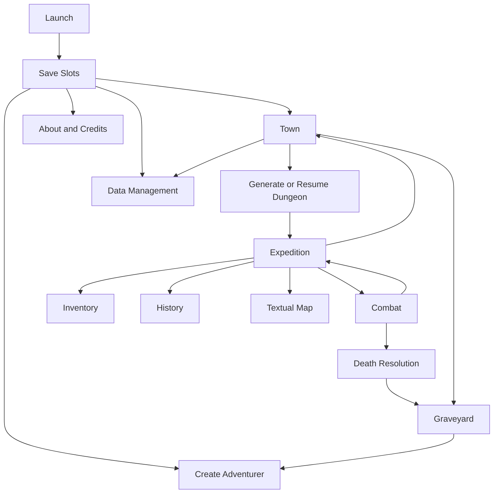

### 7.3 Context ownership

- Save-slot selection is the root administrative context.
- Town and Expedition are mutually exclusive active contexts for a living adventurer.
- Combat is a guarded subcontext of Expedition.
- Inventory and History are contextual views that do not mutate merely by opening.
- Graveyard is slot-scoped and available after the first death.
- Data management always names the selected slot and never implies cloud state.
- Navigation cannot abandon unresolved target, capacity, confirmation, validation, or import-preview decisions without explicit cancellation.

## 8. App Shell and Navigation

### 8.1 Wide desktop

- Header: context title, floor/segment where applicable, and truthful save/offline status.
- Left contextual region: adventurer/resources/equipment or destination navigation.
- Main workspace: map, monsters, inventory, history, or data preview.
- Right contextual region: current object, legal actions, latest result, or rule evidence.
- Footer/status region: concise explanation, safe navigation, and transient status.

### 8.2 Tablet and narrow desktop

- Preserve main workspace priority.
- Collapse the lower-priority side region into a drawer or stacked panel.
- Keep current state and primary legal action visible without requiring horizontal page scrolling.
- A drawer must restore focus to its invoking control.

### 8.3 Mobile

- Use a compact top bar for parent navigation, context title, and utility access.
- Use a bottom destination bar for Explore, Adventurer, Inventory, and History when not obscured by a modal decision.
- Present visual/textual map choice as an inline segmented control.
- Present full-capacity and destructive decisions as labelled bottom sheets or centred dialogs.
- Do not use hover, tiny map-only targets, or gesture-only actions.

### 8.4 Global status hierarchy

1. Blocking persistence, incompatibility, migration, or recovery issue.
2. Active turn, unresolved decision, or destructive confirmation.
3. Low-light, low-HP, capacity, or route warning.
4. Saving/saved/offline-ready status.
5. Informational success feedback.

### 8.5 Focus rules

- Route/screen change: focus the destination heading unless a more specific error or decision requires focus.
- Dialog/sheet: move focus inside, contain it, close on explicit cancel, then restore the invoker.
- Validation: focus the summary or first invalid control; associate messages with fields.
- Committed action: keep focus near the action/result unless the context changed materially.
- Combat turn change: announce turn state without repeatedly stealing focus.
- Visual/textual map switch: focus the equivalent current-position heading.

## 9. Core User Flows

### 9.1 Flow A — First launch and slot selection

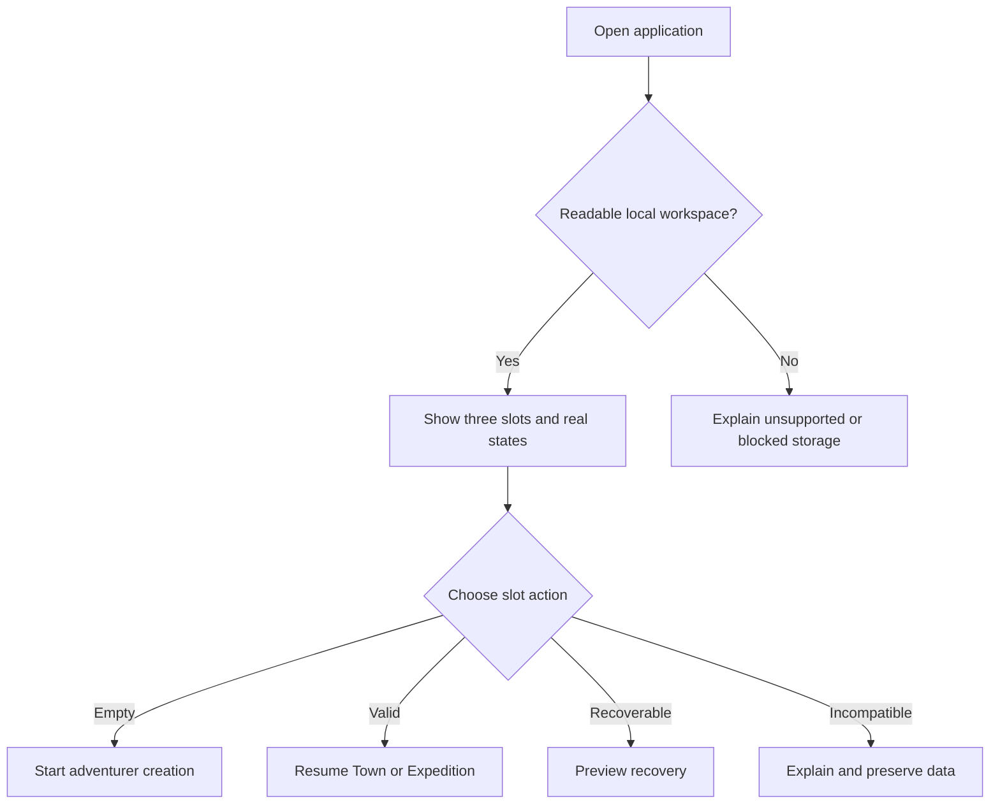

| ID | Requirement | Priority | Acceptance signal |
|---|---|---:|---|
| UX-FLOW-A-001 | Show exactly three independent local slots and their actual state. | Must | Empty, valid, recovery, invalid, and incompatible fixtures are distinguishable. |
| UX-FLOW-A-002 | Explain local-only storage and export risk before or during first use. | Must | Player can locate backup guidance. |
| UX-FLOW-A-003 | One invalid slot must not block other valid slots. | Must | Other slots remain selectable. |

### 9.2 Flow B — Create adventurer

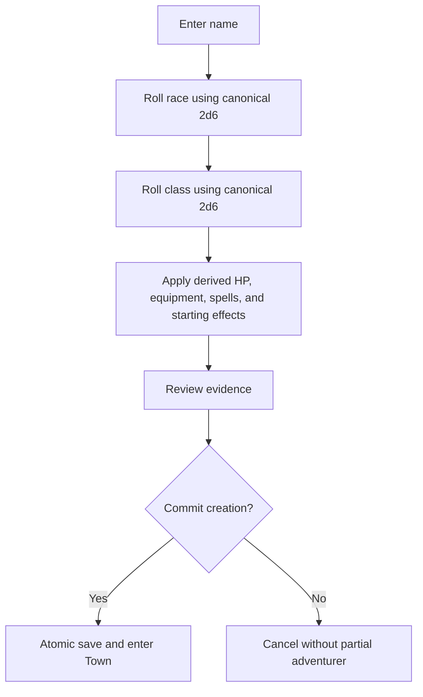

| ID | Requirement | Priority | Acceptance signal |
|---|---|---:|---|
| UX-FLOW-B-001 | Present natural dice, table results, derived HP, equipment, and starting effects. | Must | Creation evidence matches DRS outcome. |
| UX-FLOW-B-002 | Canonical mode must not present a free reroll. | Must | Reload/cancel does not create a different committed result. |
| UX-FLOW-B-003 | Create the complete adventurer and history atomically. | Must | Fault test leaves prior valid state or complete adventurer. |

### 9.3 Flow C — Generate and enter dungeon

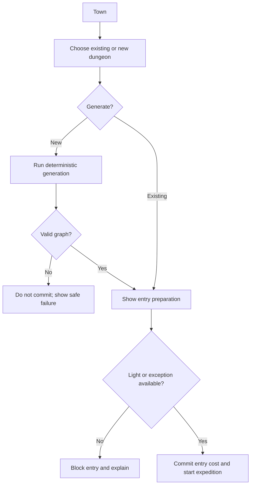

### 9.4 Flow D — Explore and resolve connections

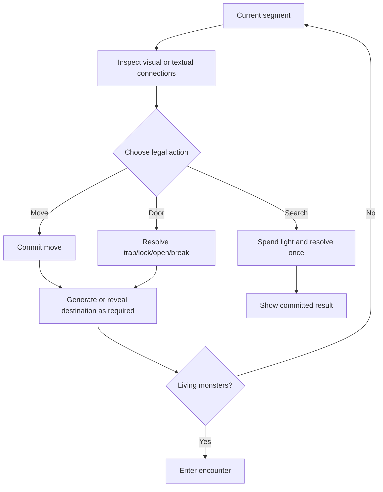

| ID | Requirement | Priority | Acceptance signal |
|---|---|---:|---|
| UX-FLOW-D-001 | Visual and textual maps expose the same connections, states, and legal actions. | Must | Parity fixture passes. |
| UX-FLOW-D-002 | Current position uses text, focus, shape, and semantics rather than colour alone. | Must | Visual and screen-reader checks pass. |
| UX-FLOW-D-003 | Last-light and destructive door actions require clear consequence confirmation. | Must | Cancel causes no mutation. |

### 9.5 Flow E — Resolve combat

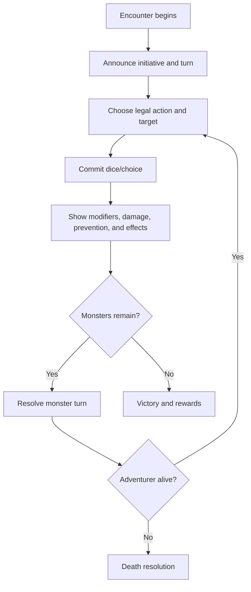

### 9.6 Flow F — Resolve capacity/equipment decision

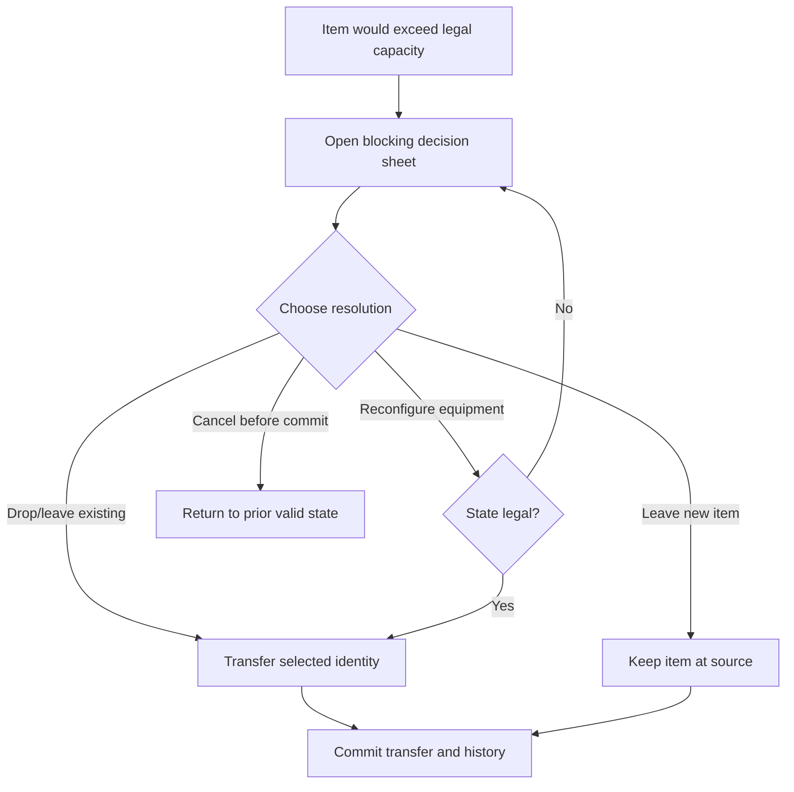

### 9.7 Flow G — Retreat, Town, and re-entry

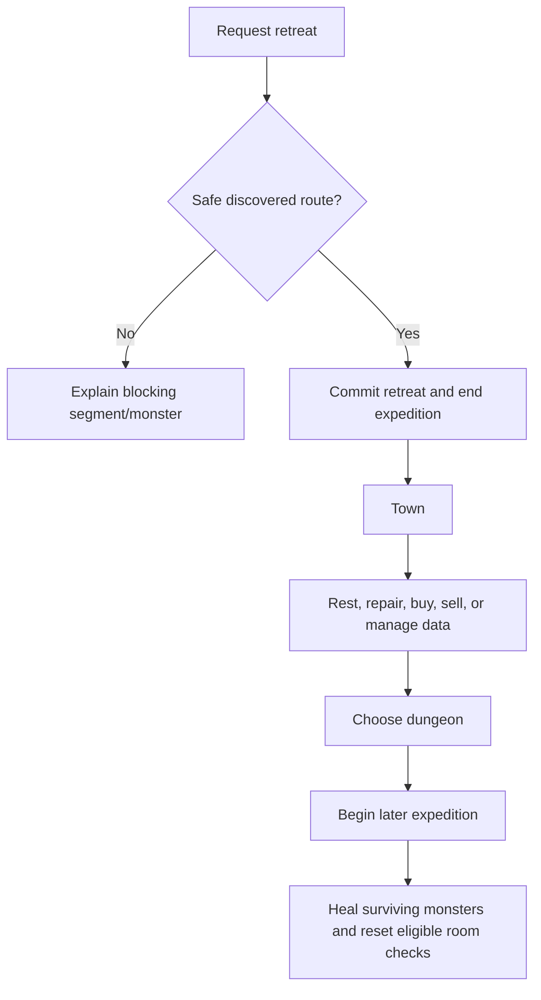

### 9.8 Flow H — Death, replacement, and recovery

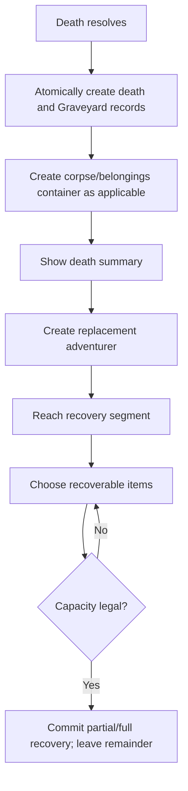

### 9.9 Flow I — Complete dungeon and review history

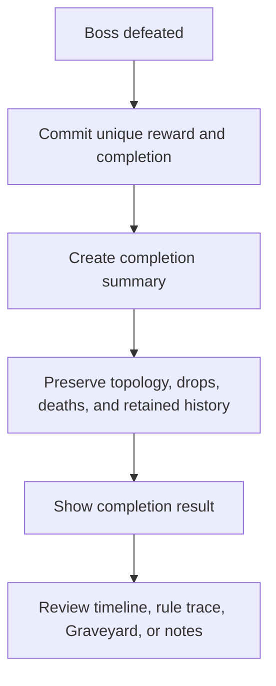

### 9.10 Flow J — Export, import, recovery, and reset

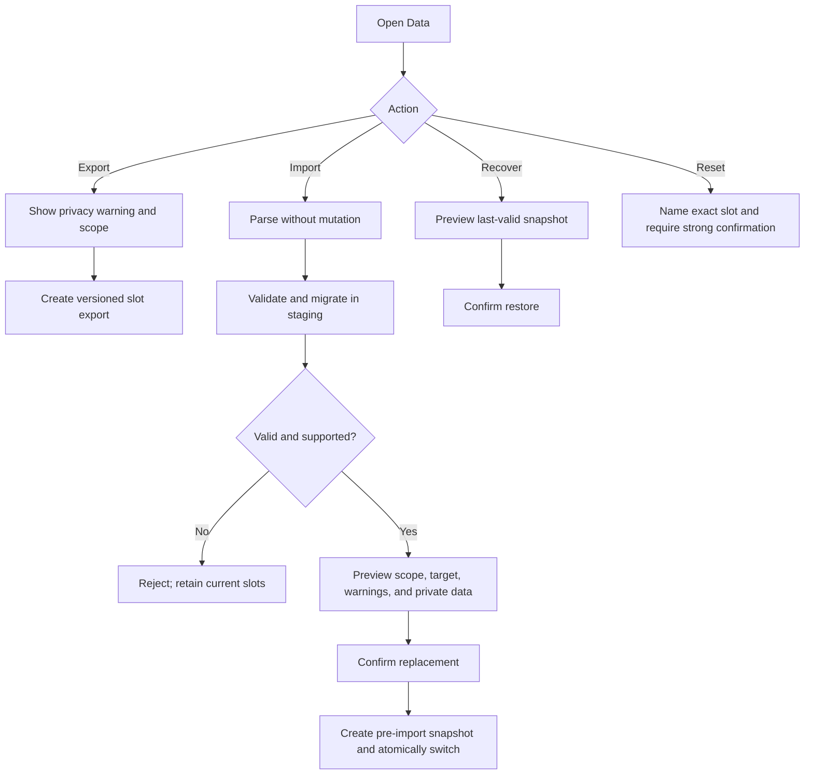

## 10. Screen and Wireframe Requirements

### 10.1 Artifact convention

Each `.wireloom` file must:

- contain one `window` root;
- use Wireloom primitives rather than ASCII imitation;
- model structure and interaction priority, not final styling;
- avoid copyrighted layouts, trade dress, and unapproved artwork;
- use annotations only to explain requirement-critical regions;
- parse and render with the pinned Wireloom version in the accompanying package manifest.

### 10.2 Wireframe catalogue

| ID | Screen/artifact | Source | Primary purpose |
|---|---|---|---|
| WF-UX-001 | First Launch — Desktop | [`01-first-launch-desktop.wireloom`](wireframes/ux-v0.1/01-first-launch-desktop.wireloom) | Three slot states, local data, recovery, import |
| WF-UX-002 | Adventurer Creation — Desktop | [`02-adventurer-creation-desktop.wireloom`](wireframes/ux-v0.1/02-adventurer-creation-desktop.wireloom) | Canonical rolls, evidence, atomic creation |
| WF-UX-003 | Expedition — Desktop | [`03-expedition-desktop.wireloom`](wireframes/ux-v0.1/03-expedition-desktop.wireloom) | Three-region expedition workspace and visual map |
| WF-UX-004 | Expedition — Mobile | [`04-expedition-mobile.wireloom`](wireframes/ux-v0.1/04-expedition-mobile.wireloom) | Compact resources, map/text switch, touch actions |
| WF-UX-005 | Combat — Desktop | [`05-combat-desktop.wireloom`](wireframes/ux-v0.1/05-combat-desktop.wireloom) | Turn, targets, legal actions, evidence |
| WF-UX-006 | Inventory Overflow — Mobile | [`06-inventory-overflow-mobile.wireloom`](wireframes/ux-v0.1/06-inventory-overflow-mobile.wireloom) | Blocking full-capacity decision sheet |
| WF-UX-007 | Town — Desktop | [`07-town-desktop.wireloom`](wireframes/ux-v0.1/07-town-desktop.wireloom) | Transactions, dungeons, backup reminder |
| WF-UX-008 | Death and Recovery — Desktop | [`08-death-recovery-desktop.wireloom`](wireframes/ux-v0.1/08-death-recovery-desktop.wireloom) | Graveyard, belongings, replacement, recovery |
| WF-UX-009 | Save/Import/Recovery — Desktop | [`09-save-import-recovery-desktop.wireloom`](wireframes/ux-v0.1/09-save-import-recovery-desktop.wireloom) | Non-destructive preview and exact target scope |
| WF-UX-010 | Textual Map — Mobile | [`10-textual-map-mobile.wireloom`](wireframes/ux-v0.1/10-textual-map-mobile.wireloom) | Nonvisual-equivalent route and actions |
| WF-UX-011 | History and Rule Trace — Desktop | [`11-history-rule-trace-desktop.wireloom`](wireframes/ux-v0.1/11-history-rule-trace-desktop.wireloom) | Timeline, immutable mechanics, notes boundary |

### 10.3 Required screen states

Every applicable screen defines:

- **Empty:** explains the next legal action.
- **Loading:** visible and programmatically perceivable; does not imply a commit.
- **Success:** announces completion and places focus appropriately.
- **Validation error:** associates error with the relevant control.
- **System error:** explains impact without colour-only or transient feedback.
- **Offline/local-only:** states actual local readiness.
- **Recovery:** returns to a known valid context.
- **Confirmation:** names action, scope, consequence, and recovery/backup where relevant.

## 11. Component Requirements

| ID | Component | Requirement | Priority |
|---|---|---|---:|
| UX-CMP-001 | Save-state indicator | Represent saving, saved, failed, recovery, migrating, incompatible, and offline-ready truthfully. | Must |
| UX-CMP-002 | Slot card | Show slot identity, playable state, last-save context, and only valid actions. | Must |
| UX-CMP-003 | Resource bar | Present HP, armour, light, coins, and hands with text and semantics. | Must |
| UX-CMP-004 | Visual map | Show discovered topology, current position, connection state, and selectable legal destinations. | Must |
| UX-CMP-005 | Textual map | Express current segment, connections, route, occupancy, and equivalent actions in semantic reading order. | Must |
| UX-CMP-006 | Context action panel | List enabled legal actions first and explain disabled guards. | Must |
| UX-CMP-007 | Result card | Show action, natural dice, table/row, modifiers, final value, outcome, and versions where relevant. | Must |
| UX-CMP-008 | Monster card/list | Show target identity, HP, traits/effects, selected state, and action eligibility. | Must |
| UX-CMP-009 | Turn indicator | Announce player/monster turn without repeatedly stealing focus. | Must |
| UX-CMP-010 | Item card | Preserve item identity, location, equipment/hand use, durability/charges, and available actions. | Must |
| UX-CMP-011 | Capacity sheet | Block unsafe continuation until a legal, explicit transfer/leave/drop decision is committed. | Must |
| UX-CMP-012 | Destructive confirmation | Name exact object/scope, consequences, cancel, and recovery/backup. | Must |
| UX-CMP-013 | History timeline | Present concise sequence-ordered events and load retained history without changing mechanics. | Must |
| UX-CMP-014 | Rule trace | Show immutable result evidence and linked state changes. | Must |
| UX-CMP-015 | Player note | Remain visibly separate from mechanical events and support edit/archive rules. | Must |
| UX-CMP-016 | Import preview | Show target, schema, counts, warnings, private-data scope, compatibility, and replacement consequence before mutation. | Must |
| UX-CMP-017 | Recovery preview | Show snapshot time/reason and exact restore scope without implying automatic success. | Must |
| UX-CMP-018 | Status announcement | Use appropriate live-region behaviour for rolls, saves, imports, errors, and context changes. | Must |

## 12. Responsive Behaviour

### 12.1 Design targets

| Width | Mode | Expected composition |
|---:|---|---|
| 1440 | Wide desktop | Persistent state + main workspace + action/detail region |
| 1280 | Desktop | Same hierarchy with reduced gutters |
| 1024 | Narrow desktop/tablet landscape | Main workspace plus one persistent side region; other content drawer/stack |
| 768 | Tablet portrait | Stacked panels; sticky compact resources/action access |
| 390 | Phone | Single-column task flow, segmented map mode, bottom navigation/sheets |
| 360 | Minimum phone | Same complete capability with tighter labels and wrapping |

### 12.2 Transformation rules

- Reflow may move regions but cannot remove required state or actions.
- No required control depends on hover.
- Dialogs and sheets fit the viewport and keep close/confirm reachable.
- Tables use cards, reduced columns, or labelled horizontal scrolling.
- Long names, events, errors, and notices wrap without overlap.
- Visual maps may reduce detail but not topology truth or current-position clarity.
- Textual map is always available during map-dependent play.
- Touch targets meet the approved accessibility baseline.
- The primary legal action remains reachable without obscuring current state.

## 13. Accessibility Requirements

The target baseline is WCAG 2.2 AA. Detailed conformance and browser/assistive-technology evidence belong to the NFR and Test Plan, but the UX must make conformance structurally possible.

| ID | Requirement | Acceptance method |
|---|---|---|
| UX-A11Y-001 | All controls and core flows are keyboard operable. | Full keyboard walkthrough |
| UX-A11Y-002 | Focus order follows visual and task order. | Desktop/mobile review |
| UX-A11Y-003 | Focus is visible and not obscured by sticky content. | WCAG focus review |
| UX-A11Y-004 | Dialog/sheet focus is contained and restored. | Component/manual test |
| UX-A11Y-005 | Inputs have labels; errors are programmatically associated. | Automated/manual check |
| UX-A11Y-006 | Headings, landmarks, lists, and status regions describe structure. | Screen-reader review |
| UX-A11Y-007 | Colour is never the sole indicator of position, status, target, warning, or result. | Visual inspection |
| UX-A11Y-008 | Visual and textual maps expose equivalent required information/actions. | Parity test |
| UX-A11Y-009 | Dynamic roll, turn, save, import, migration, recovery, and error states are announced appropriately. | NVDA/VoiceOver/TalkBack smoke tests |
| UX-A11Y-010 | Reduced-motion preferences are respected; required meaning does not depend on animation. | Browser preference test |
| UX-A11Y-011 | Text scaling/reflow preserves content and controls. | 200% zoom/reflow check |
| UX-A11Y-012 | Touch targets and spacing support phone use. | Mobile inspection |
| UX-A11Y-013 | Dice/table evidence has a readable text representation. | Screen-reader/manual check |
| UX-A11Y-014 | Status messages do not steal focus unnecessarily. | Assistive-technology review |

### 13.1 Announcement matrix

| Event | Announcement expectation |
|---|---|
| Roll/table result committed | Concise result; detail remains available |
| Turn changes | New turn and immediate required action |
| HP/armour/light materially changes | Changed value and warning when threshold/consequence applies |
| Move completes | New segment, occupancy, and available connections |
| Save completes | Polite concise status; no focus theft |
| Save fails | Assertive error, data impact, blocked continuation, recovery action |
| Import validation completes | Valid/invalid result, target, and warnings |
| Dialog opens/closes | Labelled context; focus moves/restores correctly |
| Death/completion | Assertive major-context result and next action |

## 14. Empty, Loading, Error, Confirmation, and Recovery States

| Context | Empty | Loading | Error | Recovery |
|---|---|---|---|---|
| Save slot | Explain start/import | Read/validate slot | Invalid/incompatible isolated | Last valid, export, or other slot |
| Adventurer creation | Prompt for name/start | Roll/derive pending | Definition/save failure | Prior slot state retained |
| Dungeon generation | Explain generate/resume | Deterministic generation | Invalid graph/content | No commit; retry only through approved safe path |
| Expedition | Current segment | Committed action pending display | Save/map/content failure | Block unsafe mutation; textual map/retry/recovery |
| Combat | No active encounter | Action resolving | Illegal target/save failure | Prior committed turn state |
| Inventory | No items | Records loading | Missing identity/illegal transfer | Preserve authoritative location |
| History | No events yet | Retained page loading | View unavailable | Gameplay remains usable; retry |
| Import | Select package | Parse/validate/migrate staging | Malformed/newer/invalid | Existing slots unchanged |
| Recovery | No valid snapshot | Validate snapshot | Snapshot invalid | Preserve records; explain export/manual support |

### 14.1 Destructive-action checklist

- Name the exact object and slot/dungeon/item scope.
- State immediate and persistent consequences in plain language.
- Make primary and cancel actions semantically distinct.
- Cancel applies no mutation and restores focus.
- Irreversible actions require stronger confirmation.
- Show recovery or backup guidance where relevant.
- Prevent duplicate submission.

### 14.2 Save failure

When a state-changing commit fails:

1. Do not announce success.
2. Keep or restore the prior known-valid state.
3. Block further unsafe mutation.
4. Explain whether retry, recovery, export, safe exit, or another slot is available.
5. Keep private data out of generic diagnostics.

### 14.3 Transient workflow policy

- Committed mechanical state always resumes exactly.
- Uncommitted name/form text may resume only when architecture stores it safely and clearly labels it as uncommitted.
- Target, capacity, destructive, and import decisions may return to the last committed context after termination unless exact safe staging is approved.
- Restoration must never duplicate a commit, consume another random value, or bypass validation.

## 15. Content and Licensing UX

1. Use original concise application copy and paraphrased explanations by default.
2. Do not imitate official rulebook layout, character sheet, trade dress, icons, or artwork.
3. Exact source prose or art appears only with item-specific permission and approval.
4. Palace placeholder assets must be rights-safe, replaceable, and nonessential to understanding.
5. Bundled, imported, project-original, and user-authored material is distinguishable where relevant.
6. Unknown, blocked, or restricted content is not playable in release builds.
7. About/Credits exposes creator/title, permission/licence, third-party software/assets, attribution, and unofficial-product notices.
8. Player notes are not styled as official rule text or mechanical history.
9. Rule traces prefer stable IDs, concise names, structured parameters, and original explanations rather than copied paragraphs.
10. Voluntary feedback does not automatically attach private data.
11. The Core MVP is English-only and fully usable without payment, subscription, ads, or paid unlock.

## 16. Traceability

| UX area | Functional requirements | Rules/data impact | Future evidence |
|---|---|---|---|
| First launch/slots | APP-001–014; SAV-001–024; ERR-001–006, 009–011 | SaveSlot, snapshots, DRS validation/history | AT-APP, AT-SAV, AT-ERR |
| Adventurer creation | ADV-001–016; XFR-SAVE | DRS-DICE/ADV; Adventurer, charges, items, rolls | AT-ADV |
| Dungeon entry | DUN-001–019; EXP entry | DRS-DUN/DICE/PER; dungeon graph, expedition, streams | AT-DUN, simulation |
| Exploration | EXP-001–021 | DRS-DOOR/EXP; segments, connections, events | AT-EXP |
| Combat | CMB-001–023 | DRS-CMB/SPELL/ITEM; encounters, monsters, effects | AT-CMB |
| Inventory | INV-001–023 | DRS-ITEM/PER; item identity/location/recovery | AT-INV |
| Town | TWN-001–016 | DRS-PER/ITEM/SPELL; expedition transitions | AT-TWN |
| Death/recovery | DTH-001–015 | DRS-PER/HIST; death, Graveyard, containers | AT-DTH |
| History | HIS-001–015 | DRS-HIST; events, rolls, summaries, notes | AT-HIS |
| Import/export | SAV-001–024; ERR-002–006 | manifests, reports, migrations, snapshots | AT-SAV/fault tests |
| Responsive/accessibility | UXA-001–020; XFR responsive/accessibility | UI references only; domain truth unchanged | AT-UXA/browser-AT matrix |
| Content/legal | CNT-001–014 | packages, definitions, provenance | AT-CNT/licensing inventory |

## 17. UX Acceptance Criteria

- [ ] Every primary destination has a purpose, entry/exit, required content, and state behaviour.
- [ ] Every core journey has a normal path, guards, cancellation, and recovery.
- [ ] The screen set covers first launch through Palace completion, death/recovery, and local-data protection.
- [ ] Visual and textual maps expose equivalent required actions.
- [ ] Desktop, tablet, and phone transformations preserve state and action access.
- [ ] Keyboard, focus, labels, announcements, non-colour cues, reduced motion, and text scaling are specified.
- [ ] Save, migration, import, incompatibility, quota, update, and map failures have truthful recovery behaviour.
- [ ] Destructive actions identify scope, consequences, backup/recovery, and safe cancel.
- [ ] Mechanical results remain traceable without enabling rerolls.
- [ ] Player notes remain separate from immutable history.
- [ ] No unapproved official art, copied layout, screenshots, icons, character-sheet design, or trade dress is required.
- [ ] All Wireloom sources parse and render with Wireloom 0.7.0.
- [ ] Product, UX/accessibility, technical, rules, QA, and content reviewers can identify their approval scope.

The Palace prototype should use this specification to evaluate unaided completion, current-state understanding, next-action understanding, visual/text map usability, phone viability, save/recovery comprehension, keyboard completion, and representative assistive-technology completion. Formal scripts and evidence belong to the Test Plan.

## 18. Open Questions

No unresolved product or rules decision blocks approval of this UX structure.

| ID | Question | Owner | Decision point | Status |
|---|---|---|---|---|
| OQ-UX-001 | Which final labels/icons best communicate destinations after Palace testing? | UX / Accessibility | Palace review | Open; non-blocking |
| OQ-UX-002 | Does mobile combat retain bottom navigation or use a more guarded shell? | UX / Rules / QA | Interactive prototype | Open; non-blocking |
| OQ-UX-003 | Which uncommitted form state survives termination? | UX / Technical | Architecture | Open; downstream |
| OQ-UX-004 | Is export presented as JSON or a versioned archive? | Product / UX / Technical | Architecture/NFR | Open; downstream |
| OQ-UX-005 | What final character/length rules apply to slot names, adventurer names, and notes? | UX / Accessibility / Technical | UX/NFR | Open; non-blocking |
| OQ-UX-006 | Are archived player notes retained indefinitely or cleaned through a confirmed setting? | Product / UX / Privacy | UX/NFR | Open; non-blocking |
| OQ-UX-007 | What exact browser/AT combinations form the release matrix? | Accessibility / QA | NFR/Test Plan | Open; downstream |
| OQ-UX-008 | What quota and compaction warnings are useful and non-alarming? | Product / UX / Technical | NFR | Open; downstream |
| OQ-UX-009 | Which privacy-safe diagnostic fields may be exposed voluntarily? | Product / Privacy / Technical | NFR/Operations | Open; downstream |
| OQ-UX-010 | Which final copy, notices, placeholders, and assets are approved? | Content / Licensing | Content gate | In progress |
| OQ-UX-011 | Which final design tokens, map symbols, and motion patterns pass accessibility and Palace testing? | Visual Design / Accessibility | Post-Palace plan | Open; deferred |
| OQ-UX-012 | Which Wireloom layouts require revision after representative playtests? | UX / Product | Palace evidence | Open; future evidence |

## 19. Approval

| Role | Name | Decision | Date | Notes |
|---|---|---|---|---|
| Product Owner |  | Pending / Approved / Rejected |  |  |
| UX / Accessibility Lead |  | Pending / Approved / Rejected |  |  |
| Technical Lead |  | Pending / Approved / Rejected |  |  |
| Rules / Product Designer |  | Pending / Approved / Rejected |  |  |
| QA Reviewer |  | Pending / Approved / Rejected |  |  |
| Content / Licensing Reviewer |  | Pending / Approved / Rejected |  |  |
