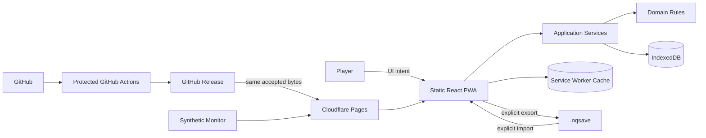
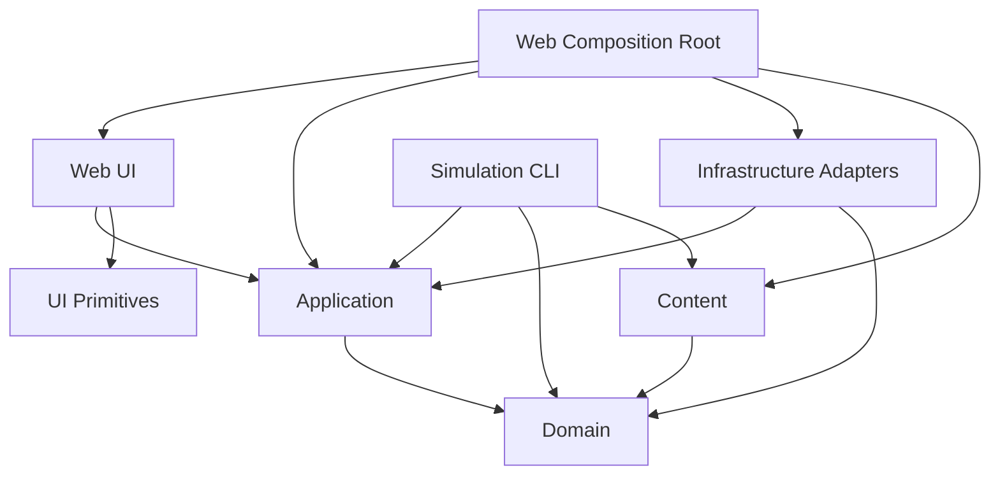
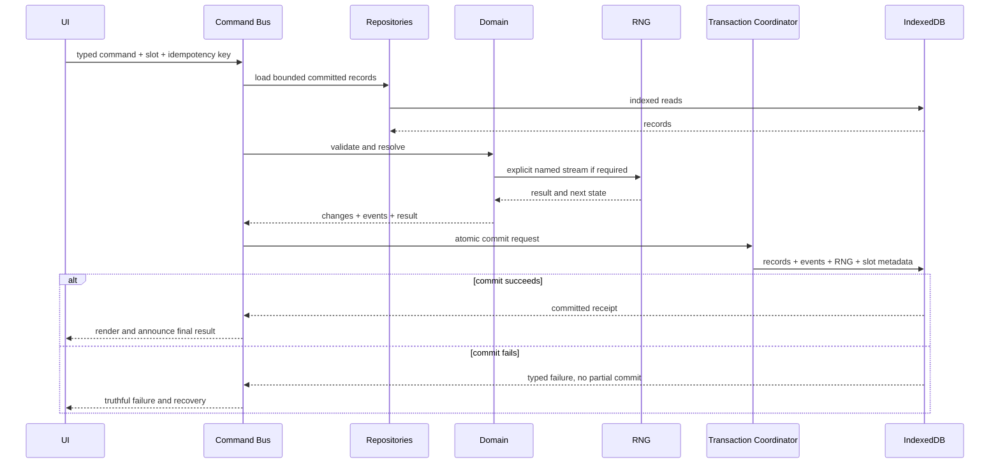
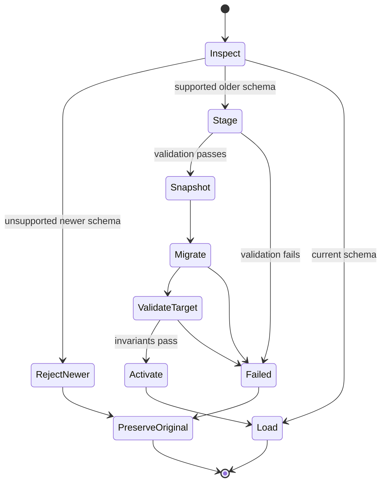
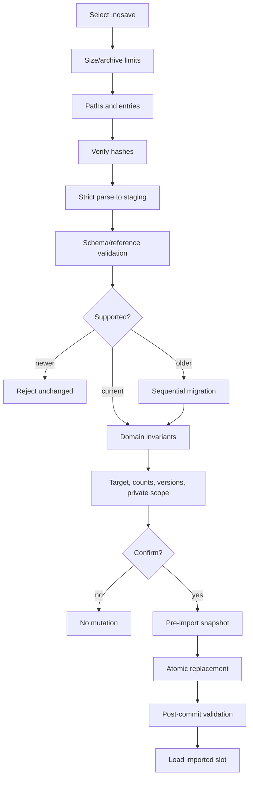
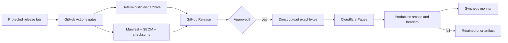
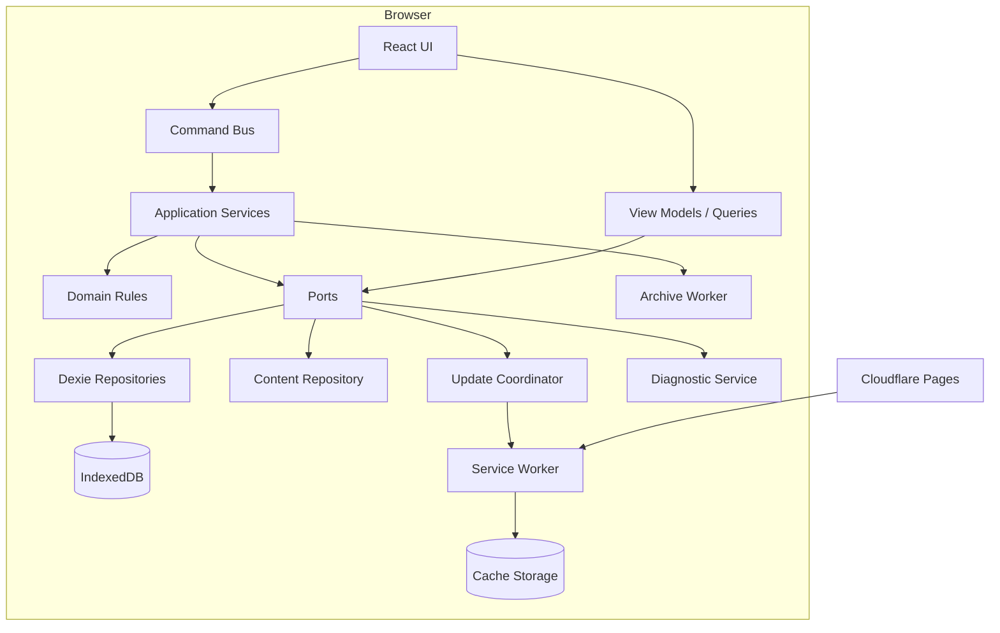
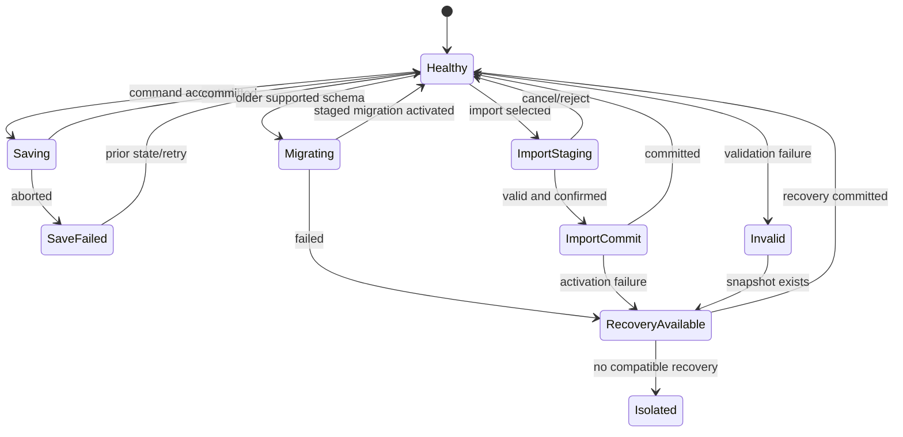

# Web Architecture, Offline Strategy and Hosting Plan

## NoteQuest Web Application — Palace Prototype and Core MVP

*Version 0.1 | Draft for Review | Prepared for the NoteQuest Project*

| Field | Value |
|---|---|
| Document owner | Technical Lead / Architect |
| Product owner | Product Owner |
| Related documents | [Business Requirements Document v0.1](business-requirements-v0.1.md); [MVP Scope v0.1](mvp-scope-v0.1.md); [Product Requirements Document v0.1](product-requirements-v0.1.md); [Functional Requirements Document v0.1](functional-requirements-v0.1.md); [Digital Rules Specification v0.1](digital-rules-specification-v0.1.md); [Data Model / Domain Model Specification v0.1](data-domain-model-v0.1.md); [UX Flow / Wireframe Requirements v0.1](ux-flow-wireframe-requirements-v0.1.md); [Non-Functional Requirements v0.1](non-functional-requirements-v0.1.md); [Content & Licensing Requirements v0.1](content-licensing-requirements-v0.1.md); [Acceptance Criteria / Test Plan v0.1](acceptance-criteria-test-plan-v0.1.md); [Implementation and Release Decision Register v0.3](implementation-release-decision-register-v0.3.md) |
| Product scope | Production-intent Palace prototype and complete six-dungeon Core MVP |
| Status | Draft for review; approved decision-register rulings are binding, while implementation details introduced here become normative when this document is approved |
| Last updated | 2026-07-17 |
| Architecture style | Static local-first PWA with dependency-directed layers and no backend dependency for Core MVP play |
| Primary stack | Strict TypeScript, React, Vite, npm, Dexie, Workbox |
| Primary testing stack | Vitest, React Testing Library, Playwright, axe-core, fast-check, Stryker |
| Hosting baseline | Cloudflare Pages through protected GitHub Actions direct deployment |

---

## Contents

1. [Purpose](#1-purpose)
2. [Source Hierarchy and Authority](#2-source-hierarchy-and-authority)
3. [Scope, Goals, and Non-Goals](#3-scope-goals-and-non-goals)
4. [Architecture Principles](#4-architecture-principles)
5. [System Context](#5-system-context)
6. [Technology Baseline](#6-technology-baseline)
7. [Repository and Package Structure](#7-repository-and-package-structure)
8. [Dependency Rules](#8-dependency-rules)
9. [Runtime Components](#9-runtime-components)
10. [Command, State, and Concurrency Model](#10-command-state-and-concurrency-model)
11. [Routing and Navigation](#11-routing-and-navigation)
12. [Content Package Architecture](#12-content-package-architecture)
13. [Physical IndexedDB Architecture](#13-physical-indexeddb-architecture)
14. [Atomic Persistence](#14-atomic-persistence)
15. [Snapshots, Recovery, Retention, and Quota](#15-snapshots-recovery-retention-and-quota)
16. [Migration and Staging](#16-migration-and-staging)
17. [Deterministic Randomness](#17-deterministic-randomness)
18. [Canonical Serialisation, Hashing, Export, and Import](#18-canonical-serialisation-hashing-export-and-import)
19. [PWA and Service-Worker Architecture](#19-pwa-and-service-worker-architecture)
20. [Offline and Capability Handling](#20-offline-and-capability-handling)
21. [Security Architecture](#21-security-architecture)
22. [Privacy and Diagnostics](#22-privacy-and-diagnostics)
23. [Performance and Resource Architecture](#23-performance-and-resource-architecture)
24. [Accessibility and Responsive Architecture](#24-accessibility-and-responsive-architecture)
25. [Error and Recovery Architecture](#25-error-and-recovery-architecture)
26. [Testing and Simulation Architecture](#26-testing-and-simulation-architecture)
27. [CI and Supply-Chain Architecture](#27-ci-and-supply-chain-architecture)
28. [Hosting and Deployment](#28-hosting-and-deployment)
29. [Monitoring, Operations, and Rollback](#29-monitoring-operations-and-rollback)
30. [Release Artifact and Versioning Model](#30-release-artifact-and-versioning-model)
31. [Architecture Diagrams](#31-architecture-diagrams)
32. [Traceability](#32-traceability)
33. [Implementation Sequence and Spikes](#33-implementation-sequence-and-spikes)
34. [Risks and Controls](#34-risks-and-controls)
35. [Acceptance Criteria](#35-acceptance-criteria)
36. [Open Implementation Details](#36-open-implementation-details)
37. [Approval](#37-approval)

---

## 1. Purpose

This document defines the production-intent technical architecture for the NoteQuest web application. It converts the approved product, rules, data, UX, quality, content, testing, and implementation decisions into a coherent design that can be implemented without introducing a second source of mechanical truth or weakening any approved release gate.

It defines:

- package and dependency boundaries;
- command execution and authoritative-state rules;
- the physical IndexedDB schema and transaction model;
- deterministic RNG, canonical serialisation, export, and import;
- PWA caching, offline readiness, and safe updates;
- security, privacy, accessibility, and performance controls;
- testing, simulation, CI, deployment, monitoring, and rollback;
- implementation sequence, spikes, and acceptance evidence.

It does not:

- redefine game rules, probabilities, legal actions, or timing;
- approve a backend, accounts, cloud saves, telemetry, monetisation, localisation, or multiplayer;
- replace the executable Test Plan, content manifests, operating runbooks, or release evidence;
- authorise final production-art spending before the written Palace go decision;
- broaden any source-prose, artwork, branding, or licensing permission.

### 1.1 Requirement language

- **Shall** and **Must** are mandatory.
- **Should** requires a documented reason and review to vary.
- **May** is permitted within the approved constraints.
- An `ARC-*` identifier becomes normative when this document is approved.
- A later approved decision-register ruling overrides this document where they conflict.

---

## 2. Source Hierarchy and Authority

When documents appear to conflict, apply this order:

1. Later approved decision-register ruling.
2. [Digital Rules Specification](digital-rules-specification-v0.1.md) for mechanics, timing, legal actions, random behaviour, and rule evidence.
3. Functional Requirements for observable behaviour.
4. Data Model for durable identity, ownership, relations, history, migration, import, and recovery.
5. UX specification for navigation, focus, announcements, responsive transformation, and equivalent actions.
6. [Non-Functional Requirements](non-functional-requirements-v0.1.md) for measurable quality thresholds.
7. [Content & Licensing Requirements](content-licensing-requirements-v0.1.md) for provenance, rights, notices, and release eligibility.
8. [Acceptance Criteria / Test Plan](acceptance-criteria-test-plan-v0.1.md) for evidence and gates.
9. This architecture for technical realisation.
10. Source code and configuration.

Code or configuration that conflicts with an approved upstream requirement is a defect, not an implicit amendment.

### 2.1 Binding v0.3 decisions

This architecture incorporates all approved `IRD-ARCH-*`, `IRD-DATA-*`, `IRD-RNG-*`, `IRD-SER-*`, `IRD-EXP-*`, `IRD-TEST-*`, `IRD-SIM-*`, `IRD-UX-*`, `IRD-OPS-*`, and applicable `IRD-CONT-*` and `IRD-REL-*` rulings.

The architecture may not reopen:

- strict TypeScript, React, and Vite;
- static assets only for Core MVP;
- dependency-directed layers;
- committed domain state as mechanical truth;
- Dexie over IndexedDB;
- the approved seven-store physical partition;
- non-event-sourced authoritative state;
- action-level atomicity;
- PCG32 with versioned `BigInt` state;
- RFC 8785 canonical JSON semantics and SHA-256;
- `.nqsave` ZIP exports;
- Workbox `injectManifest`;
- npm with committed lockfile and reproducible `npm ci`;
- Cloudflare Pages direct deployment from protected GitHub Actions;
- no backend, Pages Functions, hidden telemetry, or remote gameplay dependency.

---

## 3. Scope, Goals, and Non-Goals

### 3.1 Goals

| ID | Goal |
|---|---|
| ARC-GOAL-001 | Preserve approved mechanics across UI, reload, browser restart, export/import, migration, update, and rollback. |
| ARC-GOAL-002 | Keep ordinary Core MVP play entirely local after offline readiness. |
| ARC-GOAL-003 | Prevent UI, routing, storage, service-worker, or hosting code from becoming mechanical authority. |
| ARC-GOAL-004 | Commit each state-changing action exactly once with its random state and immutable evidence. |
| ARC-GOAL-005 | Isolate invalid slots, failed imports, failed migrations, and failed updates without damaging valid state. |
| ARC-GOAL-006 | Run the same rules and generation packages in browser tests and a Node simulation CLI. |
| ARC-GOAL-007 | Meet the approved browser, phone, accessibility, performance, reliability, privacy, and content gates. |
| ARC-GOAL-008 | Produce immutable, traceable, rights-safe release artifacts that can be rolled back without changing local saves. |
| ARC-GOAL-009 | Separate project code, authorised content, third-party dependencies, and user-created data. |

### 3.2 In scope

- Palace and six-dungeon Core MVP architecture.
- Browser-tab and installed-PWA operation.
- IndexedDB persistence, migration, export/import, history, recovery, and diagnostics.
- Static content packages and manifests.
- Browser and Node execution of shared domain logic.
- Build, test, deployment, monitoring, and rollback design.
- Cloudflare Pages static hosting.
- GitHub Actions protected release automation.

### 3.3 Non-goals

- Backend services, accounts, cloud synchronisation, or sharing.
- Server-authoritative validation or anti-cheat.
- Server-side rendering or Pages Functions.
- Runtime remote configuration or required remote content.
- Executable imports, plugins, mods, or user-authored scripts.
- Native packaging.
- Payments, advertising, subscriptions, or analytics.
- Production source maps served publicly.

---

## 4. Architecture Principles

| ID | Principle | Required consequence |
|---|---|---|
| ARC-PRIN-001 | Domain truth is independent of presentation. | Domain imports no React, DOM, IndexedDB, routing, service-worker, network, or visual-layout code. |
| ARC-PRIN-002 | One command, one validated outcome, one atomic commit. | Duplicate submissions cannot duplicate mutations or random consumption. |
| ARC-PRIN-003 | Persist before presenting resolved outcomes. | Final dice, generation, sales, death, and rewards are announced only after durable commit. |
| ARC-PRIN-004 | Current records are authoritative; events explain. | A valid save does not require full event replay. |
| ARC-PRIN-005 | Stable IDs outrank labels, coordinates, and array positions. | Durable references remain valid across presentation changes. |
| ARC-PRIN-006 | Failure is explicit and non-destructive. | Invalid or incompatible state never triggers silent reset or partial activation. |
| ARC-PRIN-007 | Offline is ordinary operation. | Core workflows do not depend on network after readiness. |
| ARC-PRIN-008 | Version everything that affects durable meaning. | Schema, rules, content, RNG, migrations, export format, and releases are explicit. |
| ARC-PRIN-009 | Accessibility is structural. | Focus, announcements, textual-map equivalence, and reduced motion are architecture concerns. |
| ARC-PRIN-010 | Privacy is enforced by absence and allowlists. | No tracker or arbitrary diagnostic dump exists. |
| ARC-PRIN-011 | Rights status is build data. | Unknown, blocked, expired, incompatible, or unapproved bundled items fail the build. |
| ARC-PRIN-012 | Deploy reviewed bytes. | Production deployment and rollback use accepted artifacts, not a later rebuild. |

---

## 5. System Context

### 5.1 Actors and systems

| Actor or system | Relationship |
|---|---|
| Player | Uses the browser/PWA and controls local exports/imports. |
| Product Owner | Approves scope, gates, releases, and operational ownership. |
| Technical/Operations Owner | Controls protected deployment, monitoring, rollback, and emergency access. |
| QA and specialist reviewers | Produce browser, accessibility, security, privacy, content, performance, and release evidence. |
| GitHub repository | Stores source, public docs, workflows, release summaries, manifests, and public evidence. |
| GitHub Actions | Builds, validates, and deploys artifacts from reviewed refs. |
| GitHub Releases | Retains accepted artifacts, checksums, SBOMs, manifests, and release notes. |
| Cloudflare Pages | Serves static release bytes over HTTPS. |
| Synthetic monitor | Checks only shell and approved static assets. |
| Private evidence store | Holds controlled rights, participant, video, and specialist evidence. |

### 5.2 Gameplay data-flow boundary

Ordinary play writes only to:

- in-memory application state;
- IndexedDB;
- Cache Storage;
- browser-managed PWA metadata;
- a user-selected export file.

Ordinary play shall not transmit save records, names, notes, dice/history, Graveyard details, dungeon state, inventory, seeds, imports, exports, or diagnostics.



---

## 6. Technology Baseline

### 6.1 Runtime and build

| Area | Selection | Constraint |
|---|---|---|
| Language | Strict TypeScript | No unchecked mechanical `any`; strict compiler settings. |
| UI | React | Presentation and interaction only. |
| Build | Vite | Static output; no SSR runtime. |
| Package manager | npm | Committed lockfile and `npm ci`. |
| Persistence | Dexie over IndexedDB | Access only through project repositories and transactions. |
| PWA | Workbox custom service worker with `injectManifest` | Versioned precache and controlled activation. |
| Hashing | SHA-256 | Compatible browser and Node implementations. |
| Canonical JSON | Project adapter implementing RFC 8785 semantics | One conformance-tested boundary. |
| Routing | Client router behind a project route adapter | Routing never owns mechanical state. |

### 6.2 Testing and quality tools

- Vitest for unit and integration tests.
- React Testing Library for component behaviour.
- Playwright for browser, E2E, responsive, and PWA tests.
- axe-core for automated accessibility checks.
- fast-check for property and state-machine tests.
- Stryker for mutation testing of critical modules.
- CodeQL, OSV scanning, Dependabot, Gitleaks, CycloneDX SBOM, and licence policy.
- Existing Wireloom 0.7.0 validation for wireframes.

### 6.3 Version pinning

`ARC-TECH-001` — The initial scaffold shall record:

- Node.js LTS range and one reproducible CI version;
- npm expectations and lockfile version;
- Playwright browser versions;
- Workbox, Dexie, React, Vite, and archive-library versions;
- GitHub Actions pinned by immutable commit SHA;
- an architecture-impact note for major upgrades.

The reviewed lockfile, not this prose, supplies exact package versions.

---

## 7. Repository and Package Structure

Use npm workspaces so dependency boundaries are visible and enforceable.

```text
/
├─ apps/
│  └─ web/
│     ├─ src/
│     │  ├─ shell/
│     │  ├─ routes/
│     │  ├─ pages/
│     │  ├─ components/
│     │  ├─ accessibility/
│     │  └─ main.tsx
│     ├─ public/
│     └─ vite.config.ts
├─ packages/
│  ├─ domain/
│  ├─ application/
│  ├─ infrastructure/
│  ├─ content/
│  ├─ ui/
│  └─ test-support/
├─ tools/
│  ├─ simulation/
│  ├─ content-validation/
│  ├─ manifest/
│  └─ release/
├─ tests/
│  ├─ e2e/
│  ├─ browser/
│  ├─ performance/
│  ├─ security/
│  └─ accessibility/
├─ docs/
│  ├─ product/
│  ├─ evidence/
│  └─ operations/
├─ .github/workflows/
├─ package.json
├─ package-lock.json
└─ tsconfig.base.json
```

### 7.1 Structure requirements

| ID | Requirement |
|---|---|
| ARC-REP-001 | Shared packages shall not depend on `apps/web`. |
| ARC-REP-002 | The simulation CLI shall import the same domain, application, content, validation, and RNG implementations used by the web app. |
| ARC-REP-003 | User-facing copy shall be separate from mechanical IDs and formulas. |
| ARC-REP-004 | Content packages shall be independently versioned and validated. |
| ARC-REP-005 | Migrations shall be ordered and reviewable, never hidden in component code. |
| ARC-REP-006 | Public evidence shall remain separate from sensitive evidence. |
| ARC-REP-007 | Code-licence and content/asset-licence boundaries shall be reflected in paths and notices. |

---

## 8. Dependency Rules



### 8.1 Forbidden dependencies

| Source | Must not import |
|---|---|
| Domain | React, DOM, IndexedDB, Dexie, routing, Workbox, network, UI copy, browser globals, test-only code |
| Application | React components, layout, concrete Dexie database, Cloudflare APIs |
| Content definitions | React, persistence adapters, user data, runtime instances |
| UI primitives | Domain mutation internals, concrete database stores, cache internals |
| Simulation | Duplicated rules, browser UI, live network dependencies |
| Service worker | Mechanical mutation logic or direct save-record editing |

### 8.2 Composition root

`apps/web` constructs:

- Dexie database adapter and repositories;
- migration registry;
- content repository;
- PCG32 provider;
- canonical serialiser and hash adapter;
- import/export services;
- command bus and query services;
- diagnostic service;
- update coordinator;
- React shell.

No component constructs its own database, random generator, or command handler.

---

## 9. Runtime Components

| Component | Responsibility | Mechanical authority |
|---|---|---|
| Domain rules | Calculations, guards, invariants, legal actions, transitions | Yes, with DRS |
| Domain entities/value objects | Durable meaning and validation | Yes |
| Command bus | Serialises commands and controls commit lifecycle | Orchestration only |
| Command handlers | Load state, validate, consume explicit RNG, produce change sets/events | Uses domain authority |
| Query services | Build bounded read models | No mutation |
| Repositories | Translate logical records to physical stores | No rules invention |
| Transaction coordinator | Executes approved cross-store atomic commit | No rules invention |
| Migration engine | Sequential staged transformation | Versioned transformations only |
| Content repository | Resolves approved definitions by package/version/ID | Content authority only |
| Import/export service | Creates and validates canonical packages | No activation before confirmation |
| Diagnostic service | Produces allowlisted support data | No gameplay mutation |
| Update coordinator | Controls safe service-worker activation | No game-record edits |
| React UI | Presents state and captures intent | No mechanical authority |
| Service worker | Caches static bytes and manages update lifecycle | Never edits game state |
| Simulation CLI | Runs production rules and content deterministically | Same domain authority |

### 9.1 Action sequence



---

## 10. Command, State, and Concurrency Model

### 10.1 Authoritative state

`ARC-STATE-001` — Authoritative mechanical state is the last validated committed domain state represented by IndexedDB records, slot metadata, rules/content versions, RNG state, and immutable event evidence.

React state may contain route, selection, focus target, dialog state, draft input, progress, and bounded read models. It shall not independently determine HP, coins, torches, equipment, position, doors, dungeon graph, combat results, dice, item ownership, death, recovery, completion, or RNG advancement.

### 10.2 Typed commands

Every state-changing command shall include:

- stable command type and schema version;
- `slotId`;
- target IDs;
- normalised user values;
- expected committed revision;
- idempotency key;
- non-mechanical initiating UI context for focus/error recovery.

### 10.3 Per-slot command queue

`ARC-STATE-002` — Mechanical commands execute through one serial queue per slot.

- Same-slot commands do not commit concurrently.
- Duplicate idempotency keys return the existing pending/committed result.
- Migration, import activation, reset, or recovery obtains an exclusive slot lock.
- A revision mismatch produces a typed stale-command result and does not rerun RNG.

### 10.4 Mechanically blocking workflows

Persisted blocking workflow records identify:

- workflow type/version;
- owning slot and aggregate;
- trigger event;
- legal choices;
- committed costs/results;
- resume context;
- completion command;
- whether cancellation is legal.

The application restores the workflow before accepting conflicting mechanical actions.

---

## 11. Routing and Navigation

Stable destinations include save selection, adventurer creation, town, expedition/current segment, combat, inventory, visual map, textual map, history, Graveyard, data/recovery, settings/accessibility, and About/Credits.

The router is behind a project-owned adapter.

- Palace may use hash routing to guarantee static-host compatibility.
- History routing may be enabled only after the Cloudflare deep-link/fallback spike passes.
- Route values reference stable IDs but never contain complete mechanical state.
- Browser back/forward and refresh shall never repeat a committed command.
- A missing or incompatible routed object resolves to a truthful guarded state.
- Mobile global navigation may open safe supporting views but guards abandonment of unresolved required decisions.
- Focus restoration uses stable control IDs, not DOM position alone.

---

## 12. Content Package Architecture

Definitions are separate from runtime instances. The architecture distinguishes:

- package metadata;
- source transcription;
- project canonical values;
- display copy;
- rules/content version;
- provenance and rights;
- release approval;
- runtime records referencing stable definition IDs.

Recommended package layout:

```text
packages/content/packages/<package-id>/<version>/
├─ package.json
├─ manifest.json
├─ definitions/
├─ copy/en.json
├─ provenance/inventory.json
├─ fixtures/expected-results.json
└─ checksums.sha256
```

A package becomes selectable only when schemas validate, IDs are unique, references resolve, table ranges are complete, DRS fixtures pass, provenance/rights fields are present, approval state is allowed, blocked items are absent, and canonical hashes match.

Existing saves continue to resolve their recorded package version. Missing versions produce explicit compatibility states, never substitution by display name.

---

## 13. Physical IndexedDB Architecture

### 13.1 Database rules

- Stable project-owned database name, separated between production and tests.
- Dexie schema version mapped to explicit application schema version.
- Exactly three stable slot IDs.
- No network, timer, UI prompt, or unrelated asynchronous operation inside a commit transaction.
- Test DB isolation by unique database name or explicit app-owned reset.
- Private/incognito modes receive no untested durability promise.

### 13.2 Stores

#### `workspace`

Application-wide metadata: schema metadata, installed release/content metadata, offline-ready state, pending update metadata, non-sensitive preferences, and maintenance markers.

Primary key: `key`.

#### `slots`

Stable slot metadata, committed revision, compatibility, health, and snapshot pointers.

Primary key: `slotId`.

Required indexes:

- `updatedAt`;
- `status`;
- `[schemaVersion+status]`;
- `[rulesVersion+contentVersion]`.

#### `records`

Normalised slot-owned domain records.

Primary key: `[slotId+recordType+recordId]`.

Required indexes:

- `[slotId+recordType]`;
- `[slotId+ownerType+ownerId]`;
- `[slotId+locationType+locationId]`;
- `[slotId+dungeonId+recordType]`;
- `[slotId+expeditionId+recordType]`;
- `[slotId+updatedAt]`.

Records include adventurers, dungeon graph objects, expeditions, encounters, monsters, items, effects, corpse/drop containers, Graveyard records, notes, blocking workflows, and completion summaries.

#### `events`

Immutable mechanically relevant events.

Primary key: `[slotId+sequence]`.

Required indexes:

- `[slotId+timestamp]`;
- `[slotId+eventType+sequence]`;
- `[slotId+dungeonId+sequence]`;
- `[slotId+expeditionId+sequence]`;
- `[slotId+aggregateType+aggregateId+sequence]`;
- `[slotId+retentionClass+sequence]`.

#### `snapshots`

Protected canonical recovery packages.

Primary key: `[slotId+snapshotClass]`.

Classes: `last-valid`, `pre-migration`, `pre-import`, `pre-reset`.

Indexes: `[slotId+createdAt]`, `[slotId+schemaVersion]`, `[slotId+sourceRevision]`.

#### `contentPackages`

Approved versioned definitions required by releases and durable saves.

Primary key: `[packageId+version]`.

Indexes: `hash`, `approvalStatus`, `installedAt`, `[rulesVersion+schemaCompatibility]`.

#### `staging`

Isolated import, migration, validation, and recovery work before activation.

Primary key: `stageId`.

Indexes: `[targetSlotId+createdAt]`, `stageType`, `status`, `expiresAt`.

Staging is never active state.

### 13.3 Index rule

Ordinary launch, current-segment view, latest history, Graveyard filters, item-location lookup, and commit validation shall use bounded key/index access. A full-store scan in these paths is an architecture defect.

---

## 14. Atomic Persistence

One action-level transaction commits all applicable:

- changed domain records;
- immutable events;
- RNG stream state or stored resolved result;
- slot revision and timestamps;
- snapshot-pointer changes;
- blocking workflow creation/resolution;
- required rules/content/schema references.

### 14.1 Commit phases

1. Load bounded records at a known slot revision.
2. Validate domain invariants and command legality.
3. Resolve explicit named RNG and pure transition.
4. Prepare canonical change set and events.
5. Persist in one Dexie transaction.
6. Verify completion and minimum post-write checks.
7. Publish read-model invalidation and final UI result.
8. Preserve prior state and expose typed failure on abort.

Domain transitions should produce isolated change sets. The UI may show “resolving” or “saving,” but not a final result before durable commit.

Inside the transaction, do not await network, timers, UI prompts, compression workers, or service-worker messages. Do not run unbounded compaction.

A duplicate idempotency key does not consume RNG, append an event, or advance the slot revision.

---

## 15. Snapshots, Recovery, Retention, and Quota

### 15.1 Protected snapshots

| Class | Created | Replacement rule |
|---|---|---|
| `last-valid` | At approved recovery boundaries after validation | Only by a newer fully validated snapshot |
| `pre-migration` | Before activating migration | Only after prior migration is verified |
| `pre-import` | Before confirmed import replacement | Replaced by next validated pre-import snapshot |
| `pre-reset` | Before supported destructive reset | Replaced by next validated pre-reset snapshot |

No unbounded automatic snapshot history is permitted. User exports are independent and never deleted by the application.

### 15.2 Recovery flow

The recovery service inspects without mutation, classifies failure, lists compatible snapshots, shows source revision/reason/scope, validates the selected snapshot, activates it atomically, preserves the failed source where safe, and records recovery without duplicating mechanics.

### 15.3 Retention

- Active/incomplete dungeons retain complete mechanical history.
- Completed dungeons retain a permanent summary and final 500 mechanically relevant events.
- Latest 200 events load by default.
- Notes remain separate and user-controlled.
- Compaction cannot remove Graveyard facts, final outcome evidence, protected snapshots, or records required by current state.

### 15.4 Quota

At 70% estimated usage or below 20 MiB estimated remaining:

- estimate asynchronously;
- warn truthfully without blocking while safe commits remain possible;
- recommend export;
- identify only safe optional cleanup;
- never clean automatically;
- block before resolution when a durable commit cannot reasonably be attempted;
- preserve prior state on quota failure.

---

## 16. Migration and Staging

Each migration records source/target schema versions, migration ID, code version, compatibility, canonical fixture hashes, reversibility, invariant checks, and evidence.

Migrations are sequential. No version may be skipped unless a separately approved direct migration proves equivalence.



Active records are replaced only after all steps complete, target validation passes, content versions resolve, integrity metadata is produced, the pre-migration snapshot is durable, and activation is permitted. Failure leaves the original slot canonical-equivalent.

---

## 17. Deterministic Randomness

Use a project-owned versioned PCG32 implementation with:

- exact unsigned 64-bit arithmetic through JavaScript `BigInt`;
- algorithm ID/version;
- state and stream selector encoded as fixed-width hexadecimal;
- explicit next-state output;
- no `Math.random()` in domain or generation code.

Minimum streams:

- `dungeon-generation`;
- `combat`;
- `expedition-repopulation`.

Additional streams require registered name, purpose, derivation version, and fixtures.

A save has one master seed. Stream derivation must not use current time, locale, device, browser, UI route, display name, or unstable collection order.

Before use, fixed vectors must match in Node and each supported browser family. Retry after aborted commit begins from the prior committed stream state.

An RNG-consuming action records the algorithm/version, stream, natural result, modifiers/final result, linked rules/content versions, and resulting changes.

---

## 18. Canonical Serialisation, Hashing, Export, and Import

### 18.1 Canonical data

Use RFC 8785 JSON Canonicalization Scheme semantics for manifests, snapshots, exported state, and comparison.

Canonical payloads contain no `undefined`, function, symbol, DOM object, class instance, or cycle. `BigInt` values use explicit hexadecimal strings. Timestamps use UTC ISO-8601. Unordered sets are sorted by stable key before canonicalisation.

### 18.2 Hashing

- SHA-256 over UTF-8 canonical bytes.
- Browser uses Web Crypto; Node uses a compatible implementation.
- Hashes detect corruption or unexpected change; they are not encryption or signatures.
- Browser and Node conformance vectors must match.

### 18.3 `.nqsave`

```text
<safe-name>-<date>.nqsave
├─ manifest.json
├─ save.json
└─ checksums.sha256
```

The manifest includes format/application/schema/rules/content/RNG versions, export timestamp, selected slot, entry list, sizes, hashes, privacy-warning ID, and compatibility metadata.

### 18.4 Export

Export validates a consistent committed slot revision, creates canonical data, calculates hashes, assembles the archive, sanitises the filename, shows a private-data warning, and provides explicit download. Export changes no gameplay state.

### 18.5 Import limits

- Maximum input package: 25 MiB.
- Maximum uncompressed parsed data: 100 MiB.
- Enforce entry-count, path, nesting, string-length, and compression-ratio limits.
- Reject absolute/traversal paths, duplicate paths, executable entries, encrypted archives, symlinks, and unsupported required files.
- Imported references cannot request local or network resources.

### 18.6 Import flow



Any failure leaves the target slot unchanged.

---

## 19. PWA and Service-Worker Architecture

Use a custom Workbox service worker through `injectManifest`.

It handles versioned shell/content precache, approved static assets, navigation fallback where configured, update download/waiting, cache cleanup after safe activation, and same-origin offline requests.

It shall not edit IndexedDB saves, resolve rules, consume RNG, send analytics, upload diagnostics, or fetch unapproved runtime code/content.

### 19.1 Logical caches

- `nq-shell-<release-id>`;
- `nq-content-<content-manifest-hash>`;
- `nq-assets-<release-id>`;
- a bounded runtime cache only where reviewed.

The required precache includes HTML, hashed JS/CSS, manifest, icons, offline fallback, approved core content, critical fonts/icons, About/Credits, and required offline notices.

Offline-ready status is set only after required entries are verified.

### 19.2 Safe update lifecycle

1. Current release remains active.
2. New worker installs and waits.
3. App detects the waiting worker.
4. Update coordinator checks command, migration, import, recovery, and blocking-workflow state.
5. User receives a truthful update state.
6. After a successful safe save point, the user explicitly chooses update/reload.
7. A controlled message may trigger `skipWaiting` only for that explicit safe activation, never automatically.
8. Page reloads and verifies release/content/schema compatibility.
9. Old cache remains until activation smoke passes and no active client requires it.

Failure to download or activate leaves the current release usable.

---

## 20. Offline and Capability Handling

Feature-detect IndexedDB transactions, service workers, Cache Storage, storage estimate/persistence where available, Web Crypto, BigInt, workers, file import, and download APIs.

User-agent detection may assist support copy but never replaces capability testing.

### 20.1 Readiness states

- Online, not ready.
- Preparing offline.
- Offline ready.
- Offline active.
- Capability restricted.
- Update waiting.
- Update blocked by unsafe state.
- Update ready for explicit activation.

In private/incognito or restricted environments, perform a real app-owned write/transaction before promising durability. Do not silently fall back to `localStorage` for canonical state.

PWA installation is optional. Lack of install support cannot block normal supported-browser play.

---

## 21. Security Architecture

### 21.1 Threat controls

| Threat | Control |
|---|---|
| XSS through names/notes/imported text | Render as text; no raw HTML; restrictive CSP |
| Malicious `.nqsave` | Data-only parser, limits, path/hash/schema/reference validation, isolated staging |
| ZIP bomb | 25 MiB input, 100 MiB expanded cap, count/nesting/compression limits, worker processing |
| Duplicate/partial action | Per-slot queue, revision guard, idempotency, atomic transaction |
| Reload reroll | Commit RNG/result before presentation |
| Content tampering | Canonical manifests, SHA-256, protected refs, content gate |
| Supply-chain compromise | Lockfile, pinned Actions, CodeQL, OSV, Dependabot, Gitleaks, SBOM, licence gate |
| Credential exposure | Protected secrets, least privilege, no secret in artifact |
| Mixed release/cache | Version compatibility guards and cache namespaces |
| Data leakage through errors/logs | Stable error codes, redacted copy, diagnostic allowlist |
| Tracker introduction | No third-party runtime request; CSP and network tests |
| Unsafe rollback | Exact retained artifact and no save downgrade |

### 21.2 Rendering and execution

- User/imported data renders as text.
- No `dangerouslySetInnerHTML` for user or imported data.
- No `eval`, `new Function`, remote script execution, or runtime code download.
- User notes remain plain text for MVP.

### 21.3 Headers

Repository-owned configuration defines and tests:

- restrictive Content Security Policy including `frame-ancestors`;
- `X-Content-Type-Options: nosniff`;
- restrictive `Referrer-Policy`;
- minimal `Permissions-Policy`;
- HTTPS-only delivery;
- immutable caching for hashed assets and short-lived caching for HTML/manifests/update metadata.

### 21.4 Secrets

No gameplay runtime secret exists. Deployment credentials live only in protected GitHub secret storage, are least privilege, unavailable to untrusted PRs, and never enter artifacts.

---

## 22. Privacy and Diagnostics

No gameplay data leaves the origin automatically. Ordinary play may request only same-origin static resources and explicit external links.

### 22.1 Diagnostic allowlist

Permitted:

- app/build/release ID;
- schema, rules, content, RNG, migration, and export versions;
- browser/OS family and major version;
- viewport/input bucket;
- PWA/offline/update state;
- storage availability and broad quota bands;
- stable error codes and approved stack fingerprints;
- feature/context identifiers;
- mechanically opaque event IDs and invariant counts.

Prohibited by default:

- names and notes;
- event bodies, dice/history, save records;
- dungeon, inventory, Graveyard, corpse, or item details;
- seeds or stream state;
- imports/exports;
- IP address or persistent user ID;
- rights or participant data.

Diagnostic generation requires explicit action, local preview, included/excluded categories, and explicit copy/download. It uploads nothing automatically and changes no gameplay state.

Production console output shall contain no sensitive data or repeated warning loop. No remote crash-reporting or analytics dependency is required.

---

## 23. Performance and Resource Architecture

Architecture shall meet the approved NFR targets, including:

- cold shell p75 ≤2.5 s and p95 ≤4.0 s on reference mobile;
- first legal action p75 ≤4.0 s and p95 ≤6.0 s;
- repeat/offline ready p75 ≤1.5 s and p95 ≤2.5 s;
- local navigation p95 ≤250 ms;
- non-generation rules p95 ≤100 ms and max ≤250 ms;
- full action commit p95 ≤500 ms and max ≤1.5 s;
- generation p95 ≤750 ms and max ≤2.0 s;
- ordinary save p95 ≤500 ms and max ≤1.5 s;
- latest 200 events p95 ≤500 ms;
- 25 MiB import validation/preview p95 ≤8 s with progress after 1 s.

### 23.1 Resource budgets

| Resource | Budget |
|---|---:|
| Initial executable JavaScript | ≤350 KiB compressed |
| Total JavaScript | ≤1.25 MiB compressed |
| Initial CSS | ≤100 KiB compressed |
| HTML + manifest + critical icons | ≤150 KiB |
| Core bundled content | ≤8 MiB compressed, excluding separately approved art/audio |
| Complete first-install offline cache | ≤30 MiB |
| Individual raster image | Prefer ≤250 KiB per delivered viewport |
| Individual font family | ≤200 KiB with system fallback |
| Public production source maps | Not served without controlled-access approval |

### 23.2 Controls

- Route-level code splitting.
- Bounded indexed queries and paginated history.
- Workers for archive and measured long tasks.
- No synchronous full-history processing on launch.
- Derived read models keyed by committed revision.
- CI bundle/cache budgets.
- More than 10% regression against accepted baseline requires investigation.

---

## 24. Accessibility and Responsive Architecture

| ID | Requirement |
|---|---|
| ARC-A11Y-001 | Visual and textual paths use the same semantic state and legal-action model. |
| ARC-A11Y-002 | Visual coordinates are presentation data; graph truth remains domain data. |
| ARC-A11Y-003 | Every visual-map action has keyboard and textual equivalence. |
| ARC-A11Y-004 | Committed results are announced after commit, not speculatively. |
| ARC-A11Y-005 | Focus enters and returns from dialogs, sheets, recovery states, and route changes predictably. |
| ARC-A11Y-006 | Reduced motion changes presentation only. |
| ARC-A11Y-007 | Required actions have visible text labels; icons are supplementary. |
| ARC-A11Y-008 | Errors state impact and recovery in plain language. |
| ARC-A11Y-009 | Responsive reflow changes composition, not mechanics or action availability. |
| ARC-A11Y-010 | Blocking workflows preserve accessible name, scope, choices, focus target, and resume context. |

A central announcement service shall support polite status, assertive error/safety, committed result, save/update state, and route heading categories while deduplicating noise.

The textual map query exposes current segment/floor, occupants, hazards, drops/corpses, connections/doors, entrance route, and legal actions from the same graph and guard services as the visual map.

---

## 25. Error and Recovery Architecture

### 25.1 Error categories

- `VALIDATION`;
- `RULE_GUARD`;
- `STALE_COMMAND`;
- `DUPLICATE_COMMAND`;
- `PERSISTENCE`;
- `QUOTA`;
- `SCHEMA`;
- `MIGRATION`;
- `IMPORT`;
- `EXPORT`;
- `CONTENT`;
- `COMPATIBILITY`;
- `UPDATE`;
- `OFFLINE`;
- `SECURITY`;
- `ACCESSIBILITY_RENDER`;
- `UNKNOWN`.

Each error carries stable code, safe affected scope, whether committed state changed, retry legality, recovery actions, and privacy-safe diagnostic fields.

### 25.2 Failure matrix

| Failure | Required result |
|---|---|
| Validation/guard | No mutation; explain the guard |
| Duplicate submission | At most one commit; no duplicate RNG/event |
| Transaction abort | No partial change; truthful save failure |
| Quota failure | Prior state preserved; export/cleanup guidance |
| Invalid slot | Other slots remain available |
| Unsupported newer schema | Preserve unchanged and explain incompatibility |
| Migration failure | Preserve original and pre-migration snapshot |
| Invalid import | Target unchanged; staging removed/expired |
| Export failure | Gameplay unaffected |
| Missing required content | Block affected load; no substitute |
| Update failure | Current cached release continues |
| Visual map failure | Textual map and legal actions remain |
| Diagnostic failure | Gameplay unaffected |
| Hosting outage after ready | Cached ordinary play continues |

---

## 26. Testing and Simulation Architecture

### 26.1 Test layers

| Layer | Scope |
|---|---|
| Domain unit | Formulas, guards, values, transitions, events |
| Property-based | Invariants across states and command sequences |
| Application integration | Handlers, repositories, transactions, idempotency |
| Persistence/fault | Dexie schema, aborts, quota, snapshots, migrations |
| Content | Schemas, references, tables, provenance, hashes, eligibility |
| Component | Labels, focus, disabled reasons, responsive guards |
| Browser E2E | Workflows, reload, navigation, offline, update, import/export |
| Accessibility | axe plus keyboard, NVDA, VoiceOver, TalkBack, reflow, contrast |
| Performance | Reference profiles, large save, imports, bundles/cache |
| Security/privacy | CSP, headers, XSS, adversarial imports, network/log audit |
| Simulation | 100,000-seed gates and deterministic distributions |
| Release/operations | Artifact, deployment, smoke, monitor, rollback |

### 26.2 Test seams

Project-owned ports shall exist for clock, RNG, repositories, transaction coordinator, quota estimate, content resolver, canonical serialiser/hash, archive reader/writer, update coordinator, diagnostics, route adapter, and announcement service.

### 26.3 Fault injection

Test adapters shall support failures before transaction, after each required write, before completion, after completion before UI receipt, during snapshots, staging, migration, activation, quota, blocked DB, and content-reference validation.

Fault controls must not ship enabled in production.

### 26.4 Simulation CLI

The Node TypeScript CLI imports production domain/content/RNG packages and accepts dungeon type, run count, seed manifest, versions, worker count, and output path.

It emits JSON plus Markdown with versions, seed-manifest hash, counts, invariant failures, termination/reachability, distributions, duration, environment, and reproducible failure trace.

Parallel execution may partition seed manifests, but aggregate output must be independent of worker count and completion order.

Synthetic builders create minimum, typical, large, boundary, prior-schema, malformed, interrupted, unsupported-newer, recovery, compaction, and 25 MiB import fixtures. Real player saves are not default fixtures.

---

## 27. CI and Supply-Chain Architecture

### 27.1 Pull-request checks

- reproducible install;
- formatting/lint and strict typing;
- unit, integration, component, and selected property tests;
- content/manifest validation;
- dependency-boundary checks;
- automated accessibility;
- bundle/cache budgets;
- Gitleaks, vulnerability, and licence gates;
- CodeQL where configured;
- Chromium Palace smoke;
- Wireloom validation for changed wireframes.

### 27.2 Nightly checks

- complete Playwright browser matrix;
- extended property/simulation suites;
- persistence fault subsets;
- performance trends;
- Stryker mutation suite;
- dependency/SBOM validation.

### 27.3 Release-candidate checks

- all required browsers/viewports;
- keyboard and AT matrix;
- full 100,000-seed gate per applicable dungeon;
- at least 1,000 persistence faults;
- 10,000-action endurance;
- import/migration/recovery corpus;
- performance/security/privacy/content gates;
- reproducibility, deployment, smoke, monitoring, and rollback drill.

A flaky-test quarantine requires owner, linked defect, evidence, risk, and expiry within seven days. Release-gate tests remain blocking until reliable or replaced by an approved equivalent.

Each release includes lockfile, dependency inventory, CycloneDX SBOM, licence report, vulnerability/static/secret reports, content manifest, and checksums.

---

## 28. Hosting and Deployment

Cloudflare Pages is the production static host.

Constraints:

- direct upload from protected GitHub Actions;
- no provider-side unreviewed production build;
- no Pages Functions for Core MVP;
- no runtime server dependency;
- domain/DNS ownership and recovery recorded;
- at least two recoverable administrators before public release.

### 28.1 Artifact flow



### 28.2 Environments

| Environment | Purpose | Data |
|---|---|---|
| Local | Development/test | Synthetic or explicit local data |
| PR preview | UI/static review | Synthetic only |
| Palace closed | Controlled external prototype | Rights-safe Palace content/placeholders |
| Release candidate | Full gate evidence | Synthetic and consented UAT only |
| Production | Public Core MVP | User-local data only |

Deployment records include release/tag, commit, artifact hash, content hash, SBOM, versions, Actions run, GitHub Release assets, Cloudflare deployment ID, approvers, smoke result, prior artifact, and limitations.

---

## 29. Monitoring, Operations, and Rollback

Use an external synthetic HTTPS monitor from at least two regions at intervals no slower than five minutes. Check shell, critical assets, manifest/version, HTTPS/headers, and deployment health only.

Target at least 99.5% successful hosted-shell response per month under the NFR exclusions.

Before public release, document unavoidable provider request-log fields, jurisdiction, retention, access, deletion/expiry, and whether they can be reduced. Do not enable Cloudflare Web Analytics for routine product analytics.

### 29.1 Rollback

Retain current and immediately previous accepted artifact/deployment.

1. Declare rollback and record incident/release.
2. Select the retained exact prior artifact.
3. Use provider rollback or redeploy exact retained bytes.
4. Verify artifact/version.
5. Run production smoke.
6. Confirm synthetic monitor.
7. Communicate compatibility limitations.
8. Do not modify, delete, or downgrade local saves.

Objective: prior accepted shell served within 15 minutes of declaration, excluding external DNS incidents.

### 29.2 Access ownership

Before external Palace deployment: named Product Owner and Technical/Operations Owner.

Before public release: at least two recoverable administrators for GitHub, domain/DNS, Cloudflare, and private evidence storage; least-privilege tokens; protected environments; emergency rotation/revocation; no personal credential in artifacts.

---

## 30. Release Artifact and Versioning Model

A running build exposes:

- release ID and Git commit;
- schema version;
- rules version;
- content package IDs/versions;
- RNG algorithm/derivation versions;
- export format version;
- service-worker/cache version;
- migration registry version.

A machine-readable compatibility declaration defines readable schema range, current writable schema, supported rules/content/RNG versions, import range, migration paths, rejected newer versions, and required browser capabilities.

A changed artifact byte requires a new artifact identity and evidence record.

Project-original code may be MIT-licensed only after Rights Reviewer confirmation. Bundled NoteQuest content, names/terminology, assets, fonts, and third-party packages are excluded unless their own licence states otherwise. Release notices must separate code, content, asset, and third-party terms.

---

## 31. Architecture Diagrams

### 31.1 Layer and adapter view



### 31.2 Save and recovery state



---

## 32. Traceability

### 32.1 Decision-register trace

| Decisions | Sections |
|---|---|
| IRD-ARCH-001–006 | 6–12, 19, 27 |
| IRD-DATA-001–009 | 10, 13–16, 20, 25 |
| IRD-RNG-001–002 | 17, 26 |
| IRD-SER-001–002 | 12, 18, 30 |
| IRD-EXP-001–002 | 18, 21, 25 |
| IRD-CONT-001–005 | 12, 21, 27, 30 |
| IRD-TEST-001–007 | 26–27, 30 |
| IRD-SIM-001–005 | 17, 26 |
| IRD-UX-001–005 | 10–11, 20, 22, 24–25 |
| IRD-OPS-001–008 | 19, 21–23, 27–30 |
| IRD-REL-001–005 | 21, 28–30 |
| IRD-ASSET-001–003 | 12, 23, 30; final plan remains post-Palace |

### 32.2 Quality trace

| Quality | Mechanism |
|---|---|
| Performance | Code splitting, indexes, bounded queries, workers, budgets |
| Reliability | Revision guards, idempotency, atomic transactions, snapshots |
| Offline | Workbox precache, readiness verification, no backend |
| Security | CSP, strict imports, limits, scans, protected secrets |
| Privacy | Zero automatic upload and diagnostic allowlist |
| Accessibility | Shared semantic state, focus, announcements, textual map |
| Compatibility | Capability detection, route adapter, version matrix |
| Maintainability | Workspaces, boundaries, ports, explicit migrations |
| Recovery | Staging, protected snapshots, slot isolation |
| Release | Immutable artifact, exact-byte deployment, retained rollback |

---

## 33. Implementation Sequence and Spikes

### 33.1 Sequence 0 — repository readiness

- npm workspaces;
- pinned Node/npm/Actions;
- strict TypeScript;
- formatting, lint, and boundary checks;
- package interfaces;
- Vitest and basic CI;
- licence-boundary placeholders.

Exit: clean checkout builds/tests without secrets or unpublished dependencies.

### 33.2 Sequence 1 — deterministic core

- domain IDs and values;
- PCG32/stream derivation;
- canonical serialiser/SHA-256;
- Palace content validation;
- command/result/event models;
- reference vectors;
- initial simulation CLI.

Exit: Node/browser vectors match and Palace fixtures validate.

### 33.3 Sequence 2 — persistence foundation

- Dexie DB/stores/indexes;
- repositories and transaction coordinator;
- slot revisions, queue, idempotency;
- snapshots;
- fault hooks and synthetic fixtures.

Exit: representative actions commit atomically; abort preserves prior state.

### 33.4 Sequence 3 — shell and PWA

- React shell and route adapter;
- save selection/capability states;
- Workbox service worker;
- offline readiness/update coordinator;
- focus and announcement foundations.

Exit: shell works online/offline and update failure preserves current release.

### 33.5 Sequence 4 — Palace vertical slice

Implement creation, Palace generation, exploration, combat, inventory, town, history, maps, death/recovery/Graveyard, save/load, export/import, mobile, and accessibility patterns.

Exit: automated Palace Must path and deterministic/fault subsets pass.

### 33.6 Sequence 5 — deployment and external Palace readiness

Implement immutable release workflow, GitHub Release, Cloudflare deploy, headers, monitoring, access register, rollback drill, Palace rights/content gate, UAT build, and evidence storage.

### 33.7 Required spikes

| Spike | Question | Pass condition |
|---|---|---|
| SPIKE-ARCH-001 | PCG32 BigInt cross-environment consistency | Exact Node/browser vector equality |
| SPIKE-ARCH-002 | Dexie atomic multi-store commit performance | Fault and p95 targets pass |
| SPIKE-ARCH-003 | 25 MiB ZIP/100 MiB expanded import safety | Limits, progress, recovery, and p95 pass |
| SPIKE-ARCH-004 | Cloudflare deep links, PWA update, and rollback | Refresh/deep-link/offline/rollback matrix passes |
| SPIKE-ARCH-005 | Complete cache budget | Required cache ≤30 MiB |
| SPIKE-ARCH-006 | Browser quota and restricted-mode behaviour | Capability/fault matrix documented |
| SPIKE-ARCH-007 | Shared visual/textual map query | Equivalent actions and timing pass |
| SPIKE-ARCH-008 | Exact artifact deployment | GitHub Release and production hashes match |

A failed spike requires an architecture amendment or approved alternative preserving upstream requirements.

---

## 34. Risks and Controls

| ID | Risk | Control |
|---|---|---|
| ARC-RISK-001 | Boundaries become unenforced ceremony | Static import rules and architecture tests |
| ARC-RISK-002 | Dexie leaks into domain/application | Project-owned ports and repositories |
| ARC-RISK-003 | Large transactions exceed browser limits | Bounded writes, performance spike, fault suite |
| ARC-RISK-004 | Service worker activates unsafely | Explicit coordinator, safe handshake, E2E |
| ARC-RISK-005 | PCG32 differs across environments | Reference vectors and versioning |
| ARC-RISK-006 | ZIP work freezes UI or exhausts memory | Hard limits, worker, progress, performance gate |
| ARC-RISK-007 | Canonical JSON diverges | Adapter and conformance vectors |
| ARC-RISK-008 | Event store slows play | Indexes, paging, retention, no startup scan |
| ARC-RISK-009 | Old save content version disappears | Compatibility manifest and retained packages |
| ARC-RISK-010 | UI becomes mechanical authority | Typed command boundary and mutation tests |
| ARC-RISK-011 | Provider config changes outside review | Repository config, deployment record, smoke tests |
| ARC-RISK-012 | Rollback cannot read newer saves | Preserve unchanged and show compatibility warning |
| ARC-RISK-013 | Dependencies break budgets | Admission review and major-upgrade note |
| ARC-RISK-014 | Diagnostics/logs weaken privacy | Allowlists and provider log review |
| ARC-RISK-015 | Code licence covers protected content | Path separation and boundary notice |
| ARC-RISK-016 | Accessibility is deferred | Semantic/focus/announcement services from first slice |
| ARC-RISK-017 | Final assets exceed budgets | Post-Palace measured exception gate |
| ARC-RISK-018 | Browser storage is externally cleared | Truthful notices and required export/import |

---

## 35. Acceptance Criteria

This document may be approved when:

- [ ] All approved v0.3 implementation decisions are represented without contradiction.
- [ ] Domain, application, infrastructure, UI, content, and composition-root boundaries are explicit.
- [ ] Forbidden dependencies prevent framework/storage/network concerns from entering domain logic.
- [ ] Per-slot queues, revisions, idempotency, and persist-before-present are defined.
- [ ] The seven stores have purposes, keys, indexes, and ownership rules.
- [ ] Atomic transactions include records, events, RNG/results, slot revision, and recovery pointers.
- [ ] Snapshot, retention, quota, compaction, and recovery behaviour preserve approved data.
- [ ] Migration and import use isolated staging and preserve active data on failure.
- [ ] PCG32 state, streams, derivation, and cross-environment vectors are defined.
- [ ] Canonical JSON, SHA-256, `.nqsave`, limits, and threat controls are explicit.
- [ ] Workbox precache, offline readiness, waiting, safe activation, and failure are defined.
- [ ] Security covers text, imports, CSP/headers, dependencies, secrets, and artifacts.
- [ ] Privacy proves no automatic gameplay-data transmission.
- [ ] Diagnostics use a previewable allowlist.
- [ ] Performance mechanisms and budgets map to approved NFR targets.
- [ ] Accessibility covers semantic equivalence, focus, announcements, textual map, reduced motion, and responsive guards.
- [ ] Testing covers domain, property, persistence, browser, AT, security, simulation, performance, and release evidence.
- [ ] CI implements PR, nightly, and release-candidate cadence.
- [ ] Hosting uses Cloudflare Pages direct upload of accepted bytes without gameplay backend.
- [ ] Monitoring, logs, access ownership, release records, and rollback are defined.
- [ ] Diagrams, traceability, sequence, and spike pass conditions support implementation review.
- [ ] No open item conceals a new product, rules, rights, privacy, or scope decision.

---

## 36. Open Implementation Details

No unresolved product or rules decision blocks approval. These values may be selected in implementation or operations artifacts within this architecture.

| ID | Detail | Owner | Required by |
|---|---|---|---|
| OQ-ARCH-001 | Exact package names, TS project references, lint/format tools, and boundary checker | Technical Lead | Initial scaffold |
| OQ-ARCH-002 | Exact database name and final index names after query measurement | Technical Lead / Data Modeller | Persistence implementation |
| OQ-ARCH-003 | Exact canonical JSON adapter/library | Technical Lead / QA | Serialisation spike |
| OQ-ARCH-004 | Exact ZIP library and worker strategy | Technical / Security / Licensing | Import/export spike |
| OQ-ARCH-005 | Exact checksum-file formatting | Technical Lead / QA | Export fixture freeze |
| OQ-ARCH-006 | Hash or history routing after Cloudflare deep-link spike | Technical Lead / UX | Shell deployment |
| OQ-ARCH-007 | Exact cache names and Workbox plugins | Technical Lead / QA | PWA implementation |
| OQ-ARCH-008 | Synthetic-monitor vendor and data retention | Operations / Privacy | Public hosting approval |
| OQ-ARCH-009 | Unavoidable provider log fields/retention | Operations / Privacy | Public RC |
| OQ-ARCH-010 | Domain, DNS ownership, and final public title | Product / Rights / Operations | Public landing page |
| OQ-ARCH-011 | Exact Node/npm versions for scaffold and releases | Technical Lead | Scaffold/release record |
| OQ-ARCH-012 | Maintained reference hardware/device inventory | QA / Technical | Palace performance baseline |
| OQ-ARCH-013 | Dedicated archive worker or bounded pool | Technical Lead / QA | Import performance |
| OQ-ARCH-014 | Abandoned staging cleanup duration | Product / Technical / Privacy | Persistence implementation |
| OQ-ARCH-015 | Exact non-mechanical preference/draft records | UX / Technical | Shell/forms |
| OQ-ARCH-016 | Final CSP directives after asset selection | Security / Technical / Content | RC |
| OQ-ARCH-017 | Evidence templates and private-store provider/access | QA / Operations / Privacy / Rights | External Palace testing |
| OQ-ARCH-018 | GitHub environment protection and reviewer configuration | Product / Operations | Deployment workflow |

Any selection that conflicts with an approved `ARC-*`, NFR, decision-register, rules, data, UX, privacy, or licensing requirement requires formal amendment.

---

## 37. Approval

Approval makes this document the controlling implementation architecture for the Palace prototype and Core MVP. It does not certify implementation or specialist release evidence.

| Role | Name | Decision | Date | Notes |
|---|---|---|---|---|
| Product Owner |  | Pending / Approved / Rejected |  | Scope, sequencing, hosting, release alignment |
| Technical Lead / Architect |  | Pending / Approved / Rejected |  | Packages, persistence, PWA, security, deployment |
| Rules / Product Designer |  | Pending / Approved / Rejected |  | Domain isolation, RNG, content, simulation fidelity |
| Data Modeller |  | Pending / Approved / Rejected |  | Physical mapping and invariants |
| UX / Accessibility Lead |  | Pending / Approved / Rejected |  | Routing, focus, announcements, maps, responsive behaviour |
| QA / Test Lead |  | Pending / Approved / Rejected |  | Test seams, faults, performance, evidence, gates |
| Content / Licensing Reviewer |  | Pending / Approved / Rejected |  | Packages, dependencies, assets, manifests, licences |
| Privacy / Security Reviewer |  | Pending / Approved / Rejected |  | Import, CSP, diagnostics, network, logs, data flows |
| Technical / Operations Owner |  | Pending / Approved / Rejected |  | Cloudflare, deployment, monitoring, access, rollback |
